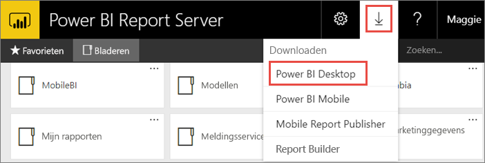

# Voor Power BI Report Server geoptimaliseerde versie van Power BI Desktop installeren
Meer informatie over het installeren van een voor Power BI Report Server geoptimaliseerde versie van Power BI Desktop.

Als u Power BI-rapporten wilt maken voor Power BI Report Server, moet u Power BI Desktop downloaden dat is geoptimaliseerd voor Power BI Report Server. Dit is een andere versie van Power BI Desktop dan de versie die wordt gebruikt met de Power BI-service. De versie van Power BI Desktop voor de Power BI-service bevat bijvoorbeeld preview-functies die niet beschikbaar zijn in de Power BI Report Server-versie totdat deze zijn vrijgegeven. Als u deze versie gebruikt, moet u ervoor zorgen dat de rapportserver kan werken met een bekende versie van de rapporten en het model. 

Het goede nieuws is dat u Power BI Desktop en de voor Power BI Report Server geoptimaliseerde versie van Power BI Desktop naast elkaar op dezelfde computer kunt installeren.

## Power BI Desktop downloaden en installeren

U kunt het snelste controleren of u over de meest recente versie van de voor Power BI Report Server geoptimaliseerde versie van Power BI Desktop beschikt, is door te starten vanuit de webportal van de rapportserver.

1. Selecteer in de webportal van report server de pijl **Downloaden** > **Power BI Desktop**.

    

    U kunt ook rechtstreeks naar [Microsoft Power BI Desktop](https://www.microsoft.com/download/details.aspx?id=56723) (geoptimaliseerd voor Power BI Report Server, maart 2018) gaan in het Microsoft Downloadcentrum.

2. Selecteer **Downloaden** in het downloadcentrum.

3. Selecteer het volgende, afhankelijk van uw computer: 

    - **PBIDesktopRS.msi** (de 32-bits versie) of

    - **PBIDesktopRS_x64.msi** (de 64-bits versie).

1. Nadat u het installatieprogramma hebt gedownload, voert u de installatiewizard van Power BI Desktop (oktober 2017) uit.
2. Selecteer aan het einde van de installatie de optie **Power BI Desktop nu starten**.
   
    Het programma wordt automatisch gestart en u kunt aan de slag.

## Controleer dat u de juiste versie gebruikt
U kunt controleren of u de juiste versie van Power BI Desktop gebruikt door te kijken in het beginscherm of de titelbalk in Power BI Desktop. In de titelbalk worden de maand en het jaar van de versie weergegeven.

In de Power BI Desktop-versie van de Power BI-service staan de maand en het jaar niet in de titelbalk.

## Bestandsindelingen kopppelen
Als u zowel Power BI Desktop als de voor Power BI Report Server geoptimaliseerde versie van Power BI Desktop op dezelfde computer hebt geïnstalleerd, krijgt de laatste installatie van Power BI Desktop de bestandskoppeling .pbix. Dit betekent dat de versie van Power BI Desktop die het laatst is geïnstalleerd wordt gestart wanneer u dubbelklikt u op een pbix-bestand.

Als u Power BI Desktop al had daarna de voor Power BI Report Server geoptimaliseerde versie van Power BI Desktop hebt geïnstalleerd, worden alle pbix-bestanden standaard geopend in de voor Power BI Report Server geoptimaliseerde versie van Power BI Desktop. Als u pbix-bestanden liever standaard opent met Power BI Desktop, installeert u Power BI Desktop opnieuw vanuit de Power BI-service.

U kunt ook eerst de versie van Power BI Desktop die u wilt gebruiken openen. En daarna opent u het bestand vanuit Power BI Desktop.

Wanneer u een Power BI-rapport wilt bewerken vanuit Power BI Report Server of een nieuw Power BI-rapport wilt maken vanuit de web-portal, wordt altijd de juiste versie van Power BI Destop geopend.

## Overwegingen en beperkingen
Rapporten in Power BI Report Server en in de Power BI-service (http://powerbi.com)) werken bijna exact dezelfde, op een paar functies na.

### In een browser
Rapporten voor Power BI Report Server ondersteunen alle visualisaties, met inbegrip van:

* Aangepaste visualisaties

Rapporten voor Power BI Report Server bieden geen ondersteuning voor:

* R-visuals
* ArcGIS-kaarten
* Breadcrumbs
* Preview-functies in Power BI Desktop

### In de mobiele Power BI-apps
Rapporten voor Power BI Report Server ondersteunen alle basisfunctionaliteit in de [mobiele Power BI-apps](../mobile-apps-for-mobile-devices.md), waaronder:

* [Indeling van telefoonrapport](../desktop-create-phone-report.md): u kunt een rapport optimaliseren voor de mobiele Power BI-apps. Op uw mobiele telefoon hebben geoptimaliseerde rapporten een speciaal pictogram, , en een speciale indeling.
  
    

Rapporten voor Power BI Report Server bieden geen ondersteuning voor deze functies in de mobiele Power BI-apps:

* R-visuals
* ArcGIS-kaarten
* Aangepaste visualisaties
* Breadcrumbs
* Geofiltering van streepjescodes

## Power BI Desktop voor eerdere versies van Power BI Report Server

Als u een rapportserver heeft met een eerdere versie, moet u de overeenkomstige versie van Power BI Desktop gebruiken. Hieronder staan de twee voorgaande versies.

- Microsoft Power BI Desktop ([geoptimaliseerd voor Power BI Report Server, oktober 2017](https://www.microsoft.com/download/details.aspx?id=56136))
- Microsoft Power BI Desktop ([geoptimaliseerd voor Power BI Report Server, juni 2017](https://www.microsoft.com/download/details.aspx?id=55330))

## Volgende stappen
Nu u Power BI Desktop hebt geïnstalleerd, kunt u beginnen met het maken van Power BI-rapporten.

[Quickstart: een Power BI-rapport maken voor Power BI Report Server](quickstart-create-powerbi-report.md)  
[Aan de slag met Power BI Desktop](../desktop-getting-started.md)  
Zelfstudie: [Aan de slag met Power BI Desktop](../guided-learning/gettingdata.yml#step-2)  
[Gebruikershandboek voor Power BI Report Server](user-handbook-overview.md)

Hebt u nog vragen? [Misschien dat de Power BI-community het antwoord weet](https://community.powerbi.com/)

