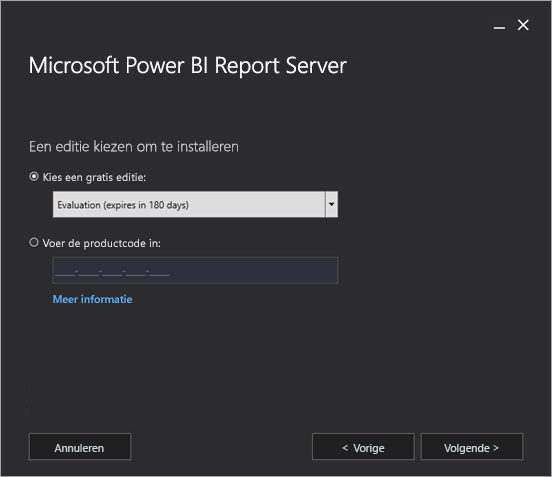
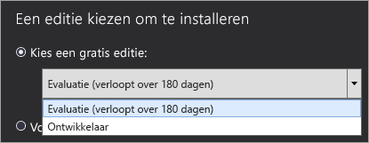
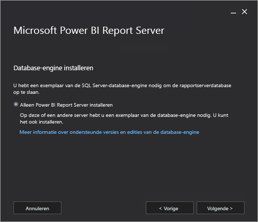
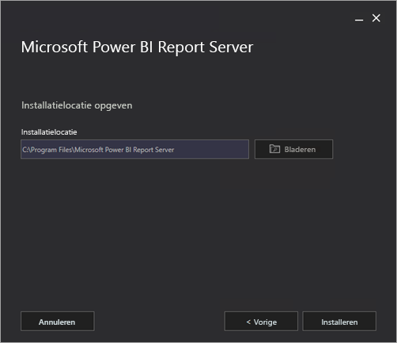

# Power BI Report Server installeren

Lees hoe u Power BI Report Server installeert.

 **Downloaden** 

Ga naar [On-premises rapportage met Power BI Report Server](https://powerbi.microsoft.com/report-server/) om Power BI Report Server te downloaden en selecteer **Gratis proefversie downloaden**. 

## Video: Power BI Report Server installeren

<iframe width="640" height="360" src="https://www.youtube.com/embed/zacaEb9A4F0?showinfo=0" frameborder="0" allowfullscreen></iframe>

## Voordat u begint
Voordat u Power BI Report Server installeert, is het raadzaam om de [hardware- en softwarevereisten voor het installeren van Power BI Report Server](system-requirements.md) door te lezen.

### Productcode van Power BI Report Server

#### Power BI Premium
Als u Power BI Premium hebt gekocht, vindt u de productcode voor Power BI Report Server op het tabblad **Premium-instellingen** in de Power BI-beheerportal. Dit is alleen beschikbaar voor hoofdbeheerders of gebruikers die de rol Power BI-servicebeheerder toegewezen hebben gekregen.

Als u **Power BI Report Server-sleutel** selecteert, wordt een dialoogvenster weergeven met uw productcode. U kunt deze kopiëren en gebruiken bij de installatie.

#### SQL Server Enterprise Software Assurance (SA)
Als u een SQL Server Enterprise SA-overeenkomst hebt, kunt u uw productcode vinden in het [Volume Licensing Service Center](https://www.microsoft.com/Licensing/servicecenter/).

## Een rapportserver installeren
Het installeren van Power BI Report Server is vrij eenvoudig. U hoeft slechts een paar stappen uit te voeren om de bestanden te installeren.

Er is geen SQL Server Database Engine-server nodig tijdens de installatie. U hebt die wel nodig om Reporting Services na de installatie te configureren.

1. Zoek de locatie van PowerBIReportServer.exe en start het installatieprogramma.
2. Selecteer **Install Power BI Report Server**.
   
    
3. Kies een editie om te installeren en selecteer vervolgens **Next**.
   
    
   
    U kunt een evaluatie- of ontwikkelaarseditie selecteren in de vervolgkeuzelijst.
   
    
   
    U kunt ook een productcode voor de server invoeren die u hebt verkregen via de Power BI-service of het Volume License Service Center. Zie het gedeelte [Voordat u begint](#before-you-begin) als u wilt weten hoe u in het bezit komt van een productcode.
4. Lees de licentievoorwaarden, ga hiermee akkoord en selecteer vervolgens**Next**.
   
    
5. U moet beschikken over een database-engine om de database van de rapportserver te kunnen opslaan. Selecteer **Next** om alleen de rapportserver te installeren.
   
    
6. Geef de installatielocatie op voor de rapportserver. Selecteer **Install** om door te gaan.
   
    
   
    Het standaardpad isC:\Program Files\Microsoft Power BI Report Server.

1. Als de installatie is voltooid, selecteert u **Configure report server** om Reporting Services Configuration Manager te starten.
   
    

## Uw rapportserver configureren

Nadat u **Configure Report Server** Configure Report Server tijdens de installatie, ziet u het scherm van Reporting Services Configuration Manager. Zie [Reporting Services Configuration Manager](https://docs.microsoft.com/sql/reporting-services/install-windows/reporting-services-configuration-manager-native-mode) voor meer informatie.

U moet een [rapportserverdatabase maken](https://docs.microsoft.com/sql/reporting-services/install-windows/ssrs-report-server-create-a-report-server-database) om de eerste configuratie van Reporting Services te voltooien. Voor deze stap hebt u een server met een SQL Server-database nodig.

### Een database maken op een andere server
Als u de database voor de rapportserver maakt op een databaseserver op een andere computer, moet u het serviceaccount voor de rapportserver wijzigen in een referentie die wordt herkend op de databaseserver. 

De rapportserver gebruikt standaard het virtuele serviceaccount. Als u probeert een database op een andere server te maken, kan de volgende fout optreden in de stap voor het toepassen van de verbindingsrechten.

`System.Data.SqlClient.SqlException (0x80131904): Windows NT user or group '(null)' not found. Check the name again.`

U kunt deze fout omzeilen door het serviceaccount te wijzigen in Network Service of een domeinaccount. Als u het serviceaccount wijzigt in Network Service, worden er rechten toegepast in de context van het computeraccount voor de rapportserver.

Zie [Configure the Report Server Service Account (SSRS Configuration Manager)](https://docs.microsoft.com/sql/reporting-services/install-windows/configure-the-report-server-service-account-ssrs-configuration-manager) (Report Server Service Account (SSRS Configuration Manager) configureren) voor meer informatie.

## Windows-service
Tijdens de installatie wordt er ook een Windows-service gemaakt. Deze wordt weergegeven als **Power BI Report Server**. De servicenaam is **PowerBIReportServer**.

## Standaard-URL-reserveringen
URL-reserveringen bestaan uit een voorvoegsel, de hostnaam, de poort en de virtuele map:

| Onderdeel | Beschrijving |
| --- | --- |
| Voorvoegsel |Het standaardvoorvoegsel is HTTP. Als u eerder een SSL-certificaat (Secure Sockets Layer) hebt geïnstalleerd, wordt er geprobeerd om URL-reserveringen te maken met het voorvoegsel HTTPS. |
| Hostnaam |De standaardhostnaam is een sterk jokerteken (+). Dit geeft aan dat de rapportserver op de opgegeven poort elke HTTP-aanvraag accepteert voor elke hostnaam die wordt omgezet naar de computer, met inbegrip van `http://<computername>/reportserver`, `http://localhost/reportserver` of `http://<IPAddress>/reportserver.` |
| Poort |De standaardpoort is 80. Als u een andere poort dan poort 80 gebruikt, moet u deze expliciet toevoegen aan de URL wanneer u de webportal opent in een browservenster. |
| Virtuele map |Standaard worden virtuele mappen gemaakt in de indeling van ReportServer voor de webservice Report Server en Reports voor de webportal. Voor de webservice Report Server is **reportserver** de standaard virtuele map. Voor de webportal is de standaard virtuele map **reports**. |

Een voorbeeld van de volledige URL-reeks ziet er dan zo uit:

* `http://+:80/reportserver`, biedt toegang tot de rapportserver.
* `http://+:80/reports`, biedt toegang tot de webportal.

## Firewall
Als u de rapportserver benadert vanaf een externe computer, is het belangrijk dat u firewallregels hebt geconfigureerd als er een firewall aanwezig is.

U moet de TCP-poort openen die u hebt geconfigureerd voor uw webservice-URL en webportal-URL. Deze URL's zijn standaard geconfigureerd op TCP-poort 80.

## Aanvullende configuratie
* Als u integratie met de Power BI-service wilt configureren zodat u rapportitems kunt vastmaken aan een Power BI-dashboard, leest u [Power BI Report Server Integration (Configuration Manager)](https://docs.microsoft.com/sql/reporting-services/install-windows/power-bi-report-server-integration-configuration-manager) (Power BI Report Server-integratie (Configuration Manager)).
* Zie [E-Mail settings](https://docs.microsoft.com/sql/reporting-services/install-windows/e-mail-settings-reporting-services-native-mode-configuration-manager) (E-mailinstellingen) en [E-Mail delivery in a report server](https://docs.microsoft.com/sql/reporting-services/subscriptions/e-mail-delivery-in-reporting-services) (E-mailbezorging op een rapportserver) om e-mail te configureren voor de verwerking van abonnementen.
* Als u de webportal zo wilt configureren dat u vanaf een computer met rapportserver rapporten kunt weergeven en beheren, raadpleegt u [Configure a firewall for report server access](https://docs.microsoft.com/sql/reporting-services/report-server/configure-a-firewall-for-report-server-access) (Een firewall configureren voor toegang tot Report Server) en [Configure a report server for remote administration](https://docs.microsoft.com/sql/reporting-services/report-server/configure-a-report-server-for-remote-administration) (Een rapportserver configureren voor extern beheer).

## Volgende stappen
[Beheerdershandboek](admin-handbook-overview.md)  
[How to find your report server product key](find-product-key.md) (De productcode van uw rapportserver zoeken)  
[Voor Power BI Report Server geoptimaliseerde versie van Power BI Desktop installeren](install-powerbi-desktop.md)  
[Een installatie van Server Reporting verifiëren](https://docs.microsoft.com/sql/reporting-services/install-windows/verify-a-reporting-services-installation)  
[Het serviceaccount van de rapportserver configureren](https://docs.microsoft.com/sql/reporting-services/install-windows/configure-the-report-server-service-account-ssrs-configuration-manager)  
[De URL's van de rapportserver configureren](https://docs.microsoft.com/sql/reporting-services/install-windows/configure-report-server-urls-ssrs-configuration-manager)  
[Configure a report server database connection](https://docs.microsoft.com/sql/reporting-services/install-windows/configure-a-report-server-database-connection-ssrs-configuration-manager) (De verbinding van een rapportserverdatabase configureren)  
[Een rapportserver initialiseren](https://docs.microsoft.com/sql/reporting-services/install-windows/ssrs-encryption-keys-initialize-a-report-server)  
[SSL-verbindingen voor een rapportserver configureren](https://docs.microsoft.com/sql/reporting-services/security/configure-ssl-connections-on-a-native-mode-report-server)  
[Windows-serviceaccounts en machtigingen configureren](https://docs.microsoft.com/sql/database-engine/configure-windows/configure-windows-service-accounts-and-permissions)  
[Browserondersteuning voor Power BI Report Server](browser-support.md)

Nog vragen? [Misschien dat de Power BI-community het antwoord weet](https://community.powerbi.com/)

