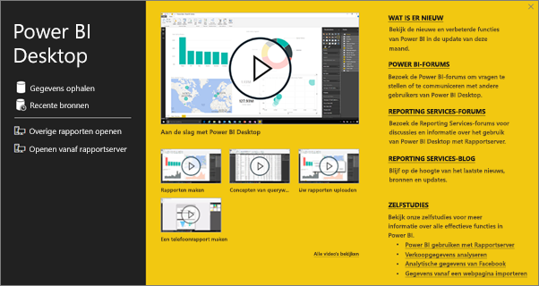
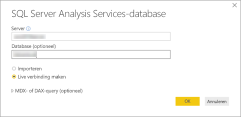
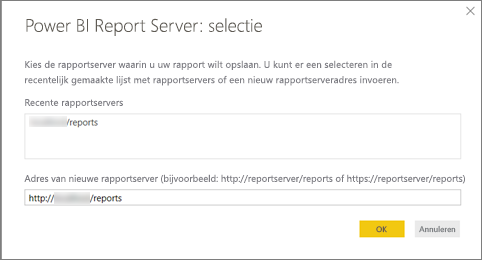
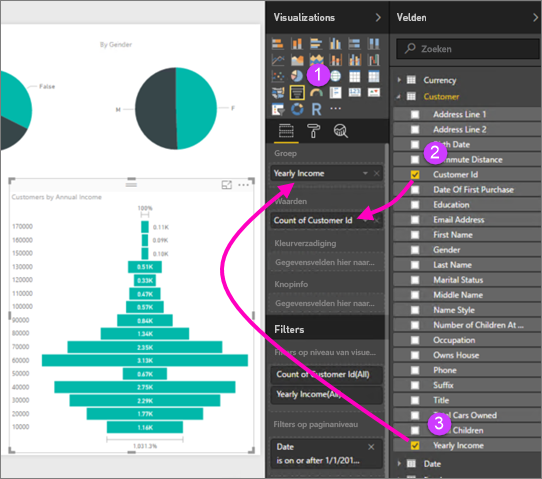
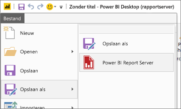

# Quickstart: een Power BI-rapport maken voor Power BI Report Server
U kunt Power BI-rapporten on-premises opslaan en beheren via de webportal van Power BI Report Server, net zoals u Power BI-rapporten kunt opslaan in de cloud in de Power BI-service (https://powerbi.com). U maakt rapporten in Power BI Desktop en publiceert deze naar de webportal. Gebruikers in uw organisatie kunnen de rapporten weergeven in een browser of in een mobiele Power BI-app op een mobiele apparaat.

Als u al Power BI-rapporten hebt gemaakt in Power BI Desktop, bent u klaar om Power BI-rapporten te maken voor Power BI Report Server. Als u dat nog niet hebt gedaan, volgen hier vier korte stappen om u op weg te helpen.

## Stap 1: Power BI Desktop (Report Server) installeren
Mogelijk hebt u Power BI Desktop al geïnstalleerd voor het maken van rapporten voor de Power BI-service. Het is raadzaam om de versie van Power BI Desktop te installeren die is geoptimaliseerd voor Power BI Report Server, zodat u zeker weet dat de server en app altijd zijn gesynchroniseerd. U kunt beide versies van Power BI Desktop op dezelfde computer installeren.

1. Selecteer **Nieuw** > **Power BI-rapport** in de webportal van Power BI Report Server.
   
    
   
    Als u geen toegang hebt tot de webportal van Power BI Report Server, gaat u naar het Microsoft Download Center en downloadt u [Microsoft Power BI Desktop](https://go.microsoft.com/fwlink/?linkid=837581) (geoptimaliseerd voor Power BI-rapportserver - juni 2017 GA).
2. Selecteer aan het einde van het installatieproces de optie **Power BI Desktop nu starten**.
   
    Het programma wordt automatisch gestart en u kunt aan de slag. U hebt de juiste versie als 'Power BI Desktop (Report Server)' wordt vermeld in de titelbalk.
3. Als u niet bekend bent met Power BI Desktop, is het misschien een goed idee om de video's op het welkomstscherm te bekijken.
   
    

## Stap 2: Een gegevensbron selecteren
U kunt verbinding maken met allerlei gegevensbronnen. Lees hier meer informatie over [het maken van verbinding met gegevensbronnen](connect-data-sources.md) (Engelstalig).

1. Selecteer **Gegevens ophalen** op het welkomstscherm.
   
    U kunt de optie **Gegevens ophalen** ook selecteren op het tabblad **Start**.
2. Selecteer uw gegevensbron, in dit voorbeeld **Analysis Services**.
   
    
3. Voer een waarde in voor **Server** en eventueel voor **Database**. Zorg ervoor dat **Live verbinding maken** is geselecteerd > **OK**.
   
    
4. Kies de rapportserver waarop u de rapporten wilt opslaan.
   
    

## Stap 3: Het rapport ontwerpen
Nu wordt het pas echt leuk. U gaat de visualisaties of visuele elementen maken die uw gegevens het best illustreren.

U kunt bijvoorbeeld een trechterdiagram maken van klanten en waarden groeperen op jaarlijkse omzet.

1. Selecteer **Trechterdiagram** bij **Visualisaties**.
2. Sleep het veld dat moet worden geteld naar het vak **Waarden**. Als het niet een numeriek veld is, wordt het type waarde automatisch gewijzigd in *Aantal van*.
3. Sleep het veld waarop u wilt groeperen naar het vak **Groep**.

Hier kunt u nog veel meer lezen over [het ontwerpen van een Power BI-rapport](../desktop-report-view.md).

## Stap 4: Het rapport opslaan op de rapportserver
Wanneer uw rapport klaar is, kunt u het opslaan op de Power BI-rapportserver die u hebt gekozen in stap 2.

1. Selecteer in het menu **Bestand** de optie **Opslaan als** > **Power BI Report Server**.
   
    
2. Nu kunt u het rapport bekijken in de webportal.
   
    

## Overwegingen en beperkingen
Rapporten in Power BI Report Server en in de Power BI-service (http://powerbi.com) werken bijna exact dezelfde, op een paar functies na.

### In een browser
Rapporten voor Power BI Report Server ondersteunen alle visualisaties, met inbegrip van:

* Aangepaste visualisaties

Rapporten voor Power BI Report Server bieden geen ondersteuning voor:

* R-visuals
* ArcGIS-kaarten
* Breadcrumbs

### In de mobiele Power BI-apps
Rapporten voor Power BI Report Server ondersteunen alle basisfunctionaliteit in de [mobiele Power BI-apps](../mobile-apps-for-mobile-devices.md), waaronder:

* [Indeling van telefoonrapport](../desktop-create-phone-report.md): u kunt een rapport optimaliseren voor de mobiele Power BI-apps. Op uw mobiele telefoon hebben geoptimaliseerde rapporten een speciaal pictogram, , en een speciale indeling.
  
    

Rapporten voor Power BI Report Server bieden geen ondersteuning voor deze functies in de mobiele Power BI-apps:

* R-visuals
* ArcGIS-kaarten
* Aangepaste visualisaties
* Breadcrumbs
* Geofiltering van streepjescodes

## Volgende stappen
### Power BI Desktop
Er zijn heel interessante informatiebronnen voor het maken van rapporten in Power BI Desktop. Deze koppelingen zijn een goed uitgangspunt.

* [Aan de slag met Power BI Desktop](../desktop-getting-started.md)
* Zelfstudie: [Aan de slag met Power BI Desktop](../guided-learning/gettingdata.yml#step-2)

### Power BI Report Server
* [Voor Power BI Report Server geoptimaliseerde versie van Power BI Desktop installeren](install-powerbi-desktop.md)  
* [Gebruikershandboek voor Power BI Report Server](user-handbook-overview.md)  

Nog vragen? [Misschien dat de Power BI-community het antwoord weet](https://community.powerbi.com/)