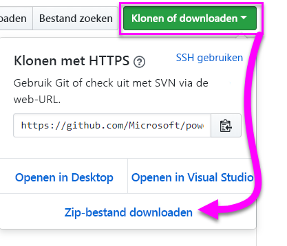
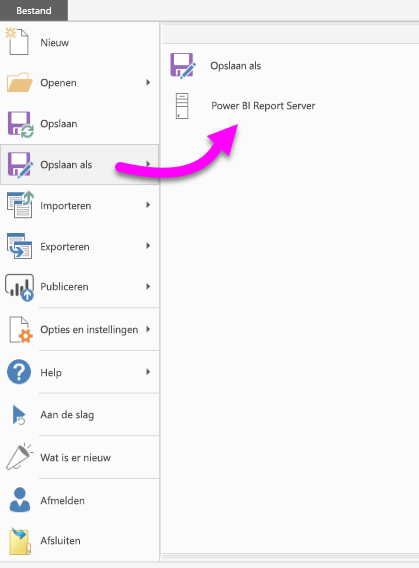
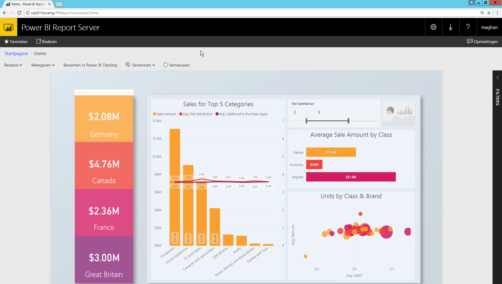
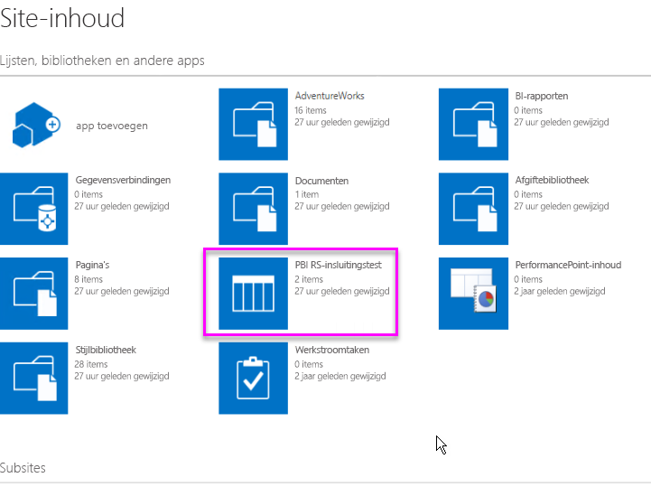
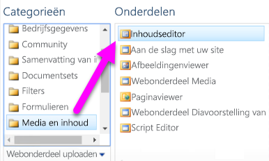

# <a name="quickstart-embed-a-power-bi-report-server-report-using-an-iframe-in-sharepoint-server"></a>Quickstart: Een Power BI Report Server-rapport insluiten met behulp van een iFrame in SharePoint Server

In deze snelstart leert u hoe u een Power BI Report Server-rapport insluit met behulp van een iFrame op een SharePoint-pagina. Als u met SharePoint Online werkt, moet Power BI Report Server openbaar toegankelijk zijn. In SharePoint Online werkt het Power BI-webonderdeel dat geschikt is voor de Power BI-service niet met Power BI Report Server. 


## <a name="prerequisites"></a>Vereisten
* U moet [Power BI Report Server](https://powerbi.microsoft.com/report-server/) hebben geïnstalleerd en geconfigureerd.
* U moet een voor [Power BI Report Server geoptimaliseerde versie van Power BI Desktop](install-powerbi-desktop.md) hebben geïnstalleerd.
* U moet een [SharePoint](https://docs.microsoft.com/sharepoint/install/install)-omgeving hebben geïnstalleerd en geconfigureerd.

## <a name="creating-the-power-bi-report-server-report-url"></a>De Power BI Report Server-rapport-URL maken

1. Download het voorbeeld vanuit GitHub [Blog Demo](https://github.com/Microsoft/powerbi-desktop-samples).

    

2. Open het PBIX-voorbeeldbestand vanuit GitHub in de voor **Power BI Report Server geoptimaliseerde versie van Power BI Desktop**.

    

3. Sla het rapport op naar **Power BI Report Server**. 

    

4. Bekijk het rapport in de **webportal**.

    

### <a name="capturing-the-url-parameter"></a>De URL-parameter vastleggen

Zodra u de URL hebt, kunt u een iFrame binnen een SharePoint-pagina maken om het rapport te hosten. Voor elke Power BI Report Server-rapport-URL kunt u een queryreeksparameter van `?rs:embed=true` toevoegen om uw rapport in te sluiten in een iFrame. 

   Bijvoorbeeld:
    ``` 
    http://myserver/reports/powerbi/Sales?rs:embed=true
    ```
## <a name="embedding-a-power-bi-report-server-report-in-a-sharepoint-iframe"></a>Power BI Report Server-rapport insluiten in een SharePoint iFrame

1. Navigeer naar een SharePoint **Site-inhoud**-pagina.

    

2. Kies de pagina waaraan u uw rapport wilt toevoegen.

    

3. Selecteer het tandwielpictogram rechts bovenin en selecteer **Pagina bewerken**.

    

4. Selecteer **Webonderdeel toevoegen**.

    

5. Selecteer onder **Categorieën** de optie **Media en inhoud**, selecteer onder **Delen** de optie **Inhoudseditor** en selecteer vervolgens **Toevoegen** .

     

6. Selecteer **Klik hier om nieuwe inhoud toe te voegen**.

    

7. Selecteer in het lint het tabblad **Tekstopmaak** en selecteer **Bron bewerken**.

     

8. Plak uw iFrame-code in het venster Bron bewerken en selecteer OK.

    

     Bijvoorbeeld:
     ```
     <iframe width="800" height="600" src="http://myserver/reports/powerbi/Sales?rs:embed=true" frameborder="0" allowFullScreen="true"></iframe>
     ```

9. Selecteer in het lint het tabblad **Pagina** en selecteer **Stoppen met bewerken**.

    

10. U ziet nu het rapport op de pagina.

    

## <a name="next-steps"></a>Volgende stappen

[Quickstart: Een Power BI-rapport maken voor Power BI Report Server](quickstart-create-powerbi-report.md)  
[Quickstart: Een gepagineerd rapport maken voor Power BI Report Server](quickstart-create-paginated-report.md)  

Hebt u nog vragen? [Misschien dat de Power BI-community het antwoord weet](https://community.powerbi.com/) 