# Zelfstudie: de webportal van Power BI Report Server in een VM verkennen
In deze zelfstudie maakt u een virtuele Azure-machine met Power BI Report Server dat al is geïnstalleerd, zodat u voorbeeldexemplaren van Power BI- en gepagineerde rapporten en KPI's kunt bekijken, bewerken en beheren.

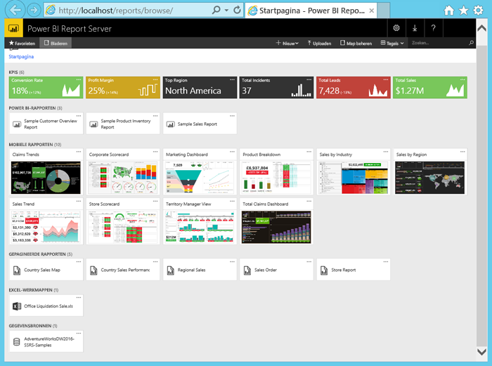

Dit zijn de taken die u in deze zelfstudie gaat uitvoeren:

> [!div class="checklist"]
> * Een VM maken en er verbinding mee maken
> * De webportal van Power BI Report Server starten en verkennen
> * Een favoriet item labelen
> * Een Power BI-rapport bekijken en bewerken
> * Een gepagineerd rapport bekijken, beheren en bewerken
> * Een Excel-werkmap in Excel Online bekijken

Voor deze zelfstudie hebt u een abonnement op Azure nodig. Als u er nog niet een hebt, maakt u een [gratis account](https://azure.microsoft.com/free/?WT.mc_id=A261C142F) voordat u begint.

## Een VM met Power BI Report Server maken

Gelukkig heeft het Power BI-team een VM gemaakt die hoort bij het al geïnstalleerde Power BI Report Server.

1. Open [Power BI Report Server](https://azuremarketplace.microsoft.com/marketplace/apps/reportingservices.technical-preview?tab=Overview) in Azure Marketplace.  

2. Selecteer **Nu downloaden**.
3. Selecteer **Doorgaan** als u de gebruiksvoorwaarden en het privacybeleid van de provider wilt accepteren.

    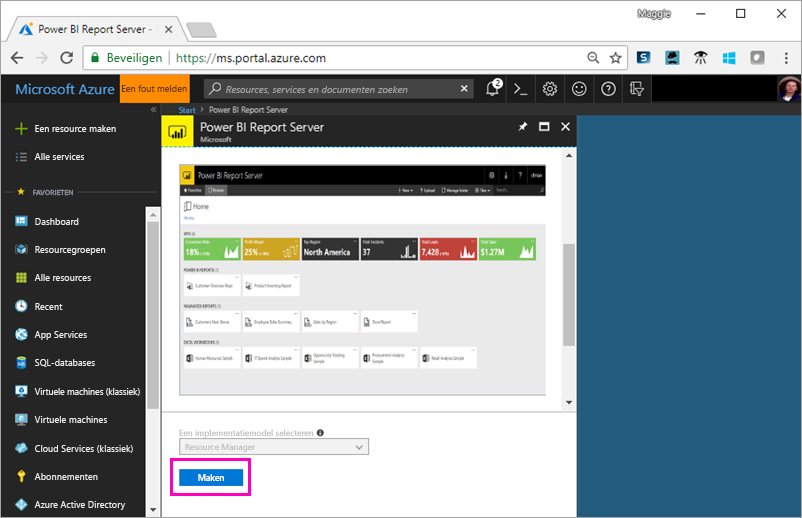

4. **Stap 1, basisinformatie**: bij **VM-naam** geeft u **reportservervm** op.

5. Maak een gebruikersnaam en wachtwoord.

6. Houd voor **Resourcegroep** **Nieuwe maken** ingeschakeld en noem deze **reportserverresourcegroup**.

    Als u de zelfstudie meer dan één keer volgt, moet u de resourcegroep na de eerste keer een andere naam geven. U kunt de naam van dezelfde resourcegroep niet twee keer in één abonnement gebruiken. 

7. Laat de overige standaardwaarden ongemoeid en klik op **OK**.

    

8. **Stap 2, Instellingen**: laat de standaardwaarden ongemoeid en klik op **OK**.

9. **Stap 3, Overzicht** > **OK**.

10. **Stap 4**: lees de gebruiksrechtovereenkomst en het privacybeleid en klik op **Maken**.

    Het proces voor het **verzenden van implementatie voor Power BI Report Server** neemt enkele minuten in beslag.

## Verbinding maken met de virtuele machine

1. Selecteer **Virtuele machines** in het linker navigatievenster van Azure. 

2. Typ 'rapport' in het vak **Filteren op naam**. 

3. Selecteer de VM met de naam **REPORTSERVERVM**.

    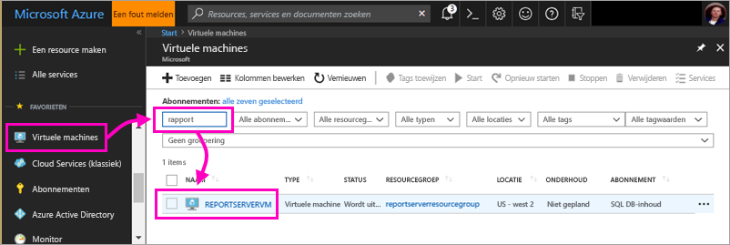

4. Selecteer **Verbinding maken** onder virtuele machine REPORTSERVERVM.

    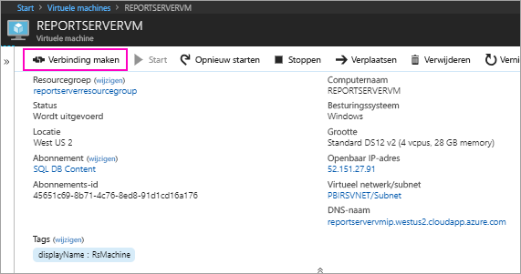

5. Selecteer **Verbinding maken** in het dialoogvenster Verbinding met extern bureaublad.

6. Voer de naam en het wachtwoord in die u hebt gemaakt voor de virtuele machine en klik op **OK**.

7. In het volgende dialoogvenster staat dat de identiteit van de externe computer niet kan worden vastgesteld. Selecteer **Ja**.

   De nieuwe VM wordt geopend.

## Power BI Report Server op de VM

Als de VM wordt geopend, vindt u hier de items die u op het bureaublad ziet.

|Getal  |Wat het betekent  |
|---------|---------|
| | Hiermee wordt SQL Server Data Tools gestart om gepagineerde (RDL) rapporten te maken |
| | Power BI-voorbeeldrapporten (PBIX)  |
| | Koppelingen naar documentatie van Power BI Report Server   |
| | Hiermee wordt Power BI Desktop gestart dat is geoptimaliseerd voor Power BI Report Server (maart 2018)  |
| | Hiermee wordt de webportal van Power BI Report Server in de browser geopend   |

Dubbelklik op het pictogram **Webportal van Report Server**. In de browser wordt http://localhost/reports/browse geopend. In de webportal ziet u verschillende, op type ingedeelde bestanden. 

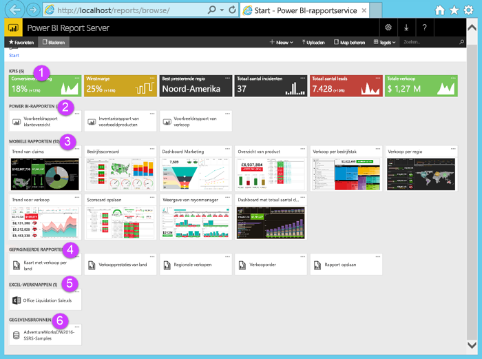

|Getal  |Wat het betekent  |
|---------|---------|
| | KPI's die in de webportal zijn gemaakt |
| |  Power BI-rapporten (PBIX)  |
| | Mobiele rapporten die in SQL Server Mobile Report Publisher zijn gemaakt  |
| |  Gepagineerde rapporten die in Report Builder of SQL Server Data Tools zijn gemaakt  |
| | Excel-werkmappen   | 
| | Gegevensbronnen voor gepagineerde rapporten | 

## Favorieten labelen
U kunt uw rapporten en KPI's taggen die u wilt toevoegen aan uw favorieten. Ze zijn dan gemakkelijker te vinden omdat ze allemaal worden verzameld in één map met favorieten, zowel in de webportal als in de mobiele Power BI-apps. 

1. Selecteer het beletselteken (**...**) in de rechterbovenhoek van de KPI **Winstmarge** > **Toevoegen aan favorieten**.
   
    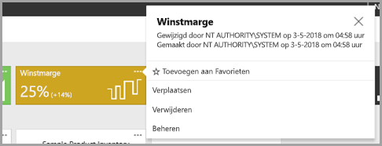
2. Selecteer op het lint van het webportaal de optie **Favorieten** om de KPI of het rapport samen met uw andere favorieten weer te geven op de pagina Favorieten in de webportal.
   
    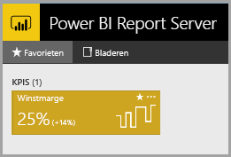

3. Selecteer **Bladeren** om terug te gaan naar de webportal.
   
## Items bekijken in de lijstweergave
Standaard wordt de inhoud in de webportal weergegeven in de tegelweergave.

Desgewenst kunt u overschakelen naar de lijstweergave. In deze weergave is het makkelijker om meerdere items tegelijkertijd te verplaatsen of te verwijderen. 

1. Selecteer **Tegels** > **Lijst**.
   
    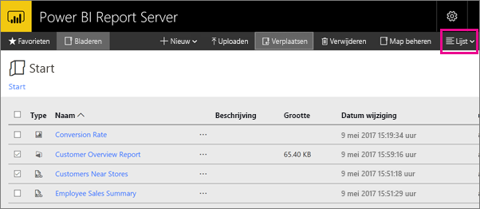

2. Ga terug naar de tegelweergave: selecteer **Lijst** > **Tegels**.

## Power BI-rapporten

In de webportal kunt u Power BI-rapporten bekijken en ermee werken en u kunt Power BI Desktop rechtstreeks in de webportal starten.

### Power BI-rapporten bekijken

1. In de webportal onder **Power BI-rapporten** selecteert u **Sample Customer Overview Report**. Het rapport wordt geopend in de browser.

1. Selecteer het blok Verenigde Staten in de boomstructuur om te zien hoe gerelateerde waarden in de andere visuele weergaven zijn gemarkeerd.

    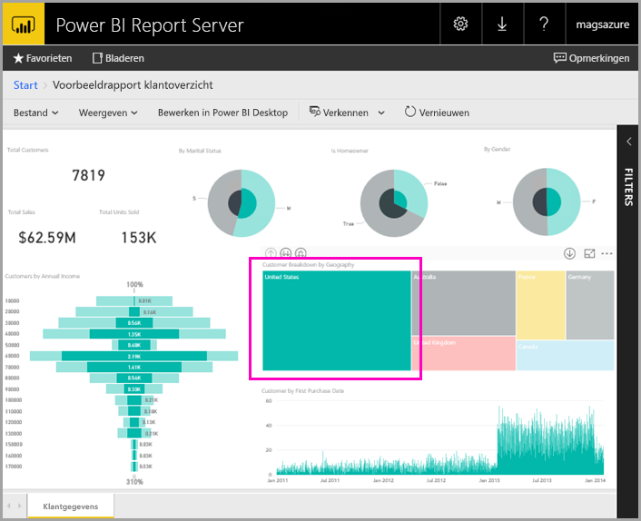

### Bewerken in Power BI Desktop

1. Selecteer **Bewerken in Power BI Desktop**.

1. Selecteer **Toestaan** zodat deze website een programma op uw computer kan openen. 

     Het rapport wordt geopend in Power BI Desktop. Let op de naam in de bovenste balk: 'Power BI Desktop (March 2018)'. Dat is de versie die is geoptimaliseerd voor Power BI Report Server.

    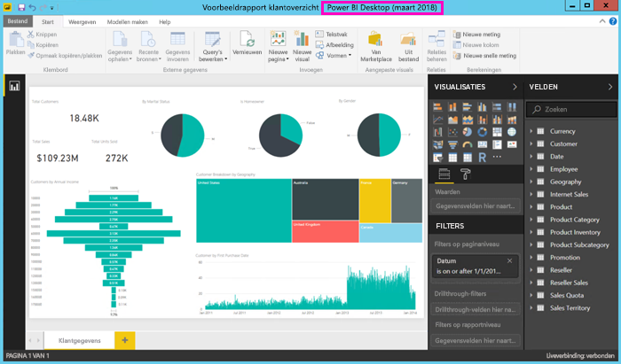

     Gebruik de versie van Power BI Desktop die is geïnstalleerd op de VM. U kunt niet wisselen tussen domeinen voor het uploaden van een rapport.

3. Vouw in het deelvenster Velden de tabel Klanten uit en sleep het veld Occupation naar Filters op rapportniveau.

    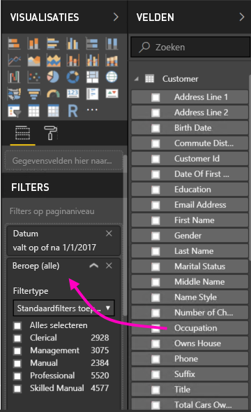

1. Sla het rapport op.

1. Ga terug naar het rapport in de browser en selecteer het pictogram **Vernieuwen** om de browser te vernieuwen.

    

8. Vouw het deelvenster **Filters** aan de rechterkant uit om het filter **Occupation** te zien dat u hebt toegevoegd. Selecteer **Professional**.

    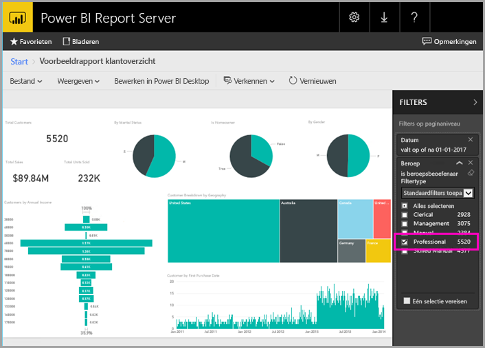

3. Selecteer **Bladeren** om terug te gaan naar de webportal.

## Gepagineerde (RDL) rapporten

In de webportal kunt u gepagineerde rapporten bekijken en beheren en Report Builder starten.

### Gepagineerd rapport beheren

1. Selecteer in de webportal onder **Gepagineerde rapporten** het beletselteken (...) naast **Sales Order** > **Beheren**.

1. Selecteer **Parameters**, wijzig de standaardwaarde voor **SalesOrderNumber** in **SO50689** > **Toepassen**.

   

3. Selecteer **Bladeren** om terug te gaan naar de webportal.

### Gepagineerd rapport bekijken

1. Selecteer **Sales Order** in de webportal.
 
3.  Het wordt geopend in de parameter **Order** die u hebt ingesteld: **SO50689**. 

    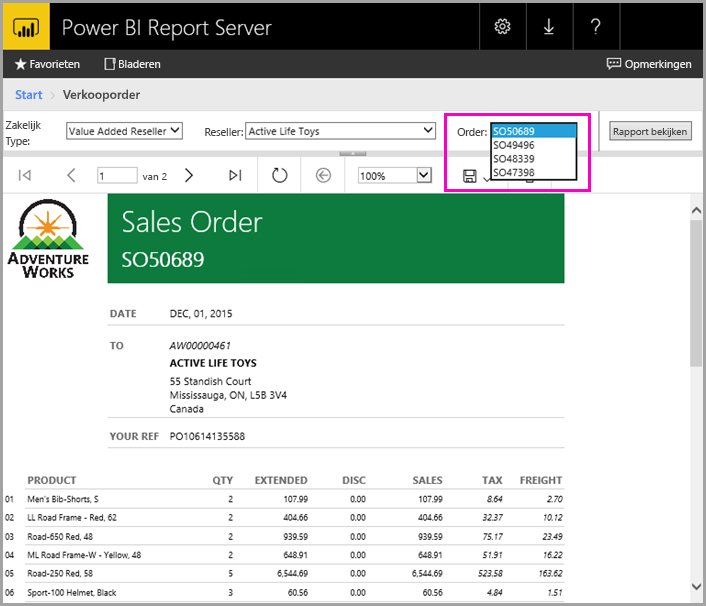

    U kunt deze parameter, samen met de overige parameters, hier wijzigen zonder dat de standaardwaarden worden gewijzigd.

1. Selecteer **Order** **SO48339** > **Rapport bekijken**.

4. U ziet dat dit pagina 1 van 2 is. Selecteer de pijl-rechts om de tweede pagina te zien. De tabel wordt op die pagina vervolgd.

    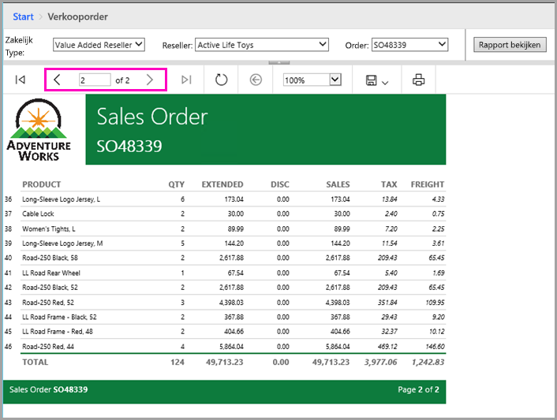

5. Selecteer **Bladeren** om terug te gaan naar de webportal.

### Gepagineerd rapport bewerken

U kunt gepagineerde rapporten bewerken in Report Builder, dat u rechtstreeks vanuit de browser kunt starten.

1. Selecteer in de webportal het beletselteken (...) naast **Sales Order** > **Bewerken in Report Builder**.

1. Selecteer **Toestaan** zodat deze website een programma op uw computer kan openen.

1. Het rapport Sales Order wordt geopend in de ontwerpweergave van Report Builder.

    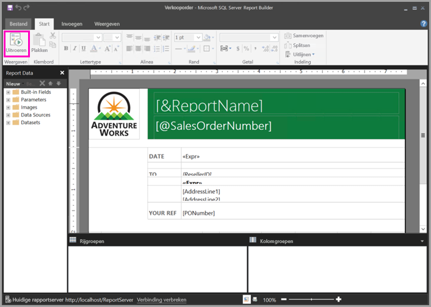

1. Selecteer **Uitvoeren** om een voorbeeld van het rapport te bekijken.

    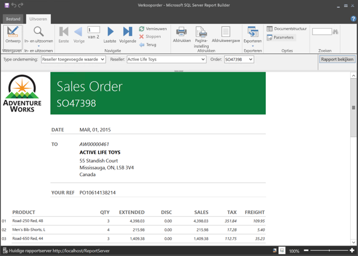

5. Sluit Report Builder en ga terug naar de browser.

## Excel-werkmappen bekijken

U kunt Excel-werkmappen in Excel Online bekijken en ermee werken in Power BI Report Server. 

1. Selecteer de Excel-werkmap **Office Liquidation Sale.xlsx**. U kunt om referenties worden gevraagd. Selecteer **Annuleren**. 
    De map wordt in de webportal geopend.
1. Selecteer **Apparaat** in de slicer.

    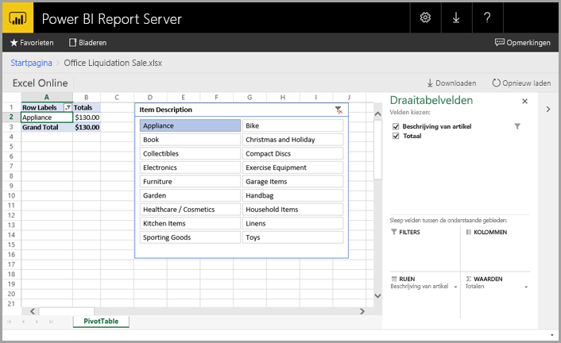

1. Selecteer **Bladeren** om terug te gaan naar de webportal.

## Resources opschonen

Als u deze zelfstudie hebt voltooid, verwijdert u de resourcegroep, de virtuele machine en alle gerelateerde resources. 

- Selecteer hiertoe de resourcegroep voor de VM en selecteer **Verwijderen**.

## Volgende stappen

In deze zelfstudie hebt u een VM gemaakt met Power BI Report Server. U hebt enkele functies van de webportal uitgeprobeerd en een Power BI- en een gepagineerd rapport geopend in de bijbehorende editors. Op deze VM zijn de SQL Server Analysis Services-gegevensbronnen geïnstalleerd, zodat u uw eigen Power BI en gepagineerde rapporten kunt maken met die gegevensbronnen. 

Als u meer informatie zoekt over het maken van rapporten voor Power BI Report Server, kunt u doorgaan.

> [!div class="nextstepaction"]
> [Een Power BI-rapport maken voor Power BI Report Server](./quickstart-create-powerbi-report.md)

