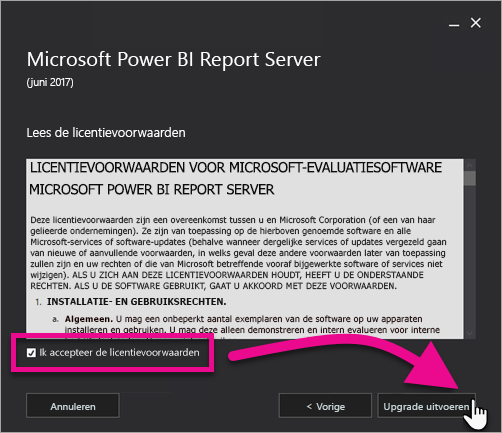
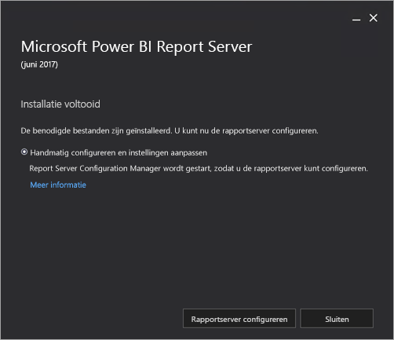

# Een upgrade uitvoeren voor Power BI Report Server
Leer hoe u een upgrade uitvoert voor Power BI Report Server.

 **Downloaden** 

Ga naar [On-premises rapportage met Power BI Report Server](https://powerbi.microsoft.com/report-server/) om Power BI Report Server en de geoptimaliseerde versie van Power BI Desktop voor Power BI Report Server te downloaden.

## Voordat u begint
Voordat u een upgrade uitvoert van een rapportserver, is het raadzaam de volgende stappen uit te voeren om een back-up van uw rapportserver te maken.

### Een back-up van uw versleutelingsleutels maken
U moet back-up van de versleutelingssleutels maken wanneer u een installatie van de rapportserver voor het eerst configureert. U moet ook telkens een back-up van de sleutels maken wanneer u de identiteit van de serviceaccounts of de naam van de computer wijzigt. Zie [Back-ups van Reporting Services-versleutelingssleutels maken en herstellen](https://docs.microsoft.com/sql/reporting-services/install-windows/ssrs-encryption-keys-back-up-and-restore-encryption-keys) voor meer informatie.

### Back-ups van de rapportserverdatabases maken
Omdat een rapportserver is een staatloze server is, worden alle toepassingsgegevens opgeslagen in de **reportserver-** en **reportservertempdb-**databases die worden uitgevoerd op een exemplaar van SQL Server Database Engine. U kunt een van de ondersteunde methoden voor het maken van back-ups van SQL Server-databases gebruiken om een back-up te maken van de databases **reportserver** en **reportservertempdb**. Aanbevelingen die specifiek zijn voor de rapportserverdatabase zijn onder meer:

* Gebruik het volledig-herstelmodel om een back-up van de database **reportserver** te maken.
* Gebruik het eenvoudige herstelmodel om een back-up van de database **reportservertempdb** te maken.
* U kunt voor elke database verschillend back-upschema's gebruiken. De enige reden om een back-up te maken van de database **reportservertempdb** is om te voorkomen dat u deze in het geval van een hardwarefout opnieuw moet maken. In het geval van een hardwarefout is het niet nodig om de gegevens in **reportservertempdb** te herstellen, maar hebt u wel de tabelstructuur nodig. Als u **reportservertempdb** kwijtraakt, kunt u de database alleen herstellen door de rapportserverdatabase opnieuw te maken. Als u de database **reportservertempdb** opnieuw maakt, is het belangrijk dat deze dezelfde naam heeft als de primaire rapportserverdatabase.

Zie [Een back-up van SQL Server-databases maken en deze terugzetten](https://docs.microsoft.com/sql/relational-databases/backup-restore/back-up-and-restore-of-sql-server-databases) voor meer informatie over het maken van back-ups en het terugzetten van relationele SQL Server-databases.

### Een back-up van de configuratiebestanden maken
Power BI-rapportserver gebruikt configuratiebestanden om de toepassingsinstellingen op te slaan. U moet een back-up van de bestanden maken wanneer u de server voor het eerst configureert en nadat u een aangepaste extensie hebt geïmplementeerd. U moet back-ups maken van onder andere de volgende bestanden:

* config.json
* RSHostingService.exe.config
* Rsreportserver.config
* Rssvrpolicy.config
* Reportingservicesservice.exe.config
* Web.config voor de Report Server ASP.NET-toepassingen
* Machine.config voor ASP.NET

## Een upgrade voor de rapportserver uitvoeren
U kunt vrij eenvoudig een upgrade voor Power BI Reports Server uitvoeren. U hoeft slechts een paar stappen uit te voeren om de bestanden te installeren.

1. Zoek de locatie van PowerBIReportServer.exe en start het installatieprogramma.
2. Selecteer **Een upgrade voor Power BI Report Server uitvoeren**.
   
    
3. Lees de licentievoorwaarden, ga hiermee akkoord en selecteer vervolgens**Upgrade uitvoeren**.
   
    
4. Nadat u de upgrade hebt uitgevoerd, kunt u **Report Server configureren** selecteren om Reporting Services Configuration Manager te starten of **Sluiten** selecteren om het installatieprogramma af te sluiten.
   
    

## Een upgrade uitvoeren voor Power BI Desktop
Nadat de upgrade voor de rapportserver is uitgevoerd, wilt u ervoor zorgen dat de ontwerpers van de Power BI-rapporten upgraden naar de versie van Power BI Desktop die is geoptimaliseerd voor Power BI Report Server die overeenkomt met de server.

## Volgende stappen
[Beheerdershandboek](admin-handbook-overview.md)  
[Voor Power BI Report Server geoptimaliseerde versie van Power BI Desktop installeren](install-powerbi-desktop.md)  
[Een installatie van Server Reporting verifiëren](https://docs.microsoft.com/sql/reporting-services/install-windows/verify-a-reporting-services-installation)  
[Het serviceaccount van de rapportserver configureren](https://docs.microsoft.com/sql/reporting-services/install-windows/configure-the-report-server-service-account-ssrs-configuration-manager)  
[De URL's van de rapportserver configureren](https://docs.microsoft.com/sql/reporting-services/install-windows/configure-report-server-urls-ssrs-configuration-manager)  
[Configure a report server database connection](https://docs.microsoft.com/sql/reporting-services/install-windows/configure-a-report-server-database-connection-ssrs-configuration-manager) (De verbinding van een rapportserverdatabase configureren)  
[Een rapportserver initialiseren](https://docs.microsoft.com/sql/reporting-services/install-windows/ssrs-encryption-keys-initialize-a-report-server)  
[SSL-verbindingen voor een rapportserver configureren](https://docs.microsoft.com/sql/reporting-services/security/configure-ssl-connections-on-a-native-mode-report-server)  
[Windows-serviceaccounts en machtigingen configureren](https://docs.microsoft.com/sql/database-engine/configure-windows/configure-windows-service-accounts-and-permissions)  
[Browserondersteuning voor Power BI Report Server](browser-support.md)

Nog vragen? [Misschien dat de Power BI-community het antwoord weet](https://community.powerbi.com/)

