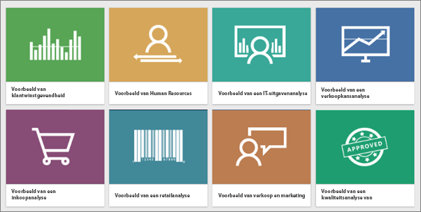
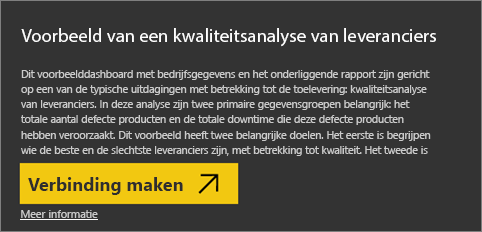
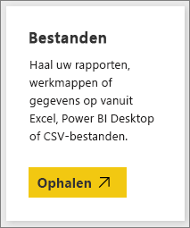
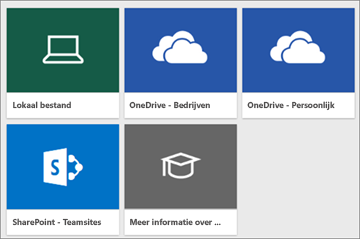
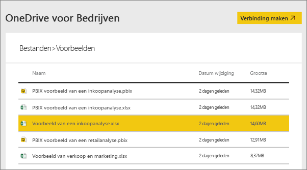
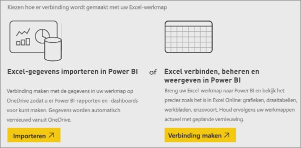
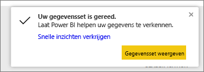
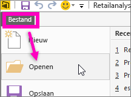

# Welke voorbeeldgegevens zijn beschikbaar voor gebruik met Power BI?
Stel dat u geen ervaring hebt met Power BI en u Power BI wilt uitproberen, maar nog geen gegevens hebt.  Of misschien hebt u een gegevensset, maar bent u bang dat u de gegevensset beschadigt omdat u (nog) niet begrijpt hoe Power BI werkt?

Maakt u zich geen zorgen. ObviEnce ([www.obvience.com](http://www.obvience.com/)) en Microsoft hebben voorbeelden gemaakt die u kunt gebruiken totdat vertrouwd bent met Power BI.  De gegevens zijn geanonimiseerd en representeren verschillende branches: financiën, HR, sales en meer. Wanneer u de onlinedocumentatie doorneemt, zult u zelfstudies en voorbeelden ontdekken die gebruikmaken van dezelfde voorbeelden, zodat u alles op de voet kunt volgen.      

   

Al deze voorbeelden zijn beschikbaar in verschillende indelingen: als inhoudspakket, als afzonderlijke Excel-werkmap en als PBIX-bestand. U hoeft zich geen zorgen te maken als u niet weet wat dit zijn of hoe u ze verkrijgt. Verderop in dit artikel wordt alles uitgelegd. Bovendien hebben we voor elk voorbeeld een *rondleiding* gemaakt. Dit is een artikel waarin het verhaal achter het voorbeeld wordt verteld en verschillende scenario's worden uitgelegd. Een voorbeeld van een scenario is het beantwoorden van vragen voor uw manager, in een ander scenario zoekt mogelijk naar concurrentiegerichte inzichten, maakt u rapporten en dashboards die u deelt of probeert u een zakelijk verschuiving te verklaren.   

Maar voor u aan de slag gaat, verzoeken we u de juridische richtlijnen voor het gebruik van deze voorbeelden te lezen. Wanneer u klaar bent, worden de voorbeelden geïntroduceerd en wordt uitgelegd hoe u ze kunt gebruiken.   

## Gebruiksrichtlijnen voor het Power BI-voorbeeld met Excel-werkmappen
Lees deze informatie voordat u de Power BI-voorbeelden gebruikt.

©2015 Microsoft Corporation. Alle rechten voorbehouden. De documenten en de werkmappen worden verstrekt in de huidige staat. De informatie en inzichten die in de werkmappen worden geformuleerd, inclusief URL's en andere websiteverwijzingen, kunnen zonder kennisgeving worden gewijzigd. Het gebruik van de voorbeelden is op eigen risico. Bepaalde voorbeelden zijn uitsluitend ter illustratie en zijn fictief. Er wordt geen verband met de realiteit bedoeld, noch moet dit hieruit worden afgeleid. Microsoft biedt geen enkele expliciete of impliciete garanties met betrekking tot de informatie die hier wordt verstrekt.

De werkmappen bieden u geen enkel wettelijk recht op enige intellectuele eigendom in een Microsoft-product. U mag deze werkmap kopiëren en gebruiken voor interne referentiedoeleinden.

De werkmappen en de bijbehorende gegevens worden verstrekt door obviEnce. [www.obvience.com](http://www.obvience.com)

ObviEnce is een ISV en Intellectual Property (IP) Incubator die zich voornamelijk concentreert op Microsoft Business Intelligence. ObviEnce werkt nauw samen met Microsoft om aanbevolen procedures en innovatieve methoden te ontwikkelen voor de ondersteuning bij en implementatie van oplossingen voor Microsoft Business Intelligence.

De werkmappen en gegevens zijn eigendom van obviEnce LLC en worden uitsluitend gedeeld, inclusief de voorbeeldgegevens uit het bedrijfsleven, om de functionaliteit van Power BI te demonstreren.

Wanneer de werkmappen en/of de gegevens worden gebruikt, moet altijd de bovenstaande naamsvermelding worden opgenomen (deze wordt ook vermeld op het informatieblad dat is opgenomen in elke werkmap). De werkmap en visualisaties moeten worden voorzien van de volgende copyrightinformatie: obviEnce ©.

Als u op een van de onderstaande koppelingen klikt om de Excel-werkmapbestanden of PBIX-bestanden te downloaden, gaat akkoord met de bovenstaande voorwaarden.

## Beschikbare voorbeelden
Er zijn acht voorbeelden beschikbaar die u kunt gebruiken.  Elk voorbeeld vertegenwoordigt een andere branche.

### Voorbeeld van klantwinstgevendheid 
[Bekijk het voorbeeld van klantwinstgevendheid](sample-customer-profitability.md)

In dit voorbeeld met bedrijfsgegevens analyseert een CFO de metrische sleutelgegevens voor haar leidinggevenden, producten en klanten. U kunt onderzoeken welke factoren van invloed zijn op de rentabiliteit van het bedrijf.

### Voorbeeld van human resources 
[Bekijk het voorbeeld van human resources](sample-human-resources.md)

In dit voorbeeld met bedrijfsgegevens concentreert u zich op de strategie van het bedrijf voor het aannemen van personeel door nieuwe werknemers, actieve werknemers en vertrokken werknemers te analyseren.  Door de gegevens te verkennen, neemt u mogelijk trends waar met betrekking tot het vrijwillig ontslag nemen en ontdekt u vooroordelen in de strategie voor het aannemen van personeel.

### Voorbeeld van een IT-uitgavenanalyse 
[Bekijk het voorbeeld van een IT-uitgavenanalyse](sample-it-spend.md)

In dit voorbeeld met bedrijfsgegevens worden de geplande kosten voor de IT-afdeling van een bedrijf vergeleken met de daadwerkelijke kosten. Deze vergelijking biedt inzicht in hoe goed het bedrijf het jaar heeft gepland en de mogelijkheid om gebieden te onderzoeken die sterk afwijken van de planning. Het bedrijf in dit voorbeeld hanteert een jaarlijkse planningscyclus en produceert vervolgens elk kwartaal een nieuw overzicht met de laatste prognoses om de wijzigingen in de IT-uitgaven in het fiscale jaar te kunnen analyseren.

### Voorbeeld van een verkoopkansanalyse 
[Bekijk het voorbeeld van een verkoopkansanalyse](sample-opportunity-analysis.md)

In dit voorbeeld met bedrijfsgegevens wordt het verkoopkanaal van een softwarebedrijf verkend. Verkoopmanagers bewaken hun directe verkoopkanalen en verkoopkanalen van partners door per regio de mogelijkheden, de opbrengst, de dealgrootte en het kanaal bij te houden.

### Voorbeeld van een inkoopanalyse 
[Bekijk het voorbeeld van een inkoopanalyse](sample-procurement.md)

In dit voorbeeld met bedrijfsgegevens analyseert een CFO de metrische sleutelgegevens voor haar leidinggevenden, producten en klanten. U kunt onderzoeken welke factoren van invloed zijn op de rentabiliteit van het bedrijf.

### Voorbeeld van een retailanalyse 
[Bekijk het voorbeeld van een retailanalyse](sample-retail-analysis.md)

In dit voorbeeld met bedrijfsgegevens worden de verkoopgegevens uit de detailhandel geanalyseerd van artikelen die in verschillende winkels en gebieden zijn verkocht. Met de metrische gegevens vergelijkt u de prestaties van dit jaar met die van vorig jaar voor de volgende gebieden: verkoop, eenheden, brutomarge, afwijkingen en analyses van nieuwe winkels.

### Voorbeeld van verkoop en marketing 
[Bekijk het voorbeeld van verkoop en marketing](sample-sales-and-marketing.md)

In dit voorbeeld met bedrijfsgegevens wordt het productiebedrijf VanArsdel Ltd geanalyseerd. Op basis van deze analyse kan de Chief Marketing Officer de branche en het marktaandeel van VanArsdel in de gaten houden.  Door het voorbeeld te verkennen, vindt u informatie over het marktaandeel, productvolume, de verkopen en het gevoel over het bedrijf.

### Voorbeeld van kwaliteitsanalyse van leveranciers 
[Bekijk het voorbeeld van een kwaliteitsanalyse van leveranciers](sample-supplier-quality.md)

Dit voorbeeld met bedrijfsgegevens is gericht op een van de typische uitdagingen voor de toelevering: kwaliteitsanalyse van leveranciers. In deze analyse zijn twee primaire gegevensgroepen belangrijk: het totale aantal defecte producten en de totale downtime die deze defecte producten hebben veroorzaakt. Dit voorbeeld heeft twee hoofddoelen. Het eerste doel is begrijpen wie de beste en de slechtste leveranciers zijn, met betrekking tot kwaliteit. Het tweede doel is identificeren welke fabrieken beter zijn in het vinden en verwijderen van defecte producten om de downtime te minimaliseren.

Nu u weet wat er beschikbaar is, is het tijd om uit te leggen hoe u deze voorbeelden verkrijgt.  

## De voorbeelden verkrijgen
Zoals u hierboven hebt gelezen, zijn de voorbeelden beschikbaar in verschillende indelingen: inhoudspakketten, Excel-werkmappen en PBIX-bestanden. Voor elk van de voorbeelden wordt beschreven hoe u ze kunt gebruiken, te beginnen met inhoudspakketten.

## De Power BI-voorbeelden als inhoudspakketten
Vanuit Power BI zijn alleen voorbeelden van inhoudspakketten beschikbaar. Voor deze voorbeelden hoeft u Power BI dus niet te verlaten. Een inhoudspakket is in wezen een bundel van een of meer dashboards, gegevenssets en rapporten die iemand heeft gemaakt en die kan worden gebruikt in de Power BI-service. Mensen maken inhoudspakketten om ze te delen met collega's. Alle voorbeeldinhoudspakketten van Power BI bevatten een gegevensset, rapport en dashboard.  Inhoudspakketten zijn niet beschikbaar voor Power BI Desktop. Zie [Inleiding tot inhoudspakketten in Power BI](service-organizational-content-pack-introduction.md) voor meer informatie over inhoudspakketten.

### Een voorbeeldinhoudspakket ophalen en openen in de Power BI-service
1. Open de Power BI-service (app.powerbi.com) en meld u aan.
2. Selecteer in de linkerbendehoek **Gegevens ophalen**.

    
3. Selecteer op de pagina Gegevens ophalen het pictogram **Voorbeelden**.

   
4. Selecteer een van de voorbeelden om een beschrijving van het desbetreffende voorbeeld weer te geven. Kies vervolgens **Verbinding maken**.  

   
5. Het inhoudspakket wordt geïmporteerd in Power BI en er wordt een nieuw dashboard, nieuw rapport en een nieuwe gegevensset toegevoegd aan de huidige werkruimte. De nieuwe inhoud is gemarkeerd met een geel sterretje. Gebruik de voorbeelden om met Power BI te experimenteren.  

   

Nu over gegevens beschikt, kunt u aan slag.  Probeer enkele zelfstudies waarin de voorbeeldinhoudspakketten worden gebruikt of open de Power BI-service om op verkenning uit te gaan.

## De Power BI-voorbeelden als Excel-bestanden
De voorbeeldinhoudspakketten zijn ook beschikbaar als Excel-werkmappen. De Excel-werkmappen zijn ontworpen om te worden gebruikt met de Power BI-service.  

1. Gebruik de onderstaande koppelingen om de bestanden afzonderlijk te downloaden of [download een zip-bestand met alle voorbeeldbestanden](http://go.microsoft.com/fwlink/?LinkId=535020). Als u een ervaren gebruiker bent, kunt u de Excel-werkmappen downloaden om de gegevensmodellen te verkennen of te bewerken.

   * [Voorbeeld van een retailanalyse](http://go.microsoft.com/fwlink/?LinkId=529778)
   * [Voorbeeld van een kwaliteitsanalyse van leveranciers](http://go.microsoft.com/fwlink/?LinkId=529779)
   * [Voorbeeld van human resources](http://go.microsoft.com/fwlink/?LinkId=529780)
   * [Voorbeeld van klantwinstgevendheid](http://go.microsoft.com/fwlink/?LinkId=529781)
   * [Voorbeeld van verkoopkansen bijhouden](http://go.microsoft.com/fwlink/?LinkId=529782)
   * [Voorbeeld van een IT-uitgavenanalyse](http://go.microsoft.com/fwlink/?LinkId=529783)
   * [Voorbeeld van een inkoopanalyse](http://go.microsoft.com/fwlink/?LinkId=529784)
   * [Voorbeeld van verkoop en marketing](http://go.microsoft.com/fwlink/?LinkId=529785)
2. Sla het gedownloade bestand op. Het maakt wel uit waar u het bestand opslaat.

   *   **Lokaal**: Als u het bestand opslaat op een lokaal station op uw computer of op een andere locatie binnen uw organisatie, kunt het bestand importeren in Power BI. Het bestand blijft op het lokale station staan. Het bestand wordt dus eigenlijk niet echt geïmporteerd in Power BI. Wat er wel gebeurt, is dat er een nieuwe gegevensset wordt gemaakt in uw Power BI-site en dat de gegevens, en in sommige gevallen het gegevensmodel, in de gegevensset worden geladen. Als uw bestand rapporten bevat, worden deze weergegeven in de Power BI-site, onder Rapporten.
   *  **OneDrive Bedrijven**: Als u OneDrive voor Bedrijven hebt en zich aanmeldt met hetzelfde account als voor Power BI, is dit verreweg de meest efficiënte manier om uw werk in Excel of Power BI te houden of om een CSV-bestand gesynchroniseerd te houden met uw gegevensset, rapporten en dashboards in Power BI. Omdat zowel Power BI als OneDrive zich in de cloud bevinden, maakt Power BI ongeveer om het uur verbinding met uw bestand in OneDrive. Als er wijzigingen worden gevonden, worden uw gegevensset, rapporten en dashboards in Power BI automatisch bijgewerkt.
   * **OneDrive - Persoonlijk**: Als u de bestanden opslaat in uw eigen OneDrive-account, geniet u veelal dezelfde voordelen als met OneDrive voor Bedrijven. Het belangrijkste verschil is dat wanneer u voor het eerst verbinding maakt met het bestand (met Gegevens ophalen > Bestanden > OneDrive - Persoonlijk), u zich bij OneDrive moet aanmelden met uw Microsoft-account. Dit is doorgaans een ander account dan het account dat u gebruikt om u aan te melden bij Power BI. Wanneer u zich met uw Microsoft-account aanmeldt bij OneDrive, moet u ervoor zorgen dat u het selectievakje Aangemeld blijven inschakelt. Op deze manier kan er om het uur verbinding via Power BI worden gemaakt met uw bestand en zorgt u ervoor dat uw gegevensset in Power BI wordt gesynchroniseerd.
   *  **SharePoint - Teamsites**: Als u uw Power BI-bestanden wilt opslaan naar SharePoint - Teamsites, doet u dit op vrijwel dezelfde manier als voor OneDrive voor Bedrijven. Het grootste verschil is de manier waarop u vanuit Power BI verbinding maakt met het bestand. U kunt een URL opgeven of verbinding maken met de hoofdmap.
3. Open de Power BI-service (app.powerbi.com) en meld u aan.

   > [!TIP]
   > U bent op een punt aanbeland dat u mogelijk een nieuw dashboard wilt maken en dit wilt vernoemen naar het bestand dat u wilt importeren.  Anders wordt er bij het importeren van de Excel-gegevensset geen nieuw dashboard met de naam van het voorbeeld gemaakt, maar wordt er in plaats daarvan een tegel toegevoegd aan het dashboard dat u momenteel hebt geopend. Als u die tegel selecteert, wordt u omgeleid naar het rapport van de gegevensset. Op zich is dit geen probleem, aangezien u later altijd nog een nieuw dashboard kunt maken, maar het scheelt u een stap of twee wanneer u meteen met een nieuw dashboard start.
   >
   >
4. Selecteer in de linkerbendehoek **Gegevens ophalen**.

    
5. Selecteer op de pagina Gegevens ophalen achtereenvolgens **Bestanden > Ophalen**.

     
6. Navigeer naar de locatie waar u het voorbeeld hebt gedownload en opgeslagen.

   
7. Selecteer het bestand, in dit geval **Procurement Analysis Sample.xlsx**, dat is opgeslagen in OneDrive voor Bedrijven en kies **Verbinding maken**.

   
8. Kies of u de gegevens wilt importeren of dat u de werkmap wilt overzetten naar Power BI om deze op exact dezelfde manier weer te geven als in Excel Online.

    
9. Als u **Importeren** selecteert, wordt de voorbeeldwerkmap in Power BI geïmporteerd en wordt deze toegevoegd als een nieuwe gegevensset met de naam **Procurement Analysis Sample**.  Als de werkmap Power View-werkbladen, -tabellen, -bereiken of een gegevensmodel bevat, wordt er ook een rapport (met dezelfde naam) in Power BI gemaakt. En als u nog geen dashboard hebt geopend, wordt er ook een nieuw dashboard in Power BI gemaakt. (Als er wel een dashboard is geopend wanneer u op **Gegevens ophalen** klikt, wordt er een nieuwe lege tegel op dat dashboard weergegeven.  Wanneer u op deze tegel klikt, wordt u omgeleid naar het rapport voor de gegevensset die u zojuist hebt toegevoegd.) De nieuwe inhoud is vernoemd naar het voorbeeld en is gemarkeerd met een geel sterretje.
10. Zodra het scherm **Uw gegevensset is gereed.** wordt weergegeven, selecteert u **Gegevensset weergeven** of **Snelle inzichten verkrijgen**, maar u kunt ook gewoon het linkernavigatievenster in Power BI gebruiken het bijbehorende rapport of dashboard te zoeken en te openen.  

     

### (Optioneel) De Excel-voorbeelden in Excel bekijken
Wilt u begrijpen hoe de gegevens in een Excel-werkmap worden geconverteerd naar Power BI-gegevenssets en -rapporten? Wanneer u de Excel-voorbeelden opent ***in Excel*** en de werkbladen daar verkent, verschaft dit enige inzicht.

* Wanneer u een voorbeeldwerkmap voor het eerst in Excel opent, is het mogelijk dat er twee waarschuwingen worden weergegeven. De eerste waarschuwing geeft aan dat de werkmap is geopend in de beveiligde weergave. Selecteer **Bewerken inschakelen**. De tweede waarschuwing geeft aan dat de werkmap externe verbindingen bevat. Selecteer **Inhoud inschakelen**.
* Elke werkmap bevat meerdere werkbladen. Wanneer u het Excel-bestand in Power BI importeert wordt er een gegevensset **en** een rapport gemaakt. Dit komt omdat al deze Excel-voorbeelden ten minste één Power View-werkblad met visualisaties bevatten.

   Mogelijk moet u [de invoegtoepassing Power View inschakelen](https://support.office.com/article/Create-a-Power-View-sheet-in-Excel-2013-B23D768D-7586-47FE-97BD-89B80967A405#__toc328591957).
* Waar bevinden de daadwerkelijke gegevens zich? Deze bevinden zich in het Power Pivot-gegevensmodel. Als u de gegevens wilt weergeven, selecteert u op het tabblad **PowerPivot** de optie **Gegevensmodel beheren**.

    Wordt het tabblad PowerPivot niet weergegeven? [Schakel de invoegtoepassing Power Pivot in](https://support.office.com/article/Start-Power-Pivot-in-Microsoft-Excel-2013-add-in-A891A66D-36E3-43FC-81E8-FC4798F39EA8).
* Het tabblad Gegevens bevat informatie over obviEnce, het bedrijf dat het voorbeeld heeft gemaakt.

## De Power BI-voorbeelden als PBIX-bestanden
De voorbeeldinhoudspakketten zijn ook beschikbaar als PBIX-bestanden. De PBIX-bestanden zijn ontworpen voor gebruik met Power BI Desktop.  

1. Gebruik de onderstaande koppelingen om de bestanden afzonderlijk te downloaden. Als u deze koppelingen selecteert, wordt het bestand automatisch opgeslagen in de map Downloads. 

   * [PBIX-voorbeeld van een retailanalyse](http://download.microsoft.com/download/9/6/D/96DDC2FF-2568-491D-AAFA-AFDD6F763AE3/Retail%20Analysis%20Sample%20PBIX.pbix)
   * [PBIX-voorbeeld van een kwaliteitsanalyse van leveranciers](http://download.microsoft.com/download/8/C/6/8C661638-C102-4C04-992E-9EA56A5D319B/Supplier-Quality-Analysis-Sample-PBIX.pbix)
   <!-- Previous link doesn't work -->
   * [PBIX-voorbeeld van Human resources](http://download.microsoft.com/download/6/9/5/69503155-05A5-483E-829A-F7B5F3DD5D27/Human%20Resources%20Sample%20PBIX.pbix)
   * [PBIX-voorbeeld van klantwinstgevendheid](http://download.microsoft.com/download/6/A/9/6A93FD6E-CBA5-40BD-B42E-4DCAE8CDD059/Customer%20Profitability%20Sample%20PBIX.pbix)
   * [PBIX-voorbeeld van verkoopkansen bijhouden](http://download.microsoft.com/download/9/1/5/915ABCFA-7125-4D85-A7BD-05645BD95BD8/Opportunity%20Analysis%20Sample%20PBIX.pbix)
   * [PBIX-voorbeeld van een IT-uitgavenanalyse](http://download.microsoft.com/download/E/9/8/E98CEB6D-CEBB-41CF-BA2B-1A1D61B27D87/IT%20Spend%20Analysis%20Sample%20PBIX.pbix)
   * [PBIX-voorbeeld van een inkoopanalyse](http://download.microsoft.com/download/D/5/3/D5390069-F723-413B-8D27-5888500516EB/Procurement%20Analysis%20Sample%20PBIX.pbix)
   * [PBIX-voorbeeld van verkoop en marketing](http://download.microsoft.com/download/9/7/6/9767913A-29DB-40CF-8944-9AC2BC940C53/Sales%20and%20Marketing%20Sample%20PBIX.pbix)

1. Selecteer in Power BI Desktop achtereenvolgens **Bestand > Openen** en navigeer naar de locatie waar u het PBIX-voorbeeld hebt opgeslagen.

   
4. Selecteer het PBIX-bestand om het in Power BI Desktop te openen.

## Volgende stappen
[Basisconcepten van Power BI](service-basic-concepts.md)

[Zelfstudie: Verbinding maken met de Power BI-voorbeelden](sample-tutorial-connect-to-the-samples.md)

[Gegevensbronnen voor Power BI](service-get-data.md)

Hebt u nog vragen? [Misschien dat de Power BI-community het antwoord weet](http://community.powerbi.com/)
