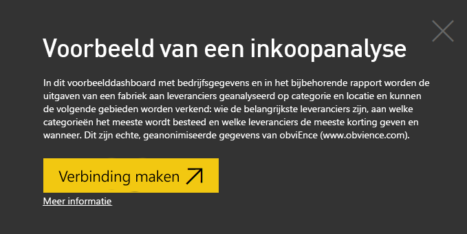
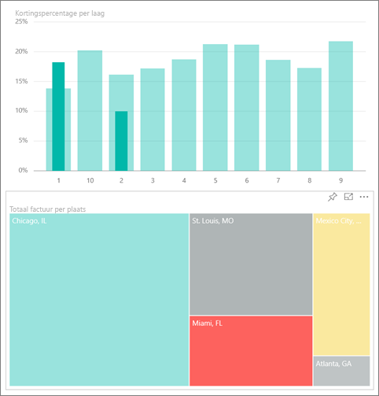
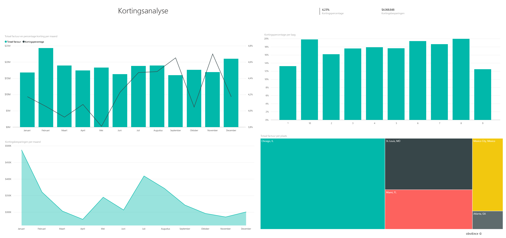
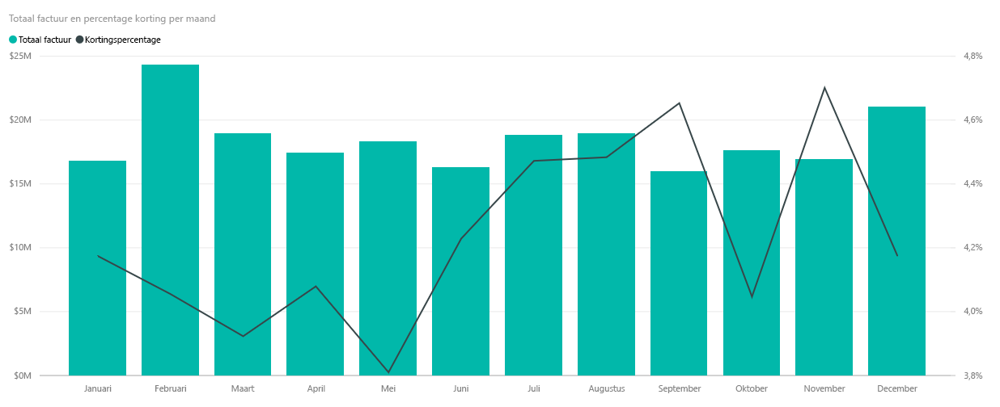
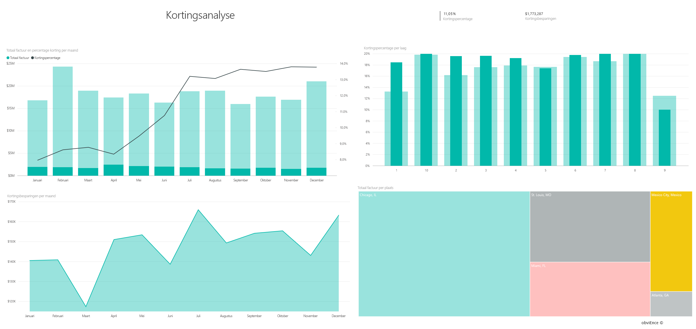

# Voorbeeld van een inkoopanalyse voor Power BI: een rondleiding

## Overzicht van het voorbeeld van een inkoopanalyse
In dit voorbeelddashboard met bedrijfsgegevens en in het onderliggende rapport worden de uitgaven van een productiebedrijf aan leveranciers geanalyseerd op categorie en locatie. In het voorbeeld verkennen we deze gebieden:

* Wie de belangrijkste leveranciers zijn
* Aan welke categorieën we het meeste besteden
* Welke leveranciers de meeste korting geven en wanneer

Dit voorbeeld is onderdeel van een serie die laat zien hoe u Power BI kunt gebruiken met bedrijfsgegevens, -rapporten en -dashboards. Dit zijn echte gegevens die afkomstig zijn van obviEnce ([www.obvience.com)](http://www.obvience.com/) die zijn geanonimiseerd.

## Vereisten

 Voordat u het voorbeeld kunt gebruiken, moet u het eerst downloaden als een [inhoudspakket](https://docs.microsoft.com/en-us/power-bi/sample-procurement#get-the-content-pack-for-this-sample), een [PBIX-bestand](http://download.microsoft.com/download/D/5/3/D5390069-F723-413B-8D27-5888500516EB/Procurement Analysis Sample PBIX.pbix) of een [Excel-werkmap](http://go.microsoft.com/fwlink/?LinkId=529784).

### Het inhoudspakket voor dit voorbeeld ophalen

1. Open Power BI-service (app.powerbi.com) en meld u aan.
2. Selecteer in de linkerbendehoek **Gegevens ophalen**.
   
    
3. Selecteer op de pagina Gegevens ophalen het pictogram **Voorbeelden**.
   
   
4. Selecteer **Voorbeeld van een inkoopanalyse** en kies **Verbinding maken**.  
  
   
   
5. Het inhoudspakket wordt geïmporteerd in Power BI en er wordt een nieuw dashboard, nieuw rapport en een nieuwe gegevensset toegevoegd aan de huidige werkruimte. De nieuwe inhoud is gemarkeerd met een geel sterretje. 
   
   
  
### Het pbix-bestand voor dit voorbeeld ophalen

U kunt ook het voorbeeld downloaden als pbix-bestand, dat bedoeld is voor gebruik met Power BI Desktop. 

 * [Voorbeeld van een inkoopanalyse](http://download.microsoft.com/download/D/5/3/D5390069-F723-413B-8D27-5888500516EB/Procurement%20Analysis%20Sample%20PBIX.pbix)

### De Excel-werkmap ophalen voor dit voorbeeld
U kunt ook [alleen de gegevensset (Excel-werkmap)](http://go.microsoft.com/fwlink/?LinkId=529784) voor dit voorbeeld downloaden. De werkmap bevat Power View-werkbladen die u kunt bekijken en wijzigen. Als u de onbewerkte gegevens wilt bekijken, selecteert u **Power Pivot > Beheren**.

## Bestedingstrends
Laten we eerst zoeken naar bestedingstrends op categorie en locatie.  

1. Open in uw werkruimte het tabblad **Dashboards** en selecteer het dashboard Inkoopanalyse.
2. Selecteer de dashboardtegel **Totaal aan facturen per land/regio**. Deze wordt geopend op de pagina Bestedingsoverzicht van het rapport Voorbeeld van een inkoopanalyse.

    

U ziet een aantal dingen:

* In het lijndiagram **Totaal aan facturen per maand en categorie**: de categorie **Direct** heeft behoorlijk consistente uitgaven **Logistiek** heeft een piek in december en  **Overige** heeft een piek in februari.
* Op de kaart **Totaal aan facturen per land/regio**: het grootste deel van onze uitgaven is in de Verenigde Staten.
* In het kolomdiagram **Totaal aan facturen per subcategorie**: **Hardware** en **Indirecte goederen en services** zijn de grootste bestedingscategorieën.
* In het staafdiagram Totaal aan facturen per laag: wij doen het meeste zaken met onze leveranciers van laag 1 (top 10). Dit helpt bij een beter relatiebeheer van onze leveranciers.

## Uitgaven in Mexico
Laten we de bestedingsgebieden in Mexico bekijken.

1. Selecteer in het cirkeldiagram de bel **Mexico** op de kaart. U ziet dat in het kolomdiagram Totaal aan facturen op subcategorie het meeste in de subcategorie **Indirecte goederen en services** staat.

   
2. Inzoomen op de kolom **Indirecte goederen en services**:

   * Selecteer de pijl voor inzoomen  in de rechterbovenhoek van de grafiek.
   * Selecteer de kolom **Indirecte goederen & Services**.

      Tot nu toe is Verkoop en marketing verreweg de grootste uitgavenpost in deze categorie.
   * Selecteer nogmaals **Mexico** op de kaart.

      De grootste uitgaven in deze categorie in Mexico zijn de uitgaven voor Onderhoud en reparatie.

      
3. Selecteer de pijl omhoog in de linkerbovenhoek van de grafiek om weer uit te zoomen.
4. Selecteer de pijl opnieuw om inzoomen uit te schakelen.  
5. Selecteer **Power BI** in de bovenste navigatiebalk om terug te keren naar uw werkruimte.

## Verschillende steden evalueren
U kunt markeren gebruiken om verschillende steden te evalueren.

1. Selecteer de dashboardtegel **Totaal aan facturen, kortingspercentage per maand**. Het rapport wordt geopend op de pagina Kortingsanalyse.
2. Selecteer de verschillende steden in de treemap **Totaal aan facturen per stad** om te zien hoe deze zich verhouden. Bijna alle facturen van Miami zijn van leveranciers van laag 1.

   

## Leverancierskortingen
Laten we kijken naar de beschikbare kortingen van leveranciers en de perioden waarin de meeste korting wordt gegeven.

Stel de volgende vragen:

* Zijn de kortingen verschillend per maand of worden elke maand dezelfde kortingen gegeven?
* Krijg sommige steden meer kortingen dan andere?

### Korting per maand
Als wij kijken naar de combinatiegrafiek **Totaal aan facturen en kortingspercentage per maand**, zien we dat **februari** de drukste maand en **september** de minst drukke maand is. Bekijk nu het kortingspercentage tijdens deze maanden.
Als het volume toeneemt, wordt de korting minder en als het volume laag is, neemt de korting toe. Hoe meer we de korting nodig hebben, des te slechter de deal zal zijn.

### Korting per stad
Een ander aspect om te verkennen, is de korting per stad. Selecteer elke plaats in de treemap en kijk hoe de andere grafieken wijzigen.

* St. Louis, MO had een grote piek in het totaal aan facturen in februari en een grote dip in de kortingsbesparingen in april.
* Mexico-Stad, Mexico heeft het hoogste kortingspercentage (11,05%) en Atlanta, GA het laagste (0,08%).

### Het rapport bewerken
Selecteer **Rapport bewerken** in de linkerbovenhoek en bekijk deze optie in de Bewerkingsweergave.

* Zie hoe de pagina's zijn gemaakt
* Pagina's en grafieken op basis van dezelfde gegevens toevoegen
* Het visualisatietype voor een grafiek wijzigen, bijvoorbeeld van de treemap naar een ringdiagram
* Vastmaken aan uw dashboard

Dit is een veilige omgeving om in te experimenteren. U kunt er namelijk altijd voor kiezen de wijzigingen niet op te slaan. Als u ze wel opslaat, kunt u altijd via **Gegevens ophalen** een nieuwe kopie van dit voorbeeld downloaden.

## Volgende stappen: koppelen aan uw gegevens
We hopen dat deze rondleiding heeft geleerd hoe u met Power BI-dashboards en rapporten inzicht kunt krijgen in inkoopgegevens. Nu is het uw beurt: aan uw eigen gegevens koppelen. Met Power BI kunt u koppelen aan een groot aantal gegevensbronnen. Zie [Aan de slag met Power BI](service-get-started.md) voor meer informatie.
