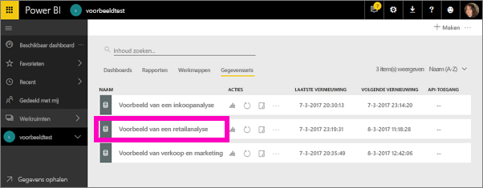
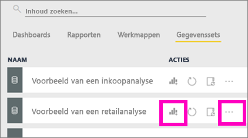

# De Power BI-voorbeelden, een zelfstudie
<!-- Shared newnav Include -->
[!INCLUDE [newnavbydefault](./includes/newnavbydefault.md)]

Het wordt aanbevolen te beginnen met het artikel [Voorbeeldgegevenssets voor Power BI](sample-datasets.md). In dat artikel leest u alles over de voorbeelden: hoe u ze downloadt, waar u ze kunt opslaan, hoe u ze gebruikt en enkele verhalen die elk voorbeeld kan vertellen. Wanneer u de basisbeginselen begrijpt, keert u terug naar deze zelfstudie.   

## Over deze zelfstudie
In deze zelfstudie leert u hoe u de voorbeeldinhoudspakketten importeert en toevoegt aan de Power BI-service en hoe u de inhoud opent. Een *inhoudspakket* is een type voorbeeld waarbij de gegevensset wordt geleverd met een dashboard en een rapport. De voorbeeldinhoudspakketten zijn beschikbaar vanuit Power BI via **Gegevens ophalen**.

> [!NOTE]
> Deze zelfstudie is van toepassing op de Power BI-service en niet op Power BI Desktop.
> 
> 

Het voorbeeldinhoudspakket *Retail Analysis* dat in deze zelfstudie wordt gebruikt, bestaat uit een dashboard, een rapport en een gegevensset.
Om vertrouwd te raken met dit type inhoudspakket en het bijbehorende scenario, kunt u [een rondleiding door het voorbeeld Retail Analysis bekijken](sample-retail-analysis.md) voordat u begint.

## Gegevens ophalen (in dit geval een voorbeeldinhoudspakket)
1. Open de Power BI-service (app.powerbi.com) en meld u aan.
2. Selecteer een werkruimte en maak een nieuw dashboard.  
   
    
3. Geef dit de naam **Voorbeeld van retailanalyse**.
   
   
4. Selecteer **Gegevens ophalen** onderaan in het linkernavigatievenster. Als u **Gegevens ophalen** niet ziet, vouwt u het navigatievenster uit door  te selecteren.
   
   
5. Selecteer **Voorbeelden**.  
   
   
6. Selecteer *Retail Analysis Sample* en kies **Verbinding maken**.   
   
   

## Wat is er precies geïmporteerd?
Wanneer u bij de voorbeeldinhoudspakketten **Verbinding maken** selecteert, haalt Power BI in werkelijkheid een kopie van dat inhoudspakket op en slaat dit voor u op in de cloud. Omdat de persoon die het inhoudspakket heeft gemaakt, een gegevensset, een rapport en een dashboard heeft opgenomen, krijgt u die wanneer u klikt op **Verbinding maken**.

1. Power BI maakt het nieuwe dashboard en geeft dit weer op het tabblad **Dashboards**. Het gele sterretje geeft aan dat het nieuw is.
   
   
2. Open het tabblad **Rapporten**.  Hier ziet u een nieuw rapport met de naam *Retail Analysis Sample*.
   
   
   
   Bekijk ook het tabblad **Gegevenssets**.  Er is ook een nieuwe gegevensset.
   
   

## De nieuwe inhoud verkennen
Verken nu zelf het dashboard, de gegevensset en het rapport. Er zijn veel verschillende manieren om te navigeren naar uw dashboards, rapporten en gegevenssets en slechts een van die manieren wordt hieronder beschreven.  

> [!TIP]
> Wilt u eerst wat meer uitleg?  Bekijk dan de [rondleiding door het voorbeeld Retail Analysis](sample-retail-analysis.md) voor een stapsgewijze uitleg van dit voorbeeld.
> 
> 

1. Ga terug naar het tabblad **Dashboards** en selecteer het dashboard *Voorbeeld van retailanalyse* om dit te openen.    
   
   
2. Het dashboard wordt geopend.  Dit bevat diverse visualisatietegels.
   
   
3. Selecteer een van de tegels om het onderliggende rapport te openen.  In dit voorbeeld selecteren we het vlakdiagram (dat een roze kader heeft in de vorige afbeelding). Het rapport wordt geopend op de pagina die dat vlakdiagram bevat.
   
    
   
   > [!NOTE]
   > Als de tegel was gemaakt met [Power BI Q&A](service-q-and-a.md), zou in plaats daarvan de Q&A-pagina zijn geopend.
   > 
   > 
4. Terug op het tabblad **Gegevenssets** hebt u verschillende mogelijkheden om de gegevensset te verkennen.  U kunt de set niet openen en alle rijen en kolommen bekijken (zoals wel kan in Power BI Desktop of Excel).  Als iemand een inhoudspakket deelt met collega's, wil hij of zij doorgaans alleen de inzichten delen en de collega's niet direct toegang geven tot de gegevens. Maar dat betekent niet dat u de gegevensset niet kunt verkennen.  
   
   
   
   * Eén manier om de gegevensset te verkennen, is door zelf uw eigen visualisaties en rapporten te maken.  Selecteer het diagrampictogram  om de gegevensset te openen in de rapportbewerkingsmodus.
     
       
   * Een andere manier om de gegevensset te verkennen, is door [Snelle inzichten](service-insights.md) uit te voeren. Selecteer de drie puntjes (...) en kies **Inzichten verkrijgen**. Wanneer de inzichten gereed zijn, selecteert u **Inzichten weergeven**.
     
       

## Volgende stappen
[Basisconcepten van Power BI](service-basic-concepts.md)

[Voorbeelden voor de Power BI-service](sample-datasets.md)

[Gegevensbronnen voor Power BI](service-get-data.md)

Hebt u nog vragen? [Misschien dat de Power BI-community het antwoord weet](http://community.powerbi.com/)

