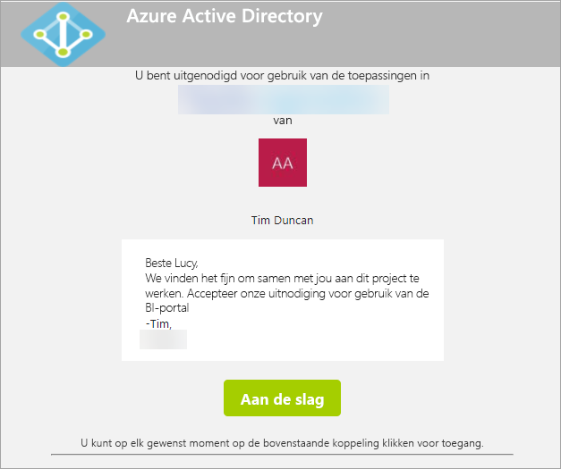

# Power BI-inhoud met Azure AD B2B distribueren naar externe gastgebruikers

Power BI kan worden geïntegreerd met Azure Active Directory Business-to-business (Azure AD B2B) voor een veilige distributie van Power BI-inhoud naar gastgebruikers buiten uw organisatie, zonder de controle over de interne gegevens te verliezen.

## Toegang inschakelen

Zorg dat de functie [Instellingen exporteren en delen](service-admin-portal.md#export-and-sharing-settings) in de Power BI-beheerdersportal is ingeschakeld voordat u gastgebruikers uitnodigt.

## Wie kunt u uitnodigen?

U kunt gastgebruikers met ongeacht welk e-mailadres uitnodigen, met inbegrip van persoonlijke accounts zoals gmail.com, outlook.com of hotmail.com. In Azure AD B2B worden deze adressen *sociale identiteiten* genoemd.

## Gastgebruikers uitnodigen

Uitnodigingen zijn alleen vereist wanneer een externe gebruiker voor het eerst wordt uitgenodigd voor uw organisatie. Er zijn twee manieren om gebruikers uit te nodigen: met geplande uitnodigingen en met ad-hoc-uitnodigingen.

### Geplande uitnodigingen

Gebruik een geplande uitnodiging als u weet welke gebruikers u wilt uitnodigen. U kunt de uitnodiging verzenden via de Azure-portal of PowerShell. U moet een tenantbeheerder zijn om anderen te kunnen uitnodigen.

Volg deze stappen om een uitnodiging te verzenden via de Azure-portal.

1. Selecteer **Azure Active Directory** in de [Azure-portal](https://portal.azure.com).

1. Ga onder **Beheren** naar **Gebruikers** > **Alle gebruikers** > **Nieuwe gastgebruiker**.

    

1. Voer een **e-mailadres** en het **persoonlijke bericht** in.

    

1. Selecteer **Uitnodigen**.

Als u meerdere gastgebruikers wilt uitnodigen, gebruikt u PowerShell. Zie [Azure Active Directory B2B-samenwerkingscode en voorbeelden van PowerShell](/azure/active-directory/b2b/code-samples/) voor meer informatie.

De gastgebruiker moet in de e-mailuitnodiging die is ontvangen, de optie **Aan de slag** selecteren. De gastgebruiker wordt vervolgens toegevoegd aan de tenant.

### Ad-hocuitnodigingen

Als u op een bepaald moment een uitnodiging wilt uitbrengen, voegt u de externe gebruiker toe aan uw dashboard of meldt u dit via de gebruikersinterface voor delen of uw app via de toegangspagina. Hier volgt een voorbeeld van wat te doen wanneer u een externe gebruiker uitnodigt om een app te gebruiken.

De gastgebruiker ontvangt een e-mail met het bericht dat de app met hem is gedeeld.

De gastgebruiker moet zich aanmelden met het e-mailadres van de organisatie. Zodra gastgebruiker zich heeft aangemeld, wordt deze gevraagd de uitnodiging te accepteren. Nadat de gastgebruiker zich heeft aangemeld, wordt deze omgeleid naar de app-inhoud. De gastgebruiker kan een bladwijzer naar deze koppeling maken of de e-mail bewaren om terug te keren naar de app.

## Licentieverlening

De gastgebruiker moet over de juiste licenties beschikken om de gedeelde app te kunnen weergeven. Er zijn drie manieren om dit te realiseren: door Power BI Premium te gebruiken, door een Power BI Pro-licentie toe te wijzen of door de Power BI Pro-licentie van de gast te gebruiken.

### Power BI Premium gebruiken

Door de app-werkruimte toe te wijzen aan [Power BI Premium-capaciteit](service-premium.md), kan de gastgebruiker de app gebruiken zonder een licentie voor Power BI Pro. Met Power BI Premium kunnen apps ook profiteren van andere mogelijkheden, zoals van een verhoogde vernieuwingsfrequentie, toegewezen capaciteit en grote modellen.

### Een Power BI Pro-licentie toewijzen aan een gastgebruiker

Als u in uw tenant een Power BI Pro-licentie toewijst aan een gastgebruiker, kan die gastgebruiker de inhoud in de tenant bekijken.

### De gastgebruiker beschikt over een eigen Power BI Pro-licentie

De gastgebruiker beschikt al over een Power BI Pro-licentie die is toegewezen in hun eigen tenant.

## Overwegingen en beperkingen

* Externe B2B-gasten mogen alleen inhoud gebruiken. Externe B2B-gasten kunnen apps, dashboards en rapporten weergeven, gegevens exporteren en e-mailabonnementen instellen voor dashboards en rapporten. Ze hebben geen toegang tot werkruimten en kunnen hun eigen inhoud niet publiceren.

* Deze functie is momenteel niet beschikbaar met de mobiele Power BI-apps. Op een mobiel apparaat kunt u in een browser Power BI-inhoud weergeven die is gedeeld met Azure AD B2B.

* Deze functie is momenteel niet beschikbaar in het webonderdeel voor Power BI SharePoint Online-rapporten.

## Volgende stappen

Meer informatie, waaronder informatie over beveiliging op rijniveau, vindt u in het technische document: [Power BI-inhoud met Azure AD B2B distribueren naar externe gastgebruikers](https://aka.ms/powerbi-b2b-whitepaper).

Zie [Wat is B2B-samenwerking van Azure AD?](/azure/active-directory/active-directory-b2b-what-is-azure-ad-b2b/) voor meer informatie over Azure AD B2B.
