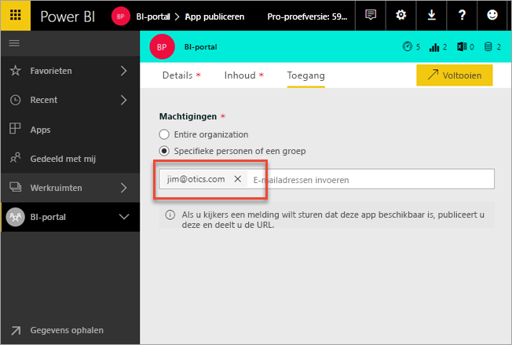

# Power BI-inhoud met Azure AD B2B distribueren naar externe gastgebruikers

Power BI kan worden geïntegreerd met Azure Active Directory Business-to-business (Azure AD B2B) voor een veilige distributie van Power BI-inhoud naar gastgebruikers buiten de organisatie, zonder de controle over de interne gegevens te verliezen.

> [!VIDEO https://www.youtube.com/embed/xxQWEQ1NnlY]

## Gastgebruikers uitnodigen

Er zijn twee manieren om gastgebruikers uit te nodigen voor uw Power BI-tenant: geplande uitnodigingen en ad-hocuitnodigingen. Er hoeven alleen uitnodigingen te worden verstuurd wanneer een externe gebruiker voor het eerst wordt uitgenodigd voor uw organisatie.

### Geplande uitnodigingen

Een geplande uitnodiging wordt uitgevoerd in Microsoft Azure Portal in Azure AD of met behulp van PowerShell. Deze optie gebruikt u als u weet welke gebruikers moeten worden uitgenodigd. 

**Als u een gastgebruiker in de Azure AD-portal wilt maken, moet u een tenantbeheerder zijn.**

1. Ga naar [Azure Portal](https://portal.azure.com) en selecteer **Azure Active Directory**.

2. Ga naar **Gebruikers en groepen** > **Alle gebruikers** > **Nieuwe gastgebruiker**.

    

3. Geef het **e-mailadres** en het **persoonlijke bericht** op.

    

4. Selecteer **Uitnodigen**.

Als u meerdere gastgebruikers wilt uitnodigen, gebruikt u PowerShell. Zie [Azure Active Directory B2B-samenwerkingscode en voorbeelden van PowerShell](https://docs.microsoft.com/azure/active-directory/active-directory-b2b-code-samples) voor meer informatie.

De gastgebruiker moet in de e-mailuitnodiging die is ontvangen, de optie **Aan de slag** selecteren. De gastgebruiker wordt vervolgens toegevoegd aan de tenant.

### Ad-hocuitnodigingen

Als u uitnodiging wilt versturen, voegt u de externe gebruiker toe aan de toegangslijst van een app wanneer u deze publiceert.

De gastgebruiker ontvangt een e-mail met het bericht dat de app is gedeeld.

De gastgebruiker moet zich aanmelden met het e-mailadres van de organisatie. Zodra gastgebruiker zich heeft aangemeld, wordt deze gevraagd de uitnodiging te accepteren. Nadat de gastgebruiker zich heeft aangemeld, wordt deze omgeleid naar de app-inhoud. Maak een bladwijzer voor deze koppeling of bewaar de e-mail om terug te keren naar de app.

## Licentieverlening

De gastgebruiker moet over de juiste licenties beschikken om de gedeelde app te kunnen weergeven. Dit kan op drie manieren worden gerealiseerd.

### Power BI Premium gebruiken

Door de app-werkruimte toe te wijzen aan Power BI Premium-capaciteit, kan de gastgebruiker de app gebruiken zonder een licentie voor Power BI Pro. Met Power BI Premium kunnen apps ook profiteren van andere mogelijkheden, zoals van een verhoogde vernieuwingsfrequentie, toegewezen capaciteit en grote modellen.

### Een Power BI Pro-licentie toewijzen aan een gastgebruiker

Als u in uw tenant een Power BI Pro-licentie toewijst aan een gastgebruiker, kan die gastgebruiker de inhoud weergeven.

> [!NOTE]
> Een Power BI Pro-licentie uit uw tenant is alleen van toepassing op gastgebruikers wanneer ze zich toegang verschaffen tot inhoud in uw tenant.

### De gastgebruiker beschikt over een eigen Power BI Pro-licentie

De gastgebruiker beschikt al over een Power BI Pro-licentie die is toegewezen in hun eigen tenant.

## Volgende stappen

Raadpleeg het [technische document](https://aka.ms/powerbi-b2b-whitepaper) voor meer informatie, inclusief informatie over hoe beveiliging op rijniveau werkt.

Zie [Wat is B2B-samenwerking van Azure AD?](https://docs.microsoft.com/azure/active-directory/active-directory-b2b-what-is-azure-ad-b2b) voor meer informatie over Azure Active Directory B2B.