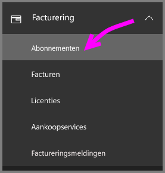
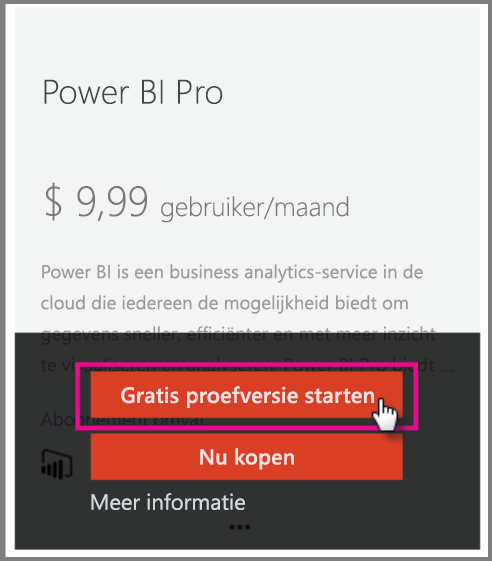
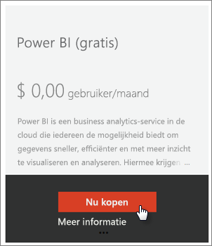
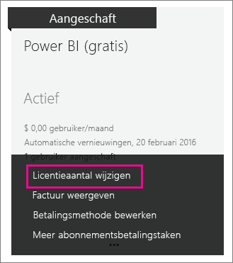

# <a name="power-bi-licensing-in-your-organization"></a>Power BI-licenties in uw organisatie

[!INCLUDE [license-capabilities](includes/license-capabilities.md)]

In dit artikel besteden we aandacht aan licenties per gebruiker gezien vanuit het perspectief van een beheerder.

## <a name="manage-power-bi-pro-licenses"></a>Power BI Pro-licenties beheren

Als beheerder kunt u Power BI Pro-licenties kopen en toewijzen. Bovendien kunt u zich registreren voor een proefversie van Power BI Pro voor uw organisatie. Individuele gebruikers kunnen zich ook registreren voor een Power BI Pro-proefversie.

### <a name="purchasing-power-bi-pro"></a>Power BI Pro kopen

U kunt Power BI Pro-licenties kopen via Microsoft Office 365 of via een gecertificeerde Microsoft-partner. Nadat u de licenties hebt gekocht, moet u deze toewijzen aan individuele gebruikers. Zie [Power BI Pro-licenties kopen en toewijzen](service-admin-purchasing-power-bi-pro.md) voor meer informatie.

### <a name="power-bi-pro-trial-for-individuals"></a>Power BI Pro-proefversie voor individuele gebruikers

Gebruikers in uw organisatie kunnen zich ook registreren voor een proefversie van Power BI Pro. Zie [Registreren voor Power BI als afzonderlijke gebruiker](service-self-service-signup-for-power-bi.md) voor meer informatie.

Gebruikers die ervoor kiezen om op deze manier de proefversie van Power BI Pro te activeren, worden in het Office 365-beheerportal niet weergegeven als gebruikers van de proefversie van Power BI Pro (maar als gebruikers van de gratis versie van Power BI). Ze worden echter wel weergegeven als gebruikers van de Power BI Pro-proefversie op de pagina voor het beheren van opslag in Power BI.

### <a name="power-bi-pro-trial-for-organizations"></a>Power BI Pro-proefversie voor organisaties

Als u Power BI-proeflicenties voor meerdere gebruikers in uw organisatie wilt aanvragen en implementeren zonder dat gebruikers de gebruiksvoorwaarden voor de proefversie afzonderlijk hoeven te accepteren, kunt u zich registreren voor een Power BI Pro-proefabonnement voor uw organisatie.

Houd rekening met het volgende voordat u de stappen volgt om u te registreren:

* U moet lid zijn van de rol [**Globale beheerder** of **Factureringsbeheerder**](https://support.office.com/article/about-office-365-admin-roles-da585eea-f576-4f55-a1e0-87090b6aaa9d) in Office 365 om u te kunnen registreren.

* Er geldt een limiet van één proefabonnement per tenant. Dit betekent dat als iemand anders uw organisatie al heeft aangemeld voor het proefabonnement, u op deze manier geen kennis meer kunt maken met Power BI Pro. Als u hier hulp bij nodig hebt, neemt u contact op met [de ondersteuning voor zakelijke producten](https://support.office.microsoft.com/article/contact-support-for-business-products-admin-help-32a17ca7-6fa0-4870-8a8d-e25ba4ccfd4b?CorrelationId=552bbf37-214f-4202-80cb-b94240dcd671).

1. Ga naar het [Office 365-beheercentrum](https://portal.office.com/adminportal/home#/homepage).

1. Selecteer in het navigatiedeelvenster aan de linkerkant **Facturering** en daarna **Abonnementen**.

   

1. Selecteer aan de rechterkant **Abonnementen toevoegen**.

   

1. Wijs onder **Andere abonnementen** het beletselteken (**. . .**) voor Power BI Pro aan en selecteer **Gratis proefabonnement starten**.

    

1. Selecteer in het bevestigingsscherm **Nu uitproberen**.

1. Selecteer **Doorgaan** in het ontvangstbewijs.

Nu kunt u [licenties toewijzen in Office 365](https://support.office.com/article/assign-licenses-to-users-in-office-365-for-business-997596b5-4173-4627-b915-36abac6786dc).

## <a name="manage-power-bi-free-licenses"></a>Gratis Power BI-licenties beheren

Gebruikers in uw organisatie kunnen op twee manieren de beschikking krijgen over gratis Power BI-licentie:

* U kunt een Power BI-licentie aan heb toewijzen vanuit de Office 365-beheerportal.

* Als een gebruiker [zich registreert voor een Power BI Pro-proefversie](service-self-service-signup-for-power-bi.md) en de proefversie vervalt, wordt aan de gebruiker een gratis licentie toegewezen.

### <a name="requesting-and-assigning-free-licenses"></a>Gratis licenties aanvragen en toewijzen

Als u van plan bent om licentieaanvragen en -toewijzingen centraal te beheren, controleert u eerst of u al beschikt over het onbeperkte licentieblok (gratis) voor Power BI.

Dit blok met licenties komt beschikbaar nadat iemand zich voor de eerste keer als individuele gebruiker heeft geregistreerd voor Power BI. Tijdens dat proces wordt dit licentieblok gekoppeld aan uw organisatie en wordt er een licentie toegewezen aan de gebruiker die zich registreert.

1. Kijk in het Office 365-beheercentrum of u onder **Facturering** > **Licenties** **onbeperkt** ziet staan.

    

1. Als het blok beschikbaar is, kunt u nu [licenties toewijzen in Office 365](https://support.office.com/article/assign-licenses-to-users-in-office-365-for-business-997596b5-4173-4627-b915-36abac6786dc). Als het blok niet beschikbaar is, hebt u twee opties:

    * Laat een lid van uw organisatie zich individueel registreren, zodat het blok met onbeperkte licenties wordt gemaakt.

    * Ga naar de volgende procedure, waarmee u zich kunt registreren voor een vast aantal licenties.

Als het blok met een onbeperkt aantal (gratis) licenties voor Power BI niet beschikbaar is en u niet een persoonlijke registratie wilt uitvoeren, volgt u deze procedure.

1. Ga naar het [Office 365-beheercentrum](https://portal.office.com/admin/default.aspx).

1. Selecteer in het linkernavigatievenster **Facturering** > **Abonnementen**.

1. Selecteer aan de rechterkant **Abonnementen toevoegen +**.

1. Wijs onder **Andere abonnementen** het beletselteken (**. . .**) voor Power BI (gratis) aan en selecteer **Nu kopen**.

    

1. Voer het gewenste aantal licenties in en selecteer vervolgens **Bestelling plaatsen** of **Toevoegen aan winkelwagen**.

1. Geef de vereiste gegevens op om te betalen.

    Op deze manier koopt u niets, ook al moet u uw creditcardgegevens voor facturering invoeren of aangeven dat u een factuur wilt krijgen.

1. Nu kunt u [licenties toewijzen in Office 365](https://support.office.com/article/assign-licenses-to-users-in-office-365-for-business-997596b5-4173-4627-b915-36abac6786dc).

1. Als u later besluit dat u meer licenties wilt toevoegen, kunt u naar **Abonnementen toevoegen** teruggaan en vervolgens **Aantal licenties wijzigen** voor Power BI (gratis) selecteren.

    

### <a name="enable-or-disable-individual-user-sign-up-in-azure-active-directory"></a>Persoonlijke gebruikersregistraties in- of uitschakelen in Azure Active Directory

Als beheerder kunt u ervoor kiezen om persoonlijke gebruikersregistraties via Azure Active Directory (AAD) in of uit te schakelen. In dit gedeelte van het artikel wordt beschreven hoe u registraties beheert met behulp van PowerShell-opdrachten. Zie [Overzicht van Azure PowerShell](/powershell/azure/overview) voor meer informatie over Azure PowerShell.

De AAD-instelling waarmee registratie wordt bepaald, is **AllowAdHocSubscriptions**. Bij de meeste tenants is deze instelling ingesteld op *true*, wat betekent dat de optie is ingeschakeld. Als u Power BI hebt gekocht via een partner, kan deze instelling zijn ingesteld op *false*, wat betekent dat de optie is uitgeschakeld. Als u de instelling wijzigt van *true* in *false*, kunnen nieuwe gebruikers in uw organisatie zich niet individueel registreren. Gebruikers die zich hebben geregistreerd voor Power BI voordat de instelling is gewijzigd, behouden hun licentie.

1. Meld u aan bij Azure Active Directory met uw Office 365-referenties. Met de eerste regel van het volgende PowerShell-script wordt u om uw referenties gevraagd. De tweede regel maakt verbinding met Azure Active Directory.

    ```powershell
     $msolcred = get-credential
     connect-msolservice -credential $msolcred
    ```

   

1. Nadat u bent aangemeld, voert u de volgende opdracht uit om te controleren hoe uw tenant momenteel is geconfigureerd.

    ```powershell
     Get-MsolCompanyInformation | fl AllowAdHocSubscriptions
    ```
1. Voer de volgende opdracht uit om **AllowAdHocSubscriptions** in te schakelen ($true) of uit te schakelen ($false).

    ```powershell
     Set-MsolCompanySettings -AllowAdHocSubscriptions $true
    ```

> [!NOTE]
> De vlag AllowAdHocSubscriptions wordt gebruikt voor het beheren van verschillende gebruikersmogelijkheden in uw organisatie, inclusief de mogelijkheid voor gebruikers om zich te registreren voor de Azure Rights Management-service. Het wijzigen van deze vlag heeft invloed op al deze mogelijkheden.

## <a name="next-steps"></a>Volgende stappen

[Registreren voor Power BI via selfservice](service-self-service-signup-for-power-bi.md)  

[Power BI Pro-licenties kopen en toewijzen](service-admin-purchasing-power-bi-pro.md)

Hebt u nog vragen? [Misschien dat de Power BI-community het antwoord weet](http://community.powerbi.com/)