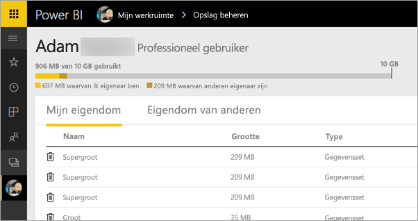
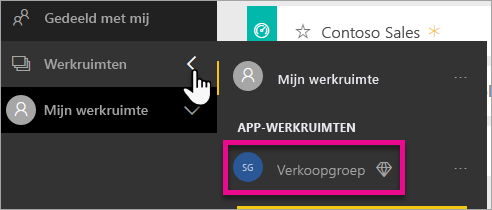
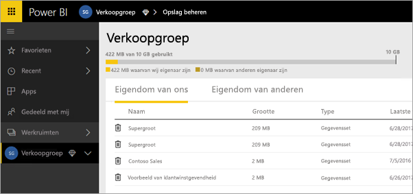

# Gegevensopslag in Power BI-werkruimten beheren

Meer informatie over hoe u uw persoonlijke of opslag van de app-werkruimte kunt beheren om ervoor te zorgen dat u rapporten en gegevenssets kunt blijven publiceren.

Gebruikers en app-werkruimten hebben hun eigen gegevenscapaciteit:

* Alle gebruikers hebben maximaal 10 GB gegevensopslag.
* Gebruikers met een Power BI Pro-licentie kunnen app-werkruimten maken, die elk maximaal 10 GB gegevensopslag hebben.
* Een app-werkruimte in een Premium-capaciteit telt niet mee bij de opslagruimte van een Power BI Pro-gebruiker.

Op tenantniveau kan het totale gebruik niet 10 GB per Pro-gebruiker overschrijden over alle Pro-gebruikers van app-werkruimten in de tenant.

Meer informatie over andere functies van het [Power BI-prijsmodel](https://powerbi.microsoft.com/pricing).

Tot uw gegevensopslag behoren uw eigen gegevenssets en Excel-rapporten en items die iemand met u heeft gedeeld. Gegevenssets zijn alle gegevensbronnen die u hebt geüpload of waarmee u verbonden bent. Deze gegevensbronnen bevatten de Power BI Desktop-bestanden en Excel-werkmappen die u gebruikt. Het volgende is ook opgenomen in uw gegevenscapaciteit.

* Excel-adresbereiken die zijn vastgemaakt aan dashboard.
* On-premises visualisaties van Reporting Services die zijn vastgemaakt aan een Power BI-dashboard.
* Geüploade afbeeldingen.

De grootte van een dashboard dat u deelt, is afhankelijk van hetgeen eraan is vastgemaakt. Als u bijvoorbeeld items uit twee rapporten vastmaakt die deel uitmaken van twee verschillende gegevenssets, omvat de grootte beide gegevenssets.

<a name="manage"/>

## Items beheren waarvan u de eigenaar bent

Zie hoeveel gegevensopslag u gebruikt in uw Power BI-account en beheer uw account.

1. Om uw eigen opslag te beheren, gaat u naar **Mijn werkruimte** in het navigatiedeelvenster links.
   
    
2. Selecteer het  in de rechterbovenhoek \> **Persoonlijke opslag beheren**.
   
    In de bovenste balk ziet u hoeveel u hebt gebruikt van uw opslaglimiet.
   
    
   
    De gegevenssets en rapporten worden gescheiden op twee tabbladen:
   
    **Items waarvan ik eigenaar ben:** Dit zijn de rapporten en gegevenssets die u hebt geüpload naar uw Power BI-account, waaronder servicegegevenssets zoals Salesforce en Dynamics CRM.  
    **Items waarvan anderen eigenaar zijn:** Anderen hebben deze rapporten en gegevenssets met u gedeeld.
1. Als u een gegevensset of rapport wilt verwijderen, selecteert u het prullenbakpictogram .

Bedenk dat u of iemand anders mogelijk rapporten en dashboards heeft die zijn gebaseerd op een gegevensset. Als u de gegevensset verwijdert, werken die rapporten en dashboards niet meer.

## Uw app-werkruimte beheren
1. Selecteer de pijl naast **Werkruimten** \> en selecteer de naam van de app-werkruimte.
   
    
2. Selecteer het tandwielpictogram  \> in de rechterbovenhoek **Persoonlijke opslag beheren**.
   
    In de bovenste balk ziet u hoeveel opslaglimiet van de groep is gebruikt.
   
    
   
    De gegevenssets en rapporten worden gescheiden op twee tabbladen:
   
    **Items waarvan wij eigenaar zijn:** Dit zijn rapporten en gegevenssets die door u of iemand anders zijn geüpload naar het Power BI-account van de groep, waaronder servicegegevenssets zoals Salesforce en Dynamics CRM.
    **Items waarvan anderen eigenaar zijn:** Anderen hebben deze rapporten en gegevenssets met uw groep gedeeld.
3. Als u een gegevensset of rapport wilt verwijderen, selecteert u het prullenbakpictogram .
   
   > [!NOTE]
   > Elk lid, met bewerkingsmachtigingen, van een app-werkruimte is gemachtigd om gegevenssets en rapporten uit de app-werkruimte te verwijderen.
   > 
   > 

Bedenk dat u of iemand anders in de groep mogelijk rapporten en dashboards heeft die zijn gebaseerd op een gegevensset. Als u de gegevensset verwijdert, werken die rapporten en dashboards niet meer.

## Limieten voor de gegevensset
Er is een limiet van 1 GB per gegevensset die wordt geïmporteerd in Power BI. Als u ervoor hebt gekozen om de Excel-ervaring te houden, in plaats van de gegevens te importeren, is 250 MB de limiet voor de gegevensset.

## Wat er gebeurt wanneer u een limiet bereikt
Als u de gegevenscapaciteitslimiet bereikt, ziet u instructies in de service. 

Wanneer u het tandwielpictogram selecteert, ziet u een rode balk die aangeeft dat u de limiet van uw gegevenscapaciteit hebt overschreden.

Deze limiet wordt ook aangeduid in **Persoonlijke opslag beheren**.

 

 Wanneer u een actie uitvoert waarmee u een van de limieten bereikt, wordt een bericht weergegeven dat u de limiet hebt overschreden. U kunt uw opslag [beheren](#manage) om de hoeveelheid opgeslagen gegevens te verkleinen en zo binnen de limiet te blijven.

 

 Hebt u nog vragen? [Misschien dat de Power BI-community het antwoord weet](http://community.powerbi.com/)

