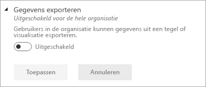
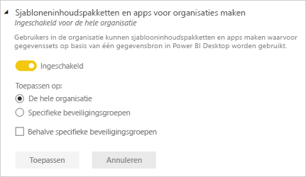
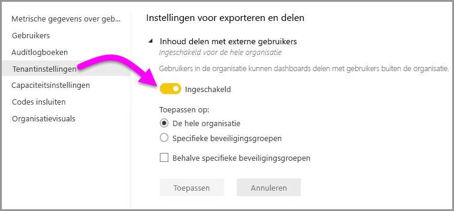
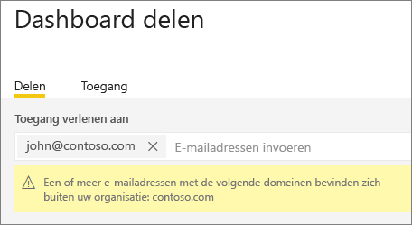
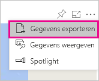
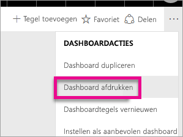
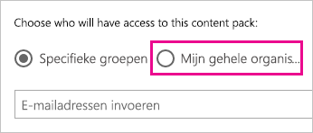

# Power BI-beheerportal

Via de beheerportal kunt u een Power BI-*tenant* voor uw organisatie beheren. De portal bevat onder andere metrische gegevens over gebruik, toegang tot het Office 365-beheercentrum en instellingen.

Het volledige beheerportal is toegankelijk voor alle gebruikers die globale beheerders zijn in Office 365 of die de rol van beheerder van de Power BI-service hebben. Als u niet een van deze rollen heeft, ziet u in de portal alleen de optie **Capaciteitsinstellingen**. Zie [Understanding the Power BI admin role](service-admin-role.md) (Power BI-beheerdersrol) voor meer informatie over de beheerdersrol voor de Power BI-service.

## Toegang krijgen tot de beheerportal

Om toegang te krijgen tot het Power BI-beheerportal, moet uw account zijn ingesteld als een **Globale beheerder**, in Office 365 of Azure Active Directory, of moet de rol van beheerder van de Power BI-service aan het account zijn toegewezen. Zie [Understanding the Power BI admin role](service-admin-role.md) (Power BI-beheerdersrol) voor meer informatie over de beheerdersrol voor de Power BI-service. Ga op de volgende manier te werk om de Power BI-beheerportal te openen.

1. Selecteer het tandwielpictogram in de rechterbovenhoek van de Power BI-service.

1. Selecteer **Beheerportal**.

    

Er zijn zeven tabbladen in de portal. De rest van dit artikel geeft informatie over elk van deze tabbladen.

* [Metrische gegevens over gebruik](#usage-metrics)
* [Gebruikers](#users)
* [Auditlogboeken](#audit-logs)
* [Tenantinstellingen](#tenant-settings)
* [Premium-instellingen](#premium-settings)
* [Codes insluiten](#embed-codes)
* [Organisatievisuals](#organization-visuals)

## Metrische gegevens over gebruik

Met de **Metrische gegevens over gebruik** kunt u het Power BI-gebruik voor uw organisatie bewaken. Daarnaast kunt u in het rapport zien welke gebruikers, en groepen, het actiefst zijn binnen Power BI voor uw organisatie.

> [!NOTE]
> De eerste keer dat u het dashboard opent, of als u het dashboard weergeeft nadat u het lange tijd niet hebt gebruikt, ziet u waarschijnlijk een melding dat het dashboard wordt geladen.

Zodra het dashboard wordt geladen, ziet u twee secties met tegels. De eerste sectie bevat gebruiksgegevens over individuele gebruikers, en de tweede sectie bevat vergelijkbare informatie over groepen in uw organisatie.

Hier volgt een overzicht van wat u in elke tegel kunt zien:

* Unieke telling van alle dashboards, rapporten en gegevenssets in de werkruimte voor gebruikers
  
    

* Het meest gebruikte dashboard qua het aantal gebruikers dat er toegang tot heeft. Als u bijvoorbeeld een dashboard hebt dat u met drie gebruikers hebt gedeeld, en u het dashboard ook hebt toegevoegd aan een inhoudspakket waarmee twee verschillende gebruikers verbinding hebben gemaakt, zou het aantal uitkomen op 6 (1 + 3 + 2)
  
    

* De meest populaire inhoud waarmee gebruikers verbinding hebben gemaakt. Het betreft hier alle inhoud die de gebruikers kunnen bereiken via het proces Gegevens ophalen, zoals SaaS-inhoudspakketten, organisatie-inhoudspakketten, bestanden of databases.
  
    

* Een weergave van de actiefste gebruikers op basis van hoeveel dashboards ze hebben, zowel dashboards die ze zelf hebben gemaakt en dashboards die met ze zijn gedeeld.
  
    

* Een weergave van de actiefste gebruikers op basis van de hoeveelheid rapporten die ze hebben.
  
    

De tweede sectie bevat hetzelfde type informatie, maar dan op basis van groepen. Hier kunt u zien welke groepen in uw organisatie het actiefst zijn en wat voor soort inhoud ze gebruiken.

Aan de hand van deze informatie kunt u een goed beeld krijgen van hoe Power BI in uw organisatie wordt gebruikt. Daarnaast kunt u zien welke gebruikers en groepen zeer actief zijn in uw organisatie.

## Gebruikers

U beheert Power BI-gebruikers, -groepen en -beheerders in het Office 365-beheercentrum. Het tabblad **Gebruikers** bevat een link naar het beheercentrum voor uw tenant.

## Auditlogboeken

U beheert Power BI-auditlogboeken in het Office 365-centrum voor beveiliging en naleving. Het tabblad **Auditlogboeken** bevat een link naar het centrum voor beveiliging en naleving voor uw tenant. [Meer informatie](service-admin-auditing.md)

Als u auditlogboeken wilt gebruiken, zorg dan dat de instelling [**Auditlogboeken maken voor het controleren van interne activiteiten en naleving**](#create-audit-logs-for-internal-activity-auditing-and-compliance) is ingeschakeld.

## Tenantinstellingen

Via het tabblad **Tenantinstellingen** kunt u nauwkeurig bepalen welke functies aan uw organisatie ter beschikking worden gesteld. Als u zich zorgen maakt over gevoelige gegevens, zijn sommige van onze functies mogelijk niet geschikt voor uw organisatie, of misschien wilt u alleen een bepaalde functie beschikbaar stellen aan een specifieke groep.

De volgende afbeelding toont de eerste twee secties van het tabblad **Tenantinstellingen**.

> [!NOTE]
> Het kan maximaal tien minuten duren voordat een instelling voor iedereen in uw tenant is gewijzigd.

Instellingen kunnen drie statussen hebben:

* **Uitgeschakeld voor de hele organisatie**: niemand in uw organisatie kan deze functie gebruiken.

    

* **Ingeschakeld voor de hele organisatie**: iedereen in uw organisatie kan deze functie gebruiken.

    

* **Ingeschakeld voor een subset van de organisatie**: een specifieke subset van gebruikers of groepen in uw organisatie kan deze functie gebruiken.

    U kunt de functie inschakelen voor uw hele organisatie, met uitzondering van een specifieke groep gebruikers.

    

    U kunt de functie ook alleen voor een specifieke groep gebruikers inschakelen en voor een andere groep gebruikers uitschakelen. Op deze manier kunt u ervoor zorgen dat bepaalde gebruikers geen toegang hebben tot de functie, zelfs niet als deel uitmaken van de groep die wel toegang heeft.

    

In de volgende secties ziet u een overzicht van de verschillende typen tenantinstellingen.

## Instellingen voor werkruimten

### Werkruimten maken (preview)

Gebruikers in de organisatie kunnen app-werkruimten maken om samen te werken aan dashboards, rapporten en andere inhoud. [Meer informatie](service-create-the-new-workspaces.md)

## Instellingen voor exporteren en delen

### Inhoud delen met externe gebruikers

Gebruikers in de organisatie kunnen dashboards delen met gebruikers buiten de organisatie. [Meer informatie](service-share-dashboards.md#share-a-dashboard-or-report-with-people-outside-your-organization)

De volgende afbeelding toont het bericht dat verschijnt wanneer u deelt met een externe gebruiker.

### Publiceren op internet

Gebruikers in de organisatie kunnen rapporten op internet publiceren. [Meer informatie](service-publish-to-web.md)

De volgende afbeelding toont het menu **Bestand** voor een rapport wanneer de instelling **Publiceren op internet** is ingeschakeld.

Gebruikers zien verschillende opties in de gebruikersinterface, afhankelijk van de instelling **Publiceren op internet**.

|Functie |Ingeschakeld voor de hele organisatie |Uitgeschakeld voor de hele organisatie |Specifieke beveiligingsgroepen   |
|---------|---------|---------|---------|
|**Publiceren op internet** onder het menu **Bestand** van het rapport.|Ingeschakeld voor iedereen|Niet voor iedereen zichtbaar|Alleen zichtbaar voor gemachtigde gebruikers of groepen.|
|**Invoegcodes beheren** onder **Instellingen**|Ingeschakeld voor iedereen|Ingeschakeld voor iedereen|Ingeschakeld voor iedereen  Optie * **Verwijderen** alleen voor gemachtigde gebruikers of groepen. * **Ophalen van codes** ingeschakeld voor iedereen.|
|**Codes invoegen** binnen de beheerportal|De status geeft een van de volgende opties weer: * Actief * Niet ondersteund * Geblokkeerd|De status geeft **Uitgeschakeld** weer|De status geeft een van de volgende opties weer: * Actief * Niet ondersteund * Geblokkeerd  Als een gebruiker niet is geautoriseerd op basis van de tenantinstelling, wordt de status weergegeven als **geschonden**.|
|Bestaande gepubliceerde rapporten|Iedereen ingeschakeld|Iedereen uitgeschakeld|Rapporten blijven weergeven voor iedereen.|

### Gegevens exporteren

Gebruikers in de organisatie kunnen gegevens uit een tegel of visualisatie exporteren. [Meer informatie](visuals/power-bi-visualization-export-data.md)

De volgende afbeelding toont de optie voor het exporteren van gegevens uit een tegel.

> [!NOTE]
> Als u **Gegevens exporteren** uitschakelt, hebben gebruikers ook geen toegang tot de functie **Analyseren in Excel** en kunnen ze ook de live-verbinding met de Power BI-service niet gebruiken.

### Hiermee worden rapporten geëxporteerd als PowerPoint-presentaties

Gebruikers in de organisatie kunnen Power BI-rapporten exporteren als PowerPoint-bestanden. [Meer informatie](consumer/end-user-powerpoint.md)

De volgende afbeelding toont het menu **Bestand** voor een rapport wanneer de instelling **Rapporten exporteren als PowerPoint-presentaties** is ingeschakeld.

### Dashboards en rapporten afdrukken

Gebruikers in de organisatie kunnen dashboards en rapporten afdrukken. [Meer informatie](consumer/end-user-print.md)

De volgende afbeelding toont de optie voor het afdrukken van een dashboard.

De volgende afbeelding toont het menu **Bestand** voor een rapport wanneer de instelling **Dashboards en rapporten afdrukken** is ingeschakeld.

## Instellingen voor inhoudspakket en app

### Inhoudspakketten en apps naar de volledige organisatie publiceren

Gebruikers in de organisatie kunnen inhoudspakketten en apps publiceren naar de volledige organisatie, niet alleen naar specifieke groepen. [Meer informatie](service-organizational-content-pack-manage-update-delete.md)

De volgende afbeelding toont de optie **Mijn hele organisatie** bij het maken van een inhoudspakket.

### Sjabloneninhoudspakketten en apps voor organisaties maken

Gebruikers in de organisatie kunnen sjablooninhoudspakketten maken die gegevenssets gebruiken die gemaakt in Power BI Desktop. [Meer informatie](template-content-pack-authoring.md)

### Apps pushen naar eindgebruikers

Gebruikers kunnen apps rechtstreeks met eindgebruikers delen zonder dat er installatie vanuit AppSource is vereist. [Meer informatie](service-create-distribute-apps.md)

## Instellingen voor integratie

### Vragen over gegevens stellen met Cortana

Gebruikers in de organisatie kunnen vragen over hun gegevens stellen met behulp van Cortana. [Meer informatie](service-cortana-enable.md)

> [!NOTE]
> Deze instelling geldt voor de hele organisatie en kan niet worden beperkt tot specifieke groepen.

### Analyseren in Excel gebruiken met on-premises gegevenssets

Gebruikers in de organisatie kunnen Excel gebruiken voor het weergeven van on-premises Power BI-gegevenssets en het werken met deze sets. [Meer informatie](service-analyze-in-excel.md)

> [!NOTE]
> Als u **Gegevens exporteren** uitschakelt, hebben gebruikers ook geen toegang tot de functie **Analyseren in Excel**.

### ArcGIS Maps for Power BI gebruiken

Gebruikers in de organisatie kunnen de visualisatie ArcGIS Maps for Power BI, die is geleverd door Esri, gebruiken. [Meer informatie](power-bi-visualization-arcgis.md)

### Algemene zoekopdrachten voor Power BI gebruiken (preview-versie)

Gebruikers in de organisatie kunnen externe-zoekopdrachtfuncties gebruiken waarbij gebruik wordt gemaakt van Azure Search. Gebruikers kunnen bijvoorbeeld gebruikmaken van Cortana om belangrijke gegevens rechtstreeks op te halen uit Power BI-dashboards en -rapporten. [Meer informatie](service-cortana-intro.md)

## Instellingen voor aangepaste visuele elementen

### Aangepaste visuele elementen inschakelen voor de hele organisatie

Gebruikers in de organisatie kunnen aangepaste visuele elementen gebruiken en delen. [Meer informatie](power-bi-custom-visuals.md)

> [!NOTE]
> Deze instelling geldt voor de hele organisatie en kan niet worden beperkt tot specifieke groepen.

## Instellingen voor R-visuals

### Interactie met visuele R-elementen en visuele R-elementen delen

Gebruikers in de organisatie kunnen interactie hebben met visuele elementen die zijn gemaakt met R scripts en deze elementen delen. [Meer informatie](visuals/service-r-visuals.md)

> [!NOTE]
> Deze instelling geldt voor de hele organisatie en kan niet worden beperkt tot specifieke groepen.

## Instellingen voor controle en gebruik

### Auditlogboeken maken voor het controleren van interne activiteiten en naleving

Gebruikers in de organisatie kunnen de auditfunctie gebruiken voor het controleren van acties die door andere gebruikers in de organisatie worden uitgevoerd in Power BI. [Meer informatie](service-admin-auditing.md)

Deze instelling moet worden ingeschakeld om vermeldingen te kunnen vastleggen in het auditlogboek. Er kan een vertraging tot 48 uur bestaan tussen het inschakelen van de controlefunctie en het kunnen weergeven van controlegegevens. Als u niet direct gegevens ziet, controleert u de controlelogboeken op een later tijdstip. Er kan een vergelijkbare vertraging optreden tussen het ophalen van machtiging voor het weergeven van controlelogboeken en het kunnen openen van de logboeken.

> [!NOTE]
> Deze instelling geldt voor de hele organisatie en kan niet worden beperkt tot specifieke groepen.

### Metrische gegevens over het gebruik voor makers van inhoud

Gebruikers in de organisatie kunnen metrische gegevens weergeven over het gebruik van de dashboards en rapporten die ze hebben gemaakt. [Meer informatie](service-usage-metrics.md)

### Gegevens per gebruiker in metrische gegevens over gebruik voor makers van inhoud

In metrische gegevens over het gebruik voor makers van inhoud zijn namen en e-mailadressen zichtbaar van gebruikers die inhoud openen. [Meer informatie](service-usage-metrics.md)

Standaard wordt Gegevens per gebruiker ingeschakeld voor metrische gegevens over gebruik. Accountgegevens van makers van inhoud worden in het metrische rapport opgenomen. Als u deze informatie niet voor een bepaalde gebruiker of voor geen enkele gebruiker wilt opnemen, schakelt u de functie voor bepaalde beveiligingsgroepen of voor een hele organisatie uit. Accountgegevens worden dan in het rapport weergegeven als *Naamloos*.

## Instellingen voor dashboard

### Gegevensclassificatie voor dashboards

Gebruikers in de organisatie kunnen dashboards labelen met classificaties die het beveiligingsniveau van het dashboard aangeven. [Meer informatie](service-data-classification.md)

> [!NOTE]
> Deze instelling geldt voor de hele organisatie en kan niet worden beperkt tot specifieke groepen.

## Instellingen voor ontwikkelaars

### Inhoud in apps insluiten

Gebruikers in de organisatie kunnen Power BI-dashboards en rapporten insluiten in SaaS-toepassingen (Software as a Service). Als u deze instelling uitschakelt, kunnen gebruikers de REST API's niet gebruiken om inhoud van Power BI in hun toepassing in te sluiten. [Meer informatie](developer/embedding.md)

## Werkruimten en instellingen voor importeren

### Inhoud maken in werkruimten

Gebruikers in de organisatie hebben toegang tot werkruimten om verbinding te maken met gegevens en om inhoud te maken. [Meer informatie](service-create-the-new-workspaces.md)

### Gegevens importeren in Power BI

Gebruikers in de organisatie kunnen gegevens importeren in de service, zoals rapporten uit Power BI Desktop publiceren, Power BI-rapportbestanden uploaden en verbinding maken met gegevens rechtstreeks vanuit de service. [Meer informatie](desktop-upload-desktop-files.md)

## Gegevensstroominstellingen (preview-versie)

### Gegevensstromen maken en gebruiken (preview-versie)

Gebruikers in de organisatie kunnen gegevensstromen maken en gebruiken. [Meer informatie](service-dataflows-overview.md)

> [!NOTE]
> Deze instelling geldt voor de hele organisatie en kan niet worden beperkt tot specifieke groepen.

## Capaciteitsinstellingen

### Power BI Premium

Via het tabblad **Power BI Premium-instellingen** kunt u capaciteiten van Power BI Premium (Em of P SKU) beheren die voor uw organisatie zijn gekocht. Alle gebruikers binnen uw organisatie kunnen het tabblad **Power BI Premium-instellingen** zien, maar ze zien alleen inhoud op het tabblad als ze zijn aangewezen als *Capaciteitsbeheerder* of als ze beschikken over toewijzingsmachtigingen. Als een gebruiker geen machtigingen heeft, verschijnt het volgende bericht.

Zie [Power BI Premium beheren](service-admin-premium-manage.md) voor meer informatie over het beheren van Premium-instellingen.

### Power BI Embedded

Via het tabblad **Power BI Embedded-instellingen** kunt u de capaciteiten van Power BI Embedded (A SKU) bekijken die u voor uw klant hebt aangeschaft. Aangezien u alleen A SKU's vanuit Azure kunt aanschaffen, kunt u [ingesloten capaciteiten in Azure beheren](developer/azure-pbie-create-capacity.md) vanuit de **Azure-portal**.

Zie [Wat is Power BI Embedded?](developer/azure-pbie-what-is-power-bi-embedded.md) voor meer informatie over het beheren van Power BI Embedded (A SKU)-instellingen.

## Codes insluiten

Als beheerder kunt u de invoegcodes weergeven die worden gegenereerd voor uw tenant. U kunt ook codes intrekken of verwijderen. [Meer informatie](service-publish-to-web.md)

## Organisatievisuals

Via het tabblad **Organisatievisuals** kunt u aangepaste visuals binnen uw organisatie implementeren en beheren. Met organisatievisuals kunt u eenvoudig eigen visuals in uw organisatie implementeren. Auteurs van rapporten kunnen deze vervolgens detecteren en vanuit Power BI Desktop in hun rapporten importeren. [Meer informatie](power-bi-custom-visuals-organization.md)

> [!WARNING]
> Een aangepaste visual kan een code bevatten met beveiligings- of privacyrisico's. Wees er zeker van dat u de auteur en de bron van de aangepaste visual vertrouwt voordat u de visual in de opslagplaats van de organisatie implementeert.

De volgende afbeelding toont alle aangepaste visuals die momenteel in de opslagplaats van de organisatie zijn geïmplementeerd.

### Een nieuwe aangepaste visual toevoegen

Volg deze stappen als u een nieuwe aangepaste visual aan de lijst wilt toevoegen. 

1. Selecteer in het rechterdeelvenster de optie **Een aangepaste visual toevoegen**.

    

1. Vul het formulier **Aangepaste visual toevoegen** in:

    * **Een PBIVIZ-bestand kiezen** (vereist): selecteer een aangepaste visual om te uploaden. Alleen versies van aangepaste API-visuals worden ondersteund (lees hier wat dit betekent).

    Voordat u een aangepaste visual uploadt, moet u controleren of de beveiliging en privacy van die visual past bij de normen van uw organisatie.

    * **Naam van uw aangepaste visual** (vereist): geef een korte titel aan de visual zodat gebruikers van Power BI Desktop gemakkelijk begrijpen wat de visual doet.

    * **Pictogram**: het pictogrambestand dat wordt weergegeven in de gebruikersinterface van Power BI Desktop.

    * **Beschrijving**: een korte beschrijving van de visual zodat de gebruiker meer context heeft en weet waarvoor de visual is bedoeld.

1. Selecteer **Toevoegen** om de uploadaanvraag te starten. U ziet het nieuwe item in de lijst als de aanvraag is geslaagd. Als de aanvraag is mislukt, ziet u de bijbehorende foutmelding

### Een aangepaste visual verwijderen uit de lijst

Als u een visual permanent wilt verwijderen, selecteert u het prullenbakpictogram voor de visual in de opslagplaats.

> [!IMPORTANT]
> Verwijderen kan niet ongedaan worden gemaakt. Wanneer de visual is verwijderd, wordt deze onmiddellijk niet meer weergegeven in bestaande rapporten. Zelfs als u dezelfde visual opnieuw uploadt, zal deze de vorige die u hebt verwijderd, niet vervangen. Gebruikers kunnen echter de nieuwe visual opnieuw importeren en het exemplaar in hun rapporten vervangen.

### Een aangepaste visual uit de lijst verwijderen

Als u de visual in de opslagplaats wilt uitschakelen, selecteert u het tandwielpictogram. In de sectie **Toegang** kunt u de aangepaste visual uitschakelen.

Als de visual is uitgeschakeld, wordt deze niet meer weergegeven in bestaande rapporten en wordt het onderstaande foutbericht weergegeven.

*Deze aangepaste visual is niet langer beschikbaar. Neem voor meer informatie contact op met uw beheerder.*

Visuals met een bladwijzer werken echter nog steeds.

Na elke update of wijziging door een beheerder, moeten gebruikers van Power BI Desktop de toepassing opnieuw starten of de browser in de Power BI-service vernieuwen om de updates te kunnen zien.

### Een visual bijwerken

Selecteer het tandwielpictogram als u de visual wilt bijwerken vanuit de zakelijke opslag. Blader naar een nieuwe versie van de visual en upload deze.

Zorg ervoor dat de id van de visual ongewijzigd blijft. Het nieuwe bestand vervangt het vorige bestand voor alle rapporten in de hele organisatie. Vervang echter niet de vorige versie als de nieuwe versie van de visual een verbruiks- of gegevensstructuur van de vorige versie van de visual kan verbreken. In plaats daarvan moet u een nieuwe vermelding maken voor de nieuwe versie van de visual. Voeg bijvoorbeeld een nieuw versienummer (versie X.X) toe aan de titel van de nieuwe vermelde visual. Op deze manier is het duidelijk dat dit dezelfde visual is, alleen met een bijgewerkt versienummer, zodat bestaande rapporten hun functionaliteit niet verbreken. Zorg er weer voor dat de id van de visual ongewijzigd blijft. De volgende keer dat gebruikers toegang hebben tot de opslagplaats van de organisatie vanuit Power BI Desktop, kunnen ze de nieuwe versie importeren, waarbij wordt gevraagd om de huidige versie in hun rapport te vervangen.

## Volgende stappen

[Power BI in uw organisatie beheren](service-admin-administering-power-bi-in-your-organization.md) [De Power BI-beheerdersrol begrijpen](service-admin-role.md)  
[Power BI controleren in uw organisatie](service-admin-auditing.md)  
[Power BI Premium beheren](service-admin-premium-manage.md)  

Hebt u nog vragen? [Misschien dat de Power BI-community het antwoord weet](http://community.powerbi.com/)
