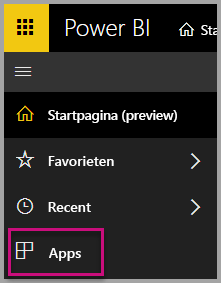
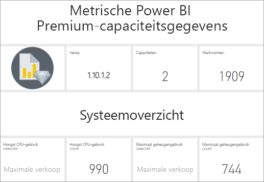
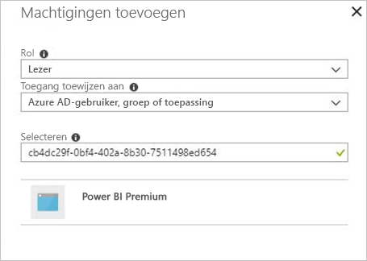

# Capaciteiten van Power BI Premium in uw organisatie bewaken

In dit artikel vindt u een overzicht van het bewaken van de metrische gegevens voor uw Power BI Premium-capaciteiten. Het bewaken van het capaciteitsgebruik biedt een geïnformeerde benadering voor het beheren van uw capaciteiten. 

U kunt de capaciteit bewaken met de app Power BI Premium Capacity Metrics of via de beheerportal. We raden de app aan omdat deze meer detail biedt. Dit artikel behandelt echte beide opties.

## De app Premium Capacity Metrics installeren

U kunt rechtstreeks naar de [app Premium Capacity Metrics](https://app.powerbi.com/groups/me/getapps/services/capacitymetrics) gaan of deze net als andere apps in Power BI installeren.

> [!IMPORTANT]
> Als u de app wilt installeren en gebruiken, moet u een capaciteitsbeheerder voor ten minste één capaciteit zijn. Een Power BI-beheerder heeft hiervoor onvoldoende rechten. 

1. Klik in Power BI op **Apps**.

    

2. Klik aan de rechterkant op **Apps downloaden**.

3. Zoek in de categorie **Apps** naar **Power BI Premium Capacity Metrics-app**.

4. Meld u aan om de app te installeren.

Als de app is geïnstalleerd, kunt u metrische gegevens over de capaciteiten in uw organisatie zien. Laten we eens kijken naar enkele belangrijke metrische gegevens die beschikbaar zijn.

## De Metrics-app gebruiken 
Als u de app opent, ziet u eerst een dashboard met een overzicht van alle capaciteiten waarvoor u beheerdersrechten bezit.

### Filteren

Op het tabblad **Filters op alle pagina's toegepast** kunt u een capaciteit, een gegevensset en/of een gegevensbereik binnen de afgelopen zeven dagen selecteren. Met deze filters wordt de selectie toegepast op alle relevante pagina's en tegels in dit rapport. Als u niets selecteert, worden in het rapport alleen de metrische gegevens getoond van elke capaciteit waarvan u de eigenaar bent.

### Tabblad Samenvatting

Op het tabblad **Samenvatting** wordt een weergave getoond van de capaciteit op basis van entiteiten, het systeem en gegevenssets.

| **Gebied** | **Metrische gegevens** |
| --- | --- |
| **Entiteiten** | * Het aantal capaciteiten waarvan u eigenaar bent  * Het verschillende aantal gegevenssets in uw capaciteit  * Het verschillende aantal werkruimten in uw capaciteit |
| **Systeem** | * Het gemiddelde geheugengebruik in GB gedurende de afgelopen zeven dagen  * Het hoogste geheugengebruik in GB gedurende de afgelopen zeven dagen en de lokale tijd waarop dit plaatsvond  * Het aantal keren waarop de CPU 80% van de drempelwaarden overschreed gedurende de afgelopen zeven dagen, gesplitst in buckets van drie minuten  * De tijden waarop de CPU de 80% meestal overschreed gedurende de afgelopen zeven dagen, gesplitst in buckets van één uur, en de lokale tijd waarop dit plaatsvond  * Het aantal keren dat DirectQuery/Live-verbindingen 80% van de drempelwaarden overschreed gedurende de afgelopen zeven dagen, gesplitst in buckets van drie minuten  * De tijden waarop DirectQuery/Live-verbindingen de 80% meestal overschreed gedurende de afgelopen zeven dagen, gesplitst in buckets van één uur, en de lokale tijd waarop dit plaatsvond |
| **Workloads van gegevenssets** | * Het totale aantal vernieuwingen gedurende de afgelopen zeven dagen  * Het totale aantal geslaagde vernieuwingen gedurende de afgelopen zeven dagen  * Het totale aantal mislukte vernieuwingen gedurende de afgelopen zeven dagen  * Het totale aantal mislukte vernieuwingen wegens onvoldoende geheugen  * De gemiddelde vernieuwingsduur wordt gemeten in minuten, de tijd om de bewerking te voltooien  * De gemiddelde wachttijd voor het vernieuwen wordt gemeten in minuten, de gemiddelde vertraging tussen de geplande tijd en het begin van de bewerking  * Het totale aantal uitgevoerde query's gedurende de afgelopen zeven dagen  * Het totale aantal geslaagde query's gedurende de afgelopen zeven dagen  * Het totale aantal mislukte query's gedurende de afgelopen zeven dagen  * De gemiddelde duur van de query's wordt gemeten in minuten, de tijd om de bewerking te voltooien  * Het totale aantal modellen dat wegens geheugendruk is verwijderd |
|  |  |

### Tabblad Vernieuwingen

Op het tabblad **Vernieuwingen** vindt u de voltooide vernieuwingen, de geslaagde vernieuwingen, de gemiddelde/maximale wachttijd en de gemiddelde/maximale vernieuwingsduur gedurende de afgelopen zeven dagen, gesegmenteerd in gegevenssets. De onderste twee diagrammen tonen de vernieuwingen versus het geheugenverbruik in GB en de gemiddelde wachttijden, gesplitst in buckets van één uur en weergegeven in de lokale tijd. De bovenste staafdiagrammen tonen de gegevenssets met de langste tijden voor het vernieuwen van de gegevensset (vernieuwingsduur) en de maximale duur van de wachttijden. Meerdere pieken met een lange wachttijd duiden erop dat de capaciteit aan zijn maximum zit.

### Tabblad Gegevenssets

Op het tabblad **Gegevenssets** vindt u de volledige gegevenssets die zijn verwijderd vanwege geheugendruk (per uur).

### Tabblad Systeem

Op het tabblad **Systeem** vindt u het hoog CPU-gebruik (aantal keren dat de drempelwaarde van 80% is overschreden), hoog gebruik van DirectQuery/Live-verbindingen en het geheugengebruik.

## Power BI Embedded-capaciteit bewaken

U kunt ook de app Power BI Premium Capacity Metrics gebruiken om *A SKU*-capaciteiten in Power BI Embedded te bewaken. Deze capaciteiten worden in het rapport weergegeven als u een beheerder van de capaciteit bent. U kunt het rapport echter niet vernieuwen, tenzij u bepaalde machtigingen verleent aan Power BI op uw A SKU's:

1. Open uw capaciteit in de Azure-portal.
1. Klik op **Toegangsbeheer (IAM)** en voeg de app Power BI Premium aan de lezersrol toe. Als u de app niet op naam kunt vinden, kunt u deze ook op client-id toevoegen: cb4dc29f-0bf4-402a-8b30-7511498ed654.

    

> [!NOTE]
> U kunt capaciteitsgebruik van Power BI Embedded bewaken met de app of in de Azure-portal, maar niet in de Power BI-beheerportal.

## Eenvoudige bewaking in de beheerportal

Het gebied **Capaciteitsinstellingen** van de beheerportal bevat vier meters waarmee de geplaatste belastingen en de door uw capaciteit gebruikte resources gedurende de afgelopen zeven dagen worden gemeten. Deze vier tegels werken volgens met tijdvensters van een uur, waarin wordt aangegeven hoeveel uren gedurende de afgelopen zeven dagen de desbetreffende meting meer dan 80% aangaf. Deze meting geeft en potentiële afname van de eindgebruikerservaring aan.

| **Meting** | **Beschrijving** |
| --- | --- |
| CPU |Aantal keer dat CPU-gebruik 80% of meer was. |
| Geheugenthrashing |De geheugendruk van uw back-endkernen. Met deze gegevens wordt aangegeven hoe vaak gegevenssets uit het geheugen zijn verwijderd vanwege de geheugendruk door het gebruik van meerdere gegevenssets. |
| Memory Usage |Gemiddeld geheugengebruik, in gigabytes (GB). |
| DQ/s | Aantal keer dat het aantal DirectQuery- en liveverbindingen 80% van de limiet heeft overschreden.   * We beperken het totale aantal query's per seconde voor DirectQuery en live-verbindingen. * De grenswaarden zijn 30/s voor P1, 60/s voor P2 en 120/s voor P3. * De query's voor DirectQuery en liveverbindingen tellen beide een zwaar voor de bovenstaande limiet. Als u gedurende één seconde bijvoorbeeld 15 DirectQuery's en 15 live-verbindingen hebt, is de grenswaarde bereikt * Dit geldt ook voor on-premises- en cloudverbindingen. |
|  |  |

Metrische gegevens geven het gebruik van de afgelopen week aan.  Als u een weergave met meer details wilt zien van de metrische gegevens, klikt u hiervoor op een van de samenvattingstegels.  Hiermee gaat u naar de gedetailleerde diagrammen voor elk van de metrische gegevens voor uw Premium-capaciteit. In het volgende diagram worden de details voor de CPU-meting getoond.

Deze grafieken worden voor de afgelopen week per uur samengevat en kunnen helpen bij het isoleren wanneer u mogelijk specifieke, prestatiegerelateerde evenementen hebt gehad in uw Premium-capaciteit.

U kunt ook de onderliggende gegevens voor elk van de metrische gegevens exporteren naar een csv-bestand.  Deze export biedt u gedetailleerde informatie voor elke dag van de afgelopen week, in stappen van drie minuten.

## Volgende stappen

U hebt geleerd hoe u Power BI Premium-capaciteiten kunt bewaken. U kunt nu meer leren over het optimaliseren van capaciteiten.

> [!div class="nextstepaction"]
> [Resourcebeheer en optimalisatie van Power BI Premium-capaciteit](service-premium-understand-how-it-works.md)
