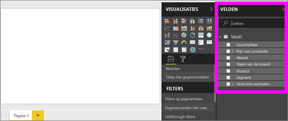
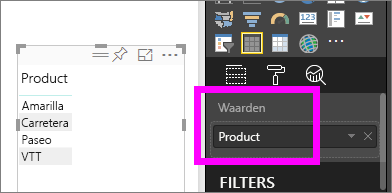
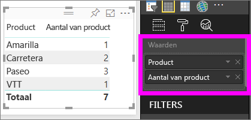

# Werken met statistische functies (som, gemiddelde, enzovoort) in de Power BI-service

## Wat is een statistische functie?

Soms wilt u de waarden in uw gegevens rekenkundig combineren. De rekenkundige bewerking kan worden som, gemiddelde, maximum, aantal, enzovoort. Wanneer u waarden in uw gegevens combineert, wordt dit genoemd *aggregeren*. Het resultaat van die rekenkundige bewerking is een *aggregatie*.

Wanneer Power BI-service en Power BI Desktop visualisaties maken, kunnen ze uw gegevens aggregeren. De aggregatie is vaak net wat u nodig hebt, maar soms wilt u de waarden op een andere manier aggregeren.  Bijvoorbeeld een som versus een gemiddelde. Er zijn verschillende manieren voor het beheren en de statistische functie die maakt gebruik van Power BI in een visualisatie te wijzigen.

Eerst laten we eens gegevens *typen* omdat het type gegevens bepaalt hoe en of, Power BI kunt aggregeren.

## Typen gegevens

De meeste gegevenssets hebben meer dan één type gegevens. Op het meest eenvoudige niveau kunnen de gegevens zijn numeriek of niet is. Power BI aggregeert numerieke gegevens met behulp van een som, gemiddelde, aantal, minimum, afwijking en nog veel meer. De service aggregeert zelfs tekstgegevens, vaak aangeduid als *categorische* gegevens. Als u wilt een categorische veld aggregeren op basis van dit plaatsen in een bucket alleen numeriek, zoals **waarden** of **knopinfo**, Power BI wordt het tellen van elke categorie of aantal unieke instanties van elke de categorie. Speciale typen gegevens, zoals datums, hebben een aantal opties voor aggregeren: eerste, laatste, eerste en laatste.

In het voorbeeld hieronder:

- zijn **Verkochte eenheden** en **Productieprijs** kolommen die numerieke gegevens bevatten

- bevatten **Segment**, **Land**, **Product**, **Maand** en **Naam van de maand** categorische gegevens

   

Bij het maken van een visualisatie in Power BI, numerieke velden worden verzameld door de service (de standaardwaarde is *som*) via een categorisch veld.  Bijvoorbeeld ' verkochte eenheden ***per Product***', ' verkochte eenheden ***per maand***' en ' productieprijs ***per Segment***'. Power BI verwijst naar bepaalde numerieke velden als **metingen**. Het is gemakkelijk om te bepalen welke maatregelen in de Power BI-rapporteditor--de **velden** lijst toont metingen met het symbool ∑ ernaast. Zie [de rapporteditor... Volg een rondleiding door](service-the-report-editor-take-a-tour.md) voor meer informatie.

## Waarom werken de statische functies niet zoals ik wil?

Werken met statistische functies in Power BI kan service verwarrend zijn. Misschien hebt u een numeriek veld en Power BI kunt u de aggregatie wijzigen. Of misschien hebt u een veld, zoals een jaar, en wilt u dit niet aggregeren, omdat u alleen wilt tellen hoe vaak het jaar voorkomt.

Het onderliggende probleem is meestal de definitie van het veld in de gegevensset. Misschien eigenaar van de gegevensset het veld gedefinieerd als tekst en waarin wordt uitgelegd waarom Power BI kan som of het gemiddelde. Helaas kan [alleen de eigenaar van de gegevensset wijzigen hoe een veld is gecategoriseerd](desktop-measures.md). Dus als u eigenaarsmachtigingen hebben voor de gegevensset, in Desktop of het programma dat wordt gebruikt voor het maken van de gegevensset (bijvoorbeeld Excel), kunt u dit probleem oplossen. Anders moet u contact opnemen met de eigenaar van de gegevensset voor hulp.  

Er is een speciale sectie aan het einde van dit artikel [ **aandachtspunten en probleemoplossing**](#considerations-and-troubleshooting). Het biedt richtlijnen en tips. Als u geen antwoord op uw vinden, stel uw vraag in de [Power BI-Community-forum](http://community.powerbi.com). Een snel antwoord krijgt u rechtstreeks vanuit de Power BI-team.

## Wijzigen hoe een numeriek veld wordt samengevoegd

Stel u hebt een diagram waarin de verkochte eenheden voor de verschillende producten wordt opgesomd, maar u hebt liever het gemiddelde.

1. Maak een **gegroepeerd kolomdiagram** die gebruikmaakt van een meting en een categorie. In dit voorbeeld gebruiken we Verkochte eenheden per product.  Power BI maakt standaard een grafiek die de som van de verkochte eenheden (Sleep de meting in de **waarde** goed) voor elk product (sleept u de categorie in de **as** goed).

   

1. In de **visualisaties** in het deelvenster met de rechtermuisknop op de meting en selecteer het type aggregatie dat u nodig hebt. In dit geval selecteren we **gemiddelde**. Als u de aggregatie niet ziet u nodig hebt, ziet de [ **aandachtspunten en probleemoplossing** ](#considerations-and-troubleshooting) sectie.

   

   > [!NOTE]
   > De beschikbare opties in de vervolgkeuzelijst variëren, afhankelijk van (1) het geselecteerde veld en 2) de manier waarop de eigenaar van de gegevensset dat veld gecategoriseerd.

1. De visualisatie gebruikt nu geaggregeerd op gemiddelde.

   

## Manieren om uw gegevens te aggregeren

Enkele opties die beschikbaar zijn voor de aggregatie van een veld:

- **Niet samenvatten**. Met deze optie kiest, Power BI behandelt elke waarde in dat veld afzonderlijk en niet samenvatten. Gebruik deze optie als u een numerieke kolom die de som van de service al dan niet mogen hebben.

- **Som**. Hiermee worden alle waarden in het veld opgeteld.

- **Gemiddelde**. Hiermee wordt het rekenkundige gemiddelde van de waarden berekend.

- **Minimum**. Geeft de kleinste waarde.

- **Maximum**. Geeft de grootste waarde.

- **Aantal (niet leeg)** . Telt het aantal waarden in het veld dat niet leeg zijn.

- **Aantal (uniek)** . Hiermee wordt het aantal verschillende waarden in het veld geteld.

- **Standaarddeviatie**.

- **Afwijking**.

- **Mediaan**.  Hiermee wordt de mediaanwaarde (middelste waarde) weergegeven. Deze waarde heeft hetzelfde aantal boven- als onderliggende items.  Als er twee medianen zijn, wordt het gemiddelde hiervan genomen.

Neem bijvoorbeeld de volgende gegevens:

| Land | Bedrag |
|:--- |:--- |
| VS |100 |
| VK |150 |
| Canada |100 |
| Duitsland |125 |
| Frankrijk | |
| Japan |125 |
| Australië |150 |

Dit voorbeeld geeft de volgende resultaten:

- **Niet samenvatten**: elke waarde wordt afzonderlijk weergegeven

- **Som**: 750

- **Gemiddelde**: 125

- **Maximum**:  150

- **Minimum**: 100

- **Aantal (niet leeg)** : 6

- **Aantal (uniek)** : 4

- **Standaardafwijking**: 20,4124145...

- **Afwijking**: 416,666...

- **Mediaan**: 125

## Een statistische functie maken met een categorieveld (tekst)

U kunt ook een niet-numeriek veld aggregeren. Als u bijvoorbeeld een veld Productnaam hebt, kunt u dit toevoegen als een waarde en vervolgens instellen op **Aantal**, **Uniek aantal**, **Eerste** of **Laatste**.

1. Sleep de **Product** veld in de **waarden** goed. De **waarden** goed wordt meestal gebruikt voor numerieke velden. Power BI herkent dat dit veld een tekstveld is, wordt de statistische functie ingesteld op **niet samenvatten**, en biedt u een tabel met één kolom.

   

1. Als u de aggregatie van de standaard wijzigt **niet samenvatten** naar **aantal (uniek)** , Power BI telt het aantal verschillende producten. In dit geval zijn er vier.
  
   

1. En als u wijzigt de aggregatie wijzigt in **Aantal**, wordt het totale aantal in Power BI geteld. In dit geval zijn er 7 vermeldingen voor **Product**.

   

1. Door deze te slepen hetzelfde veld (in dit geval **Product**) in de **waarden** goed en het standaard aggregatietype verlaten **niet samenvatten**, Power BI een uitsplitsing van het aantal door product.

   

## Aandachtspunten en probleemoplossing

V:  Waarom beschik ik niet over de optie **Niet samenvatten**?

A:  Het veld dat u hebt geselecteerd, is waarschijnlijk een berekende meting of een geavanceerde meting die in Excel of in [Power BI Desktop](desktop-measures.md) is gemaakt. Elk berekende meting heeft een eigen in code vastgelegde formule. U kunt de Power BI maakt gebruik van aggregatie niet wijzigen. Als het bijvoorbeeld een som is, kan deze alleen een som zijn. De **velden** lijst staat *berekende metingen* met het calculatorsymbool.

V:  Mijn veld **is** numeriek, waarom kan ik alleen kiezen uit **Aantal** en **Uniek aantal**?

A1:  Waarschijnlijk is dat de eigenaar van de gegevensset heeft *niet* geclassificeerd van het veld als een getal. Bijvoorbeeld, als een gegevensset heeft een **jaar** veld eigenaar van de gegevensset kan de waarde als tekst categoriseren. Is het waarschijnlijk dat Power BI telt de **jaar** veld (bijvoorbeeld aantal mensen dat geboren is in 1974). Dit is minder waarschijnlijk dat Power BI wordt opgeteld of Gemiddeld deze. Als u de eigenaar bent, kunt u de gegevensset in Power BI Desktop openen en gebruiken de **modelleren** tabblad naar het gegevenstype wijzigen.

A2: Als het veld een pictogram met Rekenmachine heeft, betekent dit dat een *berekende meting*. Elke berekende meting heeft een eigen code vastgelegde formule die alleen de eigenaar van de gegevensset kunt wijzigen. De berekening wordt door Power BI kan een eenvoudige aggregatie zoals een gemiddelde of som zijn. Dit kan ook worden er iets ingewikkelder, zoals een 'percentage van de bijdrage aan de bovenliggende categorie"of 'voorlopige totaal vanaf het begin van het jaar'. Power BI wordt niet opgeteld of Gemiddeld de resultaten. In plaats daarvan het wordt alleen opnieuw berekenen (met behulp van de code vastgelegde formule) voor elk gegevenspunt.

A3:  Een andere mogelijkheid is dat u het veld in een *bucket* hebt geplaatst waarin allee alleen categorische waarden zijn toegestaan.  In dat geval beschikt u alleen over de opties Aantal en Uniek aantal.

A4:  En een vierde mogelijkheid is dat u het veld voor een as. Er wordt in Power BI bijvoorbeeld één staaf voor elke afzonderlijke waarde weergegeven op de as van een staafdiagram. De veldwaarden worden niet samengevoegd.

>[!NOTE]
>Spreidingsdiagrammen vormen een uitzondering op deze regel. Deze diagrammen *vereisen* geaggregeerde waarden voor de x- en y-as.

V:  Waarom kan ik geen tekstvelden optellen voor SSAS-gegevensbronnen (SQL Server Analysis Services)?

A:  Met liveverbindingen met multidimensionale SSAS-modellen kunnen geen aggregaties aan de clientzijde worden uitgevoerd, waaronder eerste, laatste, gemiddelde, minimum, maximum en som.

V:  Ik heb een spreidingsdiagram en ik wil *niet* dat mijn veld wordt geaggregeerd.  Hoe?

A:  Voeg het veld toe aan de bucket **Details** en niet aan de bucket van de x- of y-as.

V:  Wanneer ik een numeriek veld aan een visualisatie toevoeg, wordt meestal de som weergegeven, maar soms wordt ook het gemiddelde, het aantal of een andere aggregatie weergegeven.  Waarom is de standaardaggregatie niet altijd hetzelfde?

A:  Eigenaren kunnen de standaardsamenvatting voor elk veld ingesteld. Als u eigenaar van een gegevensset bent, wijzigt u de standaardsamenvatting in de **modelleren** tabblad van Power BI Desktop.

V:  Ik ben de eigenaar van een gegevensset en ik wil er voor zorgen dat een veld nooit wordt samengevoegd.

A:  In Power BI Desktop kunt u op het tabblad **Model maken** de optie **Gegevenstype** instellen op **Tekst**.

V:  Ik zie niet **niet samenvatten** als een optie in de vervolgkeuzelijst.

A:  Verwijder het veld en voeg het vervolgens opnieuw toe.

Hebt u nog vragen? [Misschien dat de Power BI-community het antwoord weet](http://community.powerbi.com/)