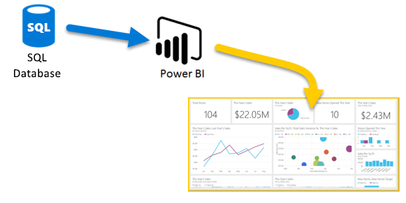

# Azure en Power BI
Met **Azure**-services en **Power BI** kunt u uw inspanningen op het gebied van gegevensverwerking omzetten in analyses en rapporten waarmee u realtime-inzichten in uw bedrijf krijgt. Of uw gegevensverwerking nu cloudgebaseerd of on-premises, eenvoudig of complex, afkomstig van één bron of zeer grootschalig, geagendeerd of realtime is, Azure en Power BI hebben de ingebouwde connectiviteit en integratie om uw inspanningen op het gebied van business intelligence tot leven te wekken.

Power BI beschikt over een groot aantal Azure-verbindingen. De business intelligence-oplossingen die u met deze services kunt maken, zijn even uniek als uw bedrijf. U kunt verbinding maken met slechts één Azure-gegevensbron, of met een aantal, en vervolgens uw gegevens vormen en verfijnen om aangepaste rapporten samen te stellen.

### Azure SQL Database en Power BI
U kunt beginnen met een eenvoudige verbinding naar Azure SQL Database en rapporten maken om de voortgang van uw bedrijf te controleren. Met de [Power BI Desktop](desktop-getting-started.md) kunt u rapporten maken die trends en Key Performance Indicators (KPI’s) identificeren die uw bedrijf vooruit helpen.

U kunt nog veel meer leren over [Azure SQL Database](http://azure.microsoft.com/services/sql-database/).

### Uw cloudgegevens transformeren, vormen en samenvoegen
Hebt u complexere gegevens en allerlei bronnen? Geen enkel probleem. Met **Power BI Desktop** en Azure-services zijn verbindingen slechts één tikje verwijderd van het dialoogvenster **Gegevens ophalen**. Binnen dezelfde query kunt u verbinding maken met uw **Azure SQL Database**, uw **Azure HDInsight**-gegevensbron en uw **Azure Blob Storage** (of **Azure Table Storage**). Selecteer vervolgens alleen de subsets binnen elk die u nodig hebt en verfijn deze.

U kunt ook verschillende rapporten maken voor verschillende doelgroepen, met dezelfde gegevensverbindingen en zelfs dezelfde query. Maak eenvoudig een nieuwe rapportpagina, verfijn uw visualisaties voor elke doelgroep en zie hoe uw bedrijf overal van op de hoogte blijft.

Bekijk voor meer informatie de volgende bronnen:

* [Azure SQL Database](http://azure.microsoft.com/services/sql-database/)
* [Azure HDInsight](http://azure.microsoft.com/services/hdinsight/)
* [Azure Storage](http://azure.microsoft.com/services/storage/) (Blob Storage en Table Storage)

### Voer complexe bewerkingen uit (en krijg een voorsprong) met behulp van Azure Services en Power BI
Met Azure en Power BI kunt u uitbreiden zoveel u wilt. Profiteer van gegevensverwerking uit meerdere bronnen, maak gebruik van grootschalige realtime-systemen, gebruik [Stream Analytics](http://azure.microsoft.com/services/stream-analytics/) en [Event Hubs](http://azure.microsoft.com/services/event-hubs/), en voeg uw uiteenlopende SaaS-services samen tot business intelligence-rapporten die uw bedrijf een voorsprong geven.

### Uw app-gegevens verbinden met API’s van Power BI
U kunt Power BI ook gebruiken om inzicht te krijgen in uw bestaande apps. Met de API van Power BI kunnen toepassingsontwikkelaars via een programma complete gegevenssets naar Power BI sturen. Hebt u continu updates nodig? Met de API's van Power BI kunnen ontwikkelaars realtime-gegevensupdates sturen om snel aan de slag te kunnen. Ze kunnen vervolgens overstappen op Azure Stream Analytics wanneer schaalvereisten dat rechtvaardigen.

Er staat veel informatie over Power BI-API's in de [Power BI-portal voor ontwikkelaars](http://dev.powerbi.com). In het [Power BI-ontwikkelaarsblog](http://blogs.msdn.com/powerbidev) vindt u ook informatie over wat anderen programmatisch doen met Power BI. Er is ook een pagina die u helpt [aan de slag te gaan met Power BI-ontwikkeling](https://msdn.microsoft.com/library/dn889824.aspx).

### Wat kunt u doen met Azure en Power BI?
Er zijn allerlei scenario's waarbij **Azure** en **Power BI** kunnen worden gecombineerd: de mogelijkheden en kansen zijn zo uniek als uw bedrijf. Zie voor meer informatie over **Azure-services** deze [overzichtspagina](http://go.microsoft.com/fwlink/?LinkId=535031&clcid=0x409), waarin **scenario's met gegevensanalyses met Azure** worden beschreven en leer hoe u uw gegevensbronnen omzet in informatie die uw bedrijf laat floreren.

