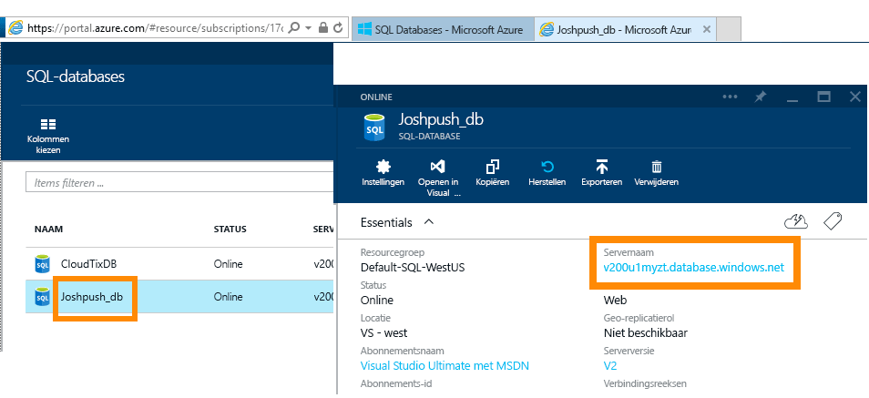

# Azure SQL Database met DirectQuery
Ontdek hoe u rechtstreeks verbinding met Azure SQL Database maakt en rapporten kunt maken waarin dynamische gegevens worden gebruikt. U kunt uw gegevens in de bron in plaats van Power BI bewaren.

Met DirectQuery worden query’s teruggestuurd naar Azure SQL Database wanneer u de gegevens in de rapportweergave verkent. Deze ervaring wordt aangeraden voor gebruikers die vertrouwd zijn met de databases en entiteiten waarmee ze verbinding maken.

**Opmerkingen:**

* Geef de volledige servernaam op wanneer u verbinding maakt (zie hieronder voor meer informatie).
* Zorg ervoor dat de firewallregels voor de database zijn ingesteld op [Toegang tot Azure-services toestaan](https://msdn.microsoft.com/library/azure/ee621782.aspx).
* Voor elke actie, zoals het selecteren van een kolom of het toevoegen van een filter, wordt er een query terug naar de database gestuurd.
* Tegels worden ongeveer elke 15 minuten vernieuwd (vernieuwen hoeft niet te worden gepland). Dit kan worden aangepast in de geavanceerde instellingen wanneer u verbinding maakt.
* Q&A is niet beschikbaar voor DirectQuery-gegevenssets.
* Wijzigingen in het schema worden niet automatisch doorgevoerd.

Deze beperkingen en opmerkingen kunnen veranderen, aangezien we de ervaring voortdurend proberen te verbeteren. De stappen om verbinding te maken, worden hieronder beschreven. 

## Power BI Desktop en DirectQuery
Als u verbinding met Azure SQL Database via DirectQuery, moet u Power BI Desktop gebruiken. Deze benadering biedt extra flexibiliteit en mogelijkheden. Rapporten die zijn gemaakt met Power BI Desktop, kunnen vervolgens worden gepubliceerd naar de Power BI-service. Meer informatie over hoe u verbinding maakt met [Azure SQL Database via DirectQuery](desktop-use-directquery.md) vindt u in Power BI Desktop. 

## Verbinding maken via Power BI
Het is niet langer mogelijk om rechtstreeks verbinding met Azure SQL Database te maken via de Power BI-service. Wanneer u de [Azure SQL Database-connector](https://app.powerbi.com/getdata/bigdata/azure-sql-database-with-live-connect) selecteert, wordt u gevraagd de verbinding via Power BI Desktop te maken. Vervolgens kunt u de Power BI Desktop-rapporten publiceren naar de Power BI-service. 

### Parameterwaarden zoeken
De volledige servernaam en databasenaam vindt u in Azure Portal.

## Volgende stappen
[DirectQuery in Power BI Desktop gebruiken](desktop-use-directquery.md)  
[Aan de slag met Power BI](service-get-started.md)  
[Gegevens ophalen voor Power BI](service-get-data.md)  
Nog vragen? [Misschien dat de Power BI-community het antwoord weet](http://community.powerbi.com/).

