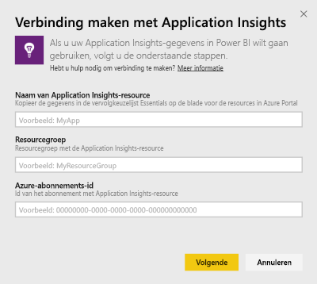
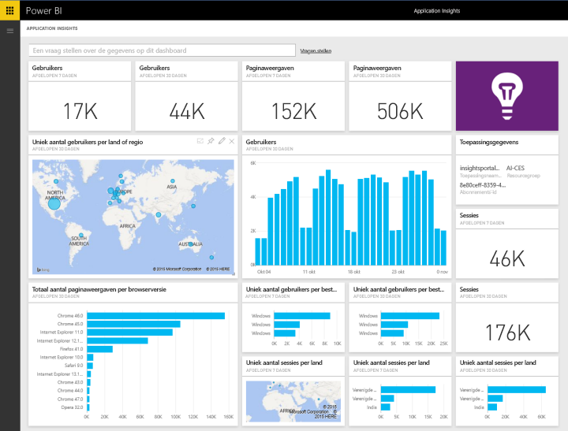

# Verbinding maken met Application Insights met Power BI
Power BI gebruiken voor het maken van krachtige aangepaste dashboards van de telemetrie van [Application Insights](https://azure.microsoft.com/documentation/articles/app-insights-overview/). Bekijk uw app-telemetrie op nieuwe manieren. Combineer metrische gegevens uit meerdere apps of componentservices op één dashboard. De eerste versie van het Power BI-inhoudspakket voor Application Insights omvat widgets voor aan algemeen gebruik gerelateerde metrische gegevens zoals actieve gebruikers, paginaweergave, sessies, browser en de versie van het besturingssysteem en geografische verdeling van gebruikers op een kaart.

Maak verbinding met het [Application Insights-inhoudspakket voor Power BI](https://app.powerbi.com/getdata/services/application-insights).

>[!NOTE]
>Toegang tot de overzichtsblade Application Insights voor uw toepassing in de Azure Preview-portal is vereist voor de verbinding. Meer informatie over de vereisten volgt hieronder.

## Verbinding maken
1. Selecteer **Gegevens ophalen** onder in het linkernavigatievenster.
   
    
2. Selecteer in het vak **Services** de optie **Ophalen**.
   
    
3. Selecteer **Application Insights** > **Ophalen**.
   
    
4. Geef de details van de toepassing waarmee u verbinding wilt maken, met inbegrip van **Application Insights-resourcenaam**, **resourcegroep** en **abonnements-ID**. Zie [Zoeken naar uw Application Insights-parameters](#FindingAppInsightsParams) hieronder voor meer informatie.
   
        
5. Selecteer **Aanmelden** en volg de schermen om verbinding te maken.
   
    
6. Het importproces wordt automatisch gestart. Als het proces is voltooid, verschijnt een melding en worden een nieuw dashboard, rapport en gegevensset in het navigatiedeelvenster weergegeven. Deze zijn gemarkeerd met een sterretje.  Selecteer het dashboard om uw geïmporteerde gegevens weer te geven.
   
    

**Wat nu?**

* [Stel vragen in het vak Q&A](power-bi-q-and-a.md) boven in het dashboard.
* [Wijzig de tegels](service-dashboard-edit-tile.md) in het dashboard.
* [Selecteer een tegel](service-dashboard-tiles.md) om het onderliggende rapport te openen.
* Als uw gegevensset is ingesteld op dagelijks vernieuwen, kunt u het vernieuwingsschema wijzigen of de gegevensset handmatig vernieuwen met **Nu vernieuwen**.

## Wat is inbegrepen
Het Application Insights-inhoudspakket bevat de volgende tabellen en metrische gegevens:  

    - ApplicationDetails  
    - UniqueUsersLast7Days   
    - UniqueUsersLast30Days   
    - UniqueUsersDailyLast30Days  
    - UniqueUsersByCountryLast7Days  
    - UniqueUsersByCountryLast30Days   
    - PageViewsDailyLast30Days   
    - SessionsLast7Days   
    - SessionsLast30Days  
    - PageViewsByBrowserVersionDailyLast30Days   
    - UniqueUsersByOperatingSystemLast7Days   
    - UniqueUsersByOperatingSystemLast30Days    
    - SessionsDailyLast30Days   
    - SessionsByCountryLast7Days   
    - SessionsByCountryLast30Days   
    - PageViewsByCountryDailyLast30Days   

## Parameters zoeken
Uw resourcenaam, resourcegroep en abonnements-id zijn allemaal te vinden in de Azure-portal. Als u de naam selecteert, wordt een gedetailleerde weergave geopend en kunt u de keuzelijst Essentials gebruiken om alle waarden te vinden die u nodig hebt.

Kopieer en plak deze in de velden in Power BI:

## Volgende stappen
[Aan de slag in Power BI](service-get-started.md)

[Gegevens ophalen in Power BI](service-get-data.md)

