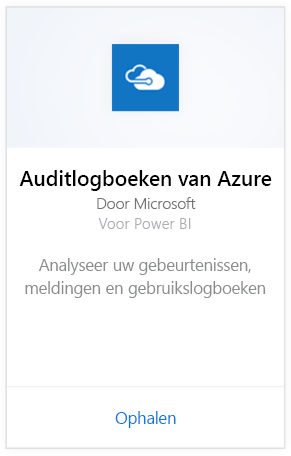
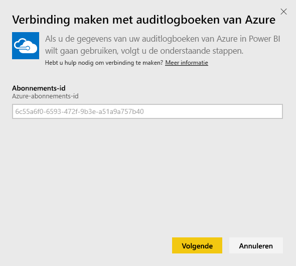
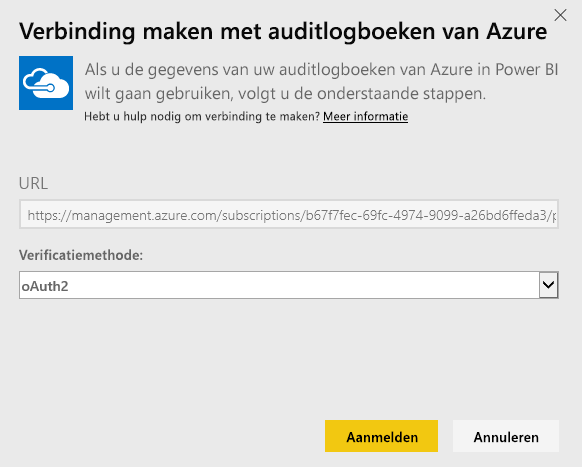
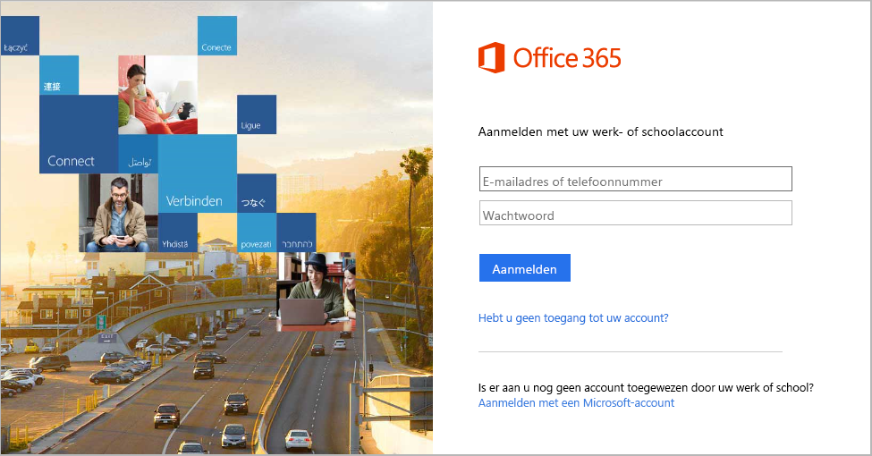

# Verbinding met Azure Search maken via Power BI
U kunt met het inhoudspakket van Azure controleren logboeken analyseren en visualiseren van gegevens die zijn opgeslagen in de auditlogboeken. Power BI haalt uw gegevens op en bouwt vervolgens een kant-en-klaar dashboard. Daarnaast worden er rapporten op basis van die gegevens gemaakt.

[Maak verbinding met het inhoudspakket van de auditlogboeken van Azure](https://app.powerbi.com/getdata/services/azure-audit-logs) of lees meer over de [integratie van auditlogboeken van Azure ](https://powerbi.microsoft.com/integrations/azure-audit-logs) met Power BI.

## Verbinding maken
1. Selecteer **Gegevens ophalen** onder in het linkernavigatievenster.  
   
    
2. Selecteer in het vak **Services** de optie **Ophalen**.  
   
     
3. Selecteer **Auditlogboeken van Azure** > **Ophalen**.  
   
   
4. Voer desgevraagd uw **Azure-abonnements-id** in. Hieronder vindt u meer informatie over hoe u uw [abonnements-id](#FindingParams) kunt vinden.   
   
    
5. Selecteer voor **Verificatiemethode** **oAuth2**\> **Aanmelden**.
   
    
6. Voer uw accountreferenties in het aanmeldingsproces te voltooien.
   
    
7. Power BI haalt de gegevens in uw auditlogboeken van Azure op en maakt een gebruiksklaar dashboard en rapport. 
   
    

**Wat nu?**

* [Stel vragen in het vak Q&A](power-bi-q-and-a.md) boven in het dashboard.
* [Wijzig de tegels](service-dashboard-edit-tile.md) in het dashboard.
* [Selecteer een tegel](service-dashboard-tiles.md) om het onderliggende rapport te openen.
* Als uw gegevensset is ingesteld op dagelijks vernieuwen, kunt u het vernieuwingsschema wijzigen of de gegevensset handmatig vernieuwen met **Nu vernieuwen**.

## Systeemvereisten
Het inhoudspakket van de auditlogboeken van Azure vereist toegang tot de logboeken voor controle in Azure Portal. Meer informatie hierover vindt u [hier](https://azure.microsoft.com/en-us/documentation/articles/insights-debugging-with-events/).

## Parameters zoeken
Er zijn twee eenvoudige manieren om uw abonnements-id te vinden.

1. Via https://portal.azure.com -&gt; Bladeren -&gt; Abonnementen -&gt; Abonnements-id
2. Via https://manage.windowsazure.com -&gt; Instellingen -&gt; Abonnements-id

Uw abonnements-id bestaat uit een lange reeks cijfers en tekens, vergelijkbaar met het voorbeeld in stap \#4 hierboven. 

## Probleemoplossing
Als u een referentiefout of een fout waarbij er vanwege ongeldige referenties wordt geprobeerd te vernieuwen, verwijdert u alle instanties van de auditlogboeken van Azure en maakt u opnieuw verbinding.

## Volgende stappen
[Aan de slag met Power BI](service-get-started.md)  
[Power BI - basisconcepten](service-basic-concepts.md)  

