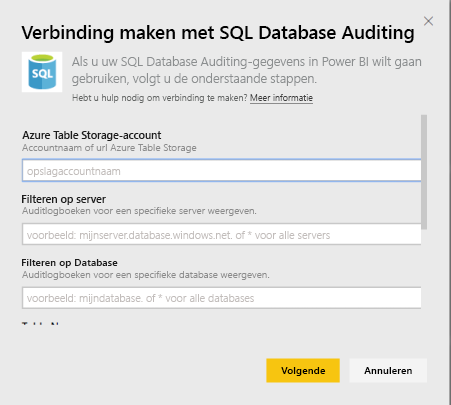
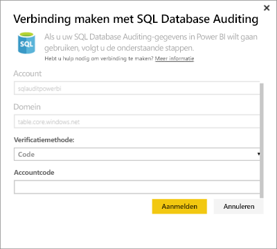

# SQL Database Auditing-inhoudspakket voor Power BI
Met het Power BI-inhoudspakket voor Azure [SQL Database Auditing](http://azure.microsoft.com/documentation/articles/sql-database-auditing-get-started/) kunt u de activiteit van uw database begrijpen en meer inzicht krijgen in afwijkingen die kunnen wijzen op problemen voor het bedrijf of vermoedelijke beveiligingsschendingen. 

Maak verbinding met het [SQL Database Auditing-inhoudspakket](https://app.powerbi.com/getdata/services/sql-db-auditing) voor Power BI.

>[!NOTE]
>Het inhoudspakket importeert gegevens van alle tabellen waarvan de naam AuditLogs bevat en voegt deze toe aan een tabel met één gegevensmodel met de naam AuditLogs. De laatste 250.000 gebeurtenissen worden opgenomen en de gegevens worden dagelijks vernieuwd.

## Verbinding maken
1. Selecteer **Gegevens ophalen** onder in het linkernavigatievenster.
   
    
2. Selecteer in het vak Services de optie Ophalen.
   
    
3. Selecteer **SQL Database Auditing** \> **Ophalen**.
   
   
4. In het venster Verbinding maken met SQL Database Auditing:
   
   - Voer de Azure Table Storage-accountnaam of de URL in waar uw logboeken worden opgeslagen.
   
   - Voer de naam in van de SQL-server die u wilt benaderen. Voer \* in om auditlogboeken voor alle servers te laden.
   
   - Voer de naam van de SQL-database in die u wilt benaderen. Voer \* in om auditlogboeken voor alle databases te laden.
   
   - Voer de naam van de Azure-tabel in die de logboeken bevat die u wilt benaderen. Voer \* in om de auditlogboeken te laden van alle tabellen waarvan de naam AuditLogs bevat.
   
   >[!IMPORTANT]
   >Het is verstandig om altijd een expliciete tabelnaam op te geven, ook als alle auditlogboeken in één tabel zijn opgeslagen.
   
   - Voer de begindatum in van de auditlogboeken die u wilt benaderen. Voer \* in om auditlogboeken te laden zonder een lagere tijdslimiet of 1d om auditlogboeken van de afgelopen dag te laden.
   
   - Voer de einddatum in van de auditlogboeken die u wilt benaderen. Voer \* in om auditlogboeken te laden met een bovenste tijdslimiet.
   
   
5. Selecteer voor verificatiemethode de optie **Sleutel** en voer uw **Account-sleutel in** \> **Aanmelden**.
   
   
6. Nadat de gegevens in Power BI zijn geïmporteerd, ziet u een nieuw dashboard, een nieuw rapport en een nieuwe gegevensset in het navigatiedeelvenster aan de linkerzijde. Nieuwe items zijn gemarkeerd met een geel sterretje \*.
   
   

**Wat nu?**

* [Stel vragen in het vak Q&A](power-bi-q-and-a.md) boven in het dashboard.
* [Wijzig de tegels](service-dashboard-edit-tile.md) in het dashboard.
* [Selecteer een tegel](service-dashboard-tiles.md) om het onderliggende rapport te openen.
* Als uw gegevensset is ingesteld op dagelijks vernieuwen, kunt u het vernieuwingsschema wijzigen of de gegevensset handmatig vernieuwen met **Nu vernieuwen**

## Volgende stappen
[Gegevens ophalen voor Power BI](service-get-data.md)
[Aan de slag met Power BI](service-get-started.md)
