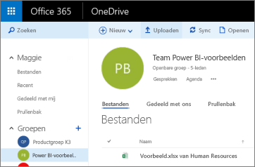
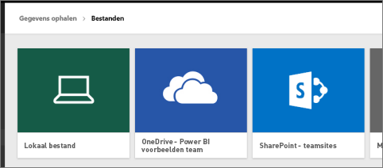
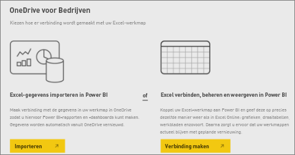
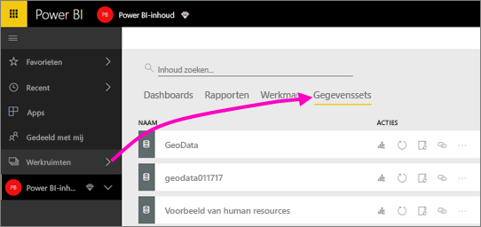
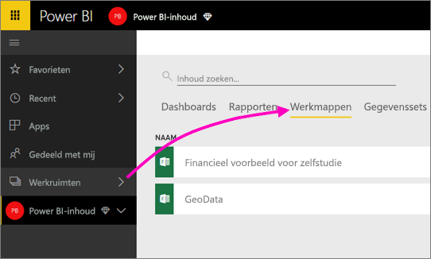

# Verbinding maken met in OneDrive opgeslagen bestanden voor uw Power BI-app-werkruimte
Wanneer u [een app-werkruimte hebt gemaakt in Power BI](service-create-distribute-apps.md), kunt u uw Excel-, CSV- en Power BI Desktop-bestanden op de OneDrive voor bedrijven opslaan voor uw Power BI-app-werkruimte. U kunt de bestanden die u in OneDrive opslaat, blijven bijwerken, en die updates worden automatisch weergegeven in de Power BI-rapporten en op de dashboards op basis van de bestanden. 

> [!NOTE]
> Bij de preview van de nieuwe werkruimte-ervaring is de relatie tussen Power BI-werkruimten en Office 365-groepen gewijzigd. Er wordt niet automatisch een Office 365-groep gemaakt wanneer u een van de nieuwe werkruimten maakt. Meer informatie over [het maken van de nieuwe werkruimten (preview)](service-create-the-new-workspaces.md)

Het toevoegen van bestanden aan uw app-werkruimte is een proces in twee stappen: 

1. Eerst uploadt u [bestanden naar de OneDrive voor bedrijven](service-connect-to-files-in-app-workspace-onedrive-for-business.md#1-upload-files-to-the-onedrive-for-business-for-your-app-workspace) voor uw app-werkruimte.
2. Vervolgens maakt u [vanuit Power BI verbinding met deze bestanden](service-connect-to-files-in-app-workspace-onedrive-for-business.md#2-import-excel-files-as-datasets-or-as-excel-online-workbooks).

> [!NOTE]
> App-werkruimten zijn alleen beschikbaar bij [Power BI Pro](service-features-license-type.md).
> 
> 

## 1 Upload bestanden naar de OneDrive voor bedrijven voor uw app-werkruimte
1. Selecteer de pijl naast Werkruimten in de Power BI-service > selecteer het weglatingsteken (**…**) naast de naam van uw werkruimte. 
   
   
2. Selecteer **Bestanden** om de OneDrive voor bedrijven voor uw app-werkruimte op Office 365 te openen.
   
   > [!NOTE]
   > Als u in het menu van de app-werkruimte niet het item **Bestanden** ziet, moet u **Leden** selecteren om de OneDrive voor bedrijven voor uw app-werkruimte te openen. Selecteer hier **Bestanden**. Office 365 installeert een opslaglocatie voor OneDrive voor bestanden van de groepswerkruimte van uw app. Dit proces kan enige tijd duren. 
   > 
   > 
3. Hier kunt u uw bestanden uploaden naar de OneDrive voor bedrijven voor uw app-werkruimte. Selecteer **Uploaden**, en navigeer naar uw bestanden.
   
   

## 2 Excel-bestanden importeren als gegevenssets of Excel Online-werkmappen
Nu uw bestanden zich in de OneDrive voor bedrijven bevinden voor uw app-werkruimte, kunt u kiezen. U kunt: 

* [De gegevens importeren uit de Excel-werkmap als een gegevensset](service-get-data-from-files.md), en de gegevens gebruiken om rapporten en dashboards te maken die u in een webbrowser en op mobiele apparaten kunt weergeven.
* Of [verbinding maken met een complete Excel-werkmap in Power BI](service-excel-workbook-files.md) en deze precies weergeven als in Excel Online wordt weergegeven.

### Bestanden importeren in uw app-werkruimte of verbinding ermee maken
1. Schakel in Power BI over naar de app-werkruimte, zodat de naam van de app-werkruimte in de linkerbovenhoek wordt vermeld. 
2. Selecteer **Gegevens ophalen** linksonder in het navigatievenster. 
   
   
3. Selecteer in het vak **Bestanden** de optie **Ophalen**.
   
   
4. Selecteer **OneDrive** - *naam van uw app-werkruimte*.
   
    
5. Selecteer het gewenste bestand > **Verbinding maken**.
   
    Dit is het punt waarop u besluit om [de gegevens uit de Excel-werkmap te importeren](service-get-data-from-files.md) of [verbinding te maken met de complete Excel-werkmappen](service-excel-workbook-files.md).
6. Selecteer **Importeren** of **verbinding maken**.
   
    
7. Als u **Importeren** selecteert, verschijnt de werkmap op het tabblad **Gegevenssets**. 
   
    
   
    Als u **Verbinding maken** selecteert, bevindt de werkmap zich op het tabblad **Werkmappen**.
   
    

## Volgende stappen
* [Apps en app-werkruimten maken in Power BI](service-create-distribute-apps.md)
* [Gegevens importeren uit Excel-werkmappen](service-get-data-from-files.md)
* [Verbinding maken met complete Excel-werkmappen](service-excel-workbook-files.md)
* Nog vragen? [Misschien dat de Power BI-community het antwoord weet](http://community.powerbi.com/)
* Feedback? Ga naar [Power BI ideeën](https://ideas.powerbi.com/forums/265200-power-bi)

