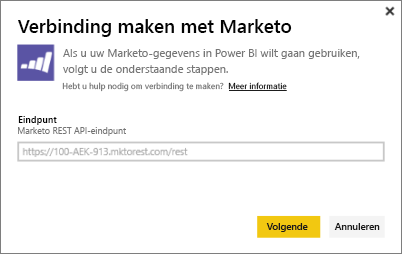

# Verbinding maken met Marketo met Power BI
Het Power BI-inhoudspakket voor Marketo biedt u inzicht in uw Marketo-account; u krijgt toegang tot gegevens over potentiële klanten en hun activiteiten. Als u deze verbinding tot stand brengt, worden uw gegevens opgehaald en krijgt u automatisch toegang tot een dashboard en rapporten op basis van de gegevens.

Verbinding maken met het [Marketo-inhoudspakket](https://app.powerbi.com/getdata/services/marketo) voor Power BI.

## Verbinding maken
1. Selecteer **Gegevens ophalen** onder in het linkernavigatievenster.
   
   
2. Selecteer in het vak **Services** de optie **Ophalen**.
   
    
3. Selecteer **Marketo** \> **Ophalen**.
   
   
4. Voer het Marketo REST-eindpunt in dat u is aangeboden door Marketo of uw Marketo-beheerder en selecteer Volgende.
   
   
   
   Meer informatie over het Marketo REST-eindpunt: [http://developers.marketo.com/documentation/rest/endpoint-url/](http://developers.marketo.com/documentation/rest/endpoint-url/).
5. Gebruik de verificatiemethode **Basic** en voer de client-id in bij **Gebruikersnaam** en het clientgeheim bij **Wachtwoord**. De client-id en het clientgeheim zijn beschikbaar in Marketo, of kunnen worden verkregen via uw Marketo-beheerder ([http://developers.marketo.com/documentation/rest/custom-service/](http://developers.marketo.com/documentation/rest/custom-service/)). 
   
   
   
   Hiermee geeft u het *Marketo voor Power BI*-inhoudspakket toegang tot uw [Marketo-gegevens](https://powerbi.microsoft.com/integrations/marketo) en kunt u deze gegevens analyseren in Power BI. De gegevens worden eenmaal per dag vernieuwd.
6. Wanneer u eenmaal verbinding hebt gemaakt met uw Marketo-account, wordt er een dashboard met al uw gegevens geladen:
   
   

**Wat nu?**

* [Stel vragen in het vak Q&A](power-bi-q-and-a.md) boven in het dashboard.
* [Wijzig de tegels](service-dashboard-edit-tile.md) in het dashboard.
* [Selecteer een tegel](service-dashboard-tiles.md) om het onderliggende rapport te openen.
* Als uw gegevensset is ingesteld op dagelijks vernieuwen, kunt u het vernieuwingsschema wijzigen of de gegevensset handmatig vernieuwen met **Nu vernieuwen**.

## Wat is inbegrepen?
De volgende gegevens zijn in Power BI beschikbaar vanaf Marketo, als er tussen vandaag en één jaar geleden activiteit is geweest:

| Tabelnaam | Beschrijving |
| --- | --- |
| EmailActivities |Gegevens over e-mails die zijn verzonden naar potentiële klanten/contactpersonen, met informatie over apparaten, categorieën, het aantal en het percentage e-mails dat niet kan worden afgeleverd, het aantal en het percentage geopende e-mails en de programmanaam. E-mailactiviteiten in Power BI is een rapport over de aflevering van e-mails. Er worden geen aanvullende logica toegepast op de gegevens. Mogelijk zijn er hierdoor verschillen in de resultaten die u ziet in de Marketo-client en in Power BI. |
| ProgramActivites |Gegevens over programma's waarvan de status is gewijzigd. Dit omvat gegevens over redenen, voltooiing, het aantal en het percentage programma's gekocht en het aantal en het percentage voltooide programma's. |
| WebPageActivities |Gegevens over de webpaginabezoeken van gebruikers, waaronder over de zoekmachine, de gebruikersagent, de webpagina en het tijdstip. |
| Datetable |Datums, variërend van vandaag tot datums van een jaar terug.  Hiermee kunt u de Marketo-gegevens per dag analyseren. |
| Potentiële klanten |Informatie over potentiële klanten, zoals over het bedrijf, de hoeveelheid omzet, het aantal werknemers, het land, de branche, de score en de status. Potentiële klanten worden opgehaald op basis van hun aanwezigheid in de gegevens over e-mails, programma's en webpagina-activiteiten. |

Alle datums worden in UTC weergegeven. Afhankelijk van hoe u uw account hebt ingesteld (welke tijdzone), kunnen de datums variëren (net zoals te zien is in de Marketo-client)

## Systeemvereisten
* Met het Marketo-account dat u gebruikt om verbinding te maken, hebt u toegang tot potentiële klanten en activiteiten.
* Er zijn voldoende API-aanroepen beschikbaar om verbinding te maken met de gegevens.  Marketo heeft een API voor elk account.  Wanneer de limiet is bereikt, is het niet mogelijk om gegevens naar Power BI te uploaden. 

**Informatie over API-limieten**

Er wordt gebruikgemaakt van Marketo-API's om gegevens van Marketo te importeren. Elke klant van Marketo kan maximaal 10.000 API-aanroepen per dag uitvoeren; deze limiet geldt voor alle toepassingen waarbij gebruik wordt gemaakt van de Marketo-API's. U kunt de API's gebruiken voor andere integraties, evenals de Power BI-integratie. Zie <http://developers.marketo.com/documentation/rest/> voor meer informatie over de API's.

Het aantal API-aanroepen dat Power BI uitvoert voor Marketo is afhankelijk van de hoeveelheid gegevens in uw Marketo-account. Power BI importeert alle potentiële klanten en activiteiten van het afgelopen jaar. Hier volgt een voorbeeld van gegevens uit Marketo en het aantal API-aanroepen dat door Power BI wordt gebruikt tijdens het importeren:  

| Gegevenstype | Aantal rijen | API-aanroepen |
| --- | --- | --- |
| Informatie over potentiële klanten |15.000 |50 |
| E-mailactiviteiten |150.000 |1000 |
| Programma-activiteiten |15.000 |100 |
| Webactiviteiten |150.000 |1000 |
| Programmawijzigingen |7500 |50 |
| **Totale aantal API-aanroepen** | |**2200** |

## Volgende stappen
[Aan de slag met Power BI](service-get-started.md)

[Gegevens ophalen voor Power BI](service-get-data.md)

[Power BI-blog: uw Marketo-gegevens bewaken en analyseren met Power BI](http://blogs.msdn.com/b/powerbi/archive/2015/03/19/monitor-and-analyze-your-marketo-data-with-power-bi.aspx)

