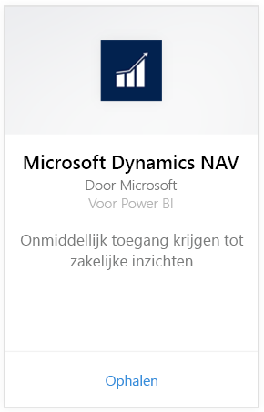
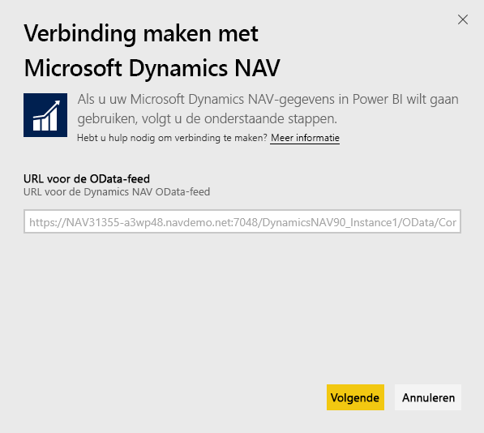
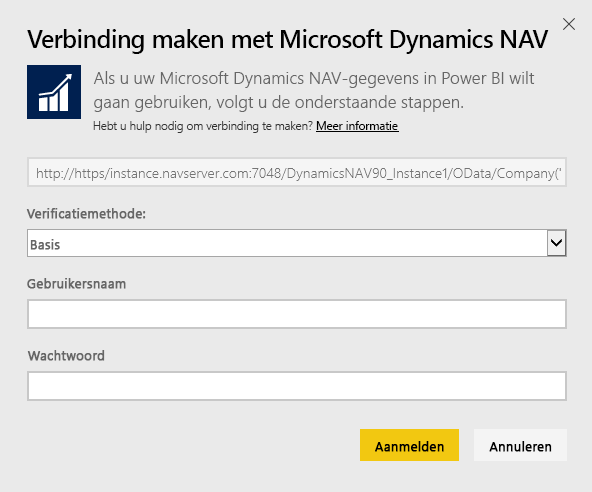
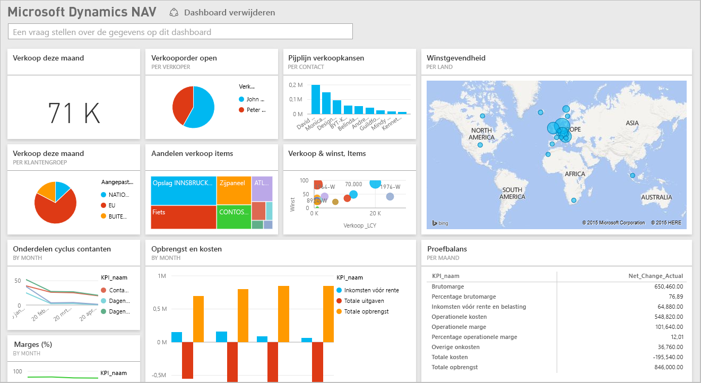

# Verbinding maken met Microsoft Dynamics NAV in Power BI
Inzicht krijgen in uw Microsoft Dynamics NAV-gegevens is eenvoudig met Power BI. Met Power BI kunt u uw gegevens ophalen, zowel verkoopgegevens als financiële gegevens, en vervolgens een app bouwen met een dashboard en rapporten op basis van die gegevens. Voor Power BI moet u machtigingen hebben voor de tabellen waaruit gegevens worden opgehaald, in dit geval verkoopgegevens en financiële gegevens. Meer informatie over de vereisten volgt hieronder. Nadat u de app hebt geïnstalleerd, kunt u het dashboard en de rapporten bekijken in de Power BI-service ([https://powerbi.com](https://powerbi.com)) en in de mobiele Power BI-apps. 

[Maak verbinding met Microsoft Dynamics NAV voor Power BI](https://app.powerbi.com/getdata/services/microsoft-dynamics-nav) of lees meer over de [Dynamics NAV-integratie](https://powerbi.microsoft.com/integrations/microsoft-dynamics-nav) met Power BI.

## Verbinding maken
[!INCLUDE [powerbi-service-apps-get-more-apps](./includes/powerbi-service-apps-get-more-apps.md)]

3. Selecteer **Microsoft Dynamics NAV** en selecteer vervolgens **Ophalen**.  
   
4. Voer uw OData-URL voor Microsoft Dynamics NAV in als dit wordt gevraagd. De URL moet aan het volgende patroon voldoen:
   
    `https://instance.navserver.com:7048/DynamicsNAV90_Instance1/OData/Company('CRONUS%20International%20Ltd.')`
   
   * instance.navserver.com met de naam van uw NAV-Server
   * DynamicsNAV90\_Instance1 met de naam van uw NAV Server-instantie
   * Company('CRONUS%20International%20Ltd.') met uw NAV-bedrijfsnaam
     
     U kunt deze URL eenvoudig ophalen in Dynamics NAV door naar Web Services te gaan en daar te zoeken naar de powerbifinance-webservice. Kopieer de OData-URL, maar verwijder daarbij /powerbifinance uit de URL.  
     
5. Selecteer **Basic** en voer uw Microsoft Dynamics NAV-referenties in.
   
    U hebt beheerreferenties (of machtigingen voor verkoopgegevens en financiële gegevens) voor uw Microsoft Dynamics NAV-account nodig.  Momenteel wordt alleen basisverificatie (gebruikersnaam en wachtwoord) ondersteund.
   
    
6. In Power BI worden uw Microsoft Dynamics NAV-gegevens opgehaald en worden een kant-en-klaar dashboard en rapport voor u gemaakt.   
   

## Dashboard en rapporten weergeven
[!INCLUDE [powerbi-service-apps-open-app](./includes/powerbi-service-apps-open-app.md)]

[!INCLUDE [powerbi-service-apps-open-app](./includes/powerbi-service-apps-what-now.md)]

## Wat is opgenomen
Het dashboard en de rapporten bevatten gegevens uit de volgende tabellen (hoofdlettergevoelig):  

* ItemSalesAndProfit  
* ItemSalesByCustomer  
* powerbifinance  
* SalesDashboard  
* SalesOpportunities  
* SalesOrdersBySalesPerson  
* TopCustomerOverview  

## Systeemvereisten
Als u uw Microsoft Dynamics NAV-gegevens wilt importeren in Power BI, moet u machtigingen hebben voor de tabellen met verkoopgegevens en financiële gegevens waaruit gegevens worden opgehaald (zie hierboven). De tabellen zijn ook nodig om gegevens beschikbaar te hebben. Lege tabellen kunnen niet worden geïmporteerd.

## Probleemoplossing
Power BI maakt gebruik van Microsoft Dynamics NAV-webservices voor het ophalen van uw gegevens. Als u een grote hoeveelheid gegevens in uw Microsoft Dynamics NAV-exemplaar hebt, kunt u de impact op het gebruik van uw webservice minimaliseren door de vernieuwingsfrequentie te wijzigen, afhankelijk van uw behoeften. Het is ook een idee dat één beheerder de app maakt en deelt in plaats van dat elke beheerder zijn eigen app maakt.

**Kan de parameter niet valideren. Controleer of alle parameters geldig zijn**  
Als u deze fout ziet nadat u uw Microsoft Dynamics NAV-URL hebt ingevoerd. Zorg dat aan de volgende vereisten is voldaan:

* De URL volgt exact dit patroon:
  
    `https://instance.navserver.com:7048/DynamicsNAV90_Instance1/OData/Company('CRONUS%20International%20Ltd.')`
  
  * instance.navserver.com met de naam van uw NAV-Server
  * DynamicsNAV90\_Instance1 met de naam van uw NAV Server-instantie
  * Company('CRONUS%20International%20Ltd.') met uw NAV-bedrijfsnaam
* Controleer of alle elementen in kleine letters zijn getypt.  
* Zorg dat de URL begint met https.  
* Zorg dat er geen afsluitende slash aan het einde van de URL staat.

**Aanmelden mislukt**  
Als u een foutmelding Aanmelden mislukt krijgt nadat u uw Microsoft Dynamics NAV-referenties hebt ingevoerd, kan er sprake zijn van een van de volgende problemen:

* Het account dat u gebruikt, beschikt niet over machtigingen voor het ophalen van de Microsoft Dynamics NAV-gegevens uit uw account. Controleer of het een beheerdersaccount is en probeer het opnieuw.
* Het Dynamics NAV-exemplaar waarmee u verbinding wilt maken, heeft geen geldig SSL-certificaat. In dit geval ziet u een gedetailleerde foutmelding (kan geen vertrouwde SSL-relatie tot stand brengen). Houd er rekening mee dat zelfondertekende certificaten niet worden ondersteund.

**Helaas**  
Als een dialoogvenster met de foutmelding Helaas verschijnt na het verificatiedialoogvenster, is er een probleem tijdens het laden van de gegevens in Power BI.

* Controleer of de URL aan het bovenstaande patroon voldoet. Er is een algemene fout opgetreden:
  
    `https://instance.navserver.com:7048/DynamicsNAV90\_Instance1/OData`
  
    U moet echter de sectie Company('CRONUS%20International%20Ltd.') met uw NAV-bedrijfsnaam opnemen:
  
    `https://instance.navserver.com:7048/DynamicsNAV90\_Instance1/OData/Company('CRONUS%20International%20Ltd.')`

## Volgende stappen
* [Wat zijn apps in Power BI?](service-create-distribute-apps.md)
* [Gegevens ophalen in Power BI](service-get-data.md)
* Hebt u nog vragen? [Misschien dat de Power BI-community het antwoord weet](http://community.powerbi.com/)

