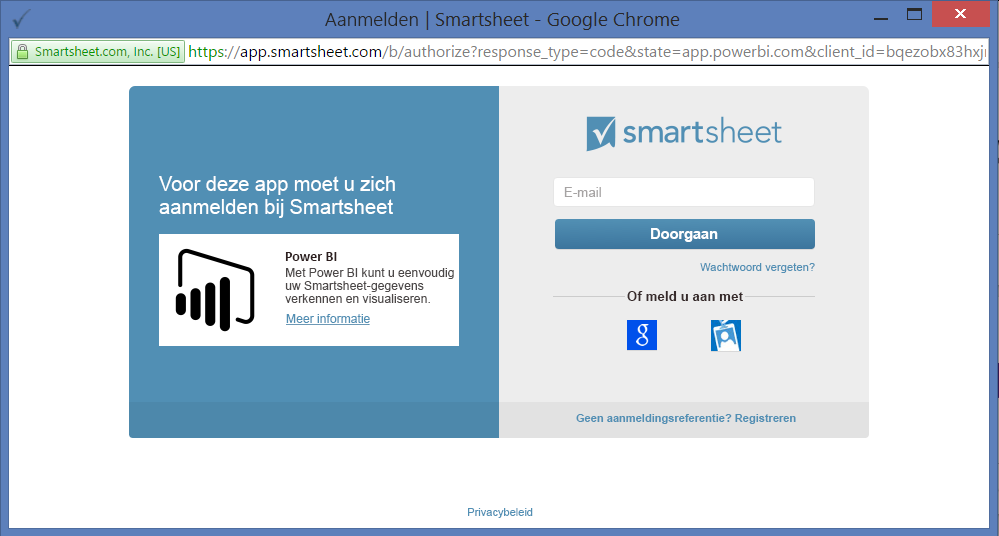

# Verbinding maken met Smartsheet via Power BI 
Smartsheet biedt een gebruiksvriendelijk platform voor samenwerking en het delen van bestanden. Het Smartsheet-inhoudspakket voor Power BI bevat een dashboard, rapporten en een gegevensset die een overzicht geven van uw Smartsheet-account. U kunt ook [Power BI Desktop](desktop-connect-to-data.md) gebruiken om rechtstreeks verbinding te maken met afzonderlijke werkbladen in uw account. 

Maak verbinding met het [Smartsheet-inhoudspakket](https://app.powerbi.com/groups/me/getdata/services/smartsheet) voor Power BI.

>[!NOTE]
>U kun het beste een Smartsheet-beheerdersaccount gebruiken om verbinding te maken en het Power BI-inhoudspakket te laden omdat dit account over meer toegangsmogelijkheden beschikt.

## Verbinding maken
1. Selecteer **Gegevens ophalen** onder in het linkernavigatievenster.
   
   
2. Selecteer in het vak **Services** de optie **Ophalen**.
   
    
3. Selecteer **Smartsheet \> Ophalen**.
   
   
4. Selecteer voor de verificatiemethode de optie **oAuth2 \> Aanmelden**.
   
   Geef desgevraagd uw Smartsheet-referenties op en voer het verificatieproces uit.
   
   
   
   
5. Nadat de gegevens in Power BI zijn geïmporteerd, ziet u een nieuw dashboard, een nieuw rapport en een nieuwe gegevensset in het navigatiedeelvenster aan de linkerzijde. Nieuwe items worden gemarkeerd met een geel sterretje \*. Selecteer de vermelding voor Smartsheet.
   
   

**Wat nu?**

* [Stel vragen in het vak Q&A](power-bi-q-and-a.md) boven in het dashboard.
* [Wijzig de tegels](service-dashboard-edit-tile.md) in het dashboard.
* [Selecteer een tegel](service-dashboard-tiles.md) om het onderliggende rapport te openen.
* Als uw gegevensset is ingesteld op dagelijks vernieuwen, kunt u het vernieuwingsschema wijzigen of de gegevensset handmatig vernieuwen met **Nu vernieuwen**.

## Wat is inbegrepen
Het Smartsheet-inhoudspakket voor Power BI bevat een overzicht van uw Smartsheet-account, zoals het aantal werkruimten, uw rapporten en werkbladen, het tijdstip waarop deze zijn gewijzigd, enzovoort. Voor beheerders worden ook bepaalde gegevens weergegeven over gebruikers in hun systeem, zoals de belangrijkste makers van werkbladen.  

Als u rechtstreeks verbinding wilt maken met afzonderlijke werkbladen in uw account, kunt u de Smartsheet-connector in [Power BI Desktop](desktop-connect-to-data.md) gebruiken.  

## Volgende stappen:

[Aan de slag met Power BI](service-get-started.md)

[Gegevens ophalen voor Power BI](service-get-data.md)