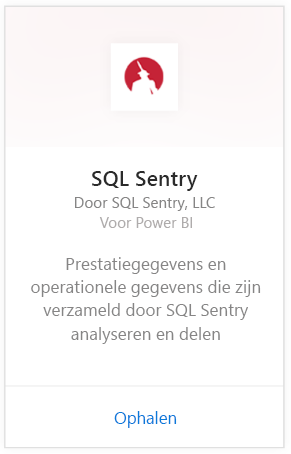
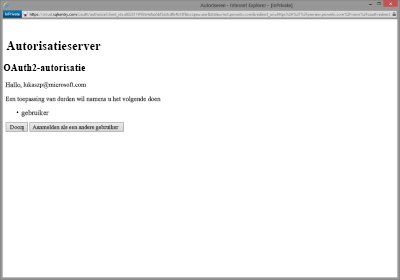
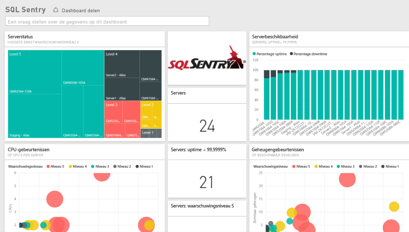
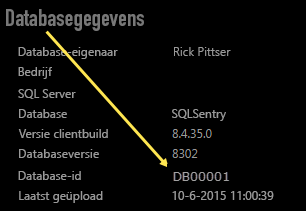

# Verbinding maken met SQL Sentry met Power BI
Prestatiegegevens die u hebt verzameld met SQL Sentry kunt u eenvoudig analyseren met behulp van Power BI. Power BI haalt uw gegevens op en bouwt vervolgens een standaarddashboard en gerelateerde rapporten op basis van die gegevens.

Maak verbinding met het [SQL Sentry-inhoudspakket](https://app.powerbi.com/groups/me/getdata/services/sql-sentry) voor Power BI.

>[!NOTE]
>Hiervoor hebt u toegang nodig tot een SQL Sentry-account dat u gebruikt voor het verbinden met http://cloud.sqlsentry.com plus een database-id die u gaat monitoren.  Instructies voor het vinden van de database-id staan hieronder.

## Verbinding maken
1. Selecteer **Gegevens ophalen** onder in het linkernavigatievenster.
   
   
2. Selecteer **Ophalen** in het vak **Services**.
   
    
3. Selecteer **SQL Sentry \> Nu downloaden**.
   
   
4. Geef de **DatabaseID** op van de database die u wilt monitoren in Power BI. Meer informatie over het vinden van deze id vindt u [hieronder](#FindingParams).
   
   
5. Selecteer voor de verificatiemethode de optie **oAuth2 \> Aanmelden**.
   
   Geef uw referenties voor cloud.sqlsentry.com op als u hierom wordt gevraagd en volg het verificatieproces van SQL Sentry.
   
   
   
   De eerste keer dat u verbinding maakt, wordt u door Power BI gevraagd om alleen-lezen toegang tot uw account te geven. Selecteer Grant om te beginnen met het importproces.  Dit kan even duren, afhankelijk van de hoeveelheid gegevens in uw account.
   
   
6. Nadat de gegevens in Power BI zijn geïmporteerd, ziet u een nieuw dashboard, een nieuw rapport en een nieuwe gegevensset in het navigatiedeelvenster aan de linkerzijde. Nieuwe items zijn gemarkeerd met een geel sterretje \*:
   
   
7. Selecteer het dashboard van SQL Sentry.
   
   Dit is het standaarddashboard dat door Power BI is gemaakt om uw gegevens weer te geven. U kunt dit dashboard wijzigen om uw gegevens weer te geven zoals u dat wilt.
   
   

**Wat nu?**

* [Stel vragen in het vak Q&A](consumer/end-user-q-and-a.md) boven in het dashboard.
* [Wijzig de tegels](service-dashboard-edit-tile.md) in het dashboard.
* [Selecteer een tegel](consumer/end-user-tiles.md) om het onderliggende rapport te openen.
* Als uw gegevensset is ingesteld op dagelijks vernieuwen, kunt u het vernieuwingsschema wijzigen of de gegevensset handmatig vernieuwen met **Nu vernieuwen**

## Wat is inbegrepen
De volgende gegevens van SQL Sentry zijn beschikbaar in Power BI:

| Tabelnaam | Beschrijving |
| --- | --- |
| Connection |Deze tabel bevat informatie over de verbindingen die voor SQL Sentry zijn gedefinieerd. |
| Date  |Deze tabel bevat de datums vanaf vandaag tot de vroegste datum waarvoor prestatiegegevens zijn verzameld en bewaard. |
| Downtime  |Deze tabel bevat informatie met betrekking tot de downtime en uptime voor elke server die wordt gemonitord in uw omgeving. |
| Memory Usage  |Deze tabel bevat gegevens over de hoeveelheid geheugen die beschikbaar of vrij is op elk van uw servers.  |
| Server  |Deze tabel bevat records voor elke server in uw omgeving. |
| Server Health  |Deze tabel bevat gegevens voor alle gebeurtenissen die zijn gegenereerd door aangepaste omstandigheden in uw omgeving, met inbegrip van ernst en aantal. |

## Parameters zoeken
De **database-id** kunt u vinden door u in een nieuw browservenster aan te melden bij <https://cloud.sqlsentry.com>.  De **database-id** wordt vermeld op de overzichtspagina:

    

De **database-id** kunt u ook vinden in het scherm met details van de database:

    

## Problemen oplossen
Als gegevens uit bepaalde apps niet worden weergegeven in Power BI, controleert u of u de juiste database-id gebruikt en of u bevoegd bent om de gegevens in te zien. 

Als u niet de eigenaar bent van de SQL Sentry-database die met <https://cloud.sqlsentry.com> wordt gesynchroniseerd, neemt u contact op met uw beheerder om ervoor te zorgen dat u toegang hebt tot de verzamelde gegevens.

## Volgende stappen
[Wat is Power BI?](power-bi-overview.md)

[Gegevens ophalen voor Power BI](service-get-data.md)

