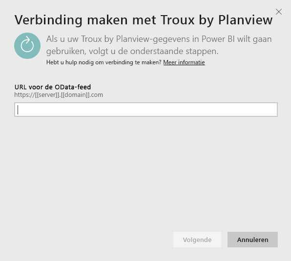
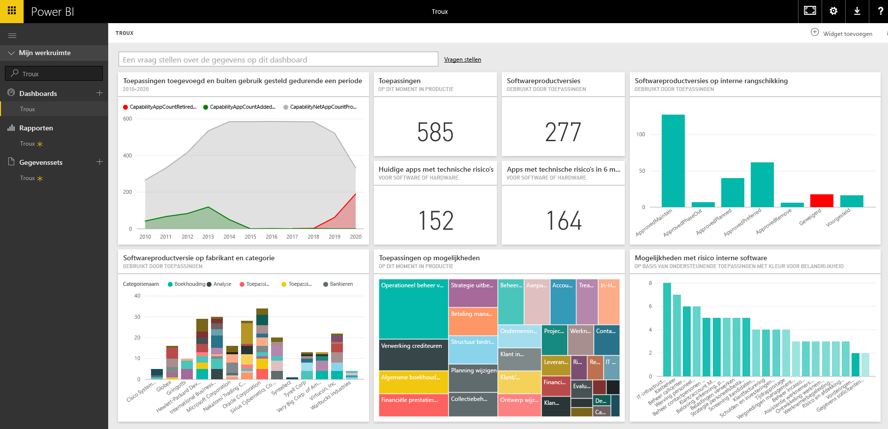

# Verbinding maken met Troux voor Power BI
Met het Troux-inhoudspakket kunt u de opslagplaats van uw ondernemingsstructuur op geheel nieuwe manieren rechtstreeks in Power BI weergeven. Het inhoudspakket geeft inzicht in de bedrijfsfunctionaliteit, de toepassingen die deze functionaliteit leveren en de technologieën die ondersteuning bieden voor deze toepassingen die volledig kunnen worden aangepast met Power BI.

Maak verbinding met het [Troux-inhoudspakket](https://app.powerbi.com/getdata/services/troux) voor Power BI.

## Verbinding maken
1. Selecteer **Gegevens ophalen** onder in het linkernavigatievenster.
   
   
2. Selecteer in het vak **Services** de optie **Ophalen**.
   
   
3. Selecteer **Troux** \> **Ophalen**.
   
   
4. Geef de URL voor Troux OData op. Bekijk hieronder de details voor [het vinden van die parameters](#FindingParams).
   
   
5. Selecteer voor **Verificatiemethode** de optie **Standaard** en geef uw gebruikersnaam en wachtwoord (hoofdlettergevoelig) op. Selecteer vervolgens **Aanmelden**.
   
    
6. Nadat uw aanmelding is goedgekeurd, wordt het importeren automatisch gestart. Nadat het importeren is voltooid, bevat het navigatiedeelvenster een nieuw dashboard, rapport en model. Selecteer het dashboard om uw geïmporteerde gegevens weer te geven.
   
     

**Wat nu?**

* [Stel vragen in het vak Q&A](power-bi-q-and-a.md) boven in het dashboard.
* [Wijzig de tegels](service-dashboard-edit-tile.md) in het dashboard.
* [Selecteer een tegel](service-dashboard-tiles.md) om het onderliggende rapport te openen.
* Als uw gegevensset is ingesteld op dagelijks vernieuwen, kunt u het vernieuwingsschema wijzigen of de gegevensset handmatig vernieuwen met **Nu vernieuwen**.

## Systeemvereisten
Toegang tot de Troux OData-feed en Troux 9.5.1 of hoger is vereist.

## Parameters zoeken
Uw klantenondersteuningsteam kan u de unieke URL voor de Troux OData-feed verstrekken

## Probleemoplossing
Als er een foutmelding wordt weergegeven vanwege een time-out, maakt u opnieuw verbinding.

## Volgende stappen
[Aan de slag in Power BI](service-get-started.md)

[Gegevens ophalen in Power BI](service-get-data.md)

