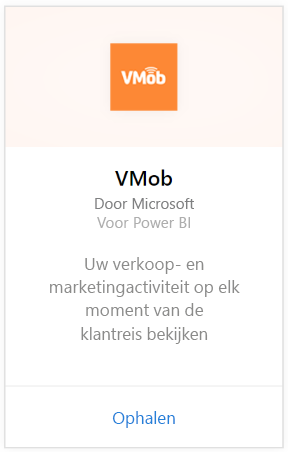
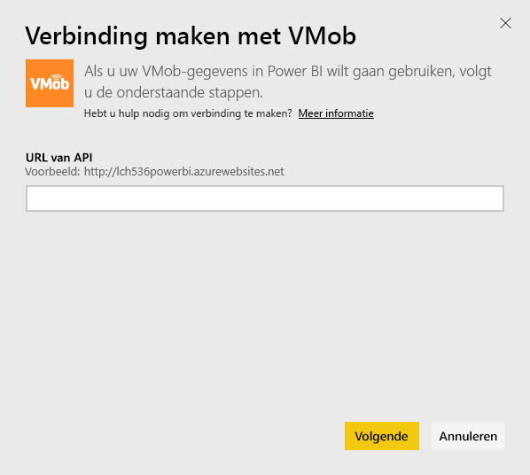

# Verbinding maken met VMob via Power BI
Uw VMob-gegevens opsporen en bekijken is eenvoudig met Power BI en het inhoudspakket van VMob. De volgende gegevens worden opgehaald door Power BI: gebruikersstatistieken, ongelimiteerd en van de afgelopen 30 dagen, KPI’s detailhandel van de afgelopen 30 dagen en campagneprestaties van de afgelopen 30 dagen.

Maak verbinding met het [VMob-inhoudspakket](https://app.powerbi.com/getdata/services/vmob) voor Power BI.

## Verbinding maken
1. Selecteer **Gegevens ophalen** onder in het linkernavigatievenster.
   
    
2. Selecteer in het vak **Services** de optie **Ophalen**.
   
   
3. Selecteer **VMob** \> **Ophalen**.
   
   
4. Wanneer u wordt gevraagd, geeft u uw VMob-URL en klikt u op de knop Volgende. Deze URL wordt afzonderlijk verstrekt door VMob.
   
    
5. Kies de optie **Basic** in de vervolgkeuzelijst voor verificatiemethoden, voer uw VMob-gebruikersnaam en het wachtwoord in en klik op de knop **Aanmelden**.
   
    
6. Het importproces wordt automatisch gestart, waarna Power BI uw VMob-gegevens ophaalt waarmee een kant-en-klaar dashboard en rapport worden gemaakt.
   
   

**Wat nu?**

* [Stel vragen in het vak Q&A](power-bi-q-and-a.md) boven in het dashboard.
* [Wijzig de tegels](service-dashboard-edit-tile.md) in het dashboard.
* [Selecteer een tegel](service-dashboard-tiles.md) om het onderliggende rapport te openen.
* Als uw gegevensset is ingesteld op dagelijks vernieuwen, kunt u het vernieuwingsschema wijzigen of de gegevensset handmatig vernieuwen met **Nu vernieuwen**

## Volgende stappen
[Aan de slag in Power BI](service-get-started.md)

[Gegevens ophalen in Power BI](service-get-data.md)

