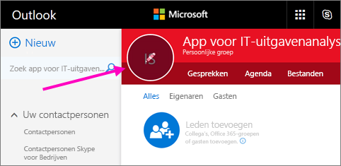
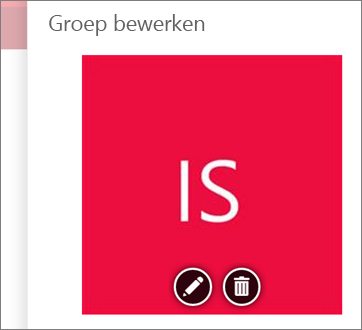
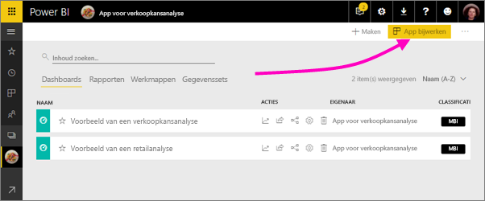
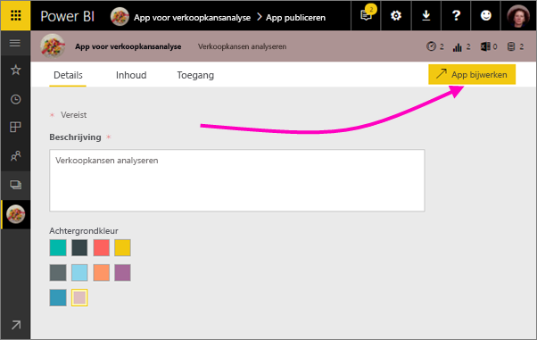
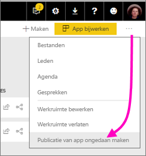

# Apps maken en publiceren met dashboards en rapporten in Power BI

In Power BI kunt u *apps* maken om gekoppelde dashboards en rapporten op één plek te verzamelen en ze vervolgens te publiceren naar grote groepen mensen in uw organisatie. U kunt ook verbinding maken met [Power BI-apps voor externe services](service-connect-to-services.md), zoals Google Analytics en Microsoft Dynamics CRM.

Uw zakelijke gebruikers hebben vaak meerdere Power BI-dashboards en rapporten nodig voor hun bedrijfsvoering. Apps brengen de verschillende onderdelen samen, zodat ze niet de namen en locaties van alle dashboards hoeven te onthouden.  

Met Power BI-apps, nu beschikbaar in preview, kunt u verzamelingen van dashboards en rapporten maken en deze apps naar uw hele organisatie of naar specifieke personen of groepen publiceren. Apps maken het u als beheerder of rapportmaker gemakkelijker om machtigingen voor verzamelingen van dashboards te beheren.

Zakelijke gebruikers kunnen deze apps installeren vanuit Microsoft AppSource, of u kunt hen een directe koppeling sturen. Ze kunnen uw inhoud eenvoudig vinden en opnieuw bekijken, omdat alles op één plek staat. Ze ontvangen automatisch updates en u kunt bepalen hoe vaak de gegevens worden vernieuwd. Meer informatie over de [app-ervaring voor zakelijke gebruikers](service-install-use-apps.md).

### Apps en organisatie-inhoudspakketten
Apps zijn verbeterde organisatie-inhoudspakketten. Als u al organisatie-inhoudspakketten hebt, blijven deze gewoon naast apps werken.

Nu u een overzicht van apps hebt, gaan we het hebben over *app-werkruimten*, waarin u apps kunt maken. 

## Video: Apps en app-werkruimten
<iframe width="640" height="360" src="https://www.youtube.com/embed/Ey5pyrr7Lk8?showinfo=0" frameborder="0" allowfullscreen></iframe>

## Licenties voor apps
Als maker van apps hebt u een licentie voor Power BI Pro nodig. Voor uw app-gebruikers zijn er twee opties.

* Optie 1: alle zakelijke gebruikers moeten **Power BI Pro**-licenties hebben om uw app te bekijken. 
* Optie 2: vrije gebruikers in uw organisatie kunnen app-inhoud bekijken als uw app een Power BI Premium-capaciteit heeft. Lees [Wat is Power BI Premium?](service-premium.md) voor meer informatie.

## App-werkruimten
*App-werkruimten* zijn de plekken waar u apps maakt. U moet dus eerst een app-werkruimte maken voordat u de app kunt maken. Als u ooit in een groepswerkruimte in Power BI hebt gewerkt, zullen app-werkruimten u bekend voorkomen. Het zijn in feite verder ontwikkelde groepswerkruimten: ruimten met tijdelijke bestanden en containers voor de inhoud van de app. 

U kunt collega's als leden of beheerders toevoegen aan deze werkruimten. Alle leden en beheerders van de app-werkruimte hebben Power BI Pro-licenties nodig. In de werkruimte kan iedereen samenwerken aan dashboards, rapporten en andere artikelen die u wilt publiceren naar een breder publiek of zelfs uw hele organisatie. 

Als de inhoud klaar is, publiceert u de app. U kunt een directe koppeling naar een breder publiek verzenden, of ze kunnen uw app vinden op het tabblad Apps door naar **Download and explore more apps from AppSource** (Meer apps downloaden en verkennen vanuit AppSource) te gaan. Deze mensen kunnen de inhoud van de app niet wijzigen, maar ze kunnen wel bepaalde acties uitvoeren in de Power BI-service of een van de mobiele apps: filteren, markeren en de gegevens sorteren. 

### Hoe verschillen app-werkruimten van groepswerkruimten?
Alle bestaande groepswerkruimten kunnen als app-werkruimten fungeren, en u kunt apps vanuit al deze werkruimten publiceren. App-werkruimten en groepswerkruimten verschillen wel op één punt: u maakt een app-werkruimte als een plaats voor het maken en opslaan van een specifieke app. Er is een een-op-eenrelatie tussen de app en de inhoud van de app-werkruimte. Alles dat in de app-werkruimte staat, staat in de app wanneer u deze publiceert. 

Nu u apps en app-werkruimten begrijpt, kunnen we een app maken en publiceren. 

## Een app-werkruimte maken
[!INCLUDE [powerbi-service-create-app-workspace](./includes/powerbi-service-create-app-workspace.md)]

De werkruimte is leeg, dus u moet er inhoud aan toevoegen. Houd er rekening mee dat wanneer u de werkruimte maakt, het ongeveer een uur kan duren voordat de werkruimte aan Office 365 is doorgegeven. 

Toevoegen van inhoud werkt hetzelfde als inhoud toevoegen aan uw Mijn werkruimte, behalve dat andere personen in de werkruimte de inhoud ook kunnen zien en bewerken. Een groot verschil is dat wanneer u klaar bent, u de inhoud als app kunt publiceren. In de app-werkruimte kunt u bestanden uploaden of ermee verbinding maken, of verbinding maken met services van derden, net zoals in uw Mijn werkruimte. Voorbeeld:

* [Maak verbinding met services](service-connect-to-services.md) zoals Microsoft Dynamics CRM, Salesforce of Google Analytics.
* [Haal gegevens op uit bestanden](service-get-data-from-files.md) zoals Excel, CSV of PBIX-bestanden (Power BI Desktop).

## Een afbeelding aan uw app toevoegen (optioneel)
Power BI maakt standaard een kleine gekleurde cirkel voor uw app met de initialen van de app. Maar misschien wilt u deze aanpassen met een afbeelding. U hebt een licentie voor Exchange Online nodig om een afbeelding toe te voegen.

1. Selecteer **Werkruimten**, selecteer het weglatingsteken (...) naast de naam van de werkruimte, en selecteer vervolgens **Leden**. 
   
     
   
    Het Office 365 Outlook-account voor de werkruimte wordt in een nieuw browservenster geopend.
2. Wanneer u de muisaanwijzer op de gekleurde cirkel in de linkerbovenhoek plaatst, verandert deze in een potloodpictogram. Selecteer het.
   
     
3. Selecteer het potloodpictogram opnieuw en zoek de afbeelding die u wilt gebruiken.
   
     
4. Selecteer **Opslaan**.
   
     
   
    De afbeelding vervangt de gekleurde cirkel in het Office 365 Outlook-venster. 
   
     
   
    In een paar minuten verschijnt de afbeelding ook in de app in Power BI.
   
     

## Uw app publiceren
Als de dashboards en rapporten in uw app-werkruimte klaar zijn, kunt u deze als een app publiceren. U hoeft niet alle rapporten en dashboards in de werkruimte te publiceren. U kunt ook alleen de items publiceren die gereed zijn. 

1. Kies in de lijstweergave van de werkruimte welke dashboards en rapporten u in de app wilt opnemen.

     

     Als u ervoor kiest om een rapport niet te publiceren, wordt er een waarschuwing naast het rapport en het bijbehorende dashboard weergegeven. U kunt de app nog steeds publiceren, maar in het bijbehorende dashboard ontbreken dan de tegels uit het rapport.

     

1. Selecteer de knop **App publiceren** in de rechterbovenhoek om het proces voor het delen van alle inhoud in de werkruimte te starten.
   
     

2. Geef eerst bij **Details** de beschrijving op om mensen te helpen de app te vinden. U kunt een achtergrondkleur instellen om de app te personaliseren.
   
     

3. Vervolgens ziet u bij **Inhoud** alle inhoud die wordt gepubliceerd als onderdeel van de app: alles wat u in de werkruimte hebt geselecteerd. U kunt ook de startpagina van de app instellen: het dashboard of rapport dat mensen als eerste zien wanneer ze naar uw app gaan. U kunt **Geen** kiezen. Vervolgens komen ze op een lijst van alle inhoud in de app te staan. 
   
     

4. Bepaal ten slotte bij **Toegang** wie toegang tot de app heeft: ofwel iedereen in uw organisatie, of specifieke personen of Active Directory-beveiligingsgroepen. 

5. Wanneer u **Voltooien** selecteert, wordt er een bevestigingsbericht weergegeven dat de app gereed is om te publiceren. U kunt in het dialoogvenster dat na het voltooien wordt weergegeven, de URL voor de directe koppeling naar de app kopiëren en verzenden naar de personen waarmee u de app hebt gedeeld.
   
     

De zakelijke gebruikers waarnaar u de app hebt gepubliceerd, kunnen deze op twee verschillende manieren vinden. U kunt ze de directe koppeling naar de app sturen, of ze kunnen ernaar zoeken in Microsoft AppSource, waar ze alle apps kunnen zien waar ze toegang tot hebben. Wanneer ze later naar Apps gaan, zien ze deze app in de lijst staan.

Meer informatie over de [app-ervaring voor zakelijke gebruikers](service-install-use-apps.md).

## Uw gepubliceerde app wijzigen
Nadat u uw app hebt gepubliceerd, kunt u deze wijzigen of bijwerken. Het is gemakkelijk om de app bij te werken als u een beheerder of lid van de app-werkruimte bent. 

1. Open de app-werkruimte die bij de app hoort. 
   
     
2. Open het dashboard of het rapport. U kunt de gewenste wijzigingen aanbrengen.
   
     De app-werkruimte is uw faseringsplek. Uw wijzigingen worden pas live wanneer u de app opnieuw publiceert. Dit betekent dat u wijzigingen kunt aanbrengen zonder dat dit de gepubliceerde apps beïnvloedt.  
 
1. Ga terug naar de lijst met inhoud van de app-werkruimte en selecteer **App bijwerken**.
   
     
4. Werk indien nodig **Details**, **Inhoud** en **Toegang** bij en selecteer **App bijwerken**.
   
     

De mensen waarnaar u de app heeft gepubliceerd, zien automatisch de bijgewerkte versie van de app. 

## Een app publiceren ongedaan maken
Elk lid van een app-werkruimte kan het publiceren van de app ongedaan maken.

* Selecteer in een app-werkruimte het weglatingsteken (**...**) in de rechterbovenhoek > **Publicatie van app ongedaan maken**.
  
     

Met deze actie wordt de app verwijderd voor iedereen waarnaar u deze hebt gepubliceerd, waarna ze geen toegang meer tot de app hebben. De app-werkruimte en de inhoud ervan worden niet verwijderd.

## Veelgestelde vragen over Power BI-apps
### Hoe verschillen app-werkruimten van groepswerkruimten?
in deze release hebben we alle groepswerkruimten gewijzigd in app-werkruimten. U kunt een app uit elke van deze werkruimten publiceren. De functionaliteit blijft grotendeels gelijk aan die van groepswerkruimten. We hebben in de komende maanden de volgende verbeteringen voor app-werkruimten gepland: 

* Wanneer u app-werkruimten maakt, worden er niet bijbehorende entiteiten in Office 365 gemaakt, zoals bij groepswerkruimten. Op die manier kunt u zoveel app-werkruimten maken als u maar wilt zonder dat u zich zorgen hoeft te maken over verschillende Office 365-groepen die op de achtergrond worden gemaakt (u kunt nog steeds de OneDrive voor Bedrijven van een Office 365-groep gebruiken voor het opslaan van uw bestanden). 
* U kunt op dit moment mensen alleen individueel toevoegen aan de leden- en beheerderlijsten. U kunt binnenkort meerdere AD-beveiligingsgroepen of moderne groepen aan deze lijsten toevoegen voor eenvoudiger beheer.  

### Hoe verschillen apps van organisatie-inhoudspakketten?
Apps zijn een verbetering en vereenvoudiging van inhoudspakketten, met enkele belangrijke verschillen. 

* Nadat zakelijke gebruikers een inhoudspakket hebben geïnstalleerd, verliest deze de gegroepeerde identiteit; de groep is nu alleen nog een lijst met dashboards en rapporten afgewisseld met andere dashboards en rapporten. Apps behouden daarentegen ook na de installatie hun groepering en identiteit. Dit maakt het eenvoudig voor zakelijke gebruikers om ze in de toekomst opnieuw te openen.  
* U kunt meerdere inhoudspakketten vanuit elke werkruimte maken, maar een app heeft een een-op-eenrelatie met de werkruimte. We denken dat apps op deze manier gemakkelijker te begrijpen en op lange termijn te onderhouden zijn. Zie het planningsgedeelte van de Power BI-blog voor meer informatie over hoe we op dit vlak verbeteringen willen aanbrengen. 
* We willen organisatie-inhoudspakketten op termijn afschaffen. Daarom raden we u aan vanaf nu apps te maken.  

### Hoe zit het met alleen-lezen-leden in groepen?
U kunt alleen-lezen-leden toevoegen in groepen die de inhoud alleen kunnen bekijken. Het grootste probleem met deze benadering is dat u geen beveiligingsgroepen als leden kunt toevoegen. Met apps kunt u een alleen-lezen-versie van uw app-werkruimte publiceren voor grote groepen, met inbegrip van beveiligingsgroepen. U kunt uw wijzigingen voor de dashboards en rapporten in de app klaarzetten zonder dat eindgebruikers hier hinder van ondervinden. We raden u aan apps voortaan op deze manier te gebruiken. Op de lange termijn willen we ook alleen-lezen-leden van werkruimten afschaffen.  

## Volgende stappen
* [Apps in Power BI installeren en gebruiken](service-install-use-apps.md)
* [Power BI-apps voor externe services](service-connect-to-services.md)
* Vragen? [Misschien dat de Power BI-community het antwoord weet](http://community.powerbi.com/)

