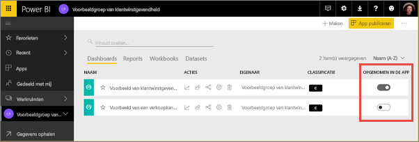
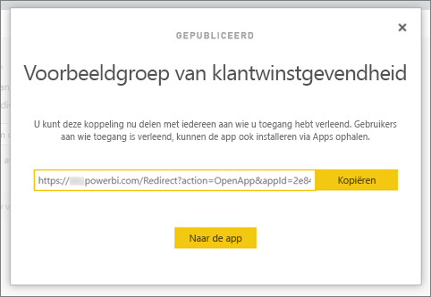
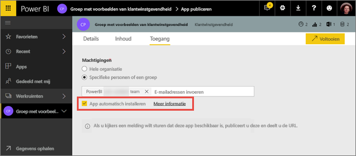
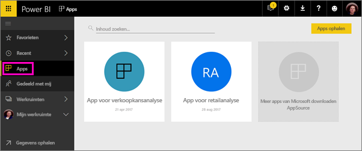

# Een app publiceren in Power BI

In Power BI, kunt u officiële verpakt inhoud maakt en deze distribueren naar een brede doelgroep als een *app*. U maakt apps in *app-werkruimten*, waar u samen met uw collega's aan Power BI-inhoud kunt werken. Vervolgens kunt u de voltooide apps naar grote groepen mensen in uw organisatie publiceren. 

Uw zakelijke gebruikers hebben vaak meerdere Power BI-dashboards en rapporten nodig voor hun bedrijfsvoering. Met Power BI-apps kunt u verzamelingen van dashboards en rapporten maken en deze apps naar uw hele organisatie of naar specifieke personen of groepen publiceren. Apps maken het u als beheerder of rapportmaker gemakkelijker om machtigingen voor deze verzamelingen te beheren.

Zakelijke gebruikers kunnen uw apps op verschillende manieren:

- Ze kunnen vinden en installeren van uw app uit Microsoft AppSource
- Deze kunt u op een directe koppeling verzenden.
- U kunt de app automatisch installeren in de Power BI-accounts van uw collega's als uw Power BI-beheerder u hiervoor toestemming geeft.

U kunt de app maken met een eigen ingebouwde navigatie, zodat uw gebruikers kunnen hun manier om uw inhoud eenvoudig vinden. De inhoud van de app niet om te wijzigen. Ze kunnen interactie hebben met het in de Power BI-service of een van de mobiele apps-: filteren, markeren en de gegevens sorteren. Ze ontvangen automatisch updates en u kunt bepalen hoe vaak de gegevens worden vernieuwd. Meer informatie over de [app-ervaring voor zakelijke gebruikers](consumer/end-user-apps.md).

## Licenties voor apps
Als u wilt maken of bijwerken van een app, moet u een Power BI Pro-licentie. Voor app *consumenten*, er zijn twee opties.

* Optie 1: alle zakelijke gebruikers moeten **Power BI Pro**-licenties hebben om uw app te bekijken. 
* Optie 2: Als uw app-werkruimte zich in een Power BI Premium-capaciteit bevindt, kunnen gebruikers in uw organisatie van de gratis app-inhoud weergeven. Lees [Wat is Power BI Premium?](service-premium.md) voor meer informatie.

## Uw app publiceren
Wanneer de dashboards en rapporten in uw werkruimte klaar zijn, kiest u welke dashboards en rapporten u wilt publiceren en publiceert u deze vervolgens als een app. 

1. Bepaal in de lijstweergave van de werkruimte welke dashboards en rapporten die u wilt dat **opgenomen in de app**.

     

     Als u niet op te nemen van een rapport met een gerelateerd dashboard kiest, ziet u een waarschuwing naast het rapport. U kunt de app nog steeds publiceren, maar het bijbehorende dashboard niet in de tegels uit het rapport bent.

     

2. Selecteer de **app publiceren** knop in de rechterbovenhoek om het proces van het maken en publiceren van een app vanuit de werkruimte te starten.
   
     

3. Op **Setup**, vult u de naam en beschrijving voor de mensen die de app te zoeken. U kunt instellen dat een themakleur die moeten aanpassen. U kunt ook een koppeling toevoegen aan een ondersteuningssite.
   
     

4. Op **navigatie**, u de inhoud die moet worden gepubliceerd als onderdeel van de app. Voeg app navigatie, voor het ordenen van de inhoud in secties. Zie [de navigatie-ervaring voor uw app ontwerpen](#design-the-navigation-experience-for-your-app) in dit artikel voor meer informatie.
   
     

5. Op **toegang**, bepalen wie toegang heeft tot de app. 
    - In [klassieke werkruimten](service-create-workspaces.md): iedereen in uw organisatie, specifieke personen of Azure Active Directory (AAD)-beveiligingsgroepen.
    - In de [nieuwe ervaring werkruimten](service-create-the-new-workspaces.md): specifieke personen, AAD-beveiligingsgroepen en distributielijsten en Office 365-groepen.

6. Als u gemachtigd bent, kunt u de app automatisch installeren voor de ontvangers. Een Power BI-beheerder kan deze instelling inschakelen in de Power BI-beheerportal. Meer informatie over [automatisch een app installeren](#automatically-install-apps-for-end-users) in dit artikel.

     

7. Wanneer u selecteert **app publiceren**, ziet u een bevestigingsbericht weergegeven dat het is gereed om te publiceren. In de **deze app delen** in het dialoogvenster kunt u de URL die is een directe koppeling naar deze app.
   
     

U kunt verzenden dat directe koppeling naar de mensen die u hebt gedeeld, of ze uw app op het tabblad Apps vinden kunnen door te gaan naar **downloaden en meer apps verkennen vanuit AppSource**. Meer informatie over de [app-ervaring voor zakelijke gebruikers](consumer/end-user-apps.md).

## Uw gepubliceerde app wijzigen
Nadat u uw app hebt gepubliceerd, kunt u deze wijzigen of bijwerken. Het is eenvoudig bij te werken als u een beheerder of lid van de nieuwe app-werkruimte bent. 

1. Open de app-werkruimte die bij de app hoort. 
   
     

2. De gewenste wijzigingen aan de dashboards of rapporten maken
 
     De app-werkruimte is uw faseringsplek. Uw wijzigingen worden pas live in de app wanneer u de app opnieuw publiceert. Dit betekent dat u wijzigingen kunt aanbrengen zonder dat dit de gepubliceerde apps beïnvloedt.  
 
    > [!IMPORTANT]
    > Als u een rapport verwijderen en bijwerken van de app, zelfs als u het rapport terug naar de app toevoegen, verliezen consumenten van uw app alle aanpassingen, zoals bladwijzers, opmerkingen, enzovoort.  
 
3. Ga terug naar de lijst van de app-werkruimte van de inhoud en selecteer **app bijwerken** in de rechterbovenhoek.
   
1. Update **Setup**, **navigatie**, en **machtigingen**, als u wilt, en selecteer vervolgens **app bijwerken**.
   
De mensen waarnaar u de app heeft gepubliceerd, zien automatisch de bijgewerkte versie van de app. 

## De navigatie-ervaring voor uw app ontwerpen
De **nieuwe navigatie builder** optie kunt u een aangepaste navigatie voor uw app kunt maken. De aangepaste navigatie eenvoudiger voor uw gebruikers te vinden en gebruiken van inhoud in de app. Bestaande apps hebben deze optie is uitgeschakeld en de nieuwe standaard-apps met de optie wordt op.

Als de optie uitgeschakeld is, kunt u de **landingspagina van App** zijn **specifieke inhoud**, bijvoorbeeld een dashboard of rapport of selecteer **geen** om weer te geven van een eenvoudige lijst inhoud voor de gebruiker.

Wanneer u inschakelt **nieuwe navigatie builder**, kunt u een aangepaste navigatie ontwerpen. Standaard worden alle rapporten, dashboards en Excel-werkmappen die u in uw app opgenomen als een platte lijst vermeld. 

U kunt de app-navigatie door verder aanpassen:
* Volgorde van de artikelen met omhoog / omlaag pijlen. 
* Naam van de items in de **rapport**, **Dashboard details**, en **werkmapdetails**.
* Bepaalde items in de navigatie verbergen.
* Met behulp van de **nieuw** optie om toe te voegen **secties** aan groep gerelateerde inhoud.
* Met behulp van de **nieuw** optie om toe te voegen een **koppeling** naar een externe bron op de navigatiebalk aan de linkerkant. 

Wanneer u het toevoegen van een **koppeling**in **gekoppeld zijn aan details** kunt u kiezen waar de koppeling wordt geopend. Standaard koppelingen openen in de **huidige tabblad**, maar u kunt selecteren **nieuw tabblad**, of **weergavegebied**. 

### Overwegingen voor het gebruik van de nieuwe navigatie builder-optie
Hier vindt u algemene zaken waarmee u rekening moet houden wanneer met de nieuwe navigatie-opbouwfunctie voor:
* Rapportpagina's worden weergegeven in het gebied van de navigatie app als een uitvouwbare sectie
* Als u de opbouwfunctie voor nieuwe navigatie uitschakelen en vervolgens publiceren of bijwerken van uw app, verliest u de aanpassingen die u hebt aangebracht. Secties, bestellen, koppelingen en aangepaste namen voor navigatie-items worden bijvoorbeeld alle verloren.

Bij het toevoegen van koppelingen naar uw app-navigatie en selecteer daarbij de optie inhoudsgebied:
* Zorg ervoor dat de koppeling kan worden ingesloten. Sommige services blokkeren het insluiten van inhoud die in de sites van derden, zoals Power BI.
* Power BI-service-inhoud, zoals rapporten of dashboards insluiten in andere werkruimten wordt niet ondersteund. 
* Insluiten van Power BI Report Server insluiten van inhoud via de systeemeigen URL inhoud van een on-premises-implementatie. Gebruik de stappen in [het maken van de Power BI Report Server-URL](https://docs.microsoft.com/power-bi/report-server/quickstart-embed#creating-the-power-bi-report-server-report-url) om de URL te achterhalen. Let erop dat zijn reguliere verificatieregels van toepassing, zodat de inhoud wilt weergeven, is een VPN-verbinding met de on-premises server vereist. 
* Een beveiligingswaarschuwing wordt weergegeven aan de bovenkant van de ingesloten inhoud om aan te geven van dat de inhoud is niet in Power BI.

## Automatisch apps voor eindgebruikers installeren
Als een beheerder, u machtigingen krijgt, kunt u apps automatisch installeren *pushen* ze aan eindgebruikers. Deze functionaliteit push wordt het gemakkelijker te verdelen van de juiste apps naar de juiste personen of groepen. Uw app wordt automatisch weergegeven in de lijst met van uw eindgebruikers Apps inhoud. Ze hoeven niet te vinden van Microsoft AppSource of een installatiekoppeling te volgen. Zie hoe beheerders inschakelen [apps pushen naar eindgebruikers](service-admin-portal.md#push-apps-to-end-users) in het artikel van Power BI-admin-portal.

### Hoe u een app automatisch te pushen naar eindgebruikers
Nadat de beheerder u machtigingen heeft verleend, hebt u een nieuwe optie om **de app automatisch te installeren**. Wanneer u het selectievakje in en selecteer **app publiceren** (of **app bijwerken**), de app wordt gepusht naar alle gebruikers of groepen die zijn gedefinieerd in de **machtigingen** sectie van de app op de **Toegang** tabblad.

### Hoe krijgen gebruikers de apps die u naar deze pushen
Nadat u een app hebt gepusht, wordt deze weergegeven in de lijst met Apps automatisch. Op deze manier, kunt u de apps cureren die specifieke gebruikers of functies in uw organisatie nodig dat bij de hand.

### Overwegingen voor het automatisch installeren van apps
Hier volgt een aantal zaken waarmee u rekening moet houden wanneer u apps naar eindgebruikers pusht:

* Het automatisch installeren van apps voor gebruikers kan enige tijd in beslag nemen. De meeste apps installeren direct voor gebruikers, maar het pushen van apps kan enige tijd duren.  Hoe lang dit duurt, is afhankelijk van het aantal items in de app en het aantal personen dat toegang tot de app heeft. U wordt aangeraden apps buiten bedrijfsuren te pushen en te zorgen dat er voldoende tijd voor de installatie is voordat gebruikers de app nodig hebben. Voordat u een algemene mededeling over de beschikbaarheid van de app verzendt, kunt u bij meerdere gebruikers controleren of de app is geïnstalleerd.

* Vernieuw de browser. Voordat de gepushte app in de lijst Apps wordt weergegeven, kan het zijn dat gebruikers de browser moeten vernieuwen of moeten sluiten en vervolgens opnieuw moeten openen.

* Als gebruikers niet onmiddellijk voor de app in de lijst met Apps ziet, moeten ze vernieuwen of sluit en Open de browser.

* Probeer gebruikers niet te overspoelen met apps. Zorg ervoor dat u niet te veel apps pusht, zodat gebruikers het gevoel hebben dat de vooraf geïnstalleerde apps ook daadwerkelijk nuttig voor ze zijn. Voor een goed afstemming van de timing is het verstandig te bepalen wie apps naar eindgebruikers mag pushen. Stel een contactpunt voor het ophalen van apps in uw organisatie die naar eindgebruikers gepusht.

* Gastgebruikers die een uitnodiging nog niet hebt geaccepteerd krijgen niet automatisch wordt geïnstalleerd voor deze apps.  

## Een app publiceren ongedaan maken
Elk lid van een app-werkruimte kan het publiceren van de app ongedaan maken.

>[!IMPORTANT]
>Wanneer u de publicatie van een app ongedaan maakt, verliezen gebruikers van de app hun aanpassingen. Ze verloren gaan eventuele persoonlijke bladwijzers, opmerkingen of abonnementen die zijn gekoppeld aan de inhoud van de app. Maak de publicatie van een app alleen ongedaan als u deze moet verwijderen.
> 
> 

* Selecteer in een app-werkruimte het weglatingsteken ( **...** ) in de rechterbovenhoek > **Publicatie van app ongedaan maken**.
  
     

Met deze actie wordt de app verwijderd voor iedereen waarnaar u deze hebt gepubliceerd, waarna ze geen toegang meer tot de app hebben. De app-werkruimte en de inhoud ervan worden niet verwijderd.

## De gepubliceerde app weergeven

Wanneer uw app wordt geopend door consumenten van uw app, zien ze de navigatie die u hebt gemaakt, in plaats van het standaard Power BI-navigatiedeelvenster links. De navigatie aan de app bevat de rapporten en dashboards in de secties die u hebt gedefinieerd. Het bevat ook afzonderlijke pagina's in elk rapport, in plaats van dat gewoon de naam van het rapport.

## Volgende stappen
* [Een app-werkruimte maken](service-create-workspaces.md)
* [Apps in Power BI installeren en gebruiken](consumer/end-user-apps.md)
* [Power BI-apps voor externe services](service-connect-to-services.md)
* [Power BI-beheerportal](https://docs.microsoft.com/power-bi/service-admin-portal)
* Vragen? [Misschien dat de Power BI-community het antwoord weet](http://community.powerbi.com/)
