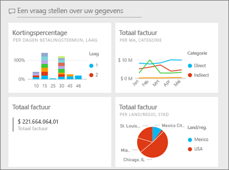

# Een kopie van een dashboard maken in Power BI

 Er zijn veel verschillende redenen om een kopie te maken van een dashboard. Misschien wilt u wijzigingen aanbrengen en de prestaties ten opzichte van het origineel testen. Of misschien wilt u enigszins verschillende versies distribueren per collega, regio of team. Misschien vindt een collega uw dashboardontwerpen zeer geslaagd en wil zij ze gebruiken om aan haar managers te rapporteren. Een andere reden zou zijn als u een nieuwe database met dezelfde gegevensstructuur en dezelfde gegevenstypen hebt en u het dashboard dat u al hebt gemaakt, opnieuw wilt gebruiken. Dat kan ook, maar vergt wel wat werk in Power BI Desktop. 

Dashboards worden gemaakt (en gekopieerd) met behulp van Power BI-service en kunnen worden weergegeven in Power BI-mobiel en Power BI Embedded.  Dashboards zijn niet beschikbaar in Power BI Desktop. 

Als u een kopie van een dashboard wilt maken, moet dit vanuit het dashboard *Auteur*. Dashboards die met u zijn gedeeld als app, kunnen niet worden gedupliceerd.

1. Open het dashboard.
2. Selecteer in de rechterbovenhoek de weglatingstekens (...) en kies **Dashboard dupliceren**.
   
   
3. Geef het dashboard en naam en selecteer **Dupliceren**. 
   
   
4. Het nieuwe dashboard wordt opgeslagen in dezelfde werkruimte als het origineel. 
   
   

5.    Open het nieuwe dashboard en bewerk indien nodig. Hier volgen enkele dingen die u mogelijk daarna wilt doen:    
    a. [Tegels verplaatsen, de naam ervan wijzigen, vergroten/verkleinen of zelfs verwijderen](service-dashboard-edit-tile.md).  
    b. Details en hyperlinks van tegels bewerken door de weglatingstekens bij de tegel (...) te selecteren en te kiezen voor **Details bewerken**.  
    c. [Nieuwe tegels toevoegen vanuit de menubalk van het dashboard](service-dashboard-add-widget.md) (**Tegel toevoegen**)  
    d. Nieuwe tegels vastmaken [vanuit Q&A](service-dashboard-pin-tile-from-q-and-a.md) of [vanuit rapporten](service-dashboard-pin-tile-from-report.md).  
    e. De naam van het dashboard wijzigen, Q & A inschakelen of uitschakelen en de tegelstroom instellen in het deelvenster van de dashboardinstellingen.  (Selecteer de vervolgkeuzelijst bij de weglatingstekens van het dashboard (...) en kies **Instellingen**)  
    f. Uw dashboard rechtstreeks delen met collega's of als onderdeel van een Power BI-app. 

## Volgende stappen
* [Tips voor het ontwerpen van een geweldig dashboard](service-dashboards-design-tips.md) 

Nog vragen? [Misschien dat de Power BI-community het antwoord weet](http://community.powerbi.com/)

