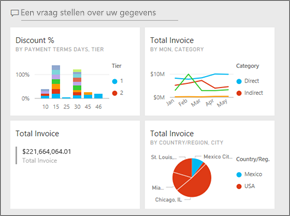
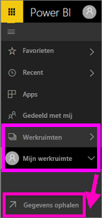
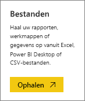
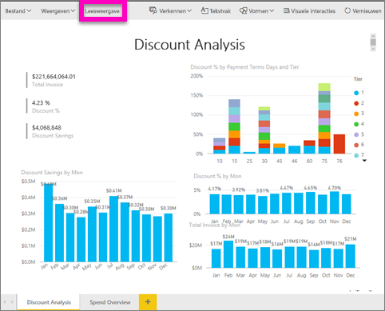
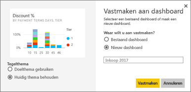

# Een Power BI-dashboard maken op basis van een rapport
U hebt [Dashboards in Power BI](service-dashboards.md) gelezen en u wilt nu uw eigen dashboard maken. Er zijn veel verschillende manieren om een dashboard te maken: op basis van een rapport, helemaal vanaf het begin, op basis van een gegevensset, door een bestaand dashboard te dupliceren, en meer.  In dit onderwerp en deze video ziet u hoe u een nieuw dashboard kunt maken door visualisaties van een bestaand rapport vast te maken.

> **OPMERKING**: Dashboards zijn een functie van Power BI-service, niet van Power BI Desktop. Dashboards kunnen niet worden gemaakt in Power BI - Mobiel, maar wel worden [bekeken en gedeeld](mobile-apps-view-dashboard.md).
> 
> 

## Video: Een dashboard maken door visualisaties en afbeeldingen van een rapport vast te maken
Kijk hoe Amanda een nieuw dashboard maakt door visualisaties van een rapport vast te maken. Probeer het vervolgens zelf uit met behulp van het voorbeeld van een inkoopanalyse door de stappen onder de video te volgen.

<iframe width="560" height="315" src="https://www.youtube.com/embed/lJKgWnvl6bQ" frameborder="0" allowfullscreen></iframe>

## Een gegevensset met een rapport importeren
We gaan een van de Power BI-voorbeeldgegevenssets importeren en gebruiken om ons nieuwe dashboard te maken. Het voorbeeld dat we gebruiken is een Excel-werkmap met twee PowerView-bladen. Als de werkmap wordt geïmporteerd in Power BI, wordt er een gegevensset en een rapport toegevoegd aan uw werkruimte.  Het rapport wordt automatisch gemaakt op basis van de PowerView-werkbladen.

1. [Selecteer deze koppeling](http://go.microsoft.com/fwlink/?LinkId=529784) om het Excel-bestand met het voorbeeld van een inkoopanalyse te downloaden en op te slaan. We raden u aan het op te slaan in uw OneDrive voor bedrijven.
2. Open de Power BI-service (app.powerbi.com) in uw browser en meld u aan.
3. Selecteer een bestaande werkruimte of maak een nieuwe app-werkruimte.
4. Selecteer in de linker navigatie **Gegevens ophalen**.
   
    
5. Selecteer **Bestanden**.
   
   
6. Navigeer naar de locatie waar u het Excel-bestand met het voorbeeld van een inkoopanalyse hebt opgeslagen. Selecteer het en kies **Verbinding maken**.
   
   
7. Selecteer voor deze oefening **Importeren**.
   
    
8. Wanneer het bericht wordt weergegeven dat het importeren is voltooid, selecteert u de **x** om het bericht te sluiten.
   
   

### Open het rapport en maak enkele tegels vast aan een dashboard
1. Blijf in dezelfde werkruimte en selecteer het tabblad **Rapporten**. Het zojuist geïmporteerde rapport wordt weergegeven met een geel sterretje. Selecteer de naam van het rapport om het te openen.
   
    
2. Het rapport wordt geopend in de [Leesweergave](service-interact-with-a-report-in-reading-view.md). Let op de twee tabbladen aan de onderkant: Discount Analysis (Kortingsanalyse) en Spend Overview (Uitgavenoverzicht). Elk tabblad vertegenwoordigt een pagina van het rapport.
   
    
3. Wijs een visualisatie aan om de beschikbare opties zichtbaar te maken. Als u een visualisatie aan een dashboard wilt toevoegen, selecteert u het punaisepictogram .
   
    
4. Omdat we een nieuw dashboard maken, selecteert u de optie **Nieuw dashboard** en geeft u het een naam. 
   
   
5. Wanneer u **Vastmaken** selecteert, wordt het nieuwe dashboard in de huidige werkruimte gemaakt. Wanneer het bericht **Aan dashboard vastgemaakt** wordt weergegeven, selecteert u **Naar dashboard gaan**. Als u wordt gevraagd of u het rapport wilt opslaan, kiest u **Opslaan**.
   
     
6. Het nieuwe dashboard wordt geopend in Power BI en het bevat één tegel - de visualisatie die we zojuist hebben vastgemaakt. 
   
   
7. Selecteer de tegel om terug te gaan naar het rapport. Maak nog een paar tegels vast aan het nieuwe dashboard. Wanneer het venster **Aan dashboard vastmaken** verschijnt, selecteert u deze keer **Bestaand dashboard**.  
   
   

Gefeliciteerd, u hebt uw eerste dashboard gemaakt! Nu u een dashboard hebt, kunt u er nog veel meer mee doen.  Probeer een van de voorgestelde **Volgende stappen** hieronder, of ga er zelf mee spelen en verkennen.   

## Volgende stappen
* [Het formaat van tegels bewerken en ze verplaatsen](service-dashboard-edit-tile.md)
* [Alles over dashboardtegels](service-dashboard-tiles.md)
* [Uw dashboard delen door een app te maken](service-create-distribute-apps.md)
* [Power BI - basisconcepten](service-basic-concepts.md)
* [Dashboards in Power BI](service-dashboards.md)
* [Tips voor het ontwerpen van een geweldig dashboard](service-dashboards-design-tips.md)

Nog vragen? [Probeer de Power BI-community](http://community.powerbi.com/)

