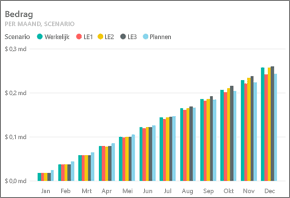
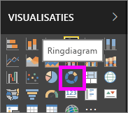
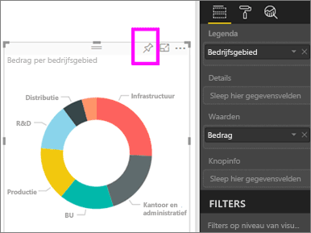
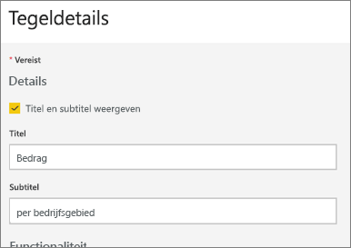
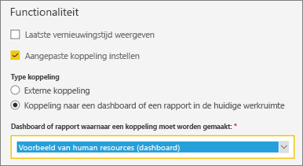
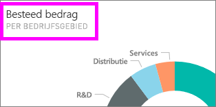

# Een dashboardtegel bewerken of verwijderen

## Dashboard*eigenaars* versus dashboard*gebruikers*
Wanneer u een dashboard maakt of bezit, beschikt u over veel opties om de vormgeving en het standaardgedrag van de tegels op dit dashboard te wijzigen. Gebruik de instellingen en de onderstaande strategieën voor het ontwerpen van de *gebruikservaring* van het dashboard voor uw collega's.  Als u een tegel selecteert, wordt hiermee het onderliggende rapport, een aangepaste URL of een andere dashboard geopend? Mogelijk gaat u [een tegel toevoegen waarin een video of streaminggegevens worden weergegeven](service-dashboard-add-widget.md)? En u kunt zelfs overwegen [een tegel met interactieve slicers te maken](service-dashboard-pin-live-tile-from-report.md). Als *auteur* hebt u veel opties. 

<iframe width="560" height="315" src="https://www.youtube.com/embed/lJKgWnvl6bQ" frameborder="0" allowfullscreen></iframe>

Dit artikel bevat informatie over het volgende.

* [Een visualisatie maken en vastmaken aan een dashboard](#create)
* [Een tegel verplaatsen](#move)
* [Het formaat van een tegel wijzigen](#resize)
* [De naam van een tegel wijzigen](#rename)
* [Een hyperlink toevoegen aan een tegel](#hyperlink)
* [Een tegel vastmaken aan een ander dashboard](#different)
* [Een tegel verwijderen](#delete)
  
 > [!TIP]
 > Als u de visualisatie die wordt weergegeven op de tegel wilt wijzigen, moet u de tegel verwijderen en een nieuwe [dashboardtegel](service-dashboard-tiles.md) toevoegen.
 > 

 ### Vereisten
 1. Als u deze wilt volgen, opent u Power BI-service (niet Power BI Desktop) en downloadt u [het voorbeeld van een IT-uitgavenanalyse](sample-it-spend.md). Wanneer het bericht verschijnt dat het downloaden is voltooid, selecteert u **Naar het dashboard gaan**

- - -

## Een nieuwe visualisatie maken en vastmaken aan het dashboard
1. Selecteer de tegel Bedrag om het rapport te openen in het dashboard voor IT-uitgavenanalyse.

    

2. Open het rapport in de bewerkingsweergave door **Rapport bewerken** te selecteren in de bovenste menubalk.

3. Voeg een nieuwe rapportpagina toe door onder aan het rapport het plusteken (+) te selecteren.

    

4. Selecteer in het deelvenster VELDEN **Feit > Bedrag** en **Zakelijk gebied > Zakelijk gebied**.
 
5. Selecteer in het deelvenster VISUALISATIES het pictogram Ringdiagram om de visualisatie te converteren naar een ringdiagram.

    

5. Selecteer het speldpictogram en maak het ringdiagram vast aan het dashboard van het voorbeeld van een IT-uitgavenanalyse.

   

6. Wanneer het bericht verschijnt dat de bewerking is voltooid, selecteert u **Naar het dashboard gaan**. U wordt vervolgens gevraagd om uw wijzigingen op te slaan. Selecteer **Opslaan**.

- - -

## De tegel verplaatsen
Zoek de nieuwe tegel op het dashboard. Selecteert en de tegel en houd deze vast om deze naar een nieuwe locatie te slepen op de dashboardcanvas.

- - -

## Het formaat van de tegel wijzigen
U kunt tegels verschillende afmetingen geven--van 1 x 1 tegeleenheden tot en met 5 x 5 tegeleenheden. Selecteer en sleep de greep (in de rechterbenedenhoek) om het formaat van de tegel te wijzigen.

- - -
## Het menu met weglatingstekens (...)

1. Selecteer de weglatingstekens in de rechterbovenhoek van de tegel. 
   
   

2. Beweeg de muisaanwijzer over de tegel Account en selecteer de weglatingstekens om de opties weer te geven. De beschikbare opties kunnen per tegeltype verschillen.  De beschikbare opties voor een live-tegel zijn bijvoorbeeld anders dan de beschikbare opties voor een tegel voor standaardvisualisatie. Als er een dashboard is gedeeld met u (u bent niet de eigenaar), hebt u minder opties.

   

3. Selecteer **Details bewerken** om het venster Tegeldetails te openen. 

    Wijzig de titel en het standaardgedrag van de tegel.  Bijvoorbeeld, u kunt besluiten dat, wanneer een *gebruiker* een tegel selecteert, in plaats van dat het rapport wordt geopend waarmee die tegel was gemaakt er een nieuw dashboard wordt weergegeven.  
   
   

### De tegel een nieuwe naam geven
Wijzig aan de bovenkant van het venster Tegeldetails **Titel** in **Besteed bedrag**.

### De standaardhyperlink wijzigen
Standaard geldt dat, wanneer u een tegel selecteert, u gewoonlijk naar het rapport gaat waar de tegel is gemaakt of naar Q&A (als de tegel was gemaakt in Q&A). Als u een koppeling wilt maken naar een webpagina, een ander dashboard of een rapport (in dezelfde werkruimte), een SSRS-rapport of andere online inhoud, moet u een aangepaste koppeling toevoegen.

1. Selecteer onder de kop functionaliteit **Aangepaste koppeling instellen**.

2. Selecteer **Koppelen aan een dashboard of rapport in de huidige werkruimte** en kies daarna uit de vervolgkeuzelijst.  In dit voorbeeld heb ik het dashboard met het voorbeeld van human resources geselecteerd. Als u dit voorbeeld nog niet in uw werkruimte hebt, kunt u het toevoegen en terugkeren naar deze stap, of u kunt een ander dashboard selecteren. 

    

3. Selecteer **Toepassen**.

4. De nieuwe titel wordt op de tegel weergegeven.  En als u de tegel selecteert, wordt in Power BI het dashboard voor Human Resources geopend. 

    

### De tegel vastmaken aan een ander dashboard
1. Selecteer in het vervolgkeuzemenu van de weglatingstekens **Tegel vastmaken** .
2. Beslis of u een duplicaat van deze tegel aan een bestaand dashboard of aan een nieuw dashboard wilt vastmaken. 
   
   
3. Selecteer **Vastmaken**.

### De tegel verwijderen
1. Als u een tegel uit een dashboard wilt verwijderen, selecteert u **Tegel verwijderen**  in de vervolgkeuzemenu van de weglatingstekens. 

2. Wanneer u een tegel verwijdert, verwijdert u daarmee niet de onderliggende visualisatie. Open het onderliggende rapport door de tegel Bedrag te selecteren. Open de laatste pagina in het rapport om te zien of de oorspronkelijke visualisatie niet uit het rapport is verwijderd. 

- - -
## Volgende stappen
[Dashboardtegels in Power BI](service-dashboard-tiles.md)

[Dashboards in Power BI](service-dashboards.md)

[Power BI - basisconcepten](service-basic-concepts.md)

Hebt u nog vragen? [Misschien dat de Power BI-community het antwoord weet](http://community.powerbi.com/)

