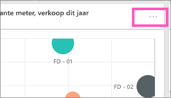

# Dashboardtegels in Power BI
Dashboards en dashboardtegels zijn functies van Power BI-service, niet van Power BI Desktop. Dashboardtegels kunnen niet worden gemaakt of vastgemaakt in Power BI - Mobiel, [maar kunnen daarin wel worden weergeven en gedeeld](consumer/mobile/mobile-tiles-in-the-mobile-apps.md). En in Power BI - Mobiel kunt u [afbeeldingen toevoegen aan uw dashboard met uw iPhone-app](consumer/mobile/mobile-iphone-app-get-started.md).

## Update van dashboardtegels

Een tegel is een momentopname van uw gegevens, vastgemaakt aan het dashboard. Een tegel kan worden gemaakt vanuit een rapport, gegevensset, dashboard of Q&A-vak, vanuit Excel en SQL Server Reporting Services (SSRS), enzovoort.  Deze schermopname laat verschillende tegels zien die zijn vastgemaakt aan een dashboard.

Tegels kunnen niet alleen worden vastgemaakt. Zelfstandige tegels kunnen rechtstreeks op het dashboard worden gemaakt met [Tegel toevoegen](service-dashboard-add-widget.md). Zelfstandige tegels bevatten: tekstvakken, afbeeldingen, video's, streaminggegevens en webinhoud.

Hulp nodig om de bouwstenen van Power BI te begrijpen?  Zie [Power BI - Basisconcepten](service-basic-concepts.md).

> [!NOTE]
> Als de oorspronkelijke visualisatie waarmee de tegel is gemaakt wijzigt, verandert de tegel niet.  Als u bijvoorbeeld een lijndiagram uit een rapport hebt vastgemaakt en u het lijndiagram vervolgens wijzigt in een staafdiagram, blijft de dashboardtegel een lijndiagram weergeven. De gegevens worden vernieuwd, maar het visualisatietype niet.
> 
> 

## Maak een tegel vast uit...
Er zijn veel verschillende manieren om een tegel toe te voegen (vastmaken) aan een dashboard. Tegels kunnen worden vastgemaakt uit:

* [Power BI Q&A](service-dashboard-pin-tile-from-q-and-a.md)
* [Een rapport](service-dashboard-pin-tile-from-report.md)
* [Een ander dashboard](service-pin-tile-to-another-dashboard.md)
* [Excel-werkmap in OneDrive voor Bedrijven](service-dashboard-pin-tile-from-excel.md)
* [Power BI Publisher voor Excel](publisher-for-excel.md)
* [Snelle inzichten](service-insights.md)
* [SSRS](https://msdn.microsoft.com/library/mt604784.aspx)

Zelfstandige tegels voor afbeeldingen, tekstvakken, video's, streaminggegevens en webinhoud kunnen rechtstreeks op het dashboard worden gemaakt met [Tegel toevoegen](service-dashboard-add-widget.md).

  

## Interactie met tegels op een dashboard
### Een tegel verplaatsen en het formaat ervan wijzigen
Pak een tegel en [beweeg deze over het dashboard](service-dashboard-edit-tile.md). Wijs de formaatgreep  aan en selecteer deze om het formaat van de tegel te wijzigen.

### Beweeg de muisaanwijzer over een tegel om het uiterlijk en gedrag ervan te wijzigen
1. Beweeg de muisaanwijzer over de tegel om de weglatingstekens weer te geven.
   
    
2. Selecteer de weglatingstekens om het actiemenu van de tegel te openen.
   
    
   
    Hier kunt u het volgende doen:
   
   * [Het rapport openen waarmee deze tegel is gemaakt ](service-reports.md)   
   
   * [Het werkblad openen waarmee deze tegel is gemaakt ](service-reports.md)   
     
    * [Weergave in de focusmodus ](service-focus-mode.md)   
     * [De in de tegel gebruikte gegevens exporteren](power-bi-visualization-export-data.md) 
     * [Titel en subtitel bewerken, een hyperlink toevoegen](service-dashboard-edit-tile.md) 
     * [Inzichten uitvoeren](service-insights.md) 
     * [De tegel aan een ander dashboard vastmaken](service-pin-tile-to-another-dashboard.md)
       
     * [De tegel verwijderen](service-dashboard-edit-tile.md)
     
3. Selecteer een leeg gebied op het canvas om het actiemenu te sluiten.

### Selecteer (klik op) een tegel
Als u een tegel selecteert, hangt wat er daarna gebeurt af van de manier waarop de tegel is aangemaakt en of deze een [aangepaste koppeling](service-dashboard-edit-tile.md) heeft. Als de tegel een aangepaste koppeling heeft, wordt de koppeling geopend als u de tegel selecteert. Anders gaat u door het selecteren van de tegel naar het rapport, het Excel Online werkmap, het SSRS-rapport dat on-premises is of naar de Q&A-vraag die werd gebruikt om de tegel te maken.

> [!NOTE]
> Uitzondering hierop zijn videotegels die rechtstreeks op het dashboard zijn gemaakt met **Tegel toevoegen**. Als u een videotegel selecteert (die op deze manier is gemaakt), wordt de video direct op het dashboard afgespeeld.   
> 
> 

## Overwegingen en probleemoplossing
* Als het rapport waarmee de visualisatie is gemaakt, niet is opgeslagen, leidt het selecteren van de tegel niet tot een actie.
* Als de tegel is gemaakt vanuit een werkmap in Excel Online, en u hebt geen leesrechten voor deze werkmap, wordt door het selecteren van de tegel de werkmap niet in Excel Online geopend.
* Voor tegels die direct op het dashboard zijn gemaakt met behulp van **Tegel toevoegen**, wordt als een aangepaste hyperlink is ingesteld, de URL geopend wanneer u de titel, subtitel en/of tegel selecteert.  Het selecteren van een van deze tegels die direct op het dashboard zijn gemaakt voor een afbeelding, webcode of tekstvak, leidt anders standaard niet tot een actie.
* Als u geen machtiging hebt voor het rapport binnen SSRS en u een tegel selecteert die vanuit SSRS is gemaakt, wordt een pagina geproduceerd die aangeeft dat u geen toegang hebt (rsAccessDenied).
* Als u geen toegang hebt tot het netwerk waar de SSRS-server zich bevindt en u een tegel selecteert die is gemaakt op basis van SQL Server Reporting Services, een pagina geproduceerd die aangeeft dat de server niet kan worden gevonden (HTTP 404). Uw apparaat heeft netwerktoegang tot de rapportserver nodig om het rapport te kunnen weergeven.
* Als de oorspronkelijke visualisatie waarmee de tegel is gemaakt wijzigt, verandert de tegel niet.  Als u bijvoorbeeld een lijndiagram uit een rapport hebt vastgemaakt en u het lijndiagram vervolgens wijzigt in een staafdiagram, blijft de dashboardtegel een lijndiagram weergeven. De gegevens worden vernieuwd, maar het visualisatietype niet.

## Volgende stappen
[Kaart maken (tegel met grote cijfers) voor uw dashboard](visuals/power-bi-visualization-card.md)

[Dashboards in Power BI](service-dashboards.md)  

[Gegevens vernieuwen](refresh-data.md)

[Power BI - basisconcepten](service-basic-concepts.md)

[Een tegel exporteren naar PowerPoint](http://blogs.msdn.com/b/powerbidev/archive/2015/09/28/integrating-power-bi-tiles-into-office-documents.aspx)

[Items van Reporting Services vastmaken aan Power BI-dashboards](https://msdn.microsoft.com/library/mt604784.aspx)

Nog vragen? [Misschien dat de Power BI-community het antwoord weet](http://community.powerbi.com/)

