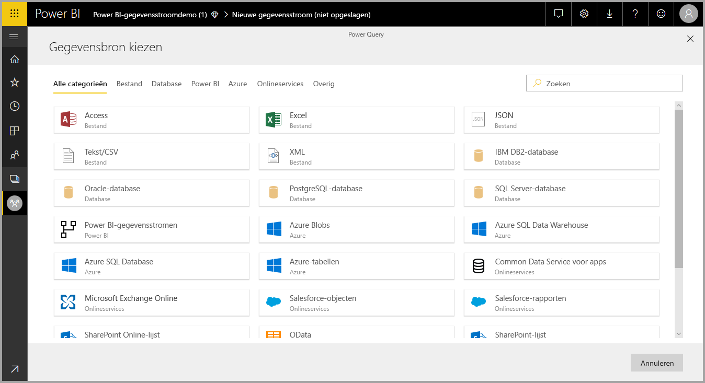
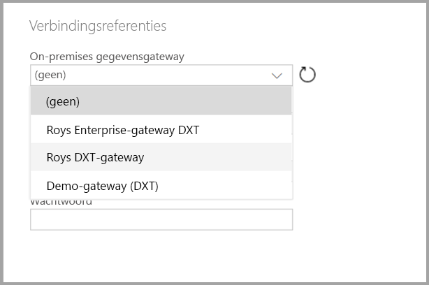

# Gegevensstromen gebruiken met on-premises gegevensbronnen (preview)

Met **gegevensstromen** kunt u een verzameling gegevens uit verschillende bronnen maken, de gegevens opschonen, transformeren en in de Power BI-opslag laden. Als u een gegevensstroom maakt, kunt u on-premises gegevensbronnen gebruiken. In dit artikel wordt uitgelegd wat er nodig is bij het maken van gegevensstromen en hoe uw **bedrijfsgateway** moet worden geconfigureerd om deze verbindingen in te schakelen.

> [!NOTE]
> De functionaliteit met betrekking tot gegevensstromen is in de preview-fase en is dus onderhevig aan wijzigingen en updates voordat deze algemeen beschikbaar wordt.
 
## Een bedrijfsgateway configureren voor gebruik met gegevensstromen

Als u een on-premises gegevensbron in een gegevensstroom wilt gebruiken, moet de gebruiker die de gegevensstroom maakt een **bedrijfsgateway** hebben geïnstalleerd en geconfigureerd. De gebruiker die de gegevensstroom maakt, moet ook de beheerder van de bedrijfsgateway zijn om die gateway voor een gegevensstroom te kunnen gebruiken.

> [!NOTE]
> Gegevensstromen worden alleen met behulp van bedrijfsgateways ondersteund.

## Een on-premises gegevensbron gebruiken in een gegevensstroom

Als u een gegevensstroom maakt, selecteert u een on-premises gegevensbron in de lijst met gegevensbronnen, zoals weergegeven in de volgende afbeelding.

Als u de selectie hebt gemaakt, wordt u gevraagd de verbindingsgegevens op te geven voor de bedrijfsgateway die wordt gebruikt om toegang te krijgen tot de on-premises gegevens. U dient de gateway zelf te selecteren en de referenties voor de geselecteerde gateway op te geven. Alleen gateways waarvan de gebruiker een beheerder is, worden in de vervolgkeuzelijst weergegeven.

## De gateway bewaken

U kunt de bedrijfsgateway voor een gegevensstroom op dezelfde manier bewaken als een gateway voor een gegevensset.

In het scherm met de instellingen voor de gegevensstroom in Power BI, kunt u de status van de gateway van een gegevensstroom bewaken en een gateway aan de gegevensstroom toewijzen, zoals weergegeven in de volgende afbeelding.

## Gateway wijzigen

U kunt de bedrijfsgateway die voor een bepaalde gegevensstroom is gebruikt, op twee manieren wijzigen:

1. **Met het bewerkingsprogramma**: u kunt de gateway die aan al uw query's is toegewezen, wijzigen met het bewerkingsprogramma voor gegevensstromen.

    > [!NOTE]
    > De gegevensstroom probeert de vereiste gegevensbronnen met behulp van de nieuwe gateway te zoeken of te maken. Als dat niet lukt, kunt u de gateway pas wijzigen als alle benodigde gegevensstromen vanuit de geselecteerde gateway beschikbaar zijn.

2. **Vanuit het instellingenscherm**: u kunt de toegewezen gateway wijzigen via het instellingenscherm voor de gegevensstroom in de Power BI-service.

Zie [On-premises gegevensgateway](service-gateway-onprem.md) voor meer informatie over bedrijfsgateways.

## Overwegingen en beperkingen

Er gelden een aantal beperkingen met betrekking tot het gebruik van bedrijfsgateways en gegevensstromen:

* Elke gegevensstroom mag slechts gebruikmaken van één gateway. Alle query's moeten dus worden geconfigureerd met behulp van dezelfde gateway.
* Een wijziging van de gateway is van invloed op de hele gegevensstroom.
* Als u meerdere gateways nodig hebt, kunt u het beste meerdere gegevensstromen maken (één voor elke gateway) en de gegevens integreren met een rekenprogramma of een programma voor entiteitsverwijzing.
* Gegevensstromen worden alleen met behulp van bedrijfsgateways ondersteund. Persoonlijke gateways kunnen niet in de vervolgkeuzelijsten en instellingsschermen worden geselecteerd.

## Volgende stappen

Dit artikel biedt informatie over het gebruik van on-premises gegevensbronnen voor gegevensstromen en hoe u gateways kunt gebruiken en configureren voor toegang tot die gegevens. De volgende artikelen kunnen hierbij nuttig zijn

* [Self-service data prep with dataflows](service-dataflows-overview.md) (Selfservice voor gegevensvoorbereiding met gegevensstromen)
* [Gegevensstromen maken en gebruiken in Power BI](service-dataflows-create-use.md)
* [Berekende entiteiten gebruiken in Power BI Premium (preview)](service-dataflows-computed-entities-premium.md)
* [Resources voor ontwikkelaars voor Power BI-gegevensstromen (preview)](service-dataflows-developer-resources.md)

U kunt de volgende artikelen lezen voor meer informatie over Power Query en geplande vernieuwing:
* [Queryoverzicht in Power BI Desktop](desktop-query-overview.md)
* [Geplande vernieuwing configureren](refresh-scheduled-refresh.md)

U kunt het overzichtsartikel lezen voor meer informatie over Common Data Model:
* [Overzicht van Common Data Model](https://docs.microsoft.com/powerapps/common-data-model/overview)

