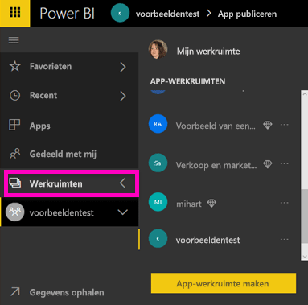
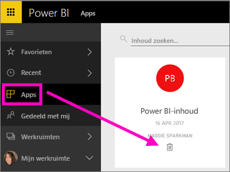

# Vrijwel alles verwijderen in de Power BI-service
In dit artikel leert u hoe u een dashboard, rapport, rapportpagina, werkmap, gegevensset, app en werkruimte verwijdert in de Power BI-service.

## Een dashboard verwijderen
Dashboards kunnen worden verwijderd. Als u het dashboard verwijdert, worden de onderliggende gegevensset of rapporten die zijn gekoppeld aan dit dashboard niet verwijderd.

* Als u de eigenaar van het dashboard bent, kunt u het verwijderen. Als u het dashboard hebt gedeeld met collega's, wordt het dashboard verwijderd uit hun Power BI-werkruimte als u het uit uw eigen Power BI-werkruimten verwijdert.
* Als er een dashboard met u is gedeeld en u het niet meer wilt zien, kunt u het verwijderen.  Als u een dashboard verwijdert, wordt het niet verwijderd uit de Power BI-werkruimte van een ander.
* Als een dashboard deel van uitmaakt een [inhoudspakket van een organisatie](service-organizational-content-pack-disconnect.md), is de enige manier om het te verwijderen het verwijderen van de bijbehorende dataset.

### Ga als volgt te werk om een dashboard te verwijderen
1. Selecteer in uw werkruimte het tabblad **Dashboards**.
2. Zoek het dashboard dat u wilt verwijderen en selecteer het verwijderpictogram .

    

## Een rapport verwijderen
Geen zorgen, als u een rapport verwijdert, wordt de gegevensset waarop het rapport is gebaseerd niet verwijderd.  En ook eventuele visualisaties die u uit het rapport hebt vastgemaakt zijn veilig. Ze blijven op het dashboard totdat u ze afzonderlijk verwijdert.

### Ga als volgt te werk om een rapport te verwijderen
1. Selecteer in uw werkruimte het tabblad **Rapporten**.
2. Zoek het rapport dat u wilt verwijderen en selecteer het verwijderpictogram   .   

    
3. Bevestig de verwijdering.

   

   > [!NOTE]
   > Als het rapport onderdeel van is een [inhoudspakket](service-organizational-content-pack-introduction.md), kunt u het niet verwijderen met behulp van deze methode.  Zie [De verbinding met een organisatie-inhoudspakket verwijderen](service-organizational-content-pack-disconnect.md).
   >
   >

## Een werkmap verwijderen
Werkmappen kunnen worden verwijderd. Met het verwijderen van een werkmap verwijdert u echter ook alle rapporten en dashboardtegels die gegevens uit deze werkmap bevatten.

Als de werkmap is opgeslagen in OneDrive voor Bedrijven, wordt deze niet verwijderd uit OneDrive als u hem verwijdert uit Power BI.

### Ga als volgt te werk om een werkmap te verwijderen
1. Selecteer in uw werkruimte het tabblad **Werkmappen**.
2. Zoek de werkmap die u wilt verwijderen en selecteer het verwijderpictogram  .

    
3. Bevestig de verwijdering.

   

## Een gegevensset verwijderen
Gegevenssets kunnen worden verwijderd. Met het verwijderen van een gegevensset verwijdert u echter ook alle rapporten en dashboardtegels die gegevens uit die gegevensset bevatten.

Als een gegevensset deel uitmaakt van een of meer [organisatie-inhoudspakketten](service-organizational-content-pack-disconnect.md), kunt u deze alleen verwijderen als u de inhoudspakketten waarin deze wordt gebruikt verwijdert, wacht totdat de verwijdering is verwerkt, en daarna opnieuw probeert om de gegevensset te verwijderen.

### Ga als volgt te werk om een gegevensset te verwijderen
1. Selecteer in uw werkruimte het tabblad **Gegevenssets**.
2. Zoek de gegevensset die u wilt verwijderen en selecteer het beletselteken (...).  

    
3. Selecteer in de vervolgkeuzelijst **Verwijderen**.

   
4. Bevestig de verwijdering.

   

## Een app-werkruimte verwijderen
> [!WARNING]
> Wanneer u een app-werkruimte maakt, maakt u een Office 365-groep. Wanneer u een app-werkruimte verwijdert, verwijdert u ook de betreffende Office 365-groep. Dit betekent dat de groep ook wordt verwijderd uit andere O365-producten, zoals SharePoint en Microsoft Teams.
>
>

Als u de auteur van de app-werkruimte bent, kunt u deze verwijderen. Wanneer u deze verwijdert, wordt de bijbehorende app ook verwijderd voor alle groepsleden en verwijderd uit uw AppSource als u de app had gepubliceerd naar uw hele organisatie. Het verwijderen van een app-werkruimte is iets anders dan het verlaten van een app-werkruimte.

### Als u een beheerder bent, kunt u een app-werkruimte als volgt verwijderen
1. Selecteer in de linker navigatie **Werkruimten**

    
2. Selecteer het beletselteken (...) aan de rechterkant van de werkruimte die u wilt verwijderen en kies **Werkruimte bewerken**.

   
3. In het venster **Werkruimte bewerken** selecteert u **Werkruimte verwijderen** > **verwijderen**.

    

### Ga als volgt te werk om een app-werkruimte uit uw lijst te verwijderen
Als u niet langer lid wilt zijn van een app-werkruimte, kunt u deze ***verlaten***. Deze wordt vervolgens verwijderd uit de lijst. Als u een werkruimte verlaat, blijft deze bestaan voor alle andere leden van de werkruimte.  

> [!IMPORTANT]
> Als u de enige beheerder van de app-werkruimte bent, kunt u deze niet verlaten.
>
>

1. Start in de werkruimte die u wilt verwijderen.
2. Selecteer in de rechterbovenhoek het beletselteken (...) en kies **Werkruimte verlaten** > **Verlaten**.

      

   > [!NOTE]
   > De opties die worden weergegeven in de vervolgkeuzelijst zijn afhankelijk van uw rol in de app-werkruimte: beheerder of lid.
   >
   >

## Een app verwijderen of wissen
Apps kunnen eenvoudig worden verwijderd op de pagina met uw app-lijst. Maar alleen de beheerder van een app kan een app permanent wissen.

### Een app verwijderen van de pagina met uw app-lijst
Als u een app verwijdert van de pagina met uw app-lijst, wordt de app niet verwijderd voor andere leden.

1. Selecteer in de linkernavigatie **Apps** om de pagina met de app-lijst te openen.
2. Houd de muis boven de app die u wilt verwijderen en selecteer het verwijderpictogram .

   

   Als u per ongeluk een app verwijdert, hebt u verschillende opties om deze terug te zetten.  U kunt de maker van de app vragen om de app opnieuw te sturen, het oorspronkelijke e-mailbericht met de koppeling naar de app zoeken, uw [meldingencentrum](service-notification-center.md) controleren om te zien of er nog meldingen voor die app worden weergegeven, of de [AppSource](service-install-use-apps.md) van uw organisatie controleren.

## Aandachtspunten en probleemoplossing
In dit artikel hebben we beschreven hoe u de belangrijkste bouwstenen van de Power BI-service verwijdert. Maar er zijn meer dingen die u in Power BI kunt verwijderen.  

* [Uw aanbevolen dashboard verwijderen](service-dashboard-featured.md#change-the-featured-dashboard)
* [Een dashboard verwijderen (uit uw favorieten)](service-dashboard-favorite.md)
* [Een rapportpagina verwijderen](service-delete.md)
* [Een dashboardtegel verwijderen](service-dashboard-edit-tile.md)
* [Een visualisatie van een rapport verwijderen](service-delete.md)

Hebt u nog vragen? [Misschien dat de Power BI-community het antwoord weet](http://community.powerbi.com/)
