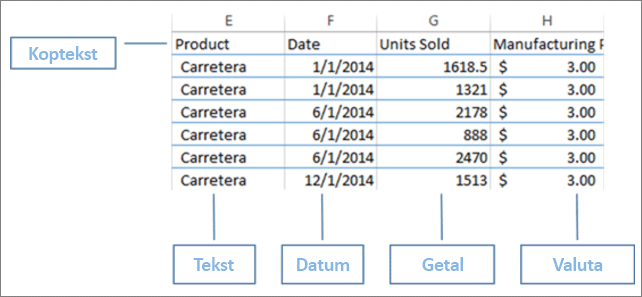
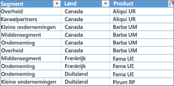
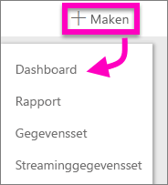
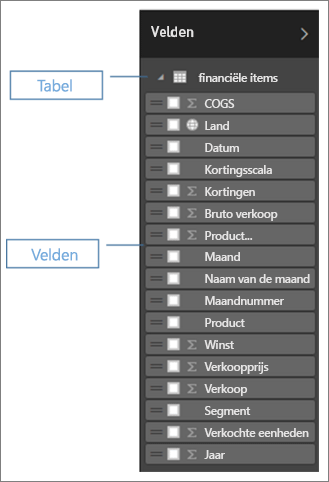
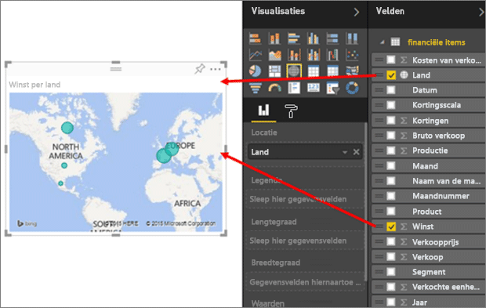
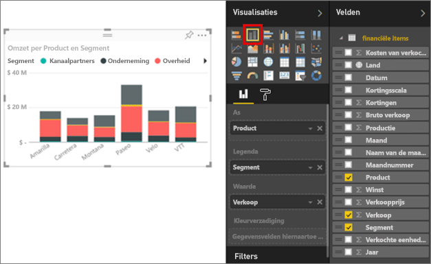
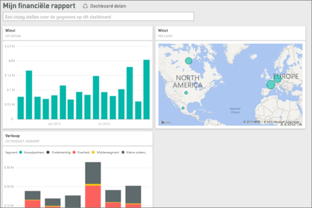
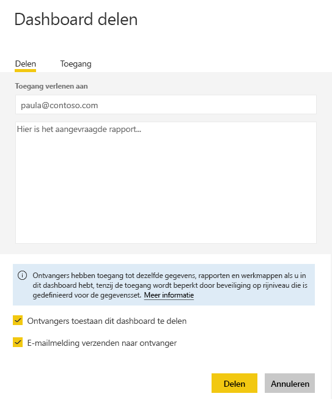

# In een handomdraai aantrekkelijke rapporten van Excel-werkmappen maken
Uw manager wil een rapport zien met recente verkoopcijfers gecombineerd met uw laatste campagne-indrukken aan het einde van de dag. Maar de meest recente gegevens bevinden zich op verschillende systemen van derden en in bestanden op uw laptop. In het verleden duurde het uren om visuele elementen te maken en een rapport te formatteren. U begint zich zorgen te maken.

Nergens voor nodig. Met Power BI maakt u in een mum van tijd een geweldig rapport.

In dit voorbeeld uploaden we een Excel-bestand van een lokaal systeem, maken we een nieuw rapport en delen het met collega's, alles vanuit Power BI.

## Uw gegevens voorbereiden
We nemen een eenvoudig Excel-bestand als voorbeeld. Voordat u uw Excel-bestand in Power BI kunt laden, moet u uw gegevens indelen in een platte tabel. Dit betekent dat elke kolom hetzelfde gegevenstype bevat, bijvoorbeeld tekst, datum, aantal of valuta. Er moet een veldnamenrij zijn, maar geen kolom of rij waarin totalen worden weergegeven.

Maak vervolgens uw gegevens op als een tabel. Selecteer **Opmaken als tabel** in de groep Stijlen op het tabblad Start in Excel. Selecteer een tabelstijl die u op het werkblad wilt toepassen. Uw Excel-werkblad is nu gereed om te laden in Power BI.

## Uw Excel-bestand naar Power BI uploaden
Power BI maakt verbinding met veel gegevensbronnen, inclusief Excel-bestanden die op uw computer aanwezig zijn. Meld u aan bij Power BI om aan de slag te gaan. Als u zich nog niet hebt aangemeld, [kunt u dit gratis doen](https://powerbi.com).

U wilt een nieuw dashboard maken. Open **Mijn werkruimte** en selecteer het pictogram **+ Maken**.

Selecteer **Dashboard**, voer een naam in en selecteer **Maken**. Het nieuwe dashboard wordt zonder gegevens weergegeven.

Selecteer links onderin het navigatiedeelvenster **Gegevens ophalen**. Selecteer **Ophalen** onder Importeren of Verbinding maken met gegevens in het vak Bestanden op de pagina Gegevens ophalen.

Selecteer op de pagina Bestanden **Lokaal bestand**. Navigeer naar het Excel-werkmapbestand op uw computer en selecteer het om het in Power BI te laden. Selecteer **Importeren**.

> **Opmerking**: als u de rest van deze zelfstudie wilt volgen, gebruikt u de [werkmap Financieel voorbeeld](sample-financial-download.md).
> 
> 

## Uw rapport maken
Nadat Power BI uw Excel-bestand heeft geïmporteerd, kunt u beginnen met het bouwen van uw rapport. Wanneer het bericht **Uw gegevensset is gereed** verschijnt, selecteert u **Gegevensset weergeven**.  Power BI opent in de bewerkweergave en geeft het rapportcanvas weer. Aan de rechterkant staan de deelvensters Visualisaties, Filters en Velden.

U ziet dat de tabelgegevens van uw Excel-werkmap in het deelvenster Velden worden weergegeven. Onder de naam van de tabel geeft Power BI de kolomkoppen weer als afzonderlijke velden.

U kunt nu beginnen met het maken van visualisaties. Uw manager wil de winst over een bepaalde periode bekijken. Sleep **Winst** naar het rapportcanvas in het deelvenster Velden. Power BI geeft standaard een staafdiagram weer. Sleep vervolgens **Datum** naar het rapportcanvas. Power BI werkt het staafdiagram bij en geeft de winst op datum weer.

> **TIP**: als uw grafiek er niet uitziet zoals verwacht, controleert u de aggregaties. Klik bijvoorbeeld in de bron **Waarde** met de rechtermuisknop op het veld dat u zojuist hebt toegevoegd en controleer of de gegevens worden samengevoegd op de manier waarop u wilt.  In dit voorbeeld gebruiken we **Som**.
> 
> 

Uw manager wil weten welke landen het meest winstgevend zijn. Maak indruk op haar met een kaartvisualisatie. Selecteer een leeg gebied op uw canvas en sleep vanuit het deelvenster Velden gewoon de velden **Land** en vervolgens **Winst**. Power BI maakt een kaartvisualisatie met bellen die de relatieve winst per locatie aangeven.

En hoe kan een visualisatie met verkoop per product en marktsegment worden weergegeven? Simpel. Selecteer de selectievakjes naast de velden Verkoop, Product en Segment in het deelvenster Velden. Power BI maakt direct een staafdiagram. Wijzig het type van de grafiek door een van de pictogrammen in het menu Visualisaties te kiezen. Wijzig het bijvoorbeeld naar een gestapeld staafdiagram.  Als u de grafiek wilt sorteren, selecteert u de beletseltekens (...) > **Sorteren op**.

Maak al uw visualisaties vast aan uw Dashboard. U kunt het delen met uw collega's.

## Uw dashboard delen
U wilt uw dashboard delen met uw manager Paula. U kunt uw dashboard en het bijbehorende rapport delen met een collega die een Power BI-account heeft. Ze kunnen met uw rapport werken, maar kunnen wijzigingen niet opslaan.

Als u uw rapport wilt delen, selecteert u **Delen** aan de bovenkant van het dashboard.

Power BI geeft de pagina Dashboard delen weer. Voer in het bovenste gedeelte de e-mailadressen van de ontvangers in. Voeg een bericht toe in het veld hieronder. Als u wilt toestaan dat ontvangers uw dashboard kunnen delen met anderen, selecteert u **Ontvangers toestaan uw dashboard te delen**. Selecteer **Delen**.

Volgende stappen

* [Aan de slag met Power BI Service](service-get-started.md)
* [Aan de slag met Power BI Desktop](desktop-getting-started.md)
* [Power BI - basisconcepten](service-basic-concepts.md)
* Hebt u nog vragen? [Misschien dat de Power BI-community het antwoord weet](http://community.powerbi.com/)

