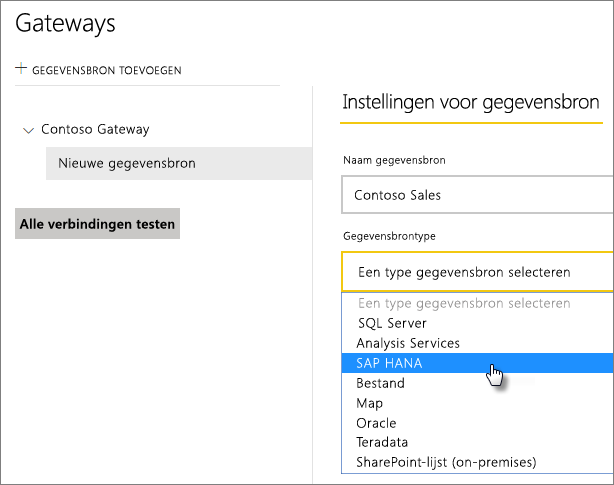
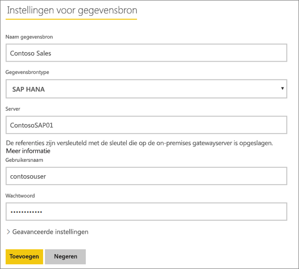

# SAP HANA-gegevensbron beheren
Nadat u de on-premises gegevensgateway hebt geïnstalleerd, moet u gegevensbronnen toevoegen die met de gateway kunnen worden gebruikt. In dit artikel wordt beschreven hoe u gateways en gegevensbronnen gebruikt. U kunt de SAP HANA-gegevensbron gebruiken voor geplande vernieuwing of voor DirectQuery.

## De gateway downloaden en installeren
U kunt de gateway downloaden via de Power BI-service. Selecteer **Downloads** > **Gegevensgateway** of ga naar de [pagina voor het downloaden van gateways](https://go.microsoft.com/fwlink/?LinkId=698861).

## Een gateway toevoegen
Als u een gateway wilt toevoegen, moet u deze gewoon [downloaden](https://go.microsoft.com/fwlink/?LinkId=698861) en installeren op een server in uw omgeving. Nadat u de gateway hebt geïnstalleerd, wordt deze weergegeven in de lijsten met gateways onder **Gateways beheren**.

> [!NOTE]
> **Gateways beheren** wordt alleen weergegeven als u beheerder van ten minste één gateway bent geworden. Dit kan doordat een andere beheerder u toevoegt of door zelf een gateway te installeren en configureren.
> 
> 

## Een gateway verwijderen
Als u een gateway verwijdert, worden ook alle gegevensbronnen voor die gateway verwijderd.  De dashboards en rapporten die afhankelijk zijn van deze gegevensbronnen, werken hierdoor ook niet meer.

1. Selecteer het tandwielpictogram  in de rechterbovenhoek > **Gateways beheren**.
2. Gateway > **Verwijderen**
   
   

## Een gegevensbron toevoegen
U kunt een gegevensbron toevoegen door een gateway te selecteren en op **Gegevensbron toevoegen** te klikken of door naar Gateway > **Gegevensbron toevoegen** te gaan.

U kunt dan in de lijst het **Gegevensbrontype** selecteren.

Vul vervolgens de gegevens in voor de gegevensbron, waaronder de **server**, de **gebruikersnaam** en de **database**.

> [!NOTE]
> Alle query's over de gegevensbron worden uitgevoerd met deze referenties. Meer informatie over hoe [referenties](service-gateway-onprem.md#credentials) worden opgeslagen vindt u in het hoofdartikel over on-premises gateways.
> 
> 

U kunt op **Toevoegen** klikken nadat u alles hebt ingevuld.  U kunt deze gegevensbron nu gebruiken voor geplande vernieuwing of DirectQuery met een on-premises SAP HANA-server. De tekst *Verbinding gemaakt* wordt weergegeven als deze bewerking is geslaagd.

### Geavanceerde instellingen
U kunt het privacyniveau voor de gegevensbron configureren. Hiermee bepaalt u hoe gegevens kunnen worden gecombineerd. Dit wordt alleen gebruikt voor geplande vernieuwing. Het geldt niet voor DirectQuery. [Meer informatie](https://support.office.com/article/Privacy-levels-Power-Query-CC3EDE4D-359E-4B28-BC72-9BEE7900B540)

## Een gegevensbron verwijderen
Als u een gegevensbron verwijdert, zullen de dashboards of rapporten die afhankelijk zijn van de gegevensbron niet meer werken.  

Ga naar Gegevensbron > **Verwijderen** om een gegevensbron te verwijderen.

## Beheerders beheren
Op het tabblad Beheerders voor de gateway kunt u gebruikers (of beveiligingsgroepen) toevoegen en verwijderen die de gateway kunnen beheren.

## Gebruikers beheren
Op het tabblad Gebruikers voor de gegevensbron kunt u gebruikers (of beveiligingsgroepen) toevoegen en verwijderen die deze gegevensbron kunnen gebruiken.

> [!NOTE]
> De lijst met gebruikers wordt uitsluitend geraadpleegd om te bepalen wie er rapporten mag publiceren. De rapporteigenaren kunnen dashboards of inhoudspakketten maken en deze delen met andere gebruikers.
> 
> 

## De gegevensbron gebruiken
Nadat u de gegevensbron hebt gemaakt, kan deze worden gebruikt met DirectQuery-verbindingen of via geplande vernieuwing.

> [!NOTE]
> De servernaam en databasenaam die worden gebruikt voor Power BI Desktop en de gegevensbron in de on-premises gegevensgateway moeten overeenkomen!
> 
> 

De koppeling tussen uw gegevensset en de gegevensbron in de gateway is gebaseerd op uw server- en databasenaam. Deze moeten overeenkomen. Als u bijvoorbeeld een IP-adres gebruikt als servernaam in Power BI Desktop, moet u dit IP-adres gebruiken voor de gegevensbron in de gatewayconfiguratie. Als u in Power BI Desktop *SERVER\EXEMPLAAR* gebruikt, moet u dat ook gebruiken in de gegevensbron die u voor de gateway configureert.

Dit geldt voor zowel DirectQuery als geplande vernieuwing.

### De gegevensbron gebruiken met DirectQuery-verbindingen
Zorg ervoor dat de servernaam en databasenaam voor Power BI Desktop en de geconfigureerde gegevensbron voor de gateway overeenkomen. Zorg er ook voor dat de gebruiker wordt vermeld op het tabblad **Gebruikers** van de gegevensbron om DirectQuery-gegevenssets te kunnen publiceren. De selectie voor DirectQuery vindt plaats in Power BI Desktop wanneer u voor het eerst gegevens importeert. [Meer informatie](desktop-use-directquery.md)

Als het goed is, werken uw rapporten nadat u de gegevens hebt gepubliceerd vanuit Power BI Desktop of via **Gegevens ophalen**. Nadat u de gegevensbron in de gateway hebt gemaakt, kan het enkele minuten duren voordat de verbinding kan worden gebruikt.

### De gegevensbron gebruiken met geplande vernieuwing
Als u wordt vermeld op het tabblad **Gebruikers** voor de gegevensbron die is geconfigureerd in de gateway en de server- en databasenaam overeenkomen, wordt de gateway als optie vermeld en kan deze worden gebruikt bij een geplande vernieuwing.

## Volgende stappen
[On-premises gegevensgateway](service-gateway-onprem.md)  
[On-premises data gateway in-depth](service-gateway-onprem-indepth.md) (On-premises gegevensgateway - uitgebreid)  
[Problemen met de on-premises gegevensgateway oplossen](service-gateway-onprem-tshoot.md)  
Nog vragen? [Misschien dat de Power BI-community het antwoord weet](http://community.powerbi.com/)

