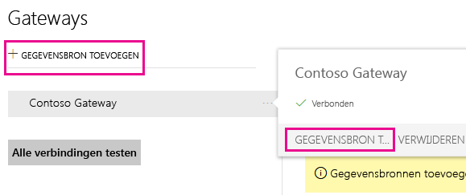
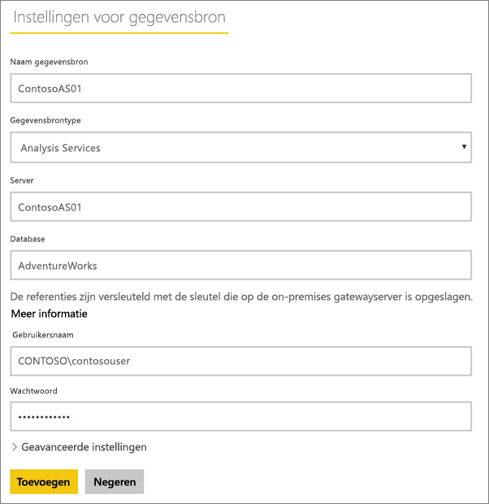
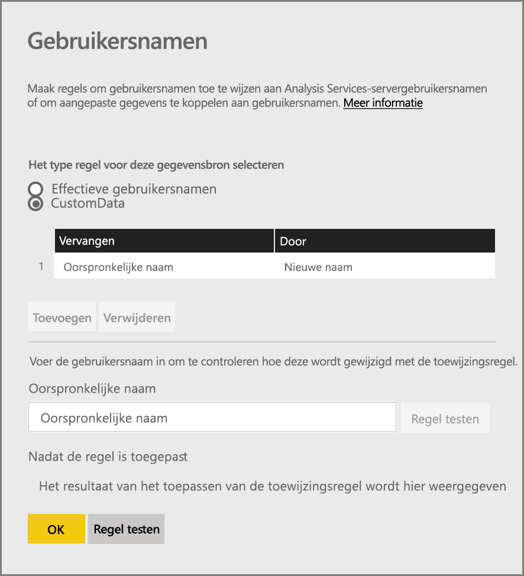
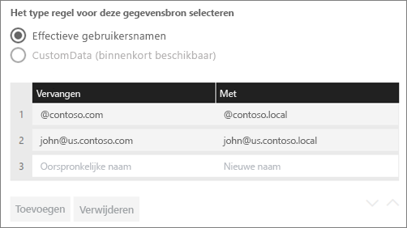
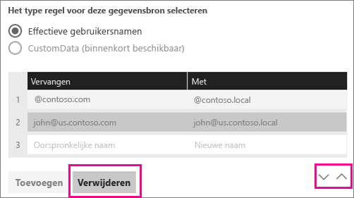
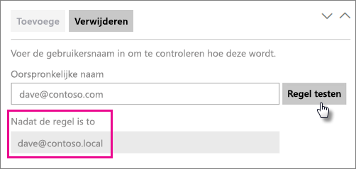
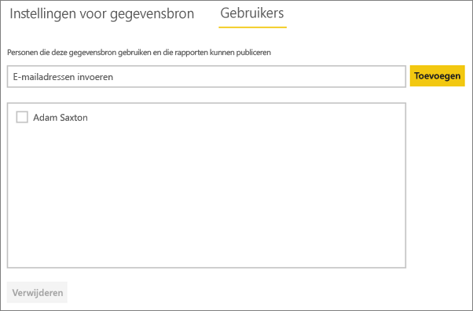

# Uw gegevensbron beheren - Analysis Services
Nadat u de on-premises gegevensgateway hebt geïnstalleerd, moet u gegevensbronnen toevoegen die met de gateway kunnen worden gebruikt. In dit artikel wordt beschreven hoe u gateways en gegevensbronnen gebruikt. U kunt de Analysis Services-gegevensbron gebruiken voor zowel geplande vernieuwing als voor liveverbindingen.

<iframe width="560" height="315" src="https://www.youtube.com/embed/ownIGbcRAAU" frameborder="0" allowfullscreen></iframe>

## De gateway downloaden en installeren
U kunt de gateway downloaden via de Power BI-service. Selecteer **Downloads** > **Gegegevensgateway** of bezoek de [Gatewaydownloadpagina](https://go.microsoft.com/fwlink/?LinkId=698861).

## Beperkingen van liveverbindingen van Analysis Services
U kunt een liveverbinding gebruiken voor tabelvormige of multidimensionale exemplaren.

| **Server-versie** | **Vereiste SKU** |
| --- | --- |
| 2012 SP1 CU4 of hoger |Business Intelligence en Enterprise-SKU |
| 2014 |Business Intelligence en Enterprise-SKU |
| 2016 |Standaard-SKU of hoger |

* Opmaak op celniveau en vertaalfuncties worden niet ondersteund.
* Acties en benoemde sets zijn niet beschikbaar in Power BI, maar u kunt wel verbinding maken met multidimensionale kubussen die ook acties of benoemde sets bevatten. Ook kunt u visuele elementen en rapporten maken.

## Een gateway toevoegen
Als u een gateway wilt toevoegen, moet u deze gewoon [downloaden](https://go.microsoft.com/fwlink/?LinkId=698861) en installeren op een server in uw omgeving. Nadat u de gateway hebt geïnstalleerd, wordt deze weergegeven in de lijsten met gateways onder **Gateways beheren**.

> [!NOTE]
> **Gateways beheren** wordt alleen weergegeven als u beheerder van ten minste één gateway bent geworden. Dit kan doordat een andere beheerder u toevoegt of door zelf een gateway te installeren en configureren.
> 
> 

## Een gateway verwijderen
Als u een gateway verwijdert, worden ook alle gegevensbronnen voor die gateway verwijderd.  De dashboards en rapporten die afhankelijk zijn van deze gegevensbronnen, werken hierdoor ook niet meer.

1. Selecteer het tandwielpictogram  in de rechterbovenhoek > **Gateways beheren**.
2. Gateway > **Verwijderen**
   
   

## Een gegevensbron toevoegen
U kunt een gegevensbron toevoegen door een gateway te selecteren en op **Gegevensbron toevoegen** te klikken of door naar Gateway > **Gegevensbron toevoegen** te gaan.

U kunt dan in de lijst het **Gegevensbrontype** selecteren. Selecteer Analysis Services als u verbinding maakt met een multidimensionale of tabellaire server.

Vul vervolgens de gegevens in voor de gegevensbron, waaronder de **Server** en de **Database**.  

De **Gebruikersnaam** en **Wachtwoord** die u invoert worden door de gateway gebruikt om verbinding te maken met het Analysis Services-exemplaar.

> [!NOTE]
> Het Windows-account dat u opgeeft moet serverbeheerdermachtigingen hebben voor het exemplaar waarmee u verbinding maakt. Als het wachtwoord van dit account zo is ingesteld dat dit verloopt, kunnen gebruikers een verbindingsfout krijgen als het wachtwoord voor de gegevensbron niet op tijd wordt bijgewerkt. Meer informatie over hoe [referenties](service-gateway-onprem.md#credentials) worden opgeslagen vindt u in het hoofdartikel over on-premises gateways.
> 
> 

U kunt op **Toevoegen** klikken nadat u alles hebt ingevuld.  U kunt deze gegevensbron nu gebruiken voor geplande vernieuwing of liveverbindingen op basis van een Analysis Services-exemplaar dat on-premises wordt uitgevoerd.  Er wordt *Verbinding gemaakt* weergegeven als deze bewerking is geslaagd.

### Geavanceerde instellingen
U kunt het privacyniveau voor de gegevensbron configureren. Hiermee bepaalt u hoe gegevens kunnen worden gecombineerd. Deze instelling wordt alleen gebruikt voor geplande vernieuwing. Deze is niet van toepassing voor liveverbindingen. [Meer informatie](https://support.office.com/article/Privacy-levels-Power-Query-CC3EDE4D-359E-4B28-BC72-9BEE7900B540)

## Gebruikersnamen en Analysis Services
Telkens wanneer een gebruiker interactie heeft met een rapport dat is verbonden met Analysis Services, wordt de effectieve gebruikersnaam doorgegeven aan de gateway en vervolgens aan de on-premises Analysis Services-server. Het e-mailadres waarmee u zich bij Power BI aanmeldt, is de informatie die als de effectieve gebruikersnaam wordt doorgegeven aan Analysis Services. Deze informatie wordt doorgegeven via de verbindingseigenschap [EffectiveUserName](https://msdn.microsoft.com/library/dn140245.aspx#bkmk_auth). Dit e-mailadres moet overeenkomen met een UPN die is gedefinieerd in het lokale Active Directory-domein. De UPN is een eigenschap van een Active Directory-account. Dat Windows-account moet aanwezig zijn in een Analysis Services-rol. De aanmelding kan niet tot stand worden gebracht als er geen overeenkomst wordt gevonden in Active Directory. [Meer informatie](https://msdn.microsoft.com/library/ms677605.aspx)

U kunt ook uw Power BI-aanmeldingsnaam toewijzen aan een UPN in een lokale directory. [Meer informatie](service-gateway-enterprise-manage-ssas.md#map-user-names)

<iframe width="560" height="315" src="https://www.youtube.com/embed/Qb5EEjkHoLg" frameborder="0" allowfullscreen></iframe>

### Hoe weet ik wat mijn UPN is?
U weet mogelijk niet wat uw UPN is en u bent mogelijk geen domeinbeheerder. Gebruik de volgende opdracht vanaf uw computer om de UPN voor uw account op te vragen.

    whoami /upn

Het resultaat ziet eruit als een e-mailadres, maar dit is de UPN voor uw domeinaccount. Als u een Analysis Services-gegevensbron gebruikt voor liveverbindingen en de UPN niet overeenkomt met het e-mailadres waarbij u zich aanmeldt bij Power BI, kan het nuttig zijn te kijken naar de stappen voor [Gebruikersnamen toewijzen](#map-user-names).

## Gebruikersnamen toewijzen
<iframe width="560" height="315" src="https://www.youtube.com/embed/eATPS-c7YRU" frameborder="0" allowfullscreen></iframe>

U kunt op twee verschillende manieren gebruikersnamen toewijzen voor Analysis Services:

1. Handmatig opnieuw toewijzen van gebruikers 
2. On-premises Active Directory-eigenschappen opzoeken om AAD UPN's toe te wijzen aan Active Directory-gebruikers (Toewijzing op basis van AD-zoekactie)

Hoewel het mogelijk is om gebruikers opnieuw toe te wijzen volgens de tweede methode, is dit tijdrovend en moeilijk te onderhouden. Het is met name onpraktisch wanneer het gebruik van jokertekens niet voldoet, zoals wanneer domeinnamen verschillen tussen AAD en uw on-premises AD of wanneer de namen van gebruikersaccounts verschillen tussen AAD en AD. Daarom wordt handmatige toewijzing volgens de tweede methode niet aanbevolen.

We beschrijven deze twee benaderingen, op volgorde, in de volgende twee secties

### Handmatig opnieuw toewijzen van gebruikersnamen
U kunt voor Analysis Services-gegevensbronnen aangepaste regels configureren voor de User Principal Name (UPN). Dit maakt het eenvoudiger als uw aanmeldingsnamen voor de Power BI-service niet overeenkomen met de UPN's in uw lokale directory. Als u zich bijvoorbeeld aanmeldt bij Power BI met john@contoso.com, maar uw lokale directory-UPN john@contoso.local is, kunt u een toewijzingsregel configureren waarmee john@contoso.local wordt doorgegeven aan Analysis Services.

Volg de volgende stappen om het venster voor UPN-toewijzing te openen.

1. Navigeer naar het **tandwielpictogram** en selecteer **Gateways beheren**.
2. Vouw de gateway uit die de Analysis Services-gegevensbron bevat. Als u de Analysis Services-gegevensbron nog niet hebt gemaakt, kunt u dat ook eerst doen.
3. Selecteer de gegevensbron en selecteer vervolgens het tabblad **Gebruikers**.
4. Selecteer **Gebruikersnamen toewijzen**.
   
    

U krijgt dan opties te zien om regels toe te voegen en voor een bepaalde gebruiker te testen.

> [!NOTE]
> Het is mogelijk om per ongeluk een andere gebruiker te wijzigen dan u wilde. Als uw **Vervangen (oorspronkelijke waarde)** *@contoso.com* is en uw **Door (nieuwe naam)** *@contoso.local* is, worden alle gebruikers met een aanmeldingsnaam die *@contoso.com* bevat vervangen door *@contoso.local*. Ook als uw **Vervangen (oorspronkelijke naam)** *dave@contoso.com* is en uw **Door (nieuwe naam)** *dave@contoso.local* is, wordt een gebruiker met de aanmeldnaam v-dave@contoso.com verzonden als v-dave*@contoso.local*.
> 
> 

### Toewijzing op basis van AD-zoekactie
Volg de stappen in deze sectie om AAD UPN's opnieuw toe te wijzen aan Active Directory-gebruikers met behulp van een zoekactie op basis van on-premises AD-eigenschappen. Laten we eerst doornemen hoe dit werkt.

In de **Power BI-service** gebeurt het volgende:

- Voor elke query door een Power BI AAD-gebruiker naar een on-premises SSAS-server wordt een UPN-tekenreeks doorgegeven, zoals: firstName.lastName@contoso.com

> [!NOTE]
> Handmatige UPN-gebruikerstoewijzingen die zijn gedefinieerd in de Power BI-configuratie van de gegevensbron worden nog steeds toegepast *voordat* de gebruikersnaam wordt verzonden naar de on-premises gegevensgateway.
> 
> 

Voor een on-premises gegevensgateway met configureerbare aangepaste gebruikerstoewijzing volgt u de volgende stappen:

1. Open Active Directory om te zoeken (automatisch of configureerbaar)
2. Zoek naar het kenmerk van de AD-persoon (zoals *E-mail*) op basis van een binnenkomende UPN-tekenreeks ('firstName.lastName@contoso.com') van de **Power BI-service**.
3. Als de AD-zoekopdracht mislukt, wordt geprobeerd de UPN door te geven aan SSAS als EffectiveUser.
4. Als de AD-zoekopdracht slaagt, wordt de *UserPrincipalName* van die AD-persoon opgehaald. 
5. Deze geeft het e-mailadres van de *UserPrincipalName* dan door aan SSAS als *EffectiveUser*, zoals: *Alias@corp.on-prem.contoso*.

Uw gateway configureren voor het uitvoeren van de AD-zoekopdracht:

1. Download en installeer de nieuwste versie van de gateway.
2. In de gateway dient u de **on-premises gegevensgatewayservice** in te stellen zodat deze wordt uitgevoerd met een domeinaccount (in plaats van een lokaal serviceaccount, anders wordt de AD-zoekopdracht tijdens runtime niet goed uitgevoerd). U moet de gatewayservice opnieuw starten om de wijziging door te voeren.  Ga naar de gateway-app op uw computer (zoek 'on-premises gegevensgateway'). Vervolgens gaat u naar **Service-instellingen > Serviceaccount wijzigen**. Zorg ervoor dat u de herstelsleutel voor deze gateway hebt, omdat u deze nodig hebt om de gateway te herstellen op dezelfde computer, tenzij u een nieuwe gateway wilt maken. 
3. Navigeer naar de installatiemap van de gateway, *C:\Program Files\On-premises data gateway* met een beheerdersaccount, om te zorgen dat u schrijfrechten hebt, en bewerk het volgende bestand:
   
       Microsoft.PowerBI.DataMovement.Pipeline.GatewayCore.dll.config 
4. Bewerk de volgende twee configuratiewaarden voor uw AD-gebruikers volgens de kenmerkconfiguraties van *uw* Active Directory. De onderstaande configuratiewaarden zijn slechts voorbeelden: u moet deze invoeren op basis van uw Active Directory-configuratie. 
   
   
5. Start de **on-premises gegevensgateway**-service opnieuw om de configuratiewijzigingen door te voeren.

### Werken met toewijzingsregels
Om een toewijzingsregel te maken, voert u een waarde in voor **Oorspronkelijke naam** en **Nieuwe naam** en selecteert u vervolgens **Toevoegen**.

| Veld | Beschrijving |
| --- | --- |
| Vervangen (Oorspronkelijke naam) |Het e-mailadres waarmee u zich aanmeldt bij Power BI. |
| Met (Nieuwe naam) |De waarde waarmee u de oorspronkelijke naam wilt vervangen. Het resultaat van deze vervanging wordt doorgegeven aan de eigenschap *EffectiveUserName* voor de Analysis Services-verbinding. |

Wanneer u een item in de lijst selecteert, kunt u ervoor kiezen deze opnieuw te rangschikken met behulp van de **pictogrammen van de dubbele punthaken** of de vermelding te **verwijderen**.

### Jokertekens (\*) gebruiken
U kunt een jokerteken gebruiken in uw tekenreeks voor **Vervangen (Oorspronkelijke naam)**. Deze kan alleen los worden gebruikt, niet in combinatie met een ander deel van een tekenreeks. Hierdoor kunt u voor alle gebruikers een enkele waarde doorgeven aan de gegevensbron. Dit is handig als u wilt dat alle gebruikers in uw organisatie dezelfde gebruiker gebruiken in uw lokale omgeving.

### Een toewijzingsregel testen
U kunt controleren door wat een oorspronkelijke naam wordt vervangen door een waarde in te voeren bij **Oorspronkelijke naam** en vervolgens **Regel testen** te selecteren.

> [!NOTE]
> Het duurt enkele minuten voordat opgeslagen regels door de service in gebruik worden genomen. In de browser werkt de regel wel direct.
> 
> 

### Beperkingen voor toewijzingsregels
* De toewijzing is alleen van toepassing voor de gegevensbron die wordt geconfigureerd. Het is geen algemene instelling. Als er meerdere Analysis Services-gegevensbronnen gebruikt, moet u de gebruikerstoewijzing uitvoeren voor alle gegevensbronnen.

## Een gegevensbron verwijderen
Het verwijderen van een gegevensbron zorgt ervoor dat alle dashboards of rapporten die daarvan afhankelijk zijn niet meer zullen werken.  

Als u een gegevensbron wilt verwijderen, gaat u naar Gegevensbron > **Verwijderen**.

## Beheerder beheren
Op het tabblad Beheerders voor de gateway kunt u gebruikers (of beveiligingsgroepen) toevoegen en verwijderen die de gateway kunnen beheren.

## Gebruikers beheren
Voor de gegevensbron kunt u op het tabblad Gebruikers gebruikers of beveiligingsgroepen toevoegen en verwijderen die deze gegevensbron kunnen gebruiken.

> [!NOTE]
> De gebruikerslijst bepaalt alleen wie gemachtigd zijn om rapporten te publiceren. De rapporteigenaren kunnen dashboards of inhoudspakketten maken en deze delen met andere gebruikers.
> 
> 

## De gegevensbron gebruiken
Nadat u de gegevensbron hebt gemaakt, wordt deze beschikbaar voor gebruik met zowel liveverbindingen als via geplande vernieuwing.

> [!NOTE]
> De servernaam en databasenaam die worden gebruikt voor Power BI Desktop en de gegevensbron in de on-premises gegevensgateway moeten overeenkomen!
> 
> 

De koppeling tussen uw gegevensset en de gegevensbron in de gateway is gebaseerd op uw server- en databasenaam. Deze moeten overeenkomen. Als u bijvoorbeeld een IP-adres gebruikt als servernaam in Power BI Desktop, moet u dit IP-adres gebruiken voor de gegevensbron in de gatewayconfiguratie. Als u in Power BI Desktop *SERVER\EXEMPLAAR* gebruikt, moet u dat ook gebruiken in de gegevensbron die u voor de gateway configureert.

Dit geldt voor zowel liveverbindingen als geplande vernieuwing.

### De gegevensbron gebruiken met liveverbindingen
U dient ervoor te zorgen dat de server- en databasenamen voor Power BI Desktop en de geconfigureerde gegevensbron voor de gateway overeenkomen. U dient er ook voor te zorgen dat uw gebruiker wordt vermeld in het tabblad **Gebruikers** voor de gegevensbron om gegevenssets met een liveverbinding te kunnen publiceren. De selectie voor liveverbindingen vindt plaats binnen Power BI Desktop, wanneer u voor het eerst gegevens importeert.

Nadat u de gegevens hebt gepubliceerd, vanuit Power BI Desktop of via **Gegevens ophalen**, zouden uw rapporten moeten werken. Nadat u de gegevensbron in de gateway hebt gemaakt, kan het enkele minuten duren voordat de verbinding kan worden gebruikt.

### De gegevensbron gebruiken met geplande vernieuwing
Als u wordt vermeld op het tabblad **Gebruikers** voor de gegevensbron die is geconfigureerd in de gateway en de server- en databasenaam overeenkomen, wordt de gateway als optie vermeld en kan deze worden gebruikt bij een geplande vernieuwing.

## Volgende stappen
[On-premises gegevensgateway](service-gateway-onprem.md)  
[On-premises data gateway in-depth](service-gateway-onprem-indepth.md) (On-premises gegevensgateway - uitgebreid)  
[Problemen met de on-premises gegevensgateway oplossen](service-gateway-onprem-tshoot.md)  
Nog vragen? [Misschien dat de Power BI-community het antwoord weet](http://community.powerbi.com/)

