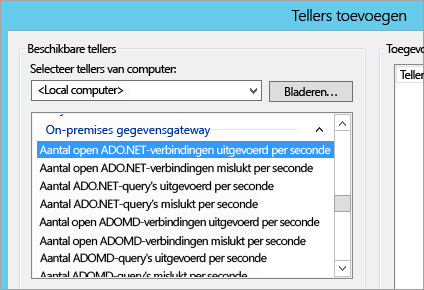
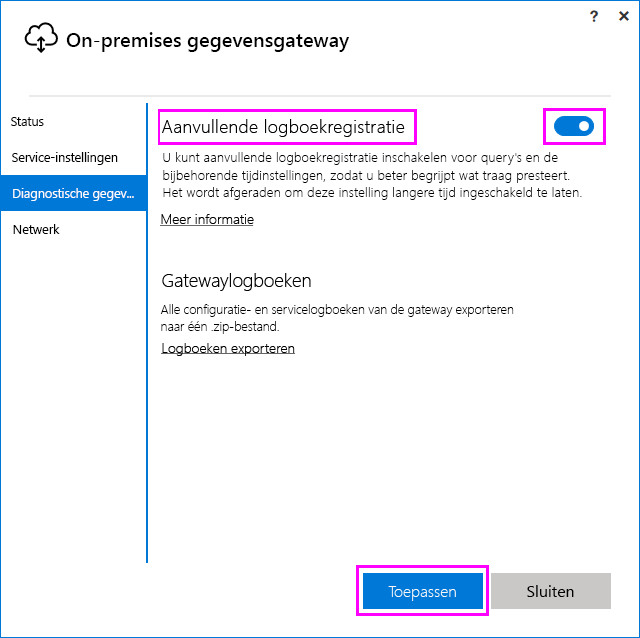
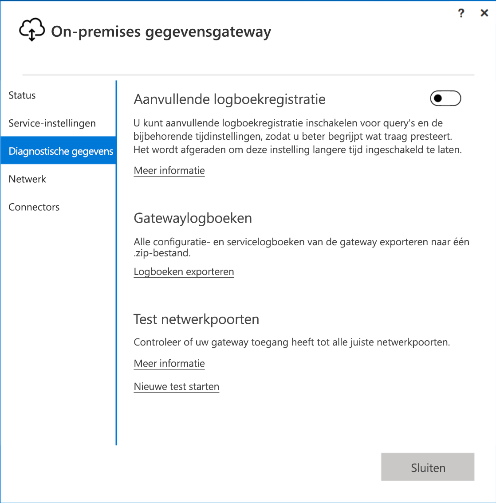
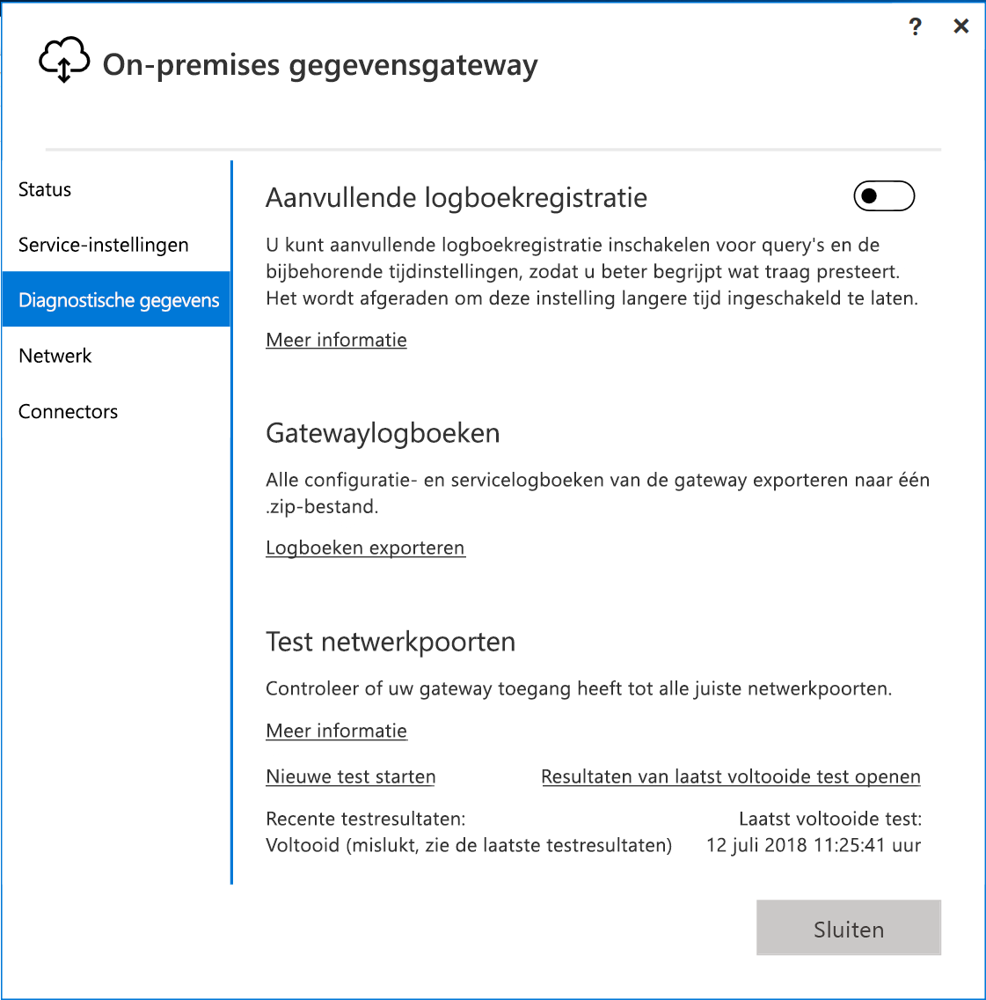
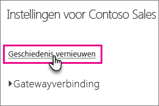

# <a name="troubleshooting-the-on-premises-data-gateway"></a>Problemen met de on-premises gegevensgateway oplossen

In dit artikel worden enkele veelvoorkomende problemen besproken tijdens het gebruik van de **on-premises gegevensgateway**.

<!-- Shared Community & support links Include -->
[!INCLUDE [gateway-onprem-tshoot-support-links-include](./includes/gateway-onprem-tshoot-support-links-include.md)]

<!-- Shared Troubleshooting Install Include -->
[!INCLUDE [gateway-onprem-tshoot-install-include](./includes/gateway-onprem-tshoot-install-include.md)]

## <a name="configuration"></a>Configuratie

### <a name="how-to-restart-the-gateway"></a>De gateway opnieuw starten

De gateway wordt uitgevoerd als een Windows-service. U kunt deze dus op een aantal manieren stoppen en starten. U kunt bijvoorbeeld een opdrachtprompt met verhoogde bevoegdheden openen op de computer waarop de gateway wordt uitgevoerd en vervolgens een van deze opdrachten uitvoeren:

* Als u de service wilt stoppen, voert u deze opdracht uit:

    '''   net stop PBIEgwService   '''

* Als u de service wilt starten, voert u deze opdracht uit:

    '''   net start PBIEgwService   '''

### <a name="log-file-configuration"></a>Configuratie van logboekbestand

De logboeken van de gatewayservice zijn onderverdeeld in drie buckets: informatie, fout en netwerk. Deze categorisatie biedt een betere probleemoplossingservaring waarmee u zich kunt richten op een specifiek gebied, afhankelijk van de fout of het probleem. U kunt de drie categorieën zien in het volgende fragment uit het configuratiebestand van de gateway: `GatewayInfo.log,GatewayErrors.log,GatewayNetwork.log`.

```xml
  <system.diagnostics>
    <trace autoflush="true" indentsize="4">
      <listeners>
        <remove name="Default" />
        <add name="ApplicationFileTraceListener"
             type="Microsoft.PowerBI.DataMovement.Pipeline.Common.Diagnostics.RotatableFilesManagerTraceListener, Microsoft.PowerBI.DataMovement.Pipeline.Common"
             initializeData="%LOCALAPPDATA%\Microsoft\On-premises data gateway\,GatewayInfo.log,GatewayErrors.log,GatewayNetwork.log,20,50" />
      </listeners>
    </trace>
  </system.diagnostics>
```

Dit bestand bevindt zich standaard op: *\Program Files\On-premises data gateway\Microsoft.PowerBI.EnterpriseGateway.exe.config*. Als u het aantal te bewaren logbestanden wilt configureren, wijzigt u het eerste getal (20 in dit voorbeeld): `GatewayInfo.log,GatewayErrors.log,GatewayNetwork.log,20,50`.

### <a name="error-failed-to-create-a-gateway-try-again"></a>Fout: De gateway is niet gemaakt. Opnieuw proberen

Alle gegevens zijn beschikbaar, maar de aanroep naar de Power BI-service heeft een fout geretourneerd. De fout wordt weergegeven samen met een activiteits-id. Dit kan gebeuren om verschillende redenen. U kunt voor meer informatie de logboeken verzamelen en bekijken, zoals hieronder wordt beschreven.

Dit kan ook voorkomen vanwege problemen met de proxyconfiguratie. De gebruikersinterface biedt geen mogelijkheid voor proxyconfiguratie. U kunt meer informatie raadplegen over het [wijzigen van de proxyconfiguratie](service-gateway-proxy.md)

### <a name="error-failed-to-update-gateway-details-please-try-again"></a>Kan de gatewaygegevens niet bijwerken. Probeer het opnieuw

Informatie van de Power BI-service is ontvangen op de gateway. De informatie is doorgegeven aan de lokale Windows-service, maar niet geretourneerd. Een andere mogelijkheid is dat het genereren van een symmetrische sleutel is mislukt. De interne uitzondering wordt weergegeven onder **Details weergeven**. U kunt voor meer informatie de hierna genoemde logboeken verzamelen en bekijken.

### <a name="error-power-bi-service-reported-local-gateway-as-unreachable-restart-the-gateway-and-try-again"></a>Fout: De Power BI-service rapporteert dat de lokale gateway niet bereikbaar is. Start de gateway opnieuw en probeer het opnieuw

Aan het einde van de configuratie wordt de Power BI-service opnieuw aangeroepen om de gateway te valideren. De Power BI-service rapporteert niet dat de gateway *live* is. De communicatie slaagt mogelijk wel als u de Windows-service opnieuw start. U kunt voor meer informatie de logboeken verzamelen en bekijken, zoals hieronder wordt beschreven.

### <a name="script-error-during-sign-into-power-bi"></a>Scriptfout tijdens het aanmelden bij Power BI

Mogelijk treedt er een scriptfout op tijdens het aanmelden bij Power BI als onderdeel van de configuratie van de on-premises gegevensgateway. Dit probleem is opgelost nadat u de volgende beveiligingsupdate hebt geïnstalleerd. De update kan worden geïnstalleerd via Windows Update.

[MS16-051: Beveiligingsupdate voor Internet Explorer: 10 mei 2016 (KB 3154070)](https://support.microsoft.com/kb/3154070)

### <a name="gateway-configuration-failed-with-a-null-reference-exception"></a>De gatewayconfiguratie is mislukt met een null-referentie-uitzondering

Mogelijk treedt er een fout op vergelijkbaar met de volgende.

        Failed to update gateway details.  Please try again.
        Error updating gateway configuration.

Hierbij wordt een stack-trace getoond, die mogelijk het volgende bericht bevat.

        Microsoft.PowerBI.DataMovement.Pipeline.Diagnostics.CouldNotUpdateGatewayConfigurationException: Error updating gateway configuration. ----> System.ArgumentNullException: Value cannot be null.
        Parameter name: serviceSection

Als u een upgrade uitvoert van een oudere gateway, behouden we het configuratiebestand. Mogelijk ontbreekt er een sectie. Wanneer de gateway deze sectie probeert te lezen, kan de bovenstaande null-referentie-uitzondering worden weergegeven.

Voer de volgende stappen uit om dit op te lossen.

1. Verwijder de gateway.
2. Verwijder de volgende map.

        c:\Program Files\On-premises data gateway
3. Installeer de gateway opnieuw.
4. Optioneel kunt u de herstelsleutel voor het herstellen van een bestaande gateway toepassen.

### <a name="support-for-tls-1112"></a>Ondersteuning voor TLS 1.1/1.2

Sinds de update van augustus 2017 maakt de On-premises gegevensgateway standaard gebruik van Transport Layer Security (TLS) 1.1 of 1.2 om te communiceren met de **Power BI-service**. Eerdere versies van de On-premises gegevensgateway maken standaard gebruik van TLS 1.0. U moet de installatie van uw on-premises gegevensgateway upgraden naar de release van augustus 2017 of later om te garanderen dat uw gateways blijven functioneren.

>[!NOTE]
>De ondersteuning voor TLS 1.0 is beëindigd op 1 november 2017.

Het is belangrijk om te weten dat TLS 1.0 nog tot 1 november 2017 wordt ondersteund door de on-premises gegevensgateway en door de gateway wordt gebruikt als back-upprotocol bij problemen. Om ervoor te zorgen dat al het verkeer van en naar de gateway gebruikmaakt van TLS 1.1 of 1.2 (en om te voorkomen dat uw gateway nog TLS 1.0 gebruikt), moet u de volgende registersleutels toevoegen op de computer waarop de gateway-service wordt uitgevoerd:

        [HKEY_LOCAL_MACHINE\SOFTWARE\Microsoft\.NETFramework\v4.0.30319]"SchUseStrongCrypto"=dword:00000001
        [HKEY_LOCAL_MACHINE\SOFTWARE\Wow6432Node\Microsoft\.NETFramework\v4.0.30319]"SchUseStrongCrypto"=dword:00000001

> [!NOTE]
> Door deze registersleutels toe te voegen of te wijzigen, wordt deze wijziging toegepast voor alle .NET-toepassingen. Zie [Transport Layer Security (TLS) registry settings](https://docs.microsoft.com/windows-server/security/tls/tls-registry-settings) (Registerinstellingen voor Transport Layer Security (TLS)) voor meer informatie over registerwijzigingen die invloed hebben op TLS voor andere toepassingen.

## <a name="data-sources"></a>Gegevensbronnen

### <a name="error-unable-to-connect-details-invalid-connection-credentials"></a>Fout: Er kan geen verbinding worden gemaakt. Details: 'Ongeldige verbindingsreferenties'

Onder **Details weergeven** wordt de foutmelding weergegeven die van de gegevensbron is ontvangen. Voor SQL Server ziet dit er ongeveer als volgt uit.

    Login failed for user 'username'.

Controleer of u de juiste gebruikersnaam en het juiste wachtwoord gebruikt. Controleer ook of deze referenties verbinding kunnen maken met de gegevensbron. Zorg ervoor dat het gebruikte account overeenkomt met de geselecteerde **verificatiemethode**.

### <a name="error-unable-to-connect-details-cannot-connect-to-the-database"></a>Fout: Er kan geen verbinding worden gemaakt. Details: 'Kan geen verbinding maken met de database'

Er kan wel verbinding worden gemaakt met de server, maar niet met de opgegeven database. Controleer de naam van de database en of de gebruikersreferenties de juiste machtigingen hebben voor toegang tot deze database.

Onder **Details weergeven** wordt de foutmelding weergegeven die van de gegevensbron is ontvangen. Voor SQL Server ziet dit er ongeveer als volgt uit.

    Cannot open database "AdventureWorks" requested by the login. The login failed. Login failed for user 'username'.

### <a name="error-unable-to-connect-details-unknown-error-in-data-gateway"></a>Fout: Er kan geen verbinding worden gemaakt. Details: 'Onbekende fout in de gegevensgateway'

Deze fout kan verschillende oorzaken hebben. Controleer of u verbinding kunt maken met de gegevensbron vanaf de computer die als host fungeert voor de gateway. Dit kan voorkomen wanneer de server niet toegankelijk is.

Onder **Details weergeven** ziet u de foutcode **DM_GWPipeline_UnknownError**.

U kunt voor meer informatie ook de Gebeurtenislogboeken raadplegen> **Logboeken Toepassingen en Services** > **On-premises gegevensgateway-service**.

### <a name="error-we-encountered-an-error-while-trying-to-connect-to-server-details-we-reached-the-data-gateway-but-the-gateway-cant-access-the-on-premises-data-source"></a>Fout: Er is een fout opgetreden tijdens het verbinden met <server>. Details: 'Er is contact gemaakt met de gegevensgateway, maar de gateway heeft geen toegang tot de on-premises gegevensbron.'

Er kan geen verbinding worden gemaakt met de opgegeven gegevensbron. Controleer de informatie die is opgegeven voor de gegevensbron.

Onder **Details weergeven** ziet u de foutcode **DM_GWPipeline_Gateway_DataSourceAccessError**.

Als de onderliggende foutmelding op de volgende melding lijkt, betekent dit dat het account dat u voor de gegevensbron gebruikt, geen serverbeheerder is voor het betreffende Analysis Services-exemplaar. [Meer informatie](https://docs.microsoft.com/sql/analysis-services/instances/grant-server-admin-rights-to-an-analysis-services-instance)

    The 'CONTOSO\account' value of the 'EffectiveUserName' XML for Analysis property is not valid.

Als de onderliggende foutmelding op de volgende melding lijkt, kan dit betekenen dat het directory-kenmerk [token-groups-global-and-universal](https://msdn.microsoft.com/library/windows/desktop/ms680300.aspx) (TGGAU) mogelijk ontbreekt voor het serviceaccount voor Analysis Services.

    The username or password is incorrect.

Het TGGAU-kenmerk is ingeschakeld voor domeinen met toegang die compatibel is met oudere versies dan Windows 2000. Voor de meeste nieuw gemaakte domeinen is dit kenmerk echter niet standaard ingeschakeld. Meer informatie hierover vindt u op [deze pagina](https://support.microsoft.com/kb/331951).

U kunt dit controleren door de volgende stappen te volgen.

1. Maak verbinding met de Analysis Services-computer in SQL Server Management Studio. Voer in de geavanceerde verbindingseigenschappen EffectiveUserName in voor de betrokken gebruiker en kijk of de fout nog steeds optreedt.
2. U kunt het Active Directory-hulpprogramma dsacls gebruiken om te controleren of het kenmerk wordt weergegeven. Dit hulpprogramma bevindt zich op een domeincontroller. U moet weten wat de onderscheidende domeinnaam voor het account is en die aan het hulpprogramma doorgeven.

        dsacls "CN=John Doe,CN=UserAccounts,DC=contoso,DC=com"

    Het resultaat zou op het volgende moeten lijken.

            Allow BUILTIN\Windows Authorization Access Group
                                          SPECIAL ACCESS for tokenGroupsGlobalAndUniversal
                                          READ PROPERTY

Als u dit probleem wilt oplossen, moet u TGGAU inschakelen voor het account dat wordt gebruikt voor de Windows-service van Analysis Services.

#### <a name="another-possibility-for-username-or-password-incorrect"></a>Een andere mogelijkheid is dat de gebruikersnaam of het wachtwoord onjuist is

Deze fout kan ook optreden als de Analysis Services-server zich in een ander domein bevindt dan de gebruikers en er geen wederzijdse vertrouwensrelatie tot stand is gebracht.

U moet samenwerken met uw domeinbeheerders om de vertrouwensrelatie tussen de domeinen te controleren.

#### <a name="unable-to-see-the-data-gateway-data-sources-in-the-get-data-experience-for-analysis-services-from-the-power-bi-service"></a>Kan de gegevensbronnen van de gegevensgateway niet zien via de Analysis Services-functie 'Gegevens ophalen' van de Power BI-service

Zorg ervoor dat uw account wordt vermeld op het tabblad **Gebruikers** van de gegevensbron in de configuratie van de gateway. Als u geen toegang hebt tot de gateway, neemt u contact op met de beheerder van de gateway en vraagt u deze de informatie te controleren. Alleen op accounts die zijn opgenomen in de lijst met **Gebruikers** is de gegevensbron te zien die wordt weergegeven in de Analysis Services-lijst.

### <a name="error-you-dont-have-any-gateway-installed-or-configured-for-the-data-sources-in-this-dataset"></a>Fout: u hebt geen gateway geïnstalleerd of geconfigureerd voor de gegevensbronnen in deze gegevensset

Zorg ervoor dat u een of meer gegevensbronnen hebt toegevoegd aan de gateway, zoals beschreven in [Een gegevensbron toevoegen](service-gateway-manage.md#add-a-data-source). Als de gateway niet wordt weergegeven in de beheerportal onder **Gateways beheren** wist u de browsercache of meldt u zich af en weer aan bij de service.

## <a name="datasets"></a>Gegevenssets

### <a name="error-there-is-not-enough-space-for-this-row"></a>Fout: Er is onvoldoende ruimte voor deze rij

Dit gebeurt als een enkele rij groter is dan 4 MB. U moet bepalen om welke rij uit de gegevensbron het gaat en deze wegfilteren of kleiner maken.

### <a name="error-the-server-name-provided-doesnt-match-the-server-name-on-the-sql-server-ssl-certificate"></a>Fout: De opgegeven servernaam komt niet overeen met de servernaam op het SSL-certificaat van SQL Server

Dit kan gebeuren wanneer de certificaat-CN voor de servers een FQDN (Fully Qualified Domain Name) is, maar u alleen de NetBIOS-naam voor de server hebt opgegeven. Hierdoor komt de servernaam niet overeen met het certificaat. Om dit probleem op te lossen, moet u de servernaam in de gegevensbron van de gateway en in het PBIX-bestand instellen op de FQDN van de server.

### <a name="i-dont-see-the-on-premises-data-gateway-present-when-configuring-scheduled-refresh"></a>De on-premises gegevensgateway wordt niet weergegeven bij het configureren van een geplande vernieuwing

Dit kan door meerdere scenario's worden veroorzaakt.

1. Mogelijk komen de server- en databasenamen die zijn ingevoerd in Power BI Desktop, niet overeen met de geconfigureerde gegevensbron voor de gateway. Deze moeten dezelfde waarden gebruiken. De waarden zijn niet hoofdlettergevoelig.
2. Uw account wordt niet vermeld op het tabblad **Gebruikers** van de gegevensbron in de configuratie van de gateway. Neem contact op met de beheerder van de gateway als u aan deze lijst wilt worden toegevoegd.
3. Uw Power BI Desktop-bestand bevat meerdere gegevensbronnen en niet al deze gegevensbronnen zijn geconfigureerd bij de gateway. U moet elke gegevensbron bij de gateway definiëren als u wilt dat de gateway wordt weergegeven voor geplande vernieuwing.

### <a name="error-the-received-uncompressed-data-on-the-gateway-client-has-exceeded-the-limit"></a>Fout: De niet-gecomprimeerde gegevens die door de gatewayclient zijn ontvangen, hebben de limiet overschreden

De exacte beperking is 10 GB aan niet-gecomprimeerde gegevens per tabel. Als dit probleem optreedt, zijn er goede mogelijkheden om uw gegevens te optimaliseren en het probleem te voorkomen. Een gunstig resultaat bereikt u vooral met het terugdringen van het gebruik van zeer constante, lange tekenreekswaarden en het vervangen hiervan door een genormaliseerde sleutel, en met het verwijderen van de kolom (indien niet in gebruik).

## <a name="reports"></a>Rapporten

### <a name="report-could-not-access-the-data-source-because-you-do-not-have-access-to-our-data-source-via-an-on-premises-data-gateway"></a>Rapport heeft geen toegang tot de gegevensbron omdat u geen toegang tot onze gegevensbron hebt via een on-premises gegevensgateway

Dit wordt meestal veroorzaakt door een van de volgende dingen.

1. De informatie van de gegevensbron komt niet overeen met wat er in de onderliggende gegevensset aanwezig is. De server- en databasenaam die in de on-premises gegevensgateway zijn opgegeven voor de gegevensbron, moeten overeenkomen met wat u hebt opgegeven in Power BI Desktop. Als u in Power BI Desktop een IP-adres gebruikt, moet de gegevensbron voor de on-premises gegevensgateway ook een IP-adres gebruiken.
2. Er is op geen enkele gateway binnen uw organisatie een gegevensbron beschikbaar. U kunt de gegevensbron configureren op een nieuwe of bestaande on-premises gegevensgateway.

### <a name="error-data-source-access-error-please-contact-the-gateway-administrator"></a>Fout: Fout met toegang tot de gegevensbron. Neem contact op met de gatewaybeheerder

Als dit rapport gebruikmaakt van een live Analysis Services-verbinding, treedt er mogelijk een probleem op waarbij er een waarde aan EffectiveUserName wordt doorgegeven die niet geldig is of geen machtigingen heeft op de Analysis Services-computer. Een verificatieprobleem wordt doorgaans veroorzaakt doordat de waarde die voor EffectiveUserName wordt doorgegeven, niet overeenkomt met een lokale User Principal Name (UPN).

Doe het volgende om dit te controleren.

1. U vindt de effectieve gebruikersnaam in de [gatewaylogboeken](#logs).
2. Wanneer u de waarde hebt achterhaald die wordt doorgegeven, controleert u of deze juist is. Als dit uw gebruiker betreft, kunt u de volgende opdracht uitvoeren vanaf de opdrachtprompt om de UPN te zien. De UPN ziet eruit als een e-mailadres.

        whoami /upn

Eventueel kunt u nagaan wat Power BI ophaalt uit Azure Active Directory.

1. Blader naar [https://developer.microsoft.com/graph/graph-explorer](https://developer.microsoft.com/graph/graph-explorer).
2. Selecteer **Aanmelden** in de rechterbovenhoek.
3. Voer de volgende query uit. Er wordt nu een vrij groot JSON-antwoord weergegeven.

        https://graph.windows.net/me?api-version=1.5
4. Zoek hierin naar **UserPrincipalName**.

Als uw Azure Active Directory-UPN niet overeenkomt met uw lokale Active Directory-UPN, kunt u de functie [Gebruikersnamen toewijzen](service-gateway-enterprise-manage-ssas.md#map-user-names) gebruiken om deze te vervangen door een geldige waarde. U kunt ook contact opnemen met uw tenantbeheerder of lokale Active Directory-beheerder om uw UPN te wijzigen.

<!-- Shared Troubleshooting Firewall/Proxy Include -->
[!INCLUDE [gateway-onprem-tshoot-firewall-include](./includes/gateway-onprem-tshoot-firewall-include.md)]

U vindt de datacenterregio waarin u zich bevindt, met behulp van de volgende stappen:

1. Selecteer **?** in de rechterbovenhoek van de Power BI-service.
2. Selecteer **Over Power BI**.
3. Uw gegevensregio wordt weergegeven bij **Uw gegevens worden opgeslagen in**.

    

Als u nog steeds niet voldoende informatie hebt, kunt u een netwerktracering uitvoeren met een hulpprogramma zoals [fiddler](#fiddler) of netsh, hoewel dit geavanceerde methoden zijn en u wellicht hulp nodig hebt bij het analyseren van de verzamelde gegevens. U kunt voor hulp contact opnemen met de [ondersteuning](https://support.microsoft.com).

## <a name="performance"></a>Prestaties

<iframe width="560" height="315" src="https://www.youtube.com/embed/IJ_DJ30VNk4?showinfo=0" frameborder="0" allowfullscreen></iframe>

### <a name="performance-counters"></a>Prestatiemeters

Er zijn een aantal prestatiemeteritems die kunnen worden gebruikt voor het bijhouden van de activiteiten van de gateway. Dit is handig om te bepalen of er een grote activiteitsbelasting is en er mogelijk een nieuwe gateway moet worden gemaakt. Deze tellers geven niet aan hoelang iets duurt.

Deze tellers zijn toegankelijk via het hulpprogramma Prestatiemeter van Windows.



Deze prestatiemeteritems zijn in enkele algemene groepen ingedeeld.

| Type item | Beschrijving |
| --- | --- |
| ADO.NET |Dit wordt gebruikt voor DirectQuery-verbindingen. |
| ADOMD |Dit wordt gebruikt voor Analysis Services 2014 en eerdere versies. |
| OLEDB |Bepaalde gegevensbronnen maken gebruik van deze optie. Hieronder vallen SAP HANA en Analysis Services 2016 en latere versies. |
| Mashup |Hieronder vallen alle geïmporteerde gegevensbronnen. Als u vernieuwing plant of vernieuwing op aanvraag uitvoert, verloopt dit via de mashup-engine. |

Hier volgt een overzicht van de beschikbare prestatiemeteritems.

| Prestatiemeteritem | Beschrijving |
| --- | --- |
| Aantal open ADO.NET-verbindingen uitgevoerd per seconde |Aantal open ADO.NET-verbindingsacties uitgevoerd per seconde (geslaagd of mislukt). |
| Aantal open ADO.NET-verbindingen mislukt per seconde |Aantal open ADO.NET-verbindingsacties mislukt per seconde. |
| Aantal ADO.NET-query's uitgevoerd per seconde |Aantal ADO.NET-query's uitgevoerd per seconde (geslaagd of mislukt). |
| Aantal ADO.NET-query's mislukt per seconde |Aantal mislukte ADO.NET-query's uitgevoerd per seconde. |
| Aantal open ADOMD-verbindingen uitgevoerd per seconde |Aantal open ADOMD-verbindingsacties uitgevoerd per seconde (geslaagd of mislukt). |
| Aantal open ADOMD-verbindingen mislukt per seconde |Aantal open ADOMD-verbindingsacties mislukt per seconde. |
| Aantal ADOMD-query's uitgevoerd per seconde |Aantal ADOMD-query's uitgevoerd per seconde (geslaagd of mislukt). |
| Aantal ADOMD-query's mislukt per seconde |Aantal mislukte ADOMD-query's uitgevoerd per seconde. |
| Totaal aantal open verbindingen uitgevoerd per seconde |Aantal open verbindingsacties uitgevoerd per seconde (geslaagd of mislukt). |
| Totaal aantal open verbindingen mislukt per seconde |Aantal mislukte open verbindingsacties uitgevoerd per seconde. |
| Totaal aantal query's uitgevoerd per seconde |Aantal query's uitgevoerd per seconde (geslaagd of mislukt). |
| Aantal items in de ADO.NET-verbindingsgroep |Aantal items in de ADO.NET-verbindingsgroep. |
| Aantal items in de OLEDB-verbindingsgroep |Aantal items in de OLEDB-verbindingsgroep. |
| Aantal items in de Service Bus-groep |Aantal items in de Service Bus-groep. |
| Aantal open Mashup-verbindingen uitgevoerd per seconde |Aantal open Mashup-verbindingsacties uitgevoerd per seconde (geslaagd of mislukt). |
| Aantal open Mashup-verbindingen mislukt per seconde |Aantal open Mashup-verbindingsacties mislukt per seconde. |
| Aantal Mashup-query's uitgevoerd per seconde |Aantal Mashup-query's uitgevoerd per seconde (geslaagd of mislukt). |
| Aantal Mashup-query's mislukt per seconde |Aantal mislukte Mashup-query's uitgevoerd per seconde. |
| Aantal OLEDB-query's voor sets met meerdere resultaten mislukt per seconde |Aantal mislukte OLEDB-query's voor sets met meerdere resultaten uitgevoerd per seconde. |
| Aantal OLEDB-query's voor sets met meerdere resultaten uitgevoerd per seconde |Aantal OLEDB-query's voor sets met meerdere resultaten uitgevoerd per seconde (geslaagd of mislukt). |
| Totaal aantal open OLEDB-verbindingen uitgevoerd per seconde |Aantal open OLEDB-verbindingsacties uitgevoerd per seconde (geslaagd of mislukt). |
| Totaal aantal open OLEDB-verbindingen mislukt per seconde |Aantal open OLEDB-verbindingsacties mislukt per seconde. |
| Aantal OLEDB-query's uitgevoerd per seconde |Aantal OLEDB-query's voor sets met meerdere resultaten uitgevoerd per seconde (geslaagd of mislukt). |
| Aantal OLEDB-query's mislukt per seconde |Aantal mislukte OLEDB-query's voor sets met meerdere resultaten uitgevoerd per seconde. |
| Aantal OLEDB-query's voor sets met enkelvoudige resultaten uitgevoerd per seconde |Aantal OLEDB-query's voor sets met enkelvoudige resultaten uitgevoerd per seconde (geslaagd of mislukt). |
| Aantal query's mislukt per seconde |Aantal mislukte query's uitgevoerd per seconde. |
| Aantal OLEDB-query's voor sets met enkelvoudige resultaten mislukt per seconde |Aantal mislukte OLEDB-query's voor sets met enkelvoudige resultaten uitgevoerd per seconde. |

## <a name="reviewing-slow-performing-queries"></a>Traag presterende query's controleren

Mogelijk vindt u de respons via de gateway te langzaam. Dit kan bijvoorbeeld het geval zijn voor DirectQuery-query's of bij het vernieuwen van uw geïmporteerde gegevensset. U kunt aanvullende logboekregistratie inschakelen voor query's en de bijbehorende tijdinstellingen, zodat u beter begrijpt wat traag presteert. Wanneer u een langlopende query hebt gevonden, zijn er mogelijk extra aanpassingen vereist in uw gegevensbron om de queryprestaties te verbeteren. Denk bijvoorbeeld aan het aanpassen van de indexen voor een SQL Server-query.

U moet twee configuratiebestanden wijzigen om de duur van een query te bepalen.

### <a name="microsoftpowerbidatamovementpipelinegatewaycoredllconfig"></a>Microsoft.PowerBI.DataMovement.Pipeline.GatewayCore.dll.config

In het bestand *Microsoft.PowerBI.DataMovement.Pipeline.GatewayCore.dll.config* dient u de waarde `EmitQueryTraces` te wijzigen van `False` naar `True`. Dit bestand bevindt zich in *C:\Program Files\On-premises data gateway*. Als u `EmitQueryTraces` inschakelt, worden de query's bijgehouden die vanaf de gateway naar een gegevensbron worden verzonden.

> [!IMPORTANT]
> Het inschakelen van EmitQueryTraces kan ervoor zorgen dat de grootte van het logboekbestand aanzienlijk toeneemt, afhankelijk van het gatewaygebruik. Wanneer u klaar bent met het controleren van de logboeken, kunt u EmitQueryTraces het beste weer instellen op False. Het wordt afgeraden om deze instelling langere tijd ingeschakeld te laten.

```
<setting name="EmitQueryTraces" serializeAs="String">
    <value>True</value>
</setting>
```

**Voorbeeld van query**

```
DM.EnterpriseGateway Information: 0 : 2016-09-15T16:09:27.2664967Z DM.EnterpriseGateway    4af2c279-1f91-4c33-ae5e-b3c863946c41    d1c77e9e-3858-4b21-3e62-1b6eaf28b176    MGEQ    c32f15e3-699c-4360-9e61-2cc03e8c8f4c    FF59BC20 [DM.GatewayCore] Executing query (timeout=224) "<pi>
SELECT
TOP (1000001) [t0].[ProductCategoryName],[t0].[FiscalYear],SUM([t0].[Amount])
 AS [a0]
FROM
(
(select [$Table].[ProductCategoryName] as [ProductCategoryName],
    [$Table].[ProductSubcategory] as [ProductSubcategory],
    [$Table].[Product] as [Product],
    [$Table].[CustomerKey] as [CustomerKey],
    [$Table].[Region] as [Region],
    [$Table].[Age] as [Age],
    [$Table].[IncomeGroup] as [IncomeGroup],
    [$Table].[CalendarYear] as [CalendarYear],
    [$Table].[FiscalYear] as [FiscalYear],
    [$Table].[Month] as [Month],
    [$Table].[OrderNumber] as [OrderNumber],
    [$Table].[LineNumber] as [LineNumber],
    [$Table].[Quantity] as [Quantity],
    [$Table].[Amount] as [Amount]
from [dbo].[V_CustomerOrders] as [$Table])
)
 AS [t0]
GROUP BY [t0].[ProductCategoryName],[t0].[FiscalYear] </pi>"
```

### <a name="microsoftpowerbidatamovementpipelinediagnosticsdllconfig"></a>Microsoft.PowerBI.DataMovement.Pipeline.Diagnostics.dll.config

In het bestand *Microsoft.PowerBI.DataMovement.Pipeline.Diagnostics.dll.config* dient u de waarde `TracingVerbosity` te wijzigen van `4` naar `5`. Dit bestand bevindt zich in *C:\Program Files\On-premises data gateway*. Als u deze instelling wijzigt, worden er uitgebreide logboekvermeldingen naar het gatewaylogboek geschreven. Hierbij wordt voor vermeldingen ook de duur getoond. U kunt ook uitgebreide vermeldingen inschakelen door het inschakelen van de knop Aanvullende logboekregistratie in de toepassing On-Premises Gateway.

   

> [!IMPORTANT]
> Door TraceVerbosity in te stellen op `5`, kan de grootte van het logboekbestand aanzienlijk toenemen, afhankelijk van het gatewaygebruik. Wanneer u klaar bent met het controleren van de logboeken, moet u TraceVerbosity weer instellen op `4`. Het wordt afgeraden om deze instelling langere tijd ingeschakeld te laten.

```
<setting name="TracingVerbosity" serializeAs="String">
    <value>5</value>
</setting>
```

<a name="activities"></a>

### <a name="activity-types"></a>Activiteitstypen

| Type activiteit | Beschrijving |
| --- | --- |
| MGEQ |Query's uitgevoerd via ADO.NET. Hieronder vallen DirectQuery-gegevensbronnen. |
| MGEO |Query's uitgevoerd via OLEDB. Hieronder vallen SAP HANA en Analysis Services 2016. |
| MGEM |Query's uitgevoerd vanuit de Mashup-engine. Deze wordt gebruikt voor geïmporteerde gegevenssets die gebruikmaken van geplande vernieuwing of vernieuwing op verzoek. |

### <a name="determine-the-duration-of-a-query"></a>De duur van een query bepalen
Om te bepalen hoe lang het duurde om een query bij de gegevensbron uit te voeren, kunt u het volgende doen.

1. Open het logboek voor de gateway.
2. Zoek naar een [activiteitstype](#activities) om de query te vinden. Een voorbeeld hiervan is MGEQ.
3. Noteer de tweede GUID: dit is de aanvraag-id.
4. Zoek verder naar MGEQ totdat u de vermelding FireActivityCompletedSuccessfullyEvent vindt, waar de duur bij wordt getoond. Controleer vervolgens of de vermelding dezelfde aanvraag-id bevat. De duur wordt getoond in milliseconden.

        DM.EnterpriseGateway Verbose: 0 : 2016-09-26T23:08:56.7940067Z DM.EnterpriseGateway    baf40f21-2eb4-4af1-9c59-0950ef11ec4a    5f99f566-106d-c8ac-c864-c0808c41a606    MGEQ    21f96cc4-7496-bfdd-748c-b4915cb4b70c    B8DFCF12 [DM.Pipeline.Common.TracingTelemetryService] Event: FireActivityCompletedSuccessfullyEvent (duration=5004)

   > [!NOTE]
   > FireActivityCompletedSuccessfullyEvent is een uitgebreid item. Dit item wordt niet vastgelegd tenzij TraceVerbosity is ingesteld op niveau 5.

## <a name="firewall-or-proxy"></a>Firewall of proxy

Zie [Configuring proxy settings for the Power BI gateways](service-gateway-proxy.md) (Proxy-instellingen voor de Power BI-gateways configureren) voor informatie over het aanleveren van proxygegevens voor uw gateway.

U kunt controleren of uw firewall of proxy verbindingen mogelijk blokkeert, door de opdracht [Test-NetConnection](https://docs.microsoft.com/powershell/module/nettcpip/test-netconnection) uit te voeren in een PowerShell-prompt. Deze opdracht test de verbinding met Azure Service Bus. De test heeft alleen betrekking op de netwerkverbinding, niet op de cloudserverservice of de gateway. Met deze opdracht kunt u controleren of uw computer verbinding kan maken met internet.

    Test-NetConnection -ComputerName watchdog.servicebus.windows.net -Port 9350

> [!NOTE]
> Test-NetConnection is alleen beschikbaar in Windows Server 2012 R2 en hoger. De opdracht is ook beschikbaar in Windows 8.1 en hoger. In eerdere versies van het besturingssysteem kunt u Telnet gebruiken om poortconnectiviteit te testen.

De resultaten ziet er ongeveer uit als in het volgende voorbeeld. Het verschil zit in TcpTestSucceeded. Als **TcpTestSucceeded** niet *true* is, wordt u mogelijk geblokkeerd door een firewall.

    ComputerName           : watchdog.servicebus.windows.net
    RemoteAddress          : 70.37.104.240
    RemotePort             : 5672
    InterfaceAlias         : vEthernet (Broadcom NetXtreme Gigabit Ethernet - Virtual Switch)
    SourceAddress          : 10.120.60.105
    PingSucceeded          : False
    PingReplyDetails (RTT) : 0 ms
    TcpTestSucceeded       : True

Als u grondig te werk wilt gaan, vervangt u de waarden **ComputerName** en **Port** door de waarden die worden vermeld onder [ports](https://docs.microsoft.com/power-bi/service-gateway-onprem#ports)

De firewall blokkeert mogelijk ook de verbindingen tussen Azure Service Bus en de Azure-datacenters. Als dat het geval is, kunt u het beste de IP-adressen van de datacenters voor uw regio op de goedgekeurde lijst plaatsen (deblokkeren). U vindt [hier](https://www.microsoft.com/download/details.aspx?id=41653) een lijst met IP-adressen voor Azure.

### <a name="network-ports-test"></a>Test netwerkpoorten

De netwerkpoortentest is een hulpprogramma om te controleren of uw gateway toegang heeft tot de juiste poorten voor alle externe servers die voor uw gateway vereist zijn voor het overbrengen van gegevens. Als de netwerkpoortentest geen verbinding kan maken met een van de poorten, ondervindt uw gateway mogelijk netwerkproblemen. Als u momenteel netwerkproblemen met uw gateway ondervindt, moet u een netwerkpoortentest uitvoeren om te controleren of u de optimale netwerkomgeving hebt.  

#### <a name="start-a-new-test"></a>Een nieuwe test starten

Hiermee voert u een nieuwe netwerkpoortentest uit in de gebruikersinterface van On-premises gegevensgateway.



Bij het uitvoeren van de netwerkpoortentest haalt de gateway een lijst met poorten en servers van Azure Service Bus op. Vervolgens wordt geprobeerd verbinding maken met alle servers en poorten. Wanneer de koppeling Nieuwe test starten opnieuw wordt weergegeven, is de netwerkpoortentest uitgevoerd.  

#### <a name="test-results"></a>Testresultaten

Een samenvatting van de test is te zien onder de koppeling Nieuwe test starten bij Recente testresultaten. De twee resultaten zijn Voltooid (Geslaagd) en Voltooid (Mislukt, zie de laatste testresultaten). Als de test is geslaagd, dan heeft de gateway verbinding gemaakt met de vereiste poorten. Als de test is mislukt, dan worden deze vereiste poorten en servers mogelijk door uw netwerkomgeving geblokkeerd. 



Als u de resultaten van de laatste voltooide test wilt weergeven, selecteert u de koppeling Laatste voltooide test openen, zoals hieronder wordt weergegeven. De testresultaten worden in de standaard teksteditor van Windows geopend.  

In de testresultaten worden alle servers, poorten en IP-adressen vermeld die voor uw gateway vereist zijn. Als in de testresultaten Gesloten voor alle poorten is weergegeven, zoals hieronder wordt weergegeven, controleert u of de verbinding niet wordt geblokkeerd door uw netwerkomgeving. Mogelijk moet u contact opnemen met uw netwerkbeheerder om de vereiste poorten te openen.


## <a name="kerberos"></a>Kerberos

Als de onderliggende databaseserver en de on-premises gegevensgateway niet juist zijn geconfigureerd voor [Kerberos Constrained Delegation](service-gateway-kerberos-for-sso-pbi-to-on-premises-data.md), schakel dan [uitgebreide logboekregistratie](#microsoftpowerbidatamovementpipelinediagnosticsdllconfig) in op de gateway en onderzoek op basis van de fouten/traceringen in logboekbestanden van de gateway als beginpunt voor probleemoplossing.

### <a name="impersonationlevel"></a>ImpersonationLevel (imitatieniveau)

Het ImpersonationLevel (imitatieniveau) is gerelateerd aan de installatie van de SPN of de lokale beleidsinstelling.

```
[DataMovement.PipeLine.GatewayDataAccess] About to impersonate user DOMAIN\User (IsAuthenticated: True, ImpersonationLevel: Identification)
```

**Oplossing**

Volg deze stappen om het probleem op te lossen:
1. Een SPN voor de on-premises gateway instellen
2. Beperkte delegering instellen in uw Active Directory (AD)

### <a name="failedtoimpersonateuserexception-failed-to-create-windows-identity-for-user-userid"></a>FailedToImpersonateUserException: kan geen Windows-identiteit voor de gebruiker userid maken

FailedToImpersonateUserException doet zich voor als u zich niet namens een andere gebruiker als zodanig kunt voordoen. Dit kan ook gebeuren als het account dat u probeert te imiteren vanuit een ander domein komt dan het domein waarop de gateway-service zich bevindt (dit is een beperking).

**Oplossing**

* Controleer of de configuratie klopt volgens de stappen in de sectie ImpersonationLevel hierboven
* Zorg ervoor dat de userid die deze probeert te imiteren een geldig AD-Account is

### <a name="general-error-1033-error-while-parsing-the-protocol"></a>Algemene fout: Fout 1033 tijdens het parseren van het protocol

De fout 1033 wordt weergegeven wanneer uw externe id, die is geconfigureerd in SAP HANA, niet met de aanmelding overeenkomt als de gebruiker wordt geïmiteerd met behulp van de UPN (alias@domain.com). In de logboeken ziet u hoe de oorspronkelijke UPN alias@domain.com wordt vervangen door een nieuwe UPN alias@domain.com bovenaan de foutenlogboeken zoals hieronder wordt weergegeven.

```
[DM.GatewayCore] SingleSignOn Required. Original UPN 'alias@domain.com' replaced with new UPN 'alias@domain.com.'
```

**Oplossing**

* SAP HANA vereist dat de geïmiteerde gebruiker het kenmerk sAMAccountName in AD (gebruikersalias) gebruikt. Als dit niet juist is, ziet u de fout 1033.

    

* In de logboeken ziet u de sAMAccountName (alias) en niet de UPN, dit is de alias die wordt gevolgd door het domein (alias@doimain.com)

    

```
      <setting name="ADUserNameReplacementProperty" serializeAs="String">
        <value>sAMAccount</value>
      </setting>
      <setting name="ADServerPath" serializeAs="String">
        <value />
      </setting>
      <setting name="CustomASDataSource" serializeAs="String">
        <value />
      </setting>
      <setting name="ADUserNameLookupProperty" serializeAs="String">
        <value>AADEmail</value>
```

### <a name="sap-aglibodbchdb-dllhdbodbc-communication-link-failure-10709-connection-failed-rte-1-kerberos-error-major-miscellaneous-failure-851968-minor-no-credentials-are-available-in-the-security-package"></a>[SAP AG] [LIBODBCHDB DLL] [HDBODBC] Koppeling communicatiefout;-10709 verbinding is mislukt (RTE:[-1] Kerberos-fout. Primair: 'Diverse-fout [851968]', secundair: 'Er zijn geen referenties beschikbaar in het beveiligingspakket'

Het foutbericht 10709 (Verbinding is mislukt) wordt weergegeven als de overdracht niet juist is geconfigureerd in AD.

**Oplossing**

* Zorg ervoor dat u de SAP Hana-server op het tabblad Delegering in AD heeft voor het gateway-serviceaccount

   

<!-- Shared Troubleshooting tools Include -->
[!INCLUDE [gateway-onprem-tshoot-tools-include](./includes/gateway-onprem-tshoot-tools-include.md)]

### <a name="refresh-history"></a>Geschiedenis vernieuwen

Wanneer u de gateway gebruikt voor geplande vernieuwing, kan de optie **Geschiedenis vernieuwen** helpen om te zien welke fouten zijn opgetreden. Daarnaast kan deze optie nuttige gegevens bieden als u een ondersteuningsaanvraag wilt maken. U kunt zowel geplande vernieuwingen als vernieuwingen op aanvraag bekijken. U krijgt als volgt toegang tot de optie **Geschiedenis vernieuwen**.

1. Ga in het navigatiedeelvenster van Power BI naar **Gegevenssets**, selecteer een gegevensset &gt; Menu openen &gt; **Vernieuwen plannen**.

    
2. Selecteer in het venster **Instellingen voor...** &gt; **Vernieuwen plannen** en selecteer **Geschiedenis vernieuwen**.

    

    

Voor meer informatie over het oplossen van problemen met betrekking tot vernieuwen raadpleegt u het artikel [Problemen met vernieuwingsscenario's oplossen](refresh-troubleshooting-refresh-scenarios.md).

## <a name="next-steps"></a>Volgende stappen
[Configuring proxy settings for the on-premises data gateway](service-gateway-proxy.md) (Proxy-instellingen voor de on-premises gegevensgateway configureren)  
[On-premises data gateway](service-gateway-onprem.md) (On-premises gegevensgateway)  
[On-premises data gateway in-depth](service-gateway-onprem-indepth.md) (On-premises gegevensgateway - uitgebreid)  
[Manage your data source - Analysis Services](service-gateway-enterprise-manage-ssas.md) (Uw gegevensbron beheren - Analysis Services)  
[Manage your data source - SAP HANA](service-gateway-enterprise-manage-sap.md) (Uw gegevensbron beheren - SAP HANA)  
[Manage your data source - SQL Server](service-gateway-enterprise-manage-sql.md) (Uw gegevensbron beheren - SQL Server)  
[Manage your data source - Import/Scheduled refresh](service-gateway-enterprise-manage-scheduled-refresh.md) (Uw gegevensbron beheren - importeren/geplande vernieuwing)  
Hebt u nog vragen? [Misschien dat de Power BI-community het antwoord weet](http://community.powerbi.com/)
