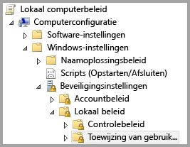
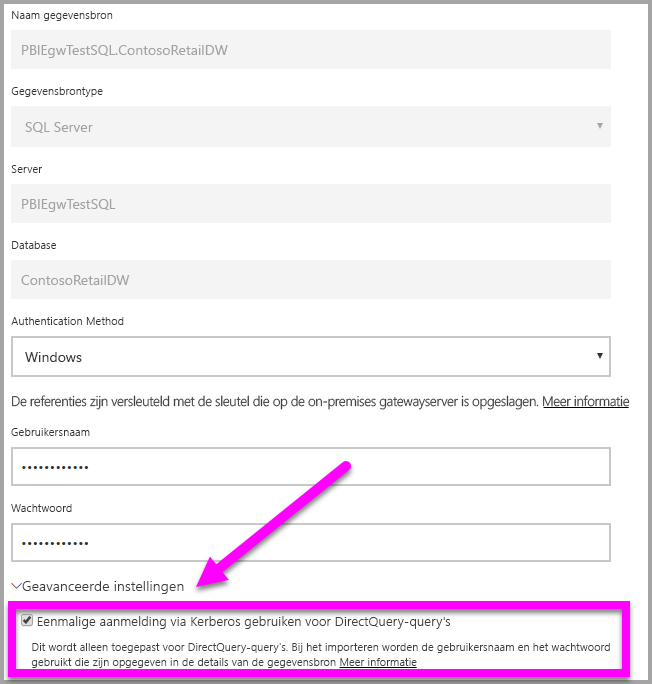
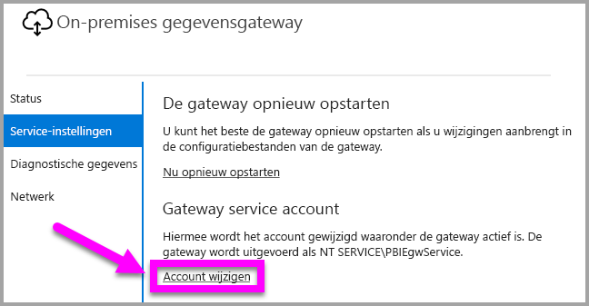
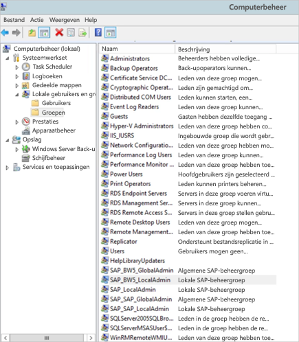
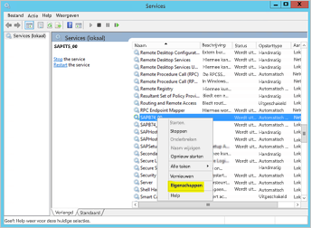
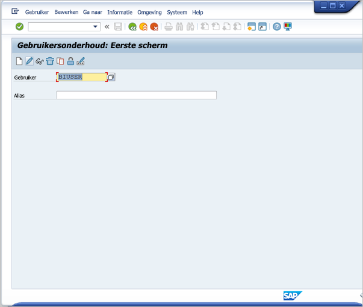
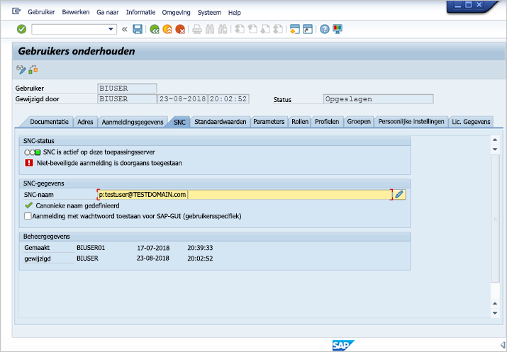
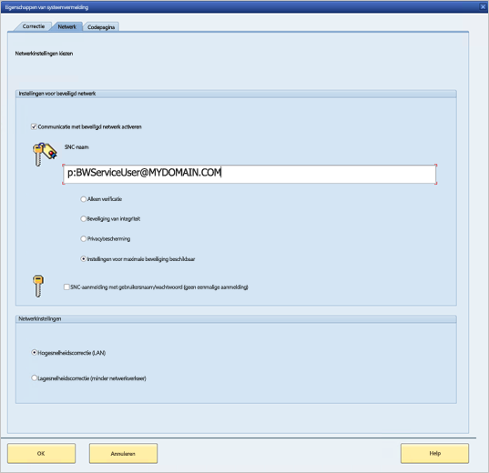
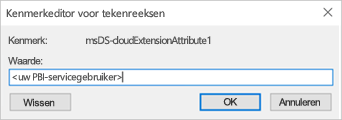
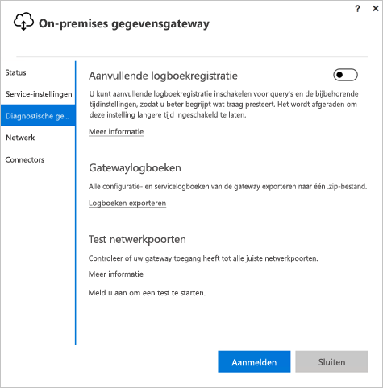

# <a name="use-kerberos-for-single-sign-on-sso-from-power-bi-to-on-premises-data-sources"></a>Kerberos gebruiken voor eenmalige aanmelding (SSO) bij on-premises gegevensbronnen vanuit Power BI

Gebruik [beperkte delegatie van Kerberos](/windows-server/security/kerberos/kerberos-constrained-delegation-overview) om naadloze connectiviteit dankzij eenmalige aanmelding mogelijk te maken. Met inschakeling van SSO is het eenvoudiger om gegevens van on-premises gegevensbronnen te vernieuwen in Power BI-rapporten en -dashboards.

## <a name="supported-data-sources"></a>Ondersteunde gegevensbronnen

Momenteel worden de volgende gegevensbronnen ondersteund:

* SQL Server
* SAP HANA
* SAP BW
* Teradata
* Spark
* Impala

Ook SAP HANA met [Security Assertion Markup Language (SAML)](service-gateway-sso-saml.md) wordt ondersteund.

### <a name="sap-hana"></a>SAP HANA

Volg eerst deze stappen om SSO in te schakelen voor SAP HANA:

* Zorg ervoor dat de SAP HANA-server de vereiste minimumversie uitvoert die afhankelijk is van het platform-niveau van uw SAP Hana-server:
  * [HANA 2 SPS 01 Rev 012.03](https://launchpad.support.sap.com/#/notes/2557386)
  * [HANA 2 SPS 02 Rev 22](https://launchpad.support.sap.com/#/notes/2547324)
  * [HANA 1 SP 12 Rev 122.13](https://launchpad.support.sap.com/#/notes/2528439)
* Installeer op de gatewaycomputer het meest recente HANA ODBC-stuurprogramma van SAP.  De minimaal vereiste versie is HANA ODBC versie 2.00.020.00, vrijgegeven in augustus 2017.

Meer informatie over het instellen en configureren van eenmalige aanmelding voor SAP HANA met Kerberos vindt u in het onderwerp [Single Sign-on Using Kerberos ](https://help.sap.com/viewer/b3ee5778bc2e4a089d3299b82ec762a7/2.0.03/en-US/1885fad82df943c2a1974f5da0eed66d.html) in de SAP HANA Security Guide en de koppelingen vanaf die pagina, in het bijzonder SAP Note 1837331 - HOWTO HANA DBSSO Kerberos/Active Directory].

## <a name="preparing-for-kerberos-constrained-delegation"></a>Voorbereiden voor beperkte Kerberos-delegering

Meerdere items moeten worden geconfigureerd om te zorgen dat beperkte Kerberos-delegering goed werkt, waaronder *Service Principal Names* (SPN) en delegeringsinstellingen voor serviceaccounts.

### <a name="prerequisite-1-install--configure-the-on-premises-data-gateway"></a>Vereiste 1: De on-premises gegevensgateway moet zijn geïnstalleerd en geconfigureerd

Deze versie van de on-premises gegevensgateway biedt ondersteuning voor een upgrade ter plekke, evenals voor het overnemen van de instellingen van bestaande gateways.

### <a name="prerequisite-2-run-the-gateway-windows-service-as-a-domain-account"></a>Vereiste 2: De gatewayservice in Windows moet worden uitgevoerd als een domeinaccount

In een standaardinstallatie wordt de gateway uitgevoerd als een lokaal serviceaccount (als *NT Service\PBIEgwService*, om precies te zijn) zoals wordt weergegeven in de volgende afbeelding:


Om **beperkte delegatie van Kerberos** in te schakelen, moet de gateway worden uitgevoerd als een domeinaccount, tenzij uw Azure AD al wordt gesynchroniseerd met uw lokale Active Directory (via Azure AD DirSync/Connect). Zie [Overschakelen van de gateway naar een domeinaccount](#switching-the-gateway-to-a-domain-account) verderop in dit artikel als u van het account wilt overschakelen naar een domeinaccount.

> [!NOTE]
> Als Azure AD DirSync/Connect is geconfigureerd en de gebruikersaccounts zijn gesynchroniseerd, hoeft de gatewayservice geen lokale AD-zoekacties uit te voeren tijdens het uitvoeren en kunt u de lokale service-SID gebruiken voor de gatewayservice (en is er dus geen domeinaccount vereist). De stappen voor het configureren van beperkte Kerberos-delegering die in dit artikel worden beschreven zijn verder hetzelfde als voor die configuratie (ze worden eenvoudigweg toegepast op het computerobject van de gateway - in Active Directory in plaats van in het domeinaccount).

### <a name="prerequisite-3-have-domain-admin-rights-to-configure-spns-setspn-and-kerberos-constrained-delegation-settings"></a>Vereiste 3: U moet beschikken over domeinbeheerdersrechten om instellingen voor SPN's (SetSPN) en de beperkte Kerberos-delegering te configureren

Hoewel het technisch mogelijk is dat een domeinbeheerder iemand anders tijdelijk of permanent rechten geeft om SPN-namen en Kerberos-delegatie te configureren zonder dat daarbij domeinbeheerdersrechten vereist zijn, is dat niet de aanbevolen aanpak. In de volgende sectie worden de configuratiestappen die nodig zijn voor **Vereiste 3** uitgebreid beschreven.

## <a name="configuring-kerberos-constrained-delegation-for-the-gateway-and-data-source"></a>Beperkte Kerberos-delegering configureren voor de gateway en de gegevensbron

Voor een correcte configuratie van het systeem, zullen we de volgende twee items moeten configureren of valideren:

1. Configureer zo nodig een SPN voor het domeinaccount van de gatewayservice.

2. Configureer de delegeringsinstellingen van het domeinaccount van de gatewayservice.

Houd er rekening mee dat u een domeinbeheerder moet zijn om deze twee configuratiestappen uit te voeren.

De volgende secties beschrijven deze twee stappen.

### <a name="configure-an-spn-for-the-gateway-service-account"></a>Een SPN voor het gatewayserviceaccount configureren

Bepaal eerst of er al een SPN is gemaakt voor het domeinaccount dat wordt gebruikt als gatewayserviceaccount, met behulp van de volgende stappen:

1. Start als domeinbeheerder **Active Directory: gebruikers en computers**.

2. Klik met de rechtermuisknop op het domein, selecteer **Zoeken** en typ de accountnaam van het gatewayserviceaccount

3. Klik in de zoekresultaten met de rechtermuisknop op het gatewayserviceaccount en selecteer **Eigenschappen**.

4. Als het tabblad **Delegering** wordt weergegeven in het dialoogvenster **Eigenschappen**, is er al een SPN gemaakt en kunt u direct verdergaan met de volgende sectie, over het configureren van de delegeringsinstellingen.

    Als het tabblad **Delegatie** niet wordt weergegeven in het dialoogvenster **Eigenschappen**, kunt u handmatig een SPN-naam maken voor dat account, zodat het tabblad **Delegatie** wordt toegevoegd (dit is de eenvoudigste manier om delegatie-instellingen te configureren). U kunt een SPN maken met behulp van het [setspn-hulpprogramma](https://technet.microsoft.com/library/cc731241.aspx) dat standaard deel uitmaakt van Windows (u moet domeinbeheerderrechten hebben om de SPN te maken).

    Stel u bijvoorbeeld voor dat het gatewayserviceaccount 'PBIEgwTest\GatewaySvc' heet en de naam van de computer waarop de gatewayservice wordt uitgevoerd **Machine1** heet. Om de SPN voor het gatewayserviceaccount in te stellen voor de computer in dit voorbeeld, zou u de volgende opdracht gebruiken:

    

    Nu deze stap is voltooid, kunnen we verdergaan met het configureren van de delegeringsinstellingen.

### <a name="configure-delegation-settings-on-the-gateway-service-account"></a>De delegeringsinstellingen configureren voor het gatewayserviceaccount

De tweede configuratievereiste betreft de delegeringsinstellingen voor het gatewayserviceaccount. Er zijn verschillende hulpprogramma's die u kunt gebruiken om deze stappen uit te voeren. In dit artikel gebruiken we **Active Directory: gebruikers en computers**, een MMC-module (Microsoft Management Console) die u kunt gebruiken om informatie in de directory te beheren en te publiceren. Deze module is standaard beschikbaar op domeincontrollers. U kunt deze ook inschakelen via de configuratie van **Windows-onderdelen** op andere computers.

We moeten **beperkte Kerberos-delegering** met protocoldoorvoer configureren. Met beperkte delegatie moet u expliciet zijn wat betreft de services waarnaar u wilt delegeren. Zo worden uw delegatieaanroepen vanuit het gatewayserviceaccount alleen geaccepteerd door uw SQL-server of uw SAP HANA-server.

In deze sectie wordt ervan uitgegaan dat u al SNP's hebt geconfigureerd voor uw onderliggende gegevensbronnen (zoals SQL Server, SAP HANA, Teradata, Spark, enzovoort). Raadpleeg de technische documentatie voor de desbetreffende gegevensbronserver voor meer informatie over het configureren van SPN-namen voor de gegevensbronserver. U kunt ook het volgende blogbericht doornemen: [*Welke SPN is vereist voor uw app?*](https://blogs.msdn.microsoft.com/psssql/2010/06/23/my-kerberos-checklist/)

In de volgende stappen wordt uitgegaan van een on-premises omgeving met twee computers: een gatewaycomputer en een databaseserver met SQL Server. In dit voorbeeldscenario worden de volgende instellingen en namen gebruikt:

* Naam van de gatewaymachine: **PBIEgwTestGW**
* Gatewayserviceaccount: **PBIEgwTest\GatewaySvc** (weergavenaam account: Gateway Connector)
* Computernaam SQL Server-gegevensbron: **PBIEgwTestSQL**
* Serviceaccount voor SQL Server-gegevensbron: **PBIEgwTest\SQLService**

Met deze voorbeeldnamen en -instellingen, worden de configuratiestappen als volgt:

1. Start als domeinbeheerder **Active Directory: gebruikers en computers**.

2. Klik met de rechtermuisknop op het gatewayserviceaccount (**PBIEgwTest\GatewaySvc**) en selecteer **Eigenschappen**.

3. Selecteer het tabblad **Delegering**.

4. Selecteer **Deze computer mag alleen aan opgegeven services delegeren**.

5. Selecteer **Elk verificatieprotocol gebruiken**.

6. Selecteer **Toevoegen** onder **Services waaraan dit account gedelegeerde referenties kan presenteren**.

7. Selecteer **Gebruikers of computers** in het nieuwe dialoogvenster.

8. Voer het serviceaccount voor de SQL Server-databaseservice in (**PBIEgwTest\SQLService**) en selecteer **OK**.

9. Selecteer de SPN die u hebt gemaakt voor de databaseserver. In ons voorbeeld begint de SPN met **MSSQLSvc**. Als u zowel de FQDN als de NetBIOS SPN voor uw databaseservice hebt toegevoegd, selecteert u deze hier allebei. Mogelijk ziet u maar één.

10. Selecteer **OK**. De SPN staat nu in de lijst.

11. U kunt optioneel ook **Uitgevouwen** selecteren om zowel de FQDN als de SPN-naam van NetBIOS weer te geven.

12. Het dialoogvenster ziet er als volgt uit als u **Uitgevouwen** hebt ingeschakeld. Selecteer **OK**.

    

Ten slotte moet op de computer waarop de gatewayservice wordt uitgevoerd (**PBIEgwTestGW** in ons voorbeeld), het lokale beleid 'Een client nabootsen na verificatie' aan het gatewayserviceaccount worden toegewezen. U kunt dit bewerkstelligen/controleren met de Editor voor lokaal groepsbeleid (**gpedit**).

1. Voer op de gatewaycomputer *gpedit.msc* uit.

1. Navigeer naar **Lokaal computerbeleid > Computerconfiguratie > Windows-instellingen > Beveiligingsinstellingen > Lokaal beleid > Toewijzing van gebruikersrechten**, zoals afgebeeld in de volgende afbeelding.

    

1. Selecteer in de lijst met beleidsregels onder **Toewijzing van gebruikersrechten** de optie **Een client nabootsen na verificatie**.

    

    Klik met de rechtermuisknop en open **Eigenschappen** voor **Een client imiteren na verificatie** en controleer de lijst met accounts. Hier moet het gatewayserviceaccount (**PBIEgwTest\GatewaySvc**) op staan.

1. Selecteer in de lijst met beleidsregels onder **Toewijzing van gebruikersrechten** de optie **Functioneren als deel van het besturingssysteem (SeTcbPrivilege)**. Zorg ervoor dat het gatewayserviceaccount ook wordt opgenomen in de lijst met accounts.

1. Start het serviceproces van de **on-premises gegevensgateway** opnieuw op.

Als u van SAP HANA gebruikmaakt, is het aan te raden de volgende aanvullende stappen te volgen om de prestaties mogelijk iets te kunnen verbeteren.

1. Zoek en open dit configuratiebestand in de installatiemap van de gateway: *Microsoft.PowerBI.DataMovement.Pipeline.GatewayCore.dll.config*.

1. Zoek de eigenschap *FullDomainResolutionEnabled* en wijzig de waarde ervan in *True*.

    ```xml
    <setting name=" FullDomainResolutionEnabled " serializeAs="String">
          <value>True</value>
    </setting>
    ```

## <a name="running-a-power-bi-report"></a>Een Power BI-rapport uitvoeren

Nadat alle configuratiestappen zijn voltooid die eerder in dit artikel zijn beschreven, kunt u de pagina **Gateway beheren** in Power BI gebruiken om de gegevensbron te configureren. Schakel onder de **Geavanceerde instellingen** SSO in en publiceer rapporten en gegevenssets die een binding met die gegevensbron hebben.



Deze configuratie werkt in de meeste gevallen. Er kunnen echter andere Kerberos-configuraties nodig zijn, afhankelijk van uw omgeving. Als het rapport nog steeds niet wordt geladen, dient u contact op te nemen met uw domeinbeheerder voor verdere hulp.

## <a name="switching-the-gateway-to-a-domain-account"></a>Overschakelen van de gateway naar een domeinaccount

Eerder in dit artikel werd de mogelijkheid genoemd om de gateway van een lokaal serviceaccount over te schakelen zodat deze wordt uitgevoerd als een domeinaccount, met behulp van de gebruikersinterface van de **on-premises gegevensgateway**. Hier volgen de stappen die u moet doorlopen om dit te doen.

1. Start het configuratiehulpprogramma voor de **on-premises gegevensgateway**.

   

2. Selecteer de knop **aanmelden** op de hoofdpagina en meld u aan met uw Power BI-account.

3. Selecteer nadat de aanmelding is voltooid het tabblad **Service-instellingen**.

4. Selecteer **Account wijzigen** om de begeleide procedure te starten, zoals weergegeven in de volgende afbeelding.

   

## <a name="configuring-sap-bw-for-sso"></a>SAP BW voor SSO configureren

Nu u inzicht hebt in de werking van Kerberos met een gateway, kunt u SSO configureren voor uw SAP Business Warehouse (SAP BW). In de volgende stappen wordt ervan uitgegaan dat u al bent [voorbereid voor beperkte delegatie van Kerberos](#preparing-for-kerberos-constrained-delegation), zoals eerder in dit artikel beschreven.

We hebben geprobeerd deze handleiding zo uitgebreid mogelijk te maken. Als u een aantal van deze stappen al hebt uitgevoerd, kunt u deze overslaan: Bijvoorbeeld als u al een servicegebruiker hebt gemaakt voor de BW-server en aan deze gebruiker een SPN hebt toegewezen, of als u de gsskrb5-bibliotheek al hebt geïnstalleerd.

### <a name="setup-gsskrb5-on-client-machines-and-the-bw-server"></a>gsskrb5 instellen op clientcomputers en de BW-server

gsskrb5 moet zowel op de client als op de server worden gebruikt om een SSO-verbinding te voltooien via de gateway. De Common Crypto Library (sapcrypto) wordt momenteel niet ondersteund.

1. Download gsskrb5/gx64krb5 van [SAP Note 2115486](https://launchpad.support.sap.com/) (SAP S-gebruiker vereist). Zorg dat u over minimaal versie 1.0.11.x van gsskrb5.dll en gx64krb5.dll beschikt.

1. Plaats de bibliotheek op een locatie op de gatewaycomputer die toegankelijk is voor uw gatewayinstantie (en voor de SAP-GUI als u de SSO-verbinding wilt testen met behulp van SAP-GUI/Aanmelden).

1. Plaats een andere kopie op uw BW-servercomputer op een locatie die toegankelijk is voor de BW-server.

1. Stel op de client- en op de servercomputer de omgevingsvariabelen SNC\_LIB en SNC\_LIB\_64 in om te verwijzen naar de locatie van respectievelijk gsskrb5.dll en gx64krb5.dll.

### <a name="create-a-bw-service-user-and-enable-snc-communication-using-gsskrb5-on-the-bw-server"></a>Een BW-servicegebruiker maken en SNC-communicatie in staat stellen om gsskrb5 te gebruiken op de BW-server

Naast de configuratie van de gateway die u al hebt voltooid, zijn er enkele aanvullende stappen specifiek voor SAP BW. In het gedeelte [**Instellingen voor het configureren van delegatie op het gatewayserviceaccount**](#configure-delegation-settings-on-the-gateway-service-account) van de documentatie wordt ervan uitgegaan dat u al SPN-namen hebt geconfigureerd voor uw onderliggende gegevensbronnen. De gatewayconfiguratie voor SAP BW voltooien:

1. Maak op een Active Directory-domeincontrollerserver een servicegebruiker (in eerste instantie een gewone Active Directory-gebruiker) voor de BW-toepassingsserver in de Active Directory-omgeving. Wijs er vervolgens een SPN-naam aan toe.

    U wordt aangeraden om de SPN-naam te beginnen met SAP/, maar u kunt ook andere voorvoegsels gebruiken, zoals HTTP/. Wat u na SAP/ invoert is aan u. Gebruik bijvoorbeeld de gebruikersnaam van de servicegebruiker van de BW-server. Als u bijvoorbeeld BWServiceUser@\<domein\> als uw servicegebruiker maakt, kunt u de SPN-naam SAP/BWServiceUser gebruiken. Eén manier om de SPN-naam toe te wijzen is met de opdracht setspn. Als u de SPN-naam bijvoorbeeld wilt instellen op de servicegebruiker die zojuist is gemaakt, moet u de volgende opdracht uitvoeren vanuit een cmd-venster op een domeincontrollercomputer: `setspn -s SAP/ BWServiceUser DOMAIN\ BWServiceUser`. Zie de SAP BW-documentatie voor meer informatie.

1. Geef de servicegebruiker toegang tot de BW-toepassingsserver:

    1. Op de BW-servercomputer voegt u de servicegebruiker toe aan de groep Lokale beheerders voor uw BW-server: open het programma Computerbeheer en dubbelklik op de groep Lokale beheerders voor uw server.

        

    1. Dubbelklik op de groep Lokale beheerders en selecteer vervolgens **Toevoegen** om uw BW-servicegebruiker toe te voegen aan de groep. Gebruik de knop **Namen controleren** om te controleren of u de naam juist hebt getypt. Selecteer **OK**.

1. Stel de servicegebruiker van de BW-server in als de gebruiker die de BW-serverservice start op de BW-servercomputer.

    1. Open het programma ‘Uitvoeren’ en voer 'Services.msc' in. Zoek de service die overeenkomt met uw instantie van de BW-toepassingsserver. Klik er met de rechtermuisknop op en selecteer **Eigenschappen**.

        

    1. Schakel over naar het tabblad **Aanmelden** en wijzig de gebruiker in uw BW-servicegebruiker, zoals hierboven beschreven. Voer het wachtwoord van de gebruiker in en selecteer **OK**.

1. Meld u bij uw server aan in SAP-GUI/Aanmelden en stel de volgende profielparameters in met behulp van de transactie RZ10:

    1. Stel de profielparameter snc/identity/as in op p:\<de BW servicegebruiker die u hebt gemaakt\>, bijvoorbeeld p:BWServiceUser@MYDOMAIN.COM. Let op de p: deze komt vóór de UPN van de servicegebruiker. Het is niet p:CN= zoals wanneer Common Crypto Lib wordt gebruikt als de SNC-bibliotheek.

    1. Stel de profielparameter snc/gssapi\_lib in op \<pad naar gsskrb5.dll/gx64krb5.dll op de servercomputer (de bibliotheek die u gaat gebruiken hangt af van de hoeveelheid bits van het besturingssysteem)\>. Vergeet niet om de bibliotheek te plaatsen op een locatie die toegankelijk is voor de BW-toepassingsserver.

    1. Stel ook de volgende aanvullende profielparameters in en wijzig zo nodig de waarden naar behoefte. Houd er rekening mee dat bij de laatste vijf opties clients via SAP-aanmelden/GUI verbinding kunnen maken met de BW-server zonder dat de SNC is geconfigureerd.

        | **Instelling** | **Waarde** |
        | --- | --- |
        | snc/data\_protection/max | 3 |
        | snc/data\_protection/min | 1 |
        | snc/data\_protection/use | 9 |
        | snc/accept\_insecure\_cpic | 1 |
        | snc/accept\_insecure\_gui | 1 |
        | snc/accept\_insecure\_r3int\_rfc | 1 |
        | snc/accept\_insecure\_rfc | 1 |
        | snc/permit\_insecure\_start | 1 |

    1. Stel de eigenschap snc/enable in op 1.

1. Open na het instellen van deze profielparameters de SAP-beheerconsole op de servercomputer en start de BW-instantie opnieuw op. Als de server niet start, controleert u of u de profielparameters juist hebt ingesteld. Zie de [SAP-documentatie](https://help.sap.com/saphelp_nw70ehp1/helpdata/en/e6/56f466e99a11d1a5b00000e835363f/frameset.htm) voor meer informatie over de profielparameterinstellingen. U kunt ook onze sectie met probleemoplossingsinformatie verderop in deze sectie raadplegen als u problemen ondervindt.

### <a name="map-a-bw-user-to-an-active-directory-user"></a>Een BW-gebruiker toewijzen aan een Active Directory-gebruiker

Wijs een Active Directory-gebruiker toe aan een SAP BW-toepassingsservergebruiker en test de SSO-verbinding in SAP-GUI/Aanmelden.

1. Meld u bij uw BW-server aan met behulp van SAP-GUI/Aanmelden. Voer de transactie SU01 uit.

1. Voer bij **Gebruiker** de BW-gebruiker in voor wie u SSO-verbindingen wilt inschakelen (in de bovenstaande schermafbeelding worden machtigingen ingesteld voor BIUSER). Selecteer het pictogram **Bewerken** in de linkerbovenhoek van het SAP-aanmeldingsvenster (de afbeelding van een pen).

    

1. Selecteer het tabblad **SNC**. Voer in het invoervak voor de SNC-naam p:\<uw Active Directory-gebruiker\>@\<uw domein\> in. Let op de verplichte p: die vooraf moet gaan aan de UPN van de Active Directory-gebruiker. De Active Directory-gebruiker die u opgeeft, moet horen bij de persoon of organisatie waarvoor u SSO-toegang tot de BW-toepassingsserver wilt inschakelen. Als u bijvoorbeeld SSO-toegang wilt inschakelen voor de gebruiker [testuser@TESTDOMAIN.COM](mailto:testuser@TESTDOMAIN.COM), voert u p:testuser@TESTDOMAIN.COM in.

    

1. Selecteer het pictogram Opslaan (de diskette in de linkerbovenhoek van het scherm).

### <a name="test-sign-in-using-sso"></a>Aanmelding met behulp van SSO testen

Controleer of u zich kunt aanmelden bij de server met behulp van SAP-aanmelden/GUI via SSO als de Active Directory-gebruiker voor wie u zojuist SSO-toegang hebt ingeschakeld.

1. Meld u op een computer waarop SAP-aanmelding is geïnstalleerd aan *als de Active Directory-gebruiker voor wie u zojuist SSO-toegang hebt ingeschakeld* en start SAP-GUI/Aanmelden. Maak een nieuwe verbinding.

1. Selecteer in het venster **Nieuwe systeemvermelding maken** de optie **Gebruikergespecificeerd systeem** en vervolgens **Volgende**.

    

1. Vul de relevante gegevens in op de volgende pagina, met inbegrip van de toepassingsserver, het instantienummer en de systeem-id, en selecteer vervolgens **Voltooien**.

1. Klik met de rechtermuisknop op de nieuwe verbinding en selecteer **Eigenschappen**. Selecteer het tabblad **Netwerk**. In het venster **SNC-naam**  voert u p:\<UPN van de BW-servicegebruiker\> in, bijvoorbeeld p:BWServiceUser@MYDOMAIN.COM. Selecteer vervolgens **OK**.

    

1. Dubbelklik op de verbinding die u zojuist hebt gemaakt, om te proberen een SSO-verbinding met de BS-server tot stand te brengen. Als deze verbindingspoging lukt, gaat u verder met de volgende stap. Anders bekijkt u de eerdere stappen in dit document om te controleren of deze correct zijn uitgevoerd of controleert u de sectie met probleemoplossingen hieronder. Houd er rekening mee dat als u in deze context niet via SSO verbinding kunt maken met de BW-server, u ook geen verbinding met de BW-server kunt maken in de gatewaycontext.

### <a name="troubleshoot-installation-and-connections"></a>Installatie- en verbindingsproblemen oplossen

Als u problemen ondervindt, volgt u deze stappen om de problemen met de gsskrb5-installatie en SSO-verbindingen vanuit SAP-GUI/Aanmelden op te lossen.

1. Het bekijken van de serverlogboeken (...work\dev\_w0 op de servercomputer) kan nuttig zijn om problemen op te lossen die optreden bij het uitvoeren van de gsskrb5-installatiestappen, met name als de BW-server niet start nadat de profielparameters zijn gewijzigd.

1. Als u de BW-service niet kunt starten vanwege een aanmeldingsfout, hebt u mogelijk het verkeerde wachtwoord opgegeven bij het instellen van de BW-‘starten als’-gebruiker. Controleer het wachtwoord door u als de BW-servicegebruiker aan te melden bij een computer in uw Active Directory-omgeving.

1. Als de foutmelding wordt weergegeven dat SQL-referenties verhinderen dat de server wordt gestart, controleert u of u de servicegebruiker toegang tot de BW-database hebt verleend.

1. ‘(GSS-API) specified target is unknown or unreachable (het opgegeven doel is onbekend of onbereikbaar)’: dit betekent meestal dat u de verkeerde SNC-naam hebt opgegeven. Zorg ervoor dat u in de clienttoepassing naast de UPN van de servicegebruiker alleen 'p:' gebruikt, niet 'p:CN=' of iets anders.

1. ‘(GSS-API) An invalid name was supplied (er is een ongeldige naam opgegeven)’: zorg ervoor dat 'p:' de waarde heeft van de profielparameter voor de SNC-identiteit van de server.

1. ‘(SNC error) the specified module could not be found (de opgegeven module is niet gevonden)’: deze fout wordt meestal veroorzaakt doordat de gsskrb5.dll/gx64krb5.dll is geplaatst op een locatie waarvoor verhoogde bevoegdheden (beheerdersrechten) voor toegang nodig zijn.

### <a name="add-registry-entries-to-the-gateway-machine"></a>Registervermeldingen toevoegen aan de gatewaycomputer

Voeg vereiste registervermeldingen toe aan het register van de computer waarop de gateway is geïnstalleerd.

1. Voer de volgende opdrachten uit in een cmd-venster:

    1. REG ADD HKLM\SOFTWARE\Wow6432Node\SAP\gsskrb5 /v ForceIniCredOK /t REG\_DWORD /d 1 /f

    1. REG ADD HKLM\SOFTWARE\SAP\gsskrb5 /v ForceIniCredOK /t REG\_DWORD /d 1 /f

### <a name="set-configuration-parameters-on-the-gateway-machine"></a>Configuratieparameters instellen op de gatewaycomputer

Er zijn twee opties voor het instellen van configuratieparameters, afhankelijk van of Azure AD DirSync is geconfigureerd zodat gebruikers zich kunnen aanmelden bij de Power BI-service als een Azure AD-gebruiker.

Volg deze stappen als u Azure AD DirSync hebt geconfigureerd.

1. Open het belangrijkste configuratiebestand voor de gateway, *Microsoft.PowerBI.DataMovement.Pipeline.GatewayCore.dll*. Dit bestand bevindt zich standaard in *C:\Program Files\On-premises data gateway*.

1. Zorg ervoor dat de eigenschap **FullDomainResolutionEnabled** is ingesteld op True en dat **SapHanaSsoRemoveDomainEnabled** is ingesteld op False.

1. Sla het configuratiebestand op.

1. Start de Gateway-service opnieuw via het tabblad Services van Taakbeheer (rechtermuisknop, Opnieuw opstarten)

    

Als u Azure AD DirSync niet hebt geconfigureerd, volgt u deze stappen voor **elke Power BI-service die u wilt toewijzen aan een Azure AD-gebruiker**. Met deze stappen wordt een Power BI-servicegebruiker handmatig gekoppeld aan een Active Directory-gebruiker met machtigingen voor aanmelden bij BW.

1. Open het belangrijkste gatewayconfiguratiebestand, Microsoft.PowerBI.DataMovement.Pipeline.GatewayCore.dll. Dit bestand bevindt zich standaard in C:\Program Files\On-premises data gateway.

1. Stel **ADUserNameLookupProperty** in op msDS-cloudExtensionAttribute1 en stel **ADUserNameReplacementProperty** in op SAMAccountName. Sla het configuratiebestand op.

1. Start de Gateway-service opnieuw op via het tabblad **Services** van Taakbeheer (klik met de rechtermuisknop, **Opnieuw opstarten**).

    

1. Stel de eigenschap msDS-cloudExtensionAttribute1 van de Active Directory-gebruiker die u aan een BW-gebruiker hebt toegewezen, in op de Power BI-servicegebruiker voor wie u Kerberos SSO wilt inschakelen. Eén manier om de eigenschap msDS-cloudExtensionAttribute1 in te stellen is via de MMC-module ‘Active Directory: gebruikers en computers’ (maar er kunnen ook andere methoden worden gebruikt).

    1. Meld u als beheerder aan bij een domeincontrollercomputer.

    1. Open de map **Gebruikers** in het modulevenster en dubbelklik op de Active Directory-gebruiker die u hebt toegewezen aan een BW-gebruiker.

    1. Selecteer het tabblad **Kenmerkeditor**.

        Als u dit tabblad niet ziet, moet u zoeken naar instructies over het inschakelen ervan of een andere methode gebruiken om de eigenschap msDS-cloudExtensionAttribute1 in te stellen. Selecteer een van de kenmerken en vervolgens de sleutel ‘m’ om te navigeren naar de Active Directory-eigenschappen die beginnen met een ‘m’. Zoek de eigenschap msDS-cloudExtensionAttribute1 en dubbelklik erop. Stel de waarde in op de gebruikersnaam die u gebruikt om u aan te melden bij de Power BI-service, als YourUser@YourDomain.

    1. Selecteer **OK**.

        

    1. Selecteer **Toepassen**. Controleer of de juiste waarde is ingesteld in de kolom Waarde.

### <a name="add-a-new-bw-application-server-data-source-to-the-power-bi-service"></a>Een nieuwe gegevensbron van de BW-toepassingsserver toevoegen aan de Power BI-service

De BW-gegevensbron toevoegen aan uw gateway: Volg de instructies eerder in dit artikel voor het [uitvoeren van een rapport](#running-a-power-bi-report).

1. Voer in het venster voor gegevensbronconfiguratie de **Hostnaam**, het **Systeemnummer** en de **client-id** van de toepassingsserver in zoals u zou doen om u vanuit Power BI Desktop aan te melden bij uw BW-server. Selecteer als **Verificatiemethode** de optie **Windows**.

1. Voer in het veld **Naam van SNC-partner** p: \<de SPN die u hebt toegewezen aan de BW-servicegebruiker\> in. Als de SPN bijvoorbeeld SAP/BWServiceUser@MYDOMAIN.COM is, voert u p:SAP/BWServiceUser@MYDOMAIN.COM in het veld **Naam van SNC-partner** in.

1. Als SNC-bibliotheek selecteert u SNC\_LIB of SNC\_LIB\_64.

1. De **Gebruikersnaam** en het **Wachtwoord** moeten de gebruikersnaam en het wachtwoord zijn van een Active Directory-gebruiker die gemachtigd is om zich via SSO bij de BW-server aan te melden (een Active Directory-gebruiker die is toegewezen aan een BW-gebruiker via de transactie SU01). Deze referenties worden alleen gebruikt als het vak **Eenmalige aanmelding via Kerberos gebruiken voor DirectQuery-query's** *niet* is ingeschakeld.

1. Selecteer het vak **Eenmalige aanmelding via Kerberos gebruiken voor DirectQuery-query's** en selecteer **Toepassen**. Als de testverbinding mislukt, controleert u of de vorige installatie- en configuratiestappen correct zijn voltooid.

    In de gateway worden altijd de ingetypte referenties gebruikt om een testverbinding met de server tot stand te brengen en om geplande vernieuwingen van importrapporten uit te voeren. Er wordt alleen geprobeerd om een SSO-verbinding tot stand te brengen als de optie **SSO gebruiken via Kerberos voor DirectQuery-query's** is geselecteerd, en als de gebruiker een DirectQuery-rapport of gegevensset wil openen.

### <a name="test-your-setup"></a>Uw configuratie testen

Publiceer een DirectQuery-rapport vanuit Power BI Desktop in de Power BI-service om uw configuratie te controleren. Zorg ervoor dat u bij de Power BI-service bent aangemeld als een Azure AD-gebruiker of als een gebruiker die u hebt toegewezen aan de eigenschap msDS-cloudExtensionAttribute1 van een Azure AD-gebruiker. Als de installatie is voltooid, kunt u een rapport maken op basis van de gepubliceerde gegevensset in de Power BI-service en gegevens ophalen via de visuals in het rapport.

### <a name="troubleshooting-gateway-connectivity-issues"></a>Het oplossen van problemen met de gatewayconnectiviteit

1. Controleer de gatewaylogboeken. Open de toepassing Gatewayconfiguratie, selecteer **Diagnostische gegevens** en selecteer **Logboeken exporteren**. De recentste fouten bevinden zich onder in de logboekbestanden die u onderzoekt.

    

1. Schakel BW-tracering in en controleer de gegenereerde logboekbestanden. Er zijn verschillende soorten BW-tracering beschikbaar. Raadpleeg de SAP-documentatie voor meer informatie.

## <a name="errors-from-an-insufficient-kerberos-configuration"></a>Fouten als gevolg van een incorrecte Kerberos-configuratie

Als de onderliggende databaseserver en de gateway niet juist zijn geconfigureerd voor **beperkte Kerberos-delegering**, kan het volgende foutbericht worden weergegeven:


De technische gegevens die horen bij dit foutbericht (DM_GWPipeline_Gateway_ServerUnreachable), kunnen er als volgt uitzien:


Het gevolg is dat de gateway de oorspronkelijke gebruiker niet goed kan imiteren en de poging om verbinding te maken met de database mislukt.

## <a name="next-steps"></a>Volgende stappen

Raadpleeg de volgende bronnen voor meer informatie over de **on-premises gegevensgateway** en **DirectQuery**:

* [On-premises data gateway](service-gateway-onprem.md) (On-premises gegevensgateway)
* [DirectQuery in Power BI](desktop-directquery-about.md)
* [Data sources supported by DirectQuery](desktop-directquery-data-sources.md) (Gegevensbronnen die worden ondersteund door DirectQuery)
* [DirectQuery en SAP BW](desktop-directquery-sap-bw.md)
* [DirectQuery en SAP HANA](desktop-directquery-sap-hana.md)