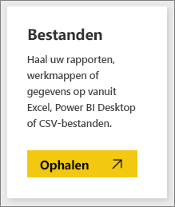
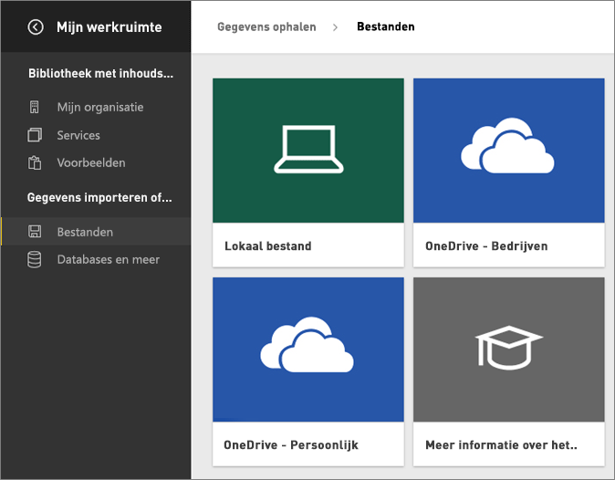
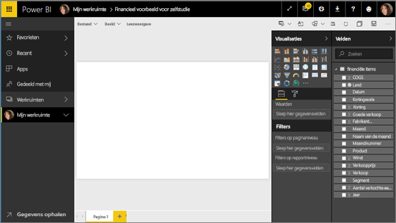
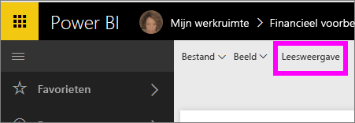
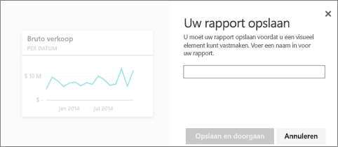
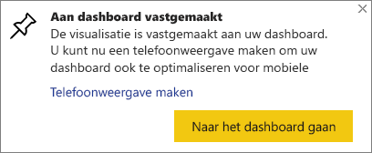
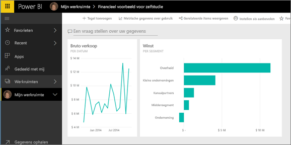

# Aan de slag met de Power BI-service (app.powerbi.com)
In deze zelfstudie leest u hoe u aan de slag kunt met de ***Power BI-service***. Als u wilt weten hoe de Power BI-service aansluit bij de andere Power BI-aanbiedingen, is het een goed idee om eerst [Wat is Power BI?](guided-learning/gettingstarted.yml?tutorial-step=1) te lezen.

Er is een gratis versie en een Pro-versie van de Power BI-service. Ongeacht welke versie u gebruikt: *als u al een account hebt*, opent u een browser en typt u app.powerbi.com om de Power BI-service te openen. Als u een nieuwe gebruiker bent, kunt u het beste beginnen op www.powerbi.com. Vanaf deze pagina kunt u meer informatie vinden over Power BI voordat u zich bij de service aanmeldt.  Wanneer u klaar bent om de service te proberen, selecteert u de koppeling **Gratis aanmelden** die u in de rechterbovenhoek ziet. Als uw beheerder Power BI al voor u heeft ingeschakeld, hoeft u de knop Gratis aanmelden niet te gebruiken maar kunt u rechtstreeks naar app.powerbi.com gaan. 

Als u hulp nodig hebt bij Power BI Desktop, leest u [Getting started with Power BI Desktop](desktop-getting-started.md) (Aan de slag met Power BI Desktop). Als u hulp zoekt voor een mobiele Power BI-app, leest u [Power BI-apps voor mobiele apparaten](mobile-apps-for-mobile-devices.md).

> [!TIP]
> Volgt u liever een gratis training in uw eigen tempo? [Schrijf u in voor de cursus Analyzing and Visualizing Data with Power BI op EdX](http://aka.ms/edxpbi).

Bezoek onze [afspeellijst op YouTube](https://www.youtube.com/playlist?list=PL1N57mwBHtN0JFoKSR0n-tBkUJHeMP2cP). Dit is een goede video om een algemeen beeld te krijgen van de Power BI-service:
> 
> <iframe width="560" height="315" src="https://www.youtube.com/embed/B2vd4MQrz4M" frameborder="0" allowfullscreen></iframe>
> 
> 
> 

Microsoft Power BI helpt u om up-to-date te blijven met de informatie die belangrijk voor u is.  Met behulp van de ***dashboards*** van de Power BI-service weet u altijd precies wat er speelt in uw bedrijf.  De dashboards bevatten ***tegels*** waarop u kunt klikken om ***rapporten*** te openen voor nog meer inzicht in de gegevens.  U kunt verbinding maken met verschillende ***gegevenssets*** om alle relevante gegevens op één plek samen te brengen. Wilt u weten wat de bouwstenen zijn van Power BI?  Zie [Power BI - Basisconcepten](service-basic-concepts.md).

Als u belangrijke gegevens hebt verzameld in Excel- of CSV-bestanden, kunt u een Power BI-dashboard maken om overal en altijd op de hoogte te blijven en inzichten te delen met anderen.  Hebt u een abonnement op een SaaS-toepassing zoals Salesforce?  U kunt een goede start maken door verbinding te maken met Salesforce en automatisch een dashboard te maken van die gegevens. [Bekijk ook alle andere SaaS-apps](service-get-data.md) waarmee u verbinding kunt maken. Als u deel uitmaakt van een organisatie, controleert u of er misschien [apps](service-create-distribute-apps.md) voor u zijn gepubliceerd.

Lees hier meer over de andere manieren om [gegevens op te halen voor Power BI](service-get-data.md).

## Stap 1: Gegevens ophalen
Hier volgt een voorbeeld van het ophalen van gegevens uit een CSV-bestand. Wilt u deze zelfstudie zelf uitvoeren? [Download dan dit CSV-voorbeeldbestand](http://go.microsoft.com/fwlink/?LinkID=521962).

1. [Meld u aan bij Power BI](http://www.powerbi.com/). Hebt u geen account? Geen probleem, u kunt er gratis een aanvragen.
2. Power BI wordt geopend in uw browser. Selecteer **Gegevens ophalen** onderin de linkernavigatiebalk.
   
   
3. Selecteer **Bestanden**. 
   
   
4. Blader naar het bestand op uw computer en kies **Openen**. Als u het bestand hebt opgeslagen in OneDrive voor Bedrijven, selecteert u die optie. Als u het bestand lokaal hebt opgeslagen, selecteert u **Lokaal bestand**. 
   
   
5. Voor deze zelfstudie selecteren we **Importeren** om het Excel-bestand toe te voegen als een gegevensset die we vervolgens kunnen gebruiken om rapporten en dashboards te maken. Als u **Uploaden** selecteert, wordt de hele Excel-werkmap geüpload naar Power BI, waar u deze kunt openen en bewerken in Excel Online.
   
   
6. Als de gegevensset klaar is, selecteert u **Gegevensset weergeven** om deze te openen in de rapporteditor. 

    

    Omdat we nog geen visualisaties hebben gemaakt, is het rapportcanvas nog leeg.

    

6. Bekijk de bovenste menubalk en kijk of u de optie **Leesweergave** ziet staan. Als u de optie voor de leesweergave kunt zien, betekent dit dat u zich in de **bewerkweergave** bevindt. 

    

    In de bewerkweergave kunt u uw rapporten maken en aanpassen omdat u de *eigenaar* van het rapport bent; u bent de *maker*. Wanneer u uw rapport met collega’s deelt, kunnen zij alleen interactief met het rapport werken in de leesweergave; zij worden *consumenten* genoemd. Lees meer over de [leesweergave en de bewerkweergave](service-reading-view-and-editing-view.md).
    
    Een uitstekende manier om vertrouwd te raken met de rapporteditor is door [een rondleiding te volgen](service-the-report-editor-take-a-tour.md).
   > 
 

## Stap 2: De gegevensset verkennen
Nu u verbinding met de gegevens hebt gemaakt, kunt u gaan verkennen.  Wanneer u iets interessants hebt gevonden, kunt u een dashboard maken om dit te controleren en te zien hoe dit na verloop van tijd verandert. Laten we zien hoe het werkt.
    
1. In de rapporteditor gebruiken we het deelvenster **Velden** aan de rechterkant van de pagina voor het bouwen van een visualisatie.  Schakel het selectievakje in van **Gross Sales** en **Date**.
   
   

2. Power BI analyseert de gegevens en maakt vervolgens een visualisatie.  Als u eerst **Date** hebt geselecteerd, ziet u een tabel.  Als u eerst **Gross Sales** hebt geselecteerd, ziet u een grafiek. Probeer de gegevens eens op een andere manier weer te geven. Laten we deze gegevens eens bekijken als lijndiagram. Selecteer het pictogram Lijndiagram (ook wel sjabloon genoemd) in het **deelvenster Visualisaties**.
   
   

3. Dit lijkt interessant, dus laten we deze *vastmaken* aan een dashboard. Beweeg de muisaanwijzer over de visualisatie en selecteer het pictogram **Vastmaken**.  Wanneer u deze visualisatie vastmaakt, wordt deze opgeslagen op uw dashboard en kunt u in één oogopslag zien wat de meest recente waarde is.
   
   

5. Omdat dit een nieuw rapport is, wordt u gevraagd dit rapport op te slaan voordat u een visualisatie aan een dashboard kan vastmaken. Geef uw rapport een naam (bijv. *Verkoop over periode*) en selecteer **Opslaan en doorgaan**. 
   
   
   
6. Laten we het lijndiagram aan het nieuwe dashboard vastmaken aan en deze de naam 'Financieel voorbeeld voor de zelfstudie' geven. 
   
   
   
 1. Selecteer **Vastmaken**.
   
    U ontvangt een bericht (in de rechterbovenhoek) dat de visualisatie als tegel aan uw dashboard is toegevoegd.
   
    

8. Selecteer **Naar het dashboard gaan** om de lijndiagram, die als tegel aan uw nieuwe dashboard is vastgemaakt, te bekijken. Maak het dashboard nog beter door meer visualisatietegels toe te voegen en [tegels een andere naam te geven, groter of kleiner te maken, te koppelen en te verplaatsen](service-dashboard-edit-tile.md).
   
   
   
   Selecteer de nieuwe tegel in het dashboard als u wilt terugkeren naar het rapport. U keert terug naar de rapporteditor in de leesweergave. Als u terug wilt naar de bewerkweergave, selecteert u **Rapport bewerken** in de bovenste menubalk. Eenmaal in de bewerkweergave, kunt u meer tegels verkennen en vastmaken. 

## Stap 3: ga verder met verkennen met behulp van Q&A (query's uitvoeren in natuurlijke taal)
1. Als u gegevens snel wilt verkennen, kunt u een vraag typen in het vak Een vraag stellen. Het vak Q&A bevindt zich boven aan uw dashboard (**Q&A over uw gegevens**) en in de bovenste menubalk in uw rapport (**Q&A**). Typ bijvoorbeeld eens ‘what segment had the most revenue’.
   
   

2. Via Q&A wordt een antwoord gezocht dat vervolgens als visualisatie wordt weergegeven. Selecteer het speldpictogram  om deze visualisatie ook in uw dashboard weer te geven.
3. Maak de visualisatie vast aan het dashboard ‘Financieel voorbeeld voor zelfstudie’.
   
    

4. Ga terug naar uw dashboard. Hier ziet u de nieuwe tegel.

   

## Volgende stappen
Klaar om meer uit te proberen?  Hier volgen enkele goede manieren om nader kennis te maken met Power BI.

* [Verbinding maken met een andere gegevensset](service-get-data.md).
* [Uw dashboard delen](service-share-dashboards.md) met uw collega's.
* [Tips voor het ontwerpen van dashboards lezen](service-dashboards-design-tips.md).
* Uw dashboards bekijken met een [Power BI-app op een mobiel apparaat](mobile-apps-for-mobile-devices.md).

Nog niet helemaal zeker van uw zaak? Neem dan eerst deze onderwerpen door om nog meer vertrouwd te raken met Power BI.

* [Lees hoe rapporten, gegevenssets, dashboards en tegels bij elkaar passen](service-basic-concepts.md)
* Ga naar onze website voor [Power BI Guided Learning](guided-learning/index.md) (Power BI: Gestuurd leren) om een aantal (zeer korte) trainingen te volgen
* Bekijk enkele [Power BI-video's](videos.md)
* [Voorbeelden die u kunt gebruiken](sample-datasets.md)

### Blijf op de hoogte met Power BI
* Volg [@MSPowerBI op Twitter](https://twitter.com/mspowerbi)
* Abonneer u op ons [YouTube-videokanaal](https://www.youtube.com/channel/UCy--PYvwBwAeuYaR8JLmrfg)
* Bekijk onze [introductiewebinars over Power BI](webinars.md) wanneer het u uitkomt
* Weet u niet zeker waar u de juiste informatie kunt vinden? Ga naar onze [pagina met tien tips voor het krijgen van hulp](service-tips-for-finding-help.md).

Nog vragen? [Misschien dat de Power BI-community het antwoord weet](http://community.powerbi.com/)

