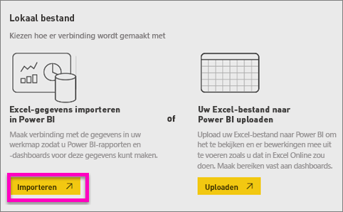
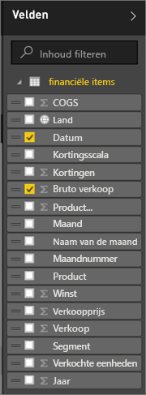
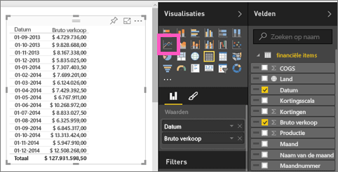
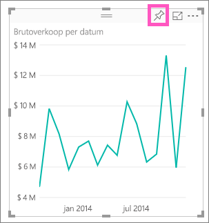
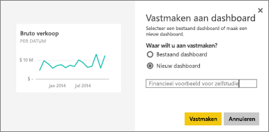
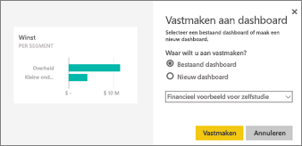

# Aan de slag met de Power BI-service
In deze zelfstudie leest u hoe u aan de slag kunt met de ***Power BI-service***. Als u wilt weten hoe de Power BI-service aansluit bij de andere Power BI-aanbiedingen, is het een goed idee om eerst [Wat is Power BI?](guided-learning/gettingstarted.yml#step-1) te lezen.

Er is een gratis versie en een Pro-versie van de Power BI-service. Ongeacht welke versie u gebruikt, opent u een browser en typt u www.powerbi.com om aan de slag te gaan. Als u zich al hebt geregistreerd, selecteert u de koppeling **Sign in** in de rechterbovenhoek. Als u zich nog niet hebt geregistreerd voor de Power BI-service, selecteert u de koppeling **Sign up free**.

Als u hulp nodig hebt bij Power BI Desktop, leest u [Getting started with Power BI Desktop](desktop-getting-started.md) (Aan de slag met Power BI Desktop). Als u hulp zoekt voor een mobiele Power BI-app, leest u [Power BI-apps voor mobiele apparaten](mobile-apps-for-mobile-devices.md).

> [!TIP]
> Volgt u liever een gratis training in uw eigen tempo? [Schrijf u in voor de cursus Analyzing and Visualizing Data with Power BI op EdX](http://aka.ms/edxpbi).

Bezoek onze [afspeellijst op YouTube](https://www.youtube.com/playlist?list=PL1N57mwBHtN0JFoKSR0n-tBkUJHeMP2cP). Dit is een goede video om een algemeen beeld te krijgen van de Power BI-service:
> 
> <iframe width="560" height="315" src="https://www.youtube.com/embed/B2vd4MQrz4M" frameborder="0" allowfullscreen></iframe>
> 
> 
> 

Microsoft Power BI helpt u om up-to-date te blijven met de informatie die belangrijk voor u is.  Met behulp van de ***dashboards*** van de Power BI-service weet u altijd precies wat er speelt in uw bedrijf.  De dashboards bevatten ***tegels*** waarop u kunt klikken om ***rapporten*** te openen voor nog meer inzicht in de gegevens.  U kunt verbinding maken met verschillende ***gegevenssets*** om alle relevante gegevens op één plek samen te brengen. Wilt u weten wat de bouwstenen zijn van Power BI?  Zie [Power BI - Basisconcepten](service-basic-concepts.md).

Als u belangrijke gegevens hebt verzameld in Excel- of CSV-bestanden, kunt u een Power BI-dashboard maken om overal en altijd op de hoogte te blijven en inzichten te delen met anderen.  Hebt u een abonnement op een SaaS-toepassing zoals Salesforce?  U kunt een goede start maken door [verbinding te maken met Salesforce](service-connect-to-salesforce.md) en automatisch een dashboard te maken van die gegevens. [Bekijk ook alle andere SaaS-apps](service-get-data.md) waarmee u verbinding kunt maken. Als u deel uitmaakt van een organisatie, controleert u of er misschien [apps](service-create-distribute-apps.md) voor u zijn gepubliceerd.

Lees hier meer over de andere manieren om [gegevens op te halen voor Power BI](service-get-data.md).

## Stap 1: Gegevens ophalen
Hier volgt een voorbeeld van het ophalen van gegevens uit een CSV-bestand. Wilt u deze zelfstudie zelf uitvoeren? [Download dan dit CSV-voorbeeldbestand](http://go.microsoft.com/fwlink/?LinkID=521962).

1. [Meld u aan bij Power BI](http://www.powerbi.com/). Hebt u geen account? Geen probleem, u kunt er gratis een aanvragen.
2. Power BI wordt geopend in uw browser. Selecteer **Gegevens ophalen** linksonder in het navigatievenster.
   
   
3. Selecteer **Bestanden**. 
   
   
4. Selecteer **Lokaal bestand**, blader naar het bestand op uw computer en kies **Openen**.
   
   
5. Voor deze zelfstudie selecteren we **Importeren** om het Excel-bestand toe te voegen als een gegevensset die we vervolgens kunnen gebruiken om rapporten en dashboards te maken.  
   
   > [!NOTE]
   > Als u **Uploaden** selecteert, wordt de hele Excel-werkmap geüpload naar Power BI, waar u deze kunt openen en bewerken in Excel Online.
   > 
   > 
   
   
6. Als de gegevensset klaar is, selecteert u **Gegevensset weergeven** om deze te openen in de rapporteditor. .
   
   > [!TIP]
   > Een uitstekende manier om vertrouwd te raken met de rapporteditor is door [een rondleiding te volgen](service-the-report-editor-take-a-tour.md).
   > 
   > 

## Stap 2: De gegevensset verkennen
U hebt nu verbinding gemaakt met de gegevens en kunt nu op zoek gaan naar inzichten.  Wanneer u iets hebt gevonden dat u wilt bewaken, kunt u een dashboard maken om op de hoogte te blijven van wijzigingen.

1. Selecteer de afbeelding van de gegevensset in het dashboard om de gegevens te verkennen waarmee u net verbinding hebt gemaakt of selecteer onder het kopje **Gegevenssets** de naam van de gegevensset om deze te openen. Hiermee opent u de gegevensset als een leeg rapport.
   
   
   
   > [!NOTE]
> Een andere manier om uw gegevens te verkennen, is **Snelle inzichten**.  Zie [Introduction to Quick Insights](service-insights.md) (Inleiding tot Snelle inzichten) voor meer informatie.
   > 
   > 
2. Selecteer in de lijst **Velden** aan de rechterkant van de pagina velden voor het samenstellen van een visualisatie.  Schakel het selectievakje in van **Gross Sales** en **Date**.
   
   
3. Power BI analyseert de gegevens en maakt vervolgens een visualisatie.  Als u eerst **Date** hebt geselecteerd, ziet u een tabel.  Als u eerst **Gross Sales** hebt geselecteerd, ziet u een grafiek. Probeer de gegevens eens op een andere manier weer te geven. Maak een lijndiagram van de grafiek door de optie Lijndiagram te selecteren.
   
   
4. Wanneer u een visualisatie hebt gevonden die u wilt toevoegen aan uw dashboard, beweegt u de muisaanwijzer over de visualisatie en selecteert u het pictogram **Vastmaken**.  Wanneer u deze visualisatie vastmaakt, wordt deze opgeslagen in uw dashboard en kunt u in een oogopslag zien wat de meest recente waarde is.
   
   
5. Omdat dit een nieuw rapport is, moet u het opslaan voordat u een visualisatie van het rapport kunt vastmaken aan het dashboard. Geef het rapport een naam (zoals *Sales Over Time*) en selecteer **Opslaan en doorgaan**. 
   
   
   
   Het nieuwe rapport wordt in het navigatievenster weergegeven onder het kopje **Rapporten**.
6. Maak de tegel vast aan een bestaand dashboard of aan een nieuw dashboard. 
   
   
   
   * **Bestaand dashboard**: selecteer de naam van het dashboard in de vervolgkeuzelijst.
   * **Nieuw dashboard**: typ de naam van het nieuwe dashboard.
7. Selecteer **Vastmaken**.
   
   U ontvangt een bericht (in de rechterbovenhoek) dat de visualisatie als tegel aan uw dashboard is toegevoegd.
   
   
8. Selecteer **Naar het dashboard gaan** om het nieuwe dashboard met de vastgemaakte tegel te bekijken. Het lijndiagram is als een tegel vastgemaakt aan het dashboard. Maak het dashboard nog beter door [tegels een andere naam te geven, groter of kleiner te maken, te koppelen en te verplaatsen](service-dashboard-edit-tile.md).
   
   
   
   Selecteer de nieuwe tegel in het dashboard als u wilt terugkeren naar het rapport.

## Stap 3: Gegevens verkennen met Een vraag stellen (query's uitvoeren in natuurlijke taal)
1. Als u gegevens snel wilt verkennen, kunt u een vraag typen in het vak Een vraag stellen. Dit vak bevindt zich boven aan het dashboard. Typ bijvoorbeeld eens **what segment had the most revenue**.
   
   
2. Selecteer het pictogram Vastmaken  om deze visualisatie ook weer te geven in uw dashboard.
3. De visualisatie vastmaken aan het dashboard Financial Sample.
   
    
4. Selecteer de pijl-links voor **Q&A afsluiten**  om terug te gaan naar uw dashboard, waar u de nieuwe tegel ziet.

## Volgende stappen
Klaar om meer uit te proberen?  Hier volgen enkele geweldige manieren om nader kennis te maken met Power BI.

* [Verbinding maken met een andere gegevensset](service-get-data.md).
* [Uw dashboard delen](service-share-dashboards.md) met uw collega's.
* [Tips voor het ontwerpen van dashboards lezen](service-dashboards-design-tips.md).
* Uw dashboards bekijken met een [Power BI-app op een mobiel apparaat](mobile-apps-for-mobile-devices.md).

Nog niet helemaal zeker van uw zaak? Neem dan eerst deze onderwerpen door om nog meer vertrouwd te raken met Power BI.

* [Lees hoe rapporten, gegevenssets, dashboards en tegels bij elkaar passen](service-basic-concepts.md)
* [Power BI-video's](videos.md)
* [Voorbeelden die u kunt gebruiken](sample-datasets.md)

### Blijf op de hoogte met Power BI
* Volg [@MSPowerBI op Twitter](https://twitter.com/mspowerbi)
* Abonneer u op ons [YouTube-videokanaal](https://www.youtube.com/channel/UCy--PYvwBwAeuYaR8JLmrfg)
* Bekijk onze [introductiewebinars over Power BI](webinars.md) wanneer het u uitkomt
* Weet u niet zeker waar u de juiste informatie kunt vinden? Ga naar onze [pagina met tien tips voor het krijgen van hulp](service-tips-for-finding-help.md).

Nog vragen? [Misschien dat de Power BI-community het antwoord weet](http://community.powerbi.com/).

