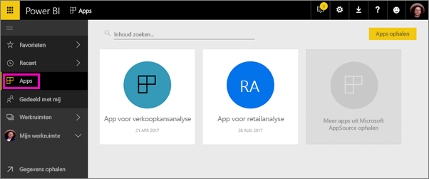
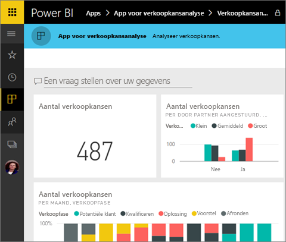
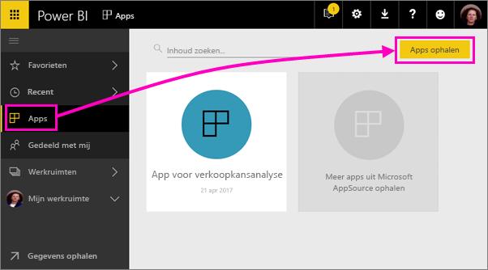

# Apps installeren en gebruiken met dashboards en rapporten in Power BI
*Apps* brengen in Power BI gerelateerde dashboards en rapporten allemaal op één plek samen. Personen in uw organisatie kunnen apps maken en distribueren met belangrijke bedrijfsinformatie. [Externe services](service-connect-to-services.md) waar u reeds gebruik van maakt, zoals Google Analytics en Microsoft Dynamics CRM, bieden ook Power BI-apps. 

Apps zijn gemakkelijk te vinden en installeren in de Power BI-service ([https://powerbi.com](https://powerbi.com)) en op uw mobiele apparaat. Nadat u een app hebt geïnstalleerd, hoeft u de namen van veel verschillende dashboards niet meer te onthouden omdat ze allemaal bij elkaar zijn in de app, in uw browser of op uw mobiele apparaat.

Bij apps ziet u automatisch de wijzigingen wanneer de auteur van de app updates publiceert. De auteur bepaalt ook hoe vaak de gegevens worden gepland om te worden vernieuwd, zodat u zich geen zorgen hoeft te maken over het up-to-date houden van de gegevens. 

Plannen voor het ontwerpen van een app? Zie [Apps in Power BI maken en publiceren](service-create-distribute-apps.md) voor meer informatie.

## Een nieuwe app verkrijgen
U kunt apps op verschillende manieren verkrijgen. De auteur van de app kan de app automatisch installeren in uw Power BI-account of u een directe koppeling naar een app sturen, of u kunt er naar zoeken in AppSource, waar u alle apps ziet waar u toegang tot hebt. In Power BI op uw mobiele apparaat kunt u deze alleen installeren via een directe verbinding en niet vanuit AppSource. Als de auteur van de app de app automatisch installeert, ziet u deze in uw lijst met apps.

### Een app vanuit een directe koppeling installeren
De eenvoudigste manier om zelf een nieuwe app te installeren is door een directe koppeling te krijgen van de auteur van de app. Power BI maakt een installatiekoppeling die de auteur naar u kan sturen.

**Op uw computer** 

Wanneer u klikt op de koppeling in de e-mail wordt Power BI-service ([https://powerbi.com](https://powerbi.com)) in een browser geopend. U bevestigt dat u de app wilt installeren en de landingspagina van de app wordt geopend.

**Op uw iOS- of mobiele Android-apparaat** 

Wanneer u op de koppeling in de e-mail op uw mobiele apparaat klikt, wordt de app automatisch geïnstalleerd en wordt de app-inhoudslijst geopend. 

### De app uit Microsoft AppSource downloaden
U kunt ook apps binnen Microsoft AppSource zoeken en installeren. 

1. Selecteer in het linkernavigatievenster de optie **Apps**  > **Apps verkrijgen**. 
   
     
2. In AppSource onder **Mijn organisatie** kunt u zoeken om de resultaten te filteren en de gewenste app vinden.
   
     
3. Selecteer **Nu downloaden** om deze aan uw pagina met apps toe te voegen. 

## Interactie met de dashboards en rapporten in de app
U kunt nu de gegevens in de dashboards en rapporten in de app verkennen. U hebt toegang tot de standaard Power BI-interacties zoals filteren, markeren, sorteren en inzoomen. Meer informatie over [Interactie met rapporten in Power BI](service-interact-with-a-report-in-reading-view.md). 

U kunt wijzigingen niet opslaan, maar u kunt altijd [de gegevens exporteren naar Excel ](power-bi-visualization-export-data.md) uit een tabel of ander visueel element in een rapport.

## Volgende stappen
* [Apps maken en publiceren in Power BI](service-create-distribute-apps.md)
* [Power BI-apps voor externe services](service-connect-to-services.md)
* Vragen? [Misschien dat de Power BI-community het antwoord weet](http://community.powerbi.com/)

