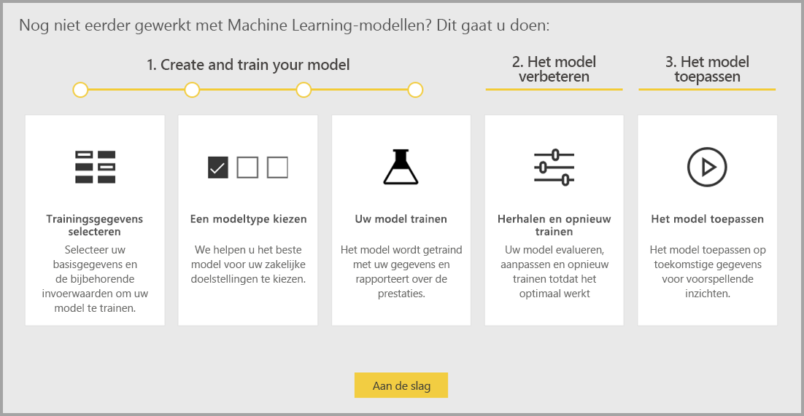
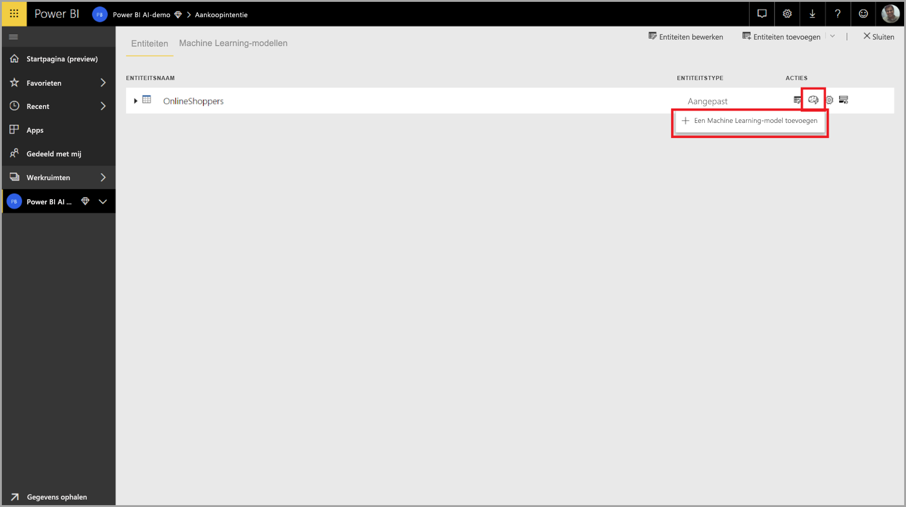
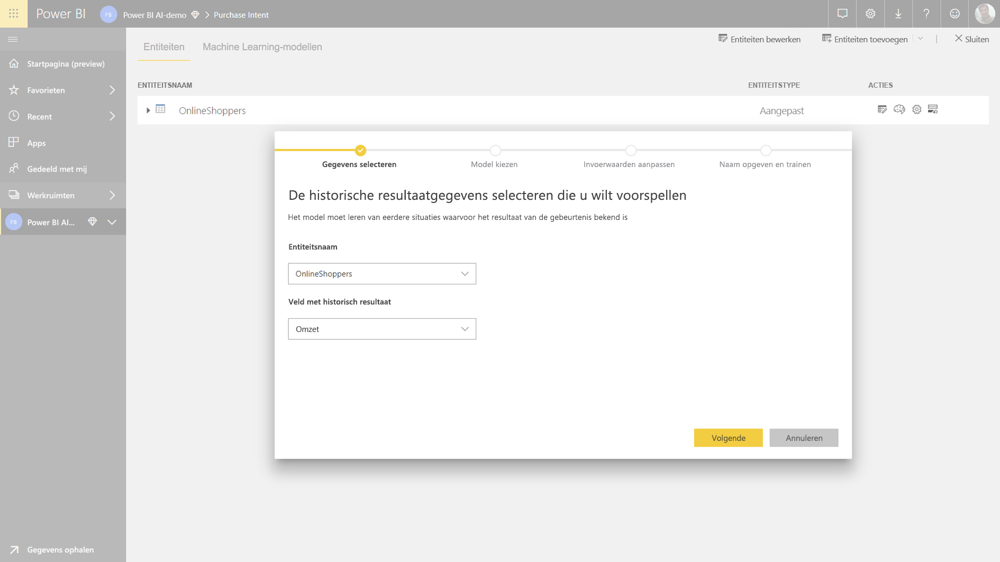
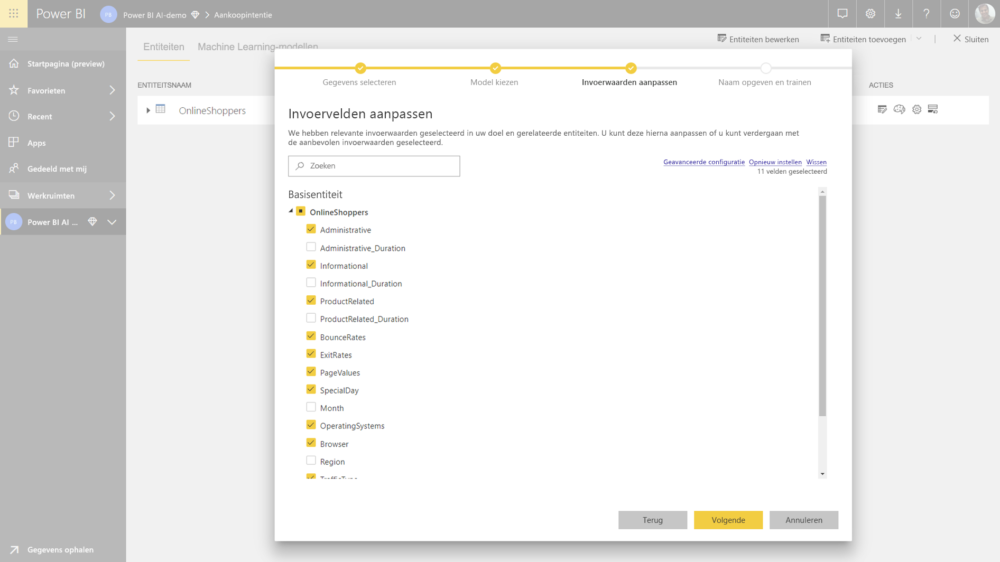
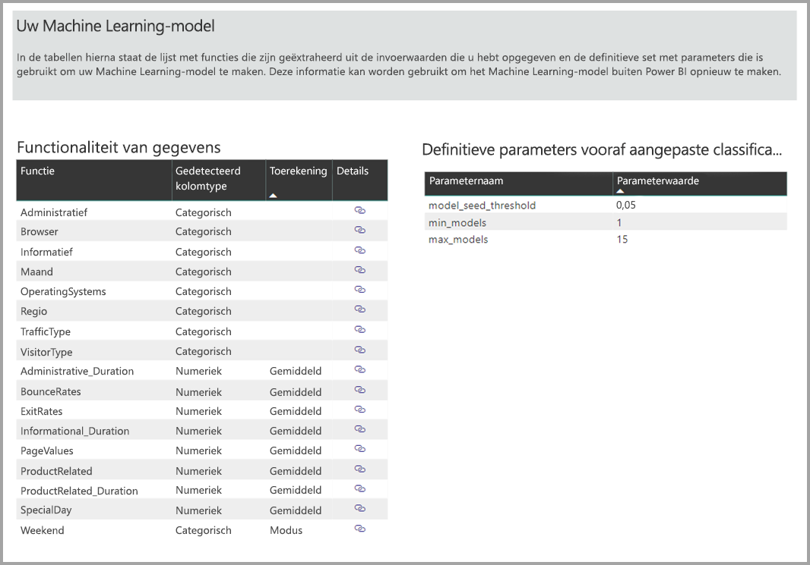
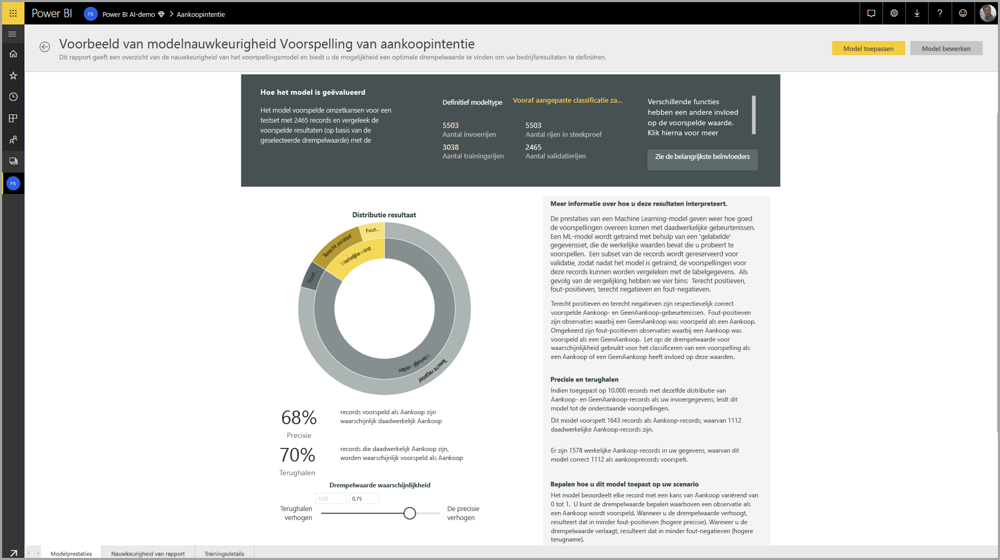
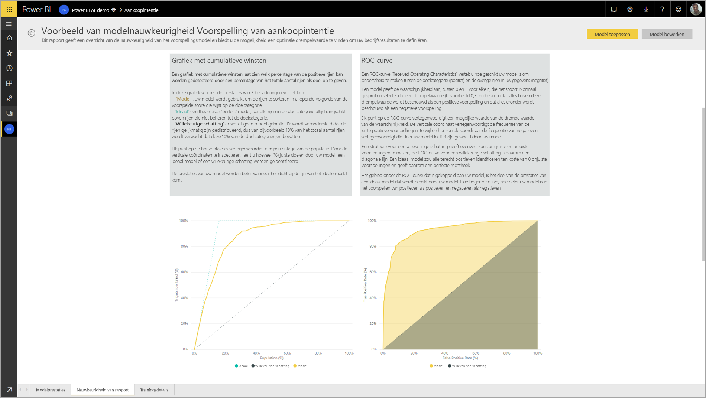
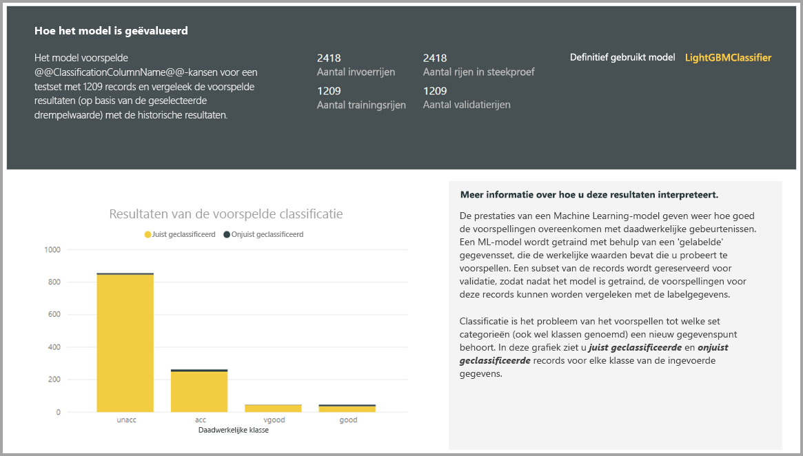
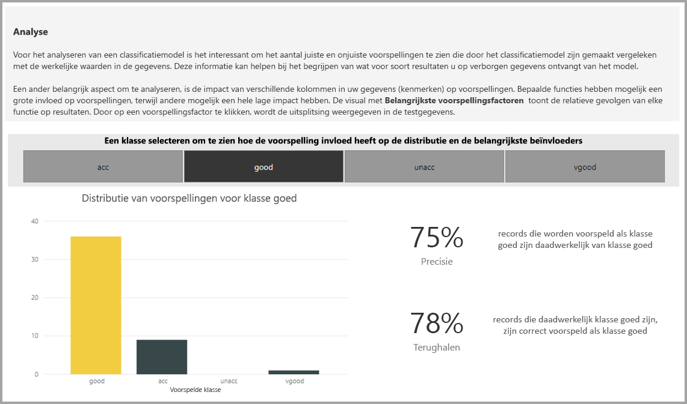
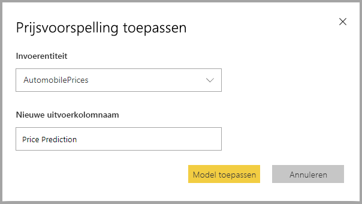

# Geautomatiseerde Machine Learning in Power BI (preview)

Geautomatiseerde machine learning-(AutoML) voor gegevensstromen kan bedrijfsanalisten te trainen, te valideren en aanroepen van Machine Learning-modellen rechtstreeks in Power BI. Het bevat een eenvoudige ervaring voor het maken van een nieuw ML-model waar analisten hun gegevensstromen gebruiken kunnen om op te geven van de ingevoerde gegevens voor het model te trainen. De service automatisch haalt de meest relevante functies, selecteert u een geschikte algoritme en verbetert de prestatie en valideert het ML-model. Nadat een model wordt getraind, genereert Power BI automatisch een rapport met de resultaten van validatie met uitleg van de prestaties en resultaten voor analisten. Het model kan vervolgens worden aangeroepen op een nieuwe of bijgewerkte gegevens in de gegevensstroom.

Geautomatiseerde machine learning is beschikbaar voor gegevensstromen die worden gehost op Power BI Premium en Embedded-capaciteit. In dit voorbeeld kunt u machine learning-modellen voor binaire voorspelling, classificatie en Regressiemodellen trainen AutoML.

## Werken met AutoML

[Power BI-gegevensstromen](service-dataflows-overview.md) bieden de self-service voor gegevensvoorbereiding voor big data. AutoML kunt u gebruikmaken van uw gegevens prep inspanningen voor het bouwen van machine learning-modellen, direct in Power BI.

AutoML in Power BI maakt het mogelijk om gegevensanalisten gegevensstromen gebruiken voor het bouwen van machine learning-modellen met een vereenvoudigde ervaring alleen Power BI-vaardigheden. De meeste van de data science achter het maken van de ML-modellen wordt automatisch door Power BI, met guardrails om ervoor te zorgen dat het model die worden geproduceerd goede kwaliteit en inzicht om te voorzien van volledig inzicht in het proces dat wordt gebruikt voor het maken van uw ML-model heeft.

AutoML ondersteunt het maken van **binaire voorspelling**, **classificatie**, en **regressie** modellen voor gegevensstromen. Dit zijn de soorten beheerde machine learning-modellen, wat betekent dat ze meer van de bekende resultaten van afgelopen opmerkingen bij het voorspellen van de resultaten van andere metingen. De invoergegevensset voor een model AutoML training is een set records die zijn **met het label** met de bekende resultaten.

AutoML in Power BI kan worden geïntegreerd [ML geautomatiseerde](https://docs.microsoft.com/azure/machine-learning/service/concept-automated-ml) uit de [Azure Machine Learning-service](https://docs.microsoft.com/azure/machine-learning/service/overview-what-is-azure-ml) om uw ML-modellen te maken. U kunt een Azure-abonnement het gebruik van AutoML in Power BI echter niet nodig. Het proces van training en die als host fungeert voor het ML-modellen wordt volledig beheerd door de Power BI-service.

Nadat een ML-model wordt getraind, genereert AutoML automatisch een Power BI-rapport waarin wordt uitgelegd van de waarschijnlijk prestaties van uw ML-model. AutoML ligt de nadruk op explainability, markeert de beoordelaars tussen uw invoer die invloed hebben op de voorspellingen geretourneerd door uw model. Het rapport bevat ook belangrijke metrische gegevens voor het model, afhankelijk van het type ML-model.

Andere pagina's van het gegenereerde rapport tonen statistische samenvatting van het model en de trainingdetails van de. De statistische samenvatting is van belang zijn voor gebruikers die graag zou willen zien van de standaard data science metingen van de prestaties voor het model. De trainingdetails van de geven een overzicht van alle herhalingen die zijn uitgevoerd voor het maken van uw model, met de parameters modellering is gekoppeld. Ook wordt beschreven hoe elke invoer is gebruikt om de ML-model te maken.

U kunt uw ML-model vervolgens toepassen op uw gegevens voor het scoren. Wanneer de gegevensstroom wordt vernieuwd, wordt de voorspellingen op basis van uw ML-model worden automatisch toegepast op uw gegevens. Power BI bevat ook een geïndividualiseerde uitleg voor elke specifieke voorspelling score die het ML-model produceert.

## Het maken van een machine learning-model

In deze sectie wordt beschreven hoe u een AutoML learning-model maken. 

### Gegevens voorbereiden voor het maken van een ML-model

Voor het maken van een machine learning-model in Power BI, moet u eerst een gegevensstroom voor de gegevens maken met de historische resultaten-informatie, dat wordt gebruikt voor het ML-model te trainen. Zie voor meer informatie over het configureren van de gegevensstroom [dataprep selfservice in Power BI](service-dataflows-overview.md).

In de huidige release gebruikt Power BI gegevens uit één entiteit voor het ML-model te trainen. Dus als uw historische gegevens uit meerdere entiteiten bestaat, moet u handmatig toevoegen de gegevens in een entiteit één gegevensstroom. U moet ook toevoegen berekende kolommen voor elke metrische bedrijfswaarden die sterk voorspellingsfactoren voor de resultaten die u probeert worden kunnen te voorspellen.

AutoML heeft specifieke vereisten voor het trainen van een machine learning-model. Deze vereisten worden beschreven in de secties hieronder, op basis van de betreffende model-typen.

### Configureren van de invoer voor ML-model

Voor het maken van een model AutoML selecteert u het ML-pictogram in de **acties** kolom van de entiteit gegevensstroom met de historische gegevens, en selecteer **toevoegen een machine learning-model**.

Een vereenvoudigde ervaring wordt gestart, die bestaan uit een wizard die u bij het proces begeleidt voor het maken van het ML-model. De wizard omvat de volgende eenvoudige stappen.

1. De entiteit met de uitkomst van historische gegevens, en het veld waarvan u een voorspelling wilt selecteren
2. Een model kiezen op basis van het type voorspelling die u graag zou willen zien
3. Selecteer de invoer die u wilt dat het model om te gebruiken als voorspellende signalen
4. Naam van het model en de configuratie op te slaan

Het veld historische resultaten identificeert de label-kenmerk voor het trainen van het ML-model, weergegeven in de volgende afbeelding.

Wanneer u het veld historische resultaat opgeeft, wordt AutoML analyseert de labelgegevens voor het identificeren van de typen van ML-modellen die voor die gegevens kunnen worden getraind en stelt de meest waarschijnlijke ML modeltype die kan worden getraind. 

> [!NOTE]
> Sommige modeltypen kunnen niet worden ondersteund voor de gegevens die u hebt geselecteerd.

AutoML analyseert ook alle velden in de geselecteerde entiteit voorstellen van de invoer die kunnen worden gebruikt voor het ML-model te trainen. Dit proces is bij benadering en is op basis van statistische analyses, zodat u de invoer gebruikt moet bekijken. Geen invoeren die afhankelijk van de historische resultaten (of het labelveld zijn) mag niet worden gebruikt voor het trainen van het ML-model, omdat ze zullen de prestaties beïnvloeden.

U kunt in de laatste stap wordt het model een naam en sla de instellingen ervan.

In dit stadium wordt u gevraagd om te vernieuwen van de gegevensstroom, die de training voor het ML-model begint.

### Training voor ML-model

Training van AutoML modellen is een onderdeel van het vernieuwen van de gegevensstroom. AutoML bereidt u eerst uw gegevens voor training.

AutoML splitst de historische gegevens die u opgeeft in een trainings- en testsets. De testgegevensset is een set evaluatieset, die wordt gebruikt voor het valideren van de modelprestaties na de training. Deze worden gerealiseerd als **trainings- en testdoeleinden** entiteiten in de gegevensstroom. Kruisvalidatie AutoML gebruikt voor de validatie.

Vervolgens elke invoerveld wordt geanalyseerd en toerekening wordt toegepast, waarmee ontbrekende waarden vervangt door de vervangende waarden. Een aantal verschillende toerekening strategieën worden gebruikt door AutoML. Alle vereiste steekproeven en normalisering worden vervolgens toegepast op uw gegevens.

AutoML geldt verschillende transformaties elke geselecteerde invoerveld op basis van het gegevenstype en de statistische eigenschappen zijn. Deze transformaties AutoML gebruikt om op te halen van functies voor gebruik in het ML-model te trainen.

Het trainingsproces voor AutoML modellen bestaat uit maximaal 50 iteraties met verschillende modellen algoritmen en hyperparameter instellingen vinden van het model met de beste prestaties. De prestaties van elk van deze modellen worden beoordeeld door validatie met de gegevensset evaluatieset-test. Tijdens deze stap training maakt AutoML verschillende pijplijnen voor training en validatie van deze herhalingen. Het proces voor het beoordelen van de prestaties van de modellen kan tijd duren, waar dan ook van enkele minuten tot enkele uren, afhankelijk van de grootte van uw gegevensset en de toegewezen capaciteit van beschikbare bronnen.

In sommige gevallen kan het uiteindelijke model gegenereerd gebruiken ensembles leren, waarbij meerdere modellen worden gebruikt om beter voorspellende prestaties te leveren.

### AutoML model explainability

Nadat het model is getraind, analyseert AutoML de relatie tussen de functies van de invoer en de uitvoer van het model. Deze beoordeelt de grootte en richting van een wijziging in de uitvoer van het model voor de gegevensset evaluatieset test voor elke invoer functie. Dit staat bekend als de *belang functie*.

### AutoML model rapport

AutoML genereert een Power BI-rapport met een overzicht van de prestaties van het model tijdens de validatie, samen met het belang van de algemene functie. Het rapport bevat een overzicht van de resultaten van het ML-model toe te passen op de testgegevens voor evaluatie en de voorspellingen met de bekende resultaat waarden te vergelijken.

U kunt het rapport model om te begrijpen van de prestaties controleren. U kunt ook valideren dat de beoordelaars van het model zijn afgestemd op de zakelijke inzichten over de bekende resultaten.

De grafieken en metingen die worden gebruikt om te beschrijven van de modelprestaties in het rapport, is afhankelijk van het modeltype. Deze worden prestatiegrafieken weergegeven en metingen worden in de volgende secties beschreven.

Aanvullende pagina's in het rapport wordt over het model vanuit het oogpunt van data science statistische metingen beschreven. Bijvoorbeeld, de **binaire voorspelling** rapport bevat een grafiek winst en de ROC-curve voor het model.

De rapporten bevatten ook een **Training Details** pagina een beschrijving bevat van hoe het model is getraind en bevat een grafiek met een beschrijving van de modelprestaties in elk van de herhalingen wordt uitgevoerd.

Een andere sectie op deze pagina wordt beschreven hoe de toerekening methode gebruikt voor het invullen van de ontbrekende waarden voor de invoervelden, evenals hoe elke invoerveld is omgezet om op te halen van de functies die worden gebruikt in het model. Dit omvat ook de parameters die worden gebruikt door het uiteindelijke model.

Als het model die worden geproduceerd ensembles learning gebruikt, dan zal de **Training Details** pagina bevat tevens een sectie met een beschrijving van het gewicht van elk onderdeel model in de ensembles, evenals de bijbehorende parameters.

## Het model AutoML toepassen

Als u tevreden met de prestaties van de ML-model dat is gemaakt bent, kunt u deze toepassen op nieuwe of bijgewerkte gegevens wanneer de gegevensstroom wordt vernieuwd. U kunt dit doen in het rapport model selecteren de **toepassen** knop in de rechterbovenhoek.

Als u wilt toepassen op het ML-model, moet u de naam van de entiteit waarnaar het moet worden toegepast, en het voorvoegsel voor de kolommen die worden toegevoegd aan deze entiteit voor de model-uitvoer. Het standaardvoorvoegsel voor de kolomnamen is de naam van het model. De *toepassen* functie omvat mogelijk extra parameters die specifiek zijn voor het modeltype.

Toepassen van het ML-model maakt u een nieuwe gegevensstroom-entiteit met het achtervoegsel **verrijkt < modelnaam >** . Bijvoorbeeld, als u van toepassing is de _PurchaseIntent_ model aan de _OnlineShoppers_ entiteit, de uitvoer wordt gegenereerd de **OnlineShoppers verrijkt PurchaseIntent**.

De uitvoer-entiteit kan niet op dit moment worden gebruikt om een voorbeeld van de resultaten van de ML-model in de Power Query-editor. De uitvoerkolommen bevatten altijd null als resultaat. U kunt de resultaten, een tweede entiteit met het achtervoegsel uitvoer **verrijkt < modelnaam > Preview-versie** wordt gemaakt wanneer het model wordt toegepast.

U moet de gegevensstroom, om een voorbeeld van de resultaten in de Query-Editor te vernieuwen.

Wanneer u het model toepast, houdt AutoML altijd uw voorspellingen bijgewerkt wanneer de gegevensstroom wordt vernieuwd.

AutoML bevat ook een geïndividualiseerde uitleg voor elke rij die het beoordeelt in de uitvoer-entiteit.

Als u de inzichten en voorspellingen op basis van het ML-model in een Power BI-rapport, kunt u verbinding met de entiteit uitvoer van het gebruik van Power BI Desktop de **gegevensstromen** connector.

## Binaire Voorspellingsmodellen

Binaire voorspellingsmodellen meer voorheen bekend als **binaire classificatie modellen**, worden gebruikt voor het classificeren van een gegevensset in twee groepen. Ze worden gebruikt voor het voorspellen van gebeurtenissen die mogelijk een binaire resultaten, zoals of een verkoopkans wordt geconverteerd, of een account wordt verloop, of een factuur wordt betaald op tijd; een transactie is of frauduleuze, enzovoort.

Omdat het resultaat binaire is, Power BI wordt verwacht dat het label voor een binaire voorspellingsmodel moet een Booleaanse waarde, met bekende resultaten met het label wordt **waar** of **false**. Bijvoorbeeld in een model van de conversie verkoopkans verkoopkansen die zijn gewonnen zijn met het label ' True ', die verloren zijn gegaan ONWAAR zijn gelabeld en de openstaande verkoopkansen zijn met het label null zijn.

De uitvoer van een binaire voorspellingsmodel is een kans op score, waarin de kans dat het resultaat overeenkomt met de waarde voor het label wordt de waarde true wordt bereikt.

### Een binaire voorspellingsmodel training

Voor het maken van een binaire voorspellingsmodel, moet de invoer-entiteit die uw trainingsgegevens bevatten een Boole-veld hebben als het veld historische resultaten voor het identificeren van de laatste bekende resultaten.

Vereisten:

* Een Booleaanse veld moet worden gebruikt als het veld historische resultaten
* Minimaal 50 rijen van historische gegevens is vereist voor elke klasse van de resultaten

Als de laatste resultaten worden aangeduid met de velden van een ander gegevenstype, kunt u in het algemeen een berekende kolom voor het transformeren van deze in een Booleaanse waarde met Power Query toevoegen.

Het proces dat wordt gemaakt voor een binaire voorspellingsmodel dezelfde volgt stappen als andere AutoML modellen, zoals beschreven in de sectie **configureren van de invoer voor ML-model** hierboven.

### Binaire voorspelling model rapport

De binaire voorspellingsmodel levert als uitvoer een kans dat een record het resultaat gedefinieerd door de labelwaarde Booleaanse als waar een. Het rapport bevat een slicer voor de drempelwaarde voor waarschijnlijkheid, die van invloed op hoe de scores boven en onder de drempelwaarde voor waarschijnlijkheid worden geïnterpreteerd.

Het rapport beschrijft de prestaties van het model in termen van *echt positieven*, *fout-positieven*, *waar negatieven* en *False negatieven*. Echte positieven en waar negatieven zijn correct voorspelde resultaten voor de twee klassen in de resultaat-gegevens. Fout-positieven worden resultaten die het werkelijke Booleaanse label van de waarde False heeft, maar zijn voorspeld als waar. False negatieven zijn daarentegen resultaten waar de werkelijke Booleaanse labelwaarde True is, maar zijn voorspeld als onwaar.

Metingen, zoals precisie en zoals eerder vermeld, wordt het effect van de drempelwaarde voor waarschijnlijkheid beschreven op de verwachte resultaten. De drempelwaarde voor waarschijnlijkheid slicer kunt u een drempel voor een goede balans tussen precisie en terughalen synchronisatiemethode selecteren.

De **rapport nauwkeurigheid** pagina van het model-rapport bevat de *cumulatieve winsten* grafiek en de ROC-curve voor het model. Dit zijn statistische metingen van de modelprestaties van het. De rapporten bevatten beschrijvingen van de grafieken weergegeven.

### Een binaire voorspellingsmodel toepassen

Als u wilt een binair voorspellingsmodel toepassen, moet u de entiteit opgeven met de gegevens die u wilt toepassen van de voorspellingen op basis van het ML-model. Andere parameters bevatten het voorvoegsel van de uitvoer kolom en de drempelwaarde voor waarschijnlijkheid voor het classificeren van de voorspelde resultaten.

Wanneer een binaire voorspellingsmodel wordt toegepast, voegt drie uitvoerkolommen toe aan de entiteit verrijkt uitvoer. Dit zijn de **PredictionScore**, **PredictionOutcome** en **PredictionExplanation**. De kolomnamen in de entiteit hebben het voorvoegsel dat is opgegeven wanneer het model wordt toegepast.

De **PredictionOutcome** kolom bevat het label voorspelde resultaten. Records met de kansen die de drempelwaarde overschrijden worden voorspeld als waarschijnlijk het resultaat te bereiken en die hieronder worden voorspeld als waarschijnlijk het resultaat te bereiken.

De **PredictionExplanation** kolom bevat een uitleg weergegeven met de specifieke invloed die de invoerfuncties had op de **PredictionScore**. Dit is een verzameling JSON-indeling van het gewicht van de invoer-functies voor de voorspelling.

## Modellen voor classificatie

Classificatiemodellen kunnen worden gebruikt voor het classificeren van een gegevensset in meerdere groepen of klassen.  Ze worden gebruikt om te voorspellen gebeurtenissen waarvoor een van meerdere mogelijke uitkomsten, zoals of een klant heeft waarschijnlijk een zeer hoog, hoog, Gemiddeld of lage waarde voor levensduur; of het risico voor de standaardwaarde is hoog, Gemiddeld, laag of zeer laag; enzovoort.

De uitvoer van een classificatie-model is een kans op score, waarmee de kans dat een record de criteria voor een bepaalde klasse een uniek wordt geïdentificeerd.

### Een classificeringsmodel training

De invoer entiteit met uw trainingsgegevens voor een model classificatie moet een tekenreeks of een numeriek veld hebben als het veld historische uitkomsten, waarmee de laatste bekende resultaten uniek wordt geïdentificeerd.

Vereisten:

* Minimaal 50 rijen van historische gegevens is vereist voor elke klasse van de resultaten

Het proces dat wordt gemaakt voor een classificeringsmodel dezelfde volgt stappen als andere AutoML modellen, zoals beschreven in de sectie **configureren van de invoer voor ML-model** hierboven.

### Classificatie model rapport

De indeling report model wordt geproduceerd door het ML-model toe te passen op de evaluatieset test gegevens en de voorspelde klasse voor een record met de werkelijke bekende klasse vergelijken.

Het model-rapport bevat een grafiek met de verdeling van de correct en onjuist ingedeeld records voor elke bekende klasse.

Een klasse-specifieke verdere analyse kunt een analyse van de manier waarop de voorspellingen voor een bekende klasse worden gedistribueerd. Dit omvat de andere klassen waarin de records van die klasse bekend zijn waarschijnlijk verkeerd worden geclassificeerd.

De uitleg van het model in het rapport bevat ook de bovenste voorspellingsfactoren voor elke categorie.

Het model classificatie rapport bevat ook een pagina met Details van de Training van die vergelijkbaar is met de pagina's voor andere modeltypen, zoals beschreven in de sectie **AutoML model rapport** eerder in dit artikel.

### Een model classificatie toepassen

Als u wilt toepassen op een classificatie ML-model, moet u de entiteit opgeven met de ingevoerde gegevens en het voorvoegsel van de uitvoer kolom.

Wanneer een model classificatie wordt toegepast, wordt deze toegevoegd dat drie kolommen aan de entiteit verrijkt uitvoer als uitvoer. Dit zijn de **PredictionScore**, **PredictionClass** en **PredictionExplanation**. De kolomnamen in de entiteit hebben het voorvoegsel dat is opgegeven wanneer het model wordt toegepast.

De **PredictionClass** kolom bevat de meest waarschijnlijke voorspelde klasse voor de record. De **PredictionScore** kolom bevat de lijst met kans scores voor de record voor elke mogelijke klasse.

De **PredictionExplanation** kolom bevat een uitleg weergegeven met de specifieke invloed die de invoerfuncties had op de **PredictionScore**. Dit is een verzameling JSON-indeling van het gewicht van de invoer-functies voor de voorspelling.

## Regressiemodellen

Regressiemodellen worden gebruikt voor het voorspellen van een waarde, zoals de omzet waarschijnlijk kunnen realiseren door een verkoop deal, de waarde voor de levensduur van een account, het bedrag van een klanten factuur die waarschijnlijk zal worden betaald, de datum waarop een factuur kan worden voldaan , enzovoort.

De uitvoer van een regressiemodel, is de voorspelde waarde.

### Een regressiemodel training

De invoer entiteit met het trainen van gegevens voor een regressiemodel moet een numeriek veld hebben als het veld historische resultaten, waarmee de laatste bekende resultaat waarden uniek wordt geïdentificeerd.

Vereisten:

* Een minimum van 100 rijen van historische gegevens is vereist voor een regressiemodel

Het proces dat wordt gemaakt voor een regressiemodel dezelfde volgt stappen als andere AutoML modellen, zoals beschreven in de sectie **configureren van de invoer voor ML-model** hierboven.

### Regressie model rapport

Als de andere AutoML model rapporten, worden de regressie-rapport is gebaseerd op de resultaten van het model toepassen op de evaluatieset testgegevens.

Het model-rapport bevat een grafiek die de voorspelde waarden op de werkelijke waarde vergelijkt. In deze grafiek geeft de afstand van de diagonaal de fout in de voorspelling.

De resterende fout-grafiek toont de distributie van het percentage van de gemiddelde fout voor verschillende waarden in de gegevensset evaluatieset-test. De horizontale as vertegenwoordigt het gemiddelde van de daadwerkelijke waarde voor de groep met de grootte van de bel met de frequentie of het aantal waarden in dat bereik. De verticale as is de gemiddelde resterende fout.

Het model regressie rapport bevat ook een pagina met Details van de Training, zoals de rapporten voor andere modeltypen, zoals beschreven in de sectie **AutoML model rapport** hierboven.

### Een regressiemodel toepassen

Als u wilt toepassen op een regressie ML-model, moet u de entiteit opgeven met de ingevoerde gegevens en het voorvoegsel van de uitvoer kolom.

Wanneer een regressiemodel wordt toegepast, voegt twee uitvoerkolommen toe aan de entiteit verrijkt uitvoer. Dit zijn de **PredictionValue**, en **PredictionExplanation**. De kolomnamen in de entiteit hebben het voorvoegsel dat is opgegeven wanneer het model wordt toegepast.

De **PredictionValue** kolom bevat de voorspelde waarde voor de record op basis van de invoervelden. De **PredictionExplanation** kolom bevat een uitleg weergegeven met de specifieke invloed die de invoerfuncties had op de **PredictionValue**. Dit is een verzameling JSON-indeling van het gewicht van de functies voor invoer.

## Volgende stappen

In dit artikel wordt een overzicht van Machine Learning geautomatiseerde voor gegevensstromen opgegeven in Power BI-service. De volgende artikelen zijn mogelijk ook nuttig.

* [Zelfstudie: Bouw een Machine Learning-model in Power BI (Preview)](service-tutorial-build-machine-learning-model.md)
* [Zelfstudie: Cognitive Services gebruiken in Power BI](service-tutorial-use-cognitive-services.md)
* [Zelfstudie: Een Machine Learning Studio-model aanroepen in Power BI (preview)](service-tutorial-invoke-machine-learning-model.md)
* [Cognitive Services in Power BI (preview)](service-cognitive-services.md)
* [Azure Machine Learning-integratie in Power BI (preview)](service-machine-learning-integration.md)

Raadpleeg de volgende artikelen voor meer informatie over gegevensstromen:
* [Gegevensstromen maken en gebruiken in Power BI](service-dataflows-create-use.md)
* [Met behulp van de berekende entiteiten in Power BI Premium](service-dataflows-computed-entities-premium.md)
* [Met behulp van gegevensstromen met on-premises gegevensbronnen](service-dataflows-on-premises-gateways.md)
* [Bronnen voor ontwikkelaars voor Power BI-gegevensstromen](service-dataflows-developer-resources.md)
* [Integratie van gegevensstromen en Azure Data Lake (preview)](service-dataflows-azure-data-lake-integration.md)

