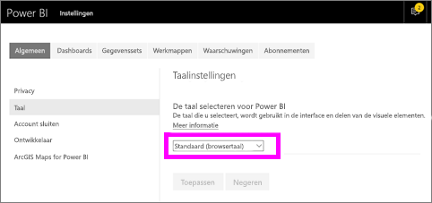
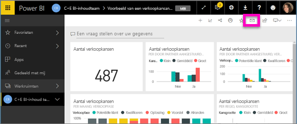
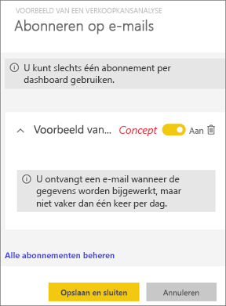
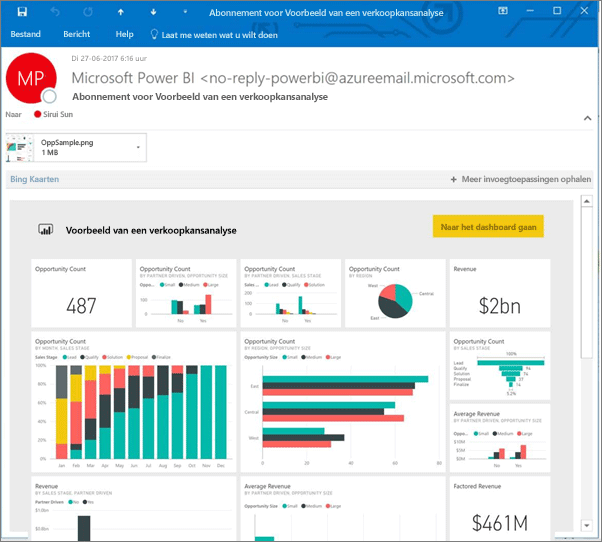
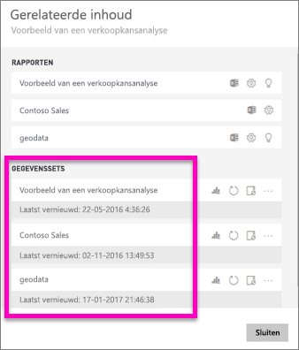
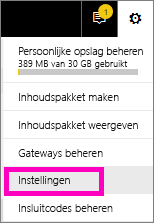
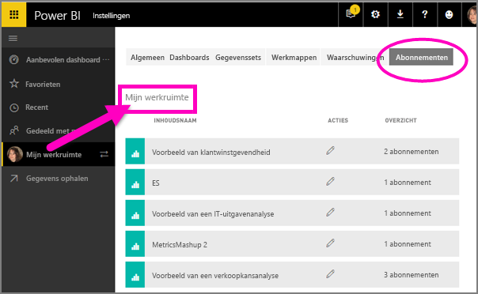

# Abonneren op een Power BI-rapport of -dashboard
Het is nog nooit zo eenvoudig geweest om op de hoogte blijven van uw belangrijkste dashboards en rapporten. Abonneer u op de rapportpagina's en dashboards die voor u het belangrijkst zijn, zodat u een e-mail van Power BI in uw postvak ontvangt met een momentopname. U geeft voor Power BI op hoe vaak u de e-mails wilt ontvangen: van één keer per dag tot één keer per week. 

De e-mail en momentopname gebruiken de taal die is ingesteld in de instellingen van Power BI (zie [Ondersteunde talen en landen/regio's voor Power BI](supported-languages-countries-regions.md)). Als er geen taal is ingesteld, gebruikt Power BI de taal van de lokale instellingen in uw huidige browser. Als u uw voorkeurstaal wilt zien of instellen, selecteert u het tandwielpictogram  **> Instellingen > Algemeen > Taal**. 

> [!NOTE]
> Abonnementen kunnen alleen worden gemaakt in de Power BI-service. Wanneer u de e-mail ontvangt, bevat deze een koppeling naar het rapport/dashboard. Wanneer deze koppeling wordt geselecteerd op een mobiel apparaat waarop Power BI-apps zijn geïnstalleerd, wordt de app in plaats van het rapport of het dashboard op de website van Power BI (standaardacties) geopend.
> 
> 

Kijk hoe Sirui een e-mailabonnement instelt voor een rapport. Volg vervolgens de stapsgewijze instructies onder de video om het zelf te proberen.

<iframe width="560" height="315" src="https://www.youtube.com/embed/saQx7G0pxhc" frameborder="0" allowfullscreen></iframe>

## Vereisten
Het **maken** van een abonnement is een Power BI Pro-functie en u moet over weergave- of bewerkingsmachtigingen beschikken voor de inhoud (dashboard of rapport).

## Abonneren op een dashboard

1. Open het dashboard.
2. Selecteer in de bovenste menubalk **Abonneren** of selecteer het enveloppictogram .
   
   
3. Gebruik de gele schuifregelaar om het abonnement in of uit te schakelen.  Als u schuifregelaar instelt op Uit, wordt het abonnement niet verwijderd. Selecteer het prullenbakpictogram om het abonnement te verwijderen.
   
   
4. Selecteer **Opslaan en sluiten** om het abonnement op te slaan. Telkens wanneer een van de onderliggende gegevenssets wordt gewijzigd, ontvangt u een e-mail met een momentopname van het dashboard. Als het dashboard vaker dan één keer per dag wordt vernieuwd, ontvangt u alleen de eerste keer dat het dashboard wordt vernieuwd een e-mail met een momentopname.
   
   
   
   > [!TIP]
   > Wilt u het e-mailbericht meteen zien? Activeer een e-mailbericht door een van de gegevenssets te vernieuwen die zijn gekoppeld aan het dashboard. (Als u geen bewerkingsmachtigingen hebt voor de gegevensset, moet u iemand met de juiste machtigingen vragen om dit voor u te doen.) Als u wilt weten welke gegevenssets worden gebruikt om het dashboard te maken, selecteert u het pictogram **Gerelateerde items weergeven**  om **Gerelateerde inhoud** te openen en selecteert u vervolgens het vernieuwingspictogram . 
   > 
   > 
   
   

## Abonneren op een rapportpagina
1. Open het rapport in de [leesweergave](service-reading-view-and-editing-view.md).
2. Selecteer in de bovenste menubalk **Abonneren**.
   
   
3. U kunt zich op één rapportpagina tegelijkertijd abonneren. Selecteer de desbetreffende rapportpagina in de vervolgkeuzelijst.
   
   
   
   Ga door met het toevoegen van rapportpagina's.
4. Gebruik de gele schuifregelaar om het abonnement voor elke pagina in of uit te schakelen.  Als u schuifregelaar instelt op Uit, wordt het abonnement niet verwijderd. Selecteer het prullenbakpictogram om het abonnement te verwijderen.
   
   
5. Selecteer **Opslaan en sluiten** om het abonnement op te slaan. U ontvangt een e-mail met een momentopname van elke rapportpagina wanneer het rapport wordt vernieuwd. Als het rapport niet wordt vernieuwd, ontvangt u die dag ook geen e-mail met een momentopname.  Als het rapport vaker dan één keer per dag wordt vernieuwd, ontvangt u alleen de eerste keer dat het dashboard wordt vernieuwd een e-mail met een momentopname.
   
   
   
   > [!TIP]
   > Wilt u het e-mailbericht meteen zien? Activeer een e-mailbericht door uw gegevensset te openen en **Nu vernieuwen** te selecteren. Als u geen bewerkingsmachtigingen hebt voor de gegevensset, moet u iemand met de juiste machtigingen vragen om dit voor u te doen.
   > 
   > 
   > 
   > 

## Hoe het e-mailschema voor rapporten wordt bepaald
In de volgende tabel wordt beschreven hoe vaak u een e-mailbericht ontvangt. Alles is afhankelijk van de verbindingsmethode van de gegevensset waarop het dashboard of rapport is gebaseerd (DirectQuery, Live Connect, geïmporteerd in Power BI of een Excel-bestand in OneDrive of SharePoint Online) en op de abonnementopties (dagelijks, wekelijks of geen).

|  | **DirectQuery** | **Live Connect** | **Geplande vernieuwing (import)** | **Excel-bestand in OneDrive/SharePoint Online** |
| --- | --- | --- | --- | --- |
| **Hoe vaak wordt het rapport/dashboard vernieuwd?** |Elke 15 minuten |Power BI controleert om de 15 minuten en als de gegevensset is gewijzigd, wordt het rapport vernieuwd. |De gebruiker selecteert geen, dagelijks of wekelijks. Dagelijks mag maximaal 8 keer per dag zijn. Wekelijks is daadwerkelijk een wekelijks schema dat de gebruiker maakt, waarbij er een vernieuwingsfrequentie van minimaal één keer per week en maximaal één keer per dag kan worden ingesteld. |Elk uur |
| **Hoeveel controle heeft de gebruiker over het e-mailschema voor het abonnement?** |Opties zijn: dagelijks of wekelijks |Geen opties: de gebruiker ontvangt een e-mailbericht als het rapport wordt vernieuwd, maar niet vaker dan één keer per dag. |Als het rapport dagelijks wordt vernieuwd, zijn de opties dagelijks en wekelijks.  Als het rapport wekelijks wordt vernieuwd, is alleen de optie wekelijks beschikbaar. |Geen opties: de gebruiker een ontvangt een e-mailbericht wanneer de gegevensset wordt bijgewerkt, maar niet vaker dan één keer per dag. |

## Uw abonnementen beheren
Er zijn 2 paden naar het scherm voor het beheren van uw abonnementen.  Voor het eerste pad selecteert u in het dialoogvenster **Abonneren op e-mails** de optie **Alle abonnementen beheren** (zie stap 3 hierboven). Voor het tweede pad selecteert u in de bovenste menubalk het tandwielpictogram van Power BI  en kiest u **Instellingen**.

Welke abonnementen worden weergegeven, is afhankelijk van de werkruimte die op dat moment actief is.  Als u alle abonnementen voor alle werkruimten allemaal in één keer wilt weergeven, moet u ervoor zorgen dat **Mijn werkruimte** actief is. Zie [Werkruimten in Power BI](service-create-distribute-apps.md) voor meer informatie over werkruimten.

Een abonnement wordt beëindigd als de Pro-licentie is verlopen, het dashboard of rapport door de eigenaar wordt verwijderd of het gebruikersaccount wordt verwijderd dat is gebruikt om het abonnement te maken.

## Overwegingen en probleemoplossing
* Op dit moment kunt u zich niet abonneren op dashboards en rapporten die afkomstig uit inhoudspakketten of Power BI-apps. Er is echter een tijdelijke oplossing. Maak een kopie van het rapport/dashboard en voeg in plaats daarvan abonnementen toe aan die versie.
* Abonnementen op rapportpagina’s zijn gekoppeld aan de naam van de rapportpagina. Als u zich abonneert op een rapportpagina en de naam ervan wijzigt, moet u uw abonnement opnieuw maken
* Voor e-mailabonnementen op gegevenssets met een liveverbinding ontvangt u alleen e-mailberichten wanneer de gegevens worden gewijzigd. Als de gegevensset wordt vernieuwd en er geen gegevenswijzigingen zijn, ontvangt u geen mail van Power BI.
* E-mailabonnementen bieden geen ondersteuning voor de [aangepaste visuals](power-bi-custom-visuals.md).  De enige uitzondering hierop vormen de aangepaste visuals die zijn [gecertificeerd](power-bi-custom-visuals-certified.md).  
* E-mailabonnementen worden verzonden met de standaard filter- en slicerstatus voor het rapport. De wijzigingen die u aanbrengt in de standaardwaarden voordat u zich abonneert, worden niet weergegeven in het e-mailbericht.    
* E-mailabonnementen worden nog niet ondersteund voor rapportpagina's die zijn gemaakt met de Power BI Desktop-functie voor een liveverbinding met de service.    
* Voor dashboardabonnementen geldt dat bepaalde soorten tegels nog niet worden ondersteund.  Hierbij gaat het om: streamingtegels, videotegels, tegels voor aangepaste webinhoud.     
* Als u een dashboard met een collega buiten uw tenant deelt, kunnen ze zich niet abonneren op het dashboard of de bijbehorende rapportpagina's. Als u aaron@xyz.com bent, kunt u delen met anyone@ABC.com.  Maar anyone@ABC.com kan zich niet abonneren op de gedeelde inhoud.    
* Mogelijk kunt u zich vanwege de maximale e-mailgrootte niet abonneren op dashboards of rapporten met extreem grote afbeeldingen.    
* Wanneer dashboards of rapporten langer dan twee maanden niet worden bezocht, wordt de vernieuwing van de bijbehorende gegevenssets automatisch door Power BI onderbroken.  Als u echter een abonnement aan een dashboard of rapport toevoegt, wordt het dashboard of rapport niet onderbroken, ook net als het niet wordt bezocht.    
* Als u geen e-mails voor een abonnement ontvangt, controleert u of uw User Principal Name (UPN) e-mails kan ontvangen. [Het Power BI-team werkt aan een versoepeling van deze vereiste](https://community.powerbi.com/t5/Issues/No-Mail-from-Cloud-Service/idc-p/205918#M10163). 
* Voor verstuurde rapporten en dashboards wordt uw taalinstelling van Power BI gebruikt. De standaardtaal is Engels. Als u uw voorkeurstaal wilt zien of instellen, selecteert u het tandwielpictogram  **> Instellingen > Algemeen > Taal**.

## Volgende stappen
* Nog vragen? [Misschien dat de Power Bi-community het antwoord weet](http://community.powerbi.com/).    
* [Lees het blogbericht](https://powerbi.microsoft.com/blog/introducing-dashboard-email-subscriptions-a-360-degree-view-of-your-business-in-your-inbox-every-day/)

