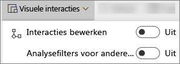

# De interactie tussen visuals in een Power BI-rapport wijzigen
Als u machtigingen hebt om een rapport te bewerken, kunt u **Visuele interacties** gebruiken om te wijzigen hoe visualisaties op een rapportpagina invloed op elkaar hebben. 

Visualisaties op een rapportpagina kunnen standaard worden gebruikt voor het kruislings filteren en markeren van de andere visualisaties op de pagina.
Als u bijvoorbeeld een staat op een kaartvisualisatie selecteert, wordt de kolomdiagram gemarkeerd en wordt het lijndiagram zo gefilterd dat alleen de gegevens worden weergegeven die van toepassing zijn voor die staat.
Zie [Over filteren en markeren](power-bi-reports-filters-and-highlighting.md). En als u een visualisatie hebt die ondersteuning biedt voor [analyseren](consumer/end-user-drill.md), heeft het analyseren van één visualisatie standaard geen invloed op de andere visualisaties op de rapportpagina. Maar deze standaardgedragsuitingen kunnen beide worden genegeerd en er kunnen interacties worden ingesteld per visualisatie.

In dit artikel ziet u hoe u **Visuele interacties** gebruikt in de [bewerkingsweergave](service-interact-with-a-report-in-editing-view.md) van de Power BI-service en in Power BI Desktop. Als een rapport met u is gedeeld, kunt u de instellingen voor Visuele interacties niet wijzigen.

> [!NOTE]
> De termen *kruislings filteren* en *kruislings markeren* worden gebruikt om de hier beschreven werking te onderscheiden van wat er gebeurt wanneer u het venster **Filters** gebruikt en visualisaties markeert.  
> 
> 

<iframe width="560" height="315" src="https://www.youtube.com/embed/N_xYsCbyHPw?list=PL1N57mwBHtN0JFoKSR0n-tBkUJHeMP2cP" frameborder="0" allowfullscreen></iframe>

1. Selecteer een visualisatie om deze actief te maken.  
2. Toon de opties voor **Visuele interacties**.
    - Selecteer de vervolgkeuzelijst op de menubalk van rapporten in de Power BI-service.

       

    - Selecteer in Desktop **Indeling > Interacties**.

        

3. Als u de besturingselementen voor interactie tussen visualisaties wilt inschakelen, selecteert u **Interacties bewerken**. Power BI voegt pictogrammen voor kruislings filteren en kruislings markeren toe aan alle andere visualisaties op de rapportpagina.
   
    
3. Bepaal welke impact de geselecteerde visualisatie op de andere moet hebben.  Herhaal dit eventueel voor alle andere visualisaties op de rapportpagina.
   
   * Als de visualisatie kruislings moet worden gefilterd, selecteert u het **filterpictogram** .
   * Als de visualisatie kruislings moet worden gemarkeerd, selecteert u het **markeerpictogram** .
   * Als er niets hoeft te gebeuren, selecteert u het pictogram voor **geen impact** .

4. Als u besturingselementen voor analyseren wilt inschakelen, selecteert u **Analysefilters voor andere visuals**.  Wanneer u nu omlaag (of omhoog) gaat in een visualisatie, worden de andere visualisaties op de rapportpagina gewijzigd om uw huidige analyseselectie weer te geven. 

   

