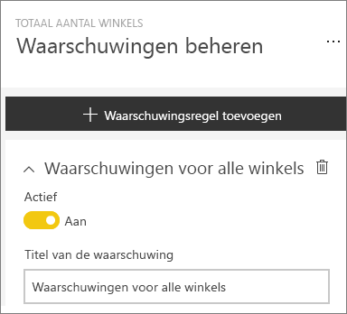
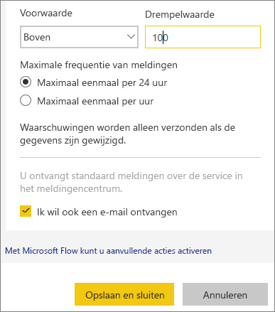
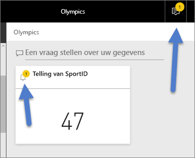
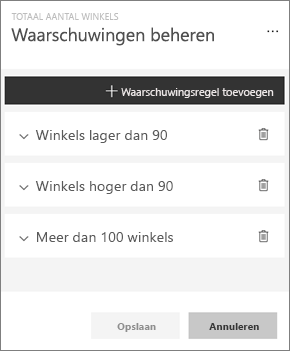
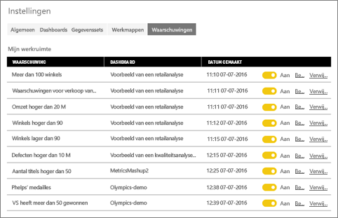

# Gegevenswaarschuwingen in de Power BI-service
Stel meldingen in om u te waarschuwen als wijzigingen aan de gegevens in uw dashboards de limieten overschrijden die u hebt ingesteld. 

U kunt waarschuwingen op tegels instellen als u een Power BI Pro-licentie hebt of als er een dashboard van een [Premium-capaciteit](service-premium.md) met u is gedeeld. Meldingen kunnen alleen worden ingesteld op tegels die zijn vastgemaakt vanuit visuele rapportelementen, en alleen op meters, KPI's en kaarten. Meldingen kunnen worden ingesteld op visuele elementen die zijn gemaakt van sets streaminggegevens die vanaf een rapport aan een dashboard zijn vastgemaakt. Ze kunnen niet worden ingesteld op streamingtegels die rechtstreeks op het dashboard zijn gemaakt via **Tegel toevoegen** > **Aangepaste streaminggegevens**. 

U bent zelf de enige die de door u ingestelde meldingen kunt zien, ook als u uw dashboard deelt. Gegevensmeldingen worden volledig met alle platforms gesynchroniseerd. Stel gegevensmeldingen in en bekijk ze [in de mobiele Power BI-apps](consumer/mobile/mobile-set-data-alerts-in-the-mobile-apps.md) (Engelstalig) en in de Power BI-service. Ze zijn niet beschikbaar voor Power BI Desktop. Meldingen kunnen ook worden [geautomatiseerd en geïntegreerd met Microsoft Flow](https://flow.microsoft.com) - [probeer het zelf](service-flow-integration.md).

> [!WARNING]
> Gegevensgestuurde meldingen bieden informatie over uw gegevens. Als u uw Power BI-gegevens op een mobiel apparaat weergeeft en dat apparaat wordt gestolen, wordt u aangeraden de Power BI-service te gebruiken om alle regels voor gegevensgestuurde meldingen uit te schakelen.
> 
> 

## Gegevenswaarschuwingen instellen in de Power BI-service
Kijk hoe Amanda enkele meldingen toevoegt aan tegels op haar dashboard. Volg vervolgens de stapsgewijze instructies onder de video om het zelf te proberen.

<iframe width="560" height="315" src="https://www.youtube.com/embed/JbL2-HJ8clE" frameborder="0" allowfullscreen></iframe>

In dit voorbeeld wordt een kaarttegel gebruikt van het voorbeelddashboard voor retailanalyse.

1. Begin op een dashboard. Selecteer de beletseltekens (drie puntjes) op een dashboardmeter, KPI of kaarttegel.
   
   
2. Selecteer het belpictogram  om een of meer waarschuwingen toe te voegen aan **Totaal aantal winkels**.
   
1. Selecteer eerst **+ Waarschuwingsregel toevoegen**. Controleer vervolgens of de schuifregelaar is ingesteld op **Aan** en geef de melding een titel. Titels helpen u de meldingen makkelijk te herkennen.
   
   
4. Schuif omlaag en voer de details van de melding in.  In dit voorbeeld maken we een melding die ons eenmaal per dag waarschuwt als het totale aantal winkels de honderd overschrijdt. Meldingen worden weergegeven in het meldingencentrum. We zorgen er ook voor dat Power BI een e-mail stuurt.
   
   
5. Selecteer **Opslaan**.

## Meldingen ontvangen
Als de bijgehouden gegevens een van de ingestelde drempelwaarden bereiken, vinden er een aantal dingen plaats. Eerst wordt gecontroleerd of het langer dan 24 uur geleden is (afhankelijk van de door u geselecteerde optie) sinds de laatste melding is verzonden. U ontvangt een melding zolang de gegevens de drempelwaarde overschrijden.

Vervolgens wordt een melding verzonden naar het meldingencentrum en ontvangt u er eventueel een per e-mail. Elke melding bevat een rechtstreekse koppeling naar uw gegevens. Selecteer de koppeling om de betreffende tegel te zien, vanaf waar u kunt gaan verkennen, delen en meer informatie kunt krijgen.  

1. Als de melding zo is ingesteld dat u een e-mail ontvangt, vindt u iets soortgelijks als hieronder in uw Postvak IN.
   
   
2. Er wordt een bericht aan het **meldingencentrum** toegevoegd en een nieuw meldingenpictogram aan de desbetreffende tegel.
   
   
3. Open het meldingencentrum om de details van de melding te bekijken.
   
    
   
   > [!NOTE]
   > Meldingen werken alleen voor gegevens die zijn vernieuwd. Als gegevens worden vernieuwd, controleert Power BI of er een melding voor die gegevens is ingesteld. Als de gegevens een drempelwaarde voor de melding hebben bereikt, wordt er een melding geactiveerd.
   > 
   > 

## Meldingen beheren
U kunt meldingen op diverse manieren beheren: vanaf het dashboardtegel zelf, vanuit het menu Instellingen in Power BI en vanaf een individuele tegel in de [mobiele Power BI-app op de iPhone](consumer/mobile/mobile-set-data-alerts-in-the-mobile-apps.md) (Engelstalig) of in de [mobiele Power BI-app voor Windows 10](consumer/mobile/mobile-set-data-alerts-in-the-mobile-apps.md) (Engelstalig).

### Vanaf de tegel zelf
1. Als u een waarschuwing voor een tegel wilt wijzigen of verwijderen, opent u opnieuw het venster **Waarschuwingen beheren** door het belpictogram  te selecteren. Alle meldingen die u voor die tegel hebt ingesteld, worden weergegeven.
   
    .
2. Als u een tegel wilt wijzigen, selecteert u de pijl links van de naam van de melding.
   
    .
3. Als u een tegel wilt verwijderen, selecteert u de prullenbak rechts van de naam van de melding.
   
      

### Vanuit het menu Instellingen in Power BI
1. Selecteer het tandwielpictogram in de Power BI-menubalk.
   
    .
2. Selecteer onder **Instellingen** de optie **Meldingen**.
   
    
3. Hier kunt u meldingen in- en uitschakelen, het venster **Meldingen beheren** openen om wijzigingen aan te brengen of de melding verwijderen.

## Tips en problemen oplossen
* Meldingen worden momenteel niet ondersteund voor Bing-tegels of kaarttegels met datum-/tijdmetingen.
* Meldingen werken alleen met numerieke gegevenstypen.
* Meldingen werken alleen voor gegevens die zijn vernieuwd. Ze werken niet met statische gegevens.
* Meldingen werken alleen voor streaming gegevenssets als u een visueel rapportelement voor KPI's, kaarten of meters maakt en dit element vervolgens aan het dashboard vastmaakt.

## Volgende stappen
[Create a Microsoft Flow that includes a data alert](service-flow-integration.md)   (Een Microsoft Flow maken die een gegevensmelding bevat)  
[Set data alerts on your mobile device](consumer/mobile/mobile-set-data-alerts-in-the-mobile-apps.md)   (Gegevensmeldingen instellen op uw mobiele apparaat)  
[Wat is Power BI?](power-bi-overview.md)    
Hebt u nog vragen? [Misschien dat de Power BI-community het antwoord weet](http://community.powerbi.com/)

