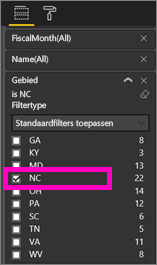
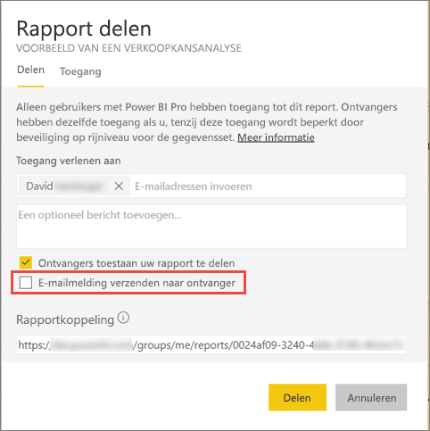

# Een Power BI-rapport filteren en delen met collega 's
*Delen* is een goede manier om enkele personen toegang te geven tot uw dashboards en rapporten. Wat gebeurt er als u een gefilterde versie van een rapport wilt delen? Dit kan bijvoorbeeld een rapport zijn dat alleen gegevens weergeeft voor een specifieke stad of verkoper of jaar. Probeer een rapport filteren en te delen of een aangepaste URL maken. Het rapport wordt gefilterd zodra ontvangers dit voor de eerste keer openen. Ze kunnen het filter verwijderen door de URL aan te passen. 

Power BI ondersteunt ook [verschillende andere manieren om samen te werken en uw rapporten te distribueren](service-how-to-collaborate-distribute-dashboards-reports.md). Als u wilt gaan delen, moeten u en de ontvangers een [Power BI Pro licentie](service-features-license-type.md) hebben, of de inhoud moet zich in een [Premium-capaciteit](service-premium-what-is.md) bevinden. 

## Twee manieren om een rapport te filteren

### Stel het filter

Open het rapport in de [bewerkingsweergave](consumer/end-user-reading-view.md), pas het filter toe en sla het rapport op.
   
In dit voorbeeld wordt het [Voorbeeld van een retailanalyse](sample-tutorial-connect-to-the-samples.md) zo gefilterd dat alleen de waarden worden weergegeven waarbij **Gebied** gelijk is aan **NC**.
   

### Een filter maken in de URL

Voeg het volgende toe aan het einde van de URL van de rapportpagina:
   
?filter=*tabelnaam*/*veldnaam* eq *waarde*
   
Het veld moet van het type getal, datum/tijd of tekenreeks zijn. De waarden *tablename* of *fieldname* mogen geen spaties bevatten.
   
In ons voorbeeld is de naam van de tabel **Store** (winkel), de naam van het veld **Territory** (gebied) en de waarde waarop we willen filteren is **NC**:
   
?filter=Winkel/Gebied eq 'NC'
   

   
Uw browser voegt speciale tekens toe om slashes, spaties en apostrofs weer te geven, zodat het uiteindelijke resultaat is:
   
app.powerbi.com/groups/me/reports/010ae9ad-a9ab-4904-a7a1-xxxxxxxxxxxx/ReportSection2?filter=Store%252FTerritory%20eq%20%27NC%27

Zie het artikel [een rapport filteren met queryreeksparameters in de URL](service-url-filters.md) voor nog veel meer details.

## De gefilterde rapport delen

1. Wanneer u [delen van het rapport](service-share-dashboards.md), schakel de **e-mailmelding verzenden naar ontvangers** selectievakje.

    

4. Verzend de koppeling met het filter dat u eerder hebt gemaakt.

## Volgende stappen
* Wilt u feedback geven? Dit kan op de [site van de Power BI-community](https://community.powerbi.com/).
* [Hoe kan ik samenwerken aan dashboards en rapporten en deze delen?](service-how-to-collaborate-distribute-dashboards-reports.md)
* [Een dashboard delen](service-share-dashboards.md)
* Nog vragen? [Misschien dat de Power BI-community het antwoord weet](http://community.powerbi.com/).

