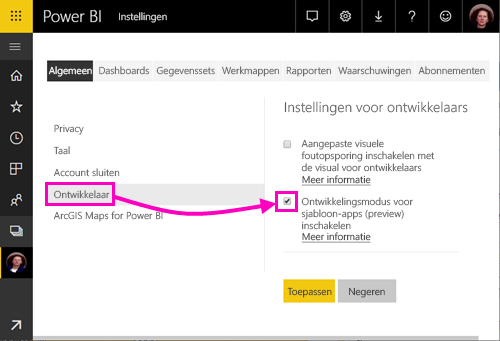
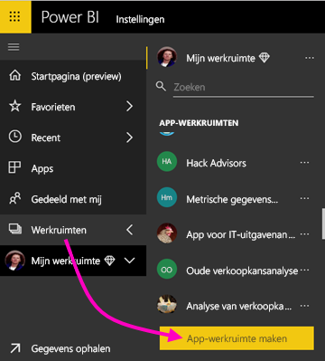
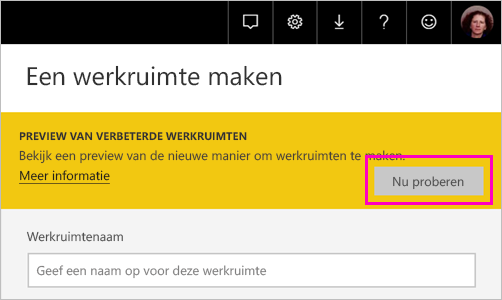
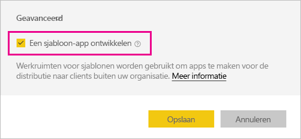
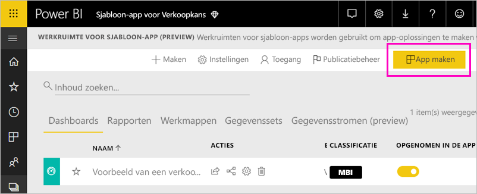
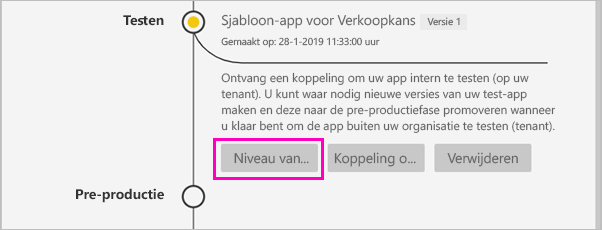
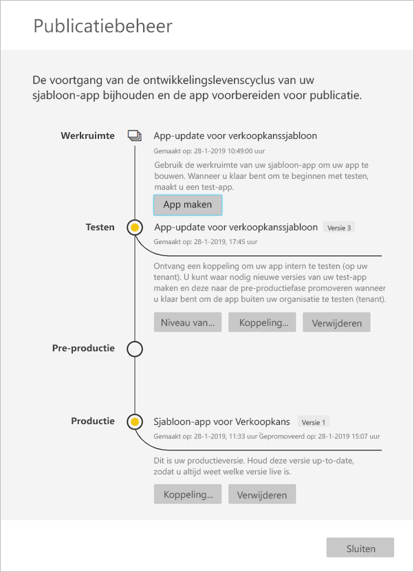

# Een sjabloon-app maken in Power BI (preview-versie)

Met de nieuwe Power BI-*sjabloon-apps* kunnen Power BI-partners Power BI-apps maken met weinig of geen code en deze implementeren naar elke Power BI-klant.  Dit artikel bevat stapsgewijze instructies voor het maken van een Power BI-sjabloon-app. 

Als u Power BI-rapporten en -dashboards kunt maken, kunt u een *sjabloon-app-bouwer* worden die analytische inhoud maakt en verpakt in een *app*. Vervolgens kunt u uw app implementeren naar andere Power BI-tenants via elk beschikbaar platform, zoals AppSource, of de app gebruiken in uw eigen webservice. Als maker kunt u een beveiligd analysepakket voor distributie maken. 

Power BI-tenantbeheerders beheren en bepalen wie er binnen hun organisatie sjabloon-apps kan maken en wie deze kan installeren. Gemachtigde gebruikers kunnen uw sjabloon-app installeren en deze vervolgens wijzigen en distribueren naar de Power BI-gebruikers in hun organisatie.

## Vereisten 

Dit zijn de vereisten voor het bouwen van een sjabloon-app:  

- Een [Power BI Pro-licentie](service-self-service-signup-for-power-bi.md)
- De [installatie van Power BI Desktop](desktop-get-the-desktop.md) (optioneel)
- Vertrouwd zijn met de [basisconcepten van Power BI](service-basic-concepts.md)
- Machtigingen voor het maken van een sjabloon-app. Zie de Power BI-[beheerderportal en Instellingen voor sjabloon-apps](service-admin-portal.md#template-apps-settings-preview) voor meer informatie.

## Modus voor app-ontwikkelaars inschakelen

Voor het maken van een sjabloon-app die u naar andere Power BI-tenants kunt distribueren, moet u zich in de modus voor app-ontwikkelaars bevinden. Anders maakt u alleen een app voor Power BI-gebruikers in uw eigen organisatie.
 
1. Open de Power BI-service in een browser.
2. Ga naar **Instellingen** > **Algemeen** > **Ontwikkelaar** > **Ontwikkelingsmodus voor sjabloon-apps inschakelen**.

    

    Als u deze optie niet ziet, neemt u contact op met uw Power BI-beheerder om u [machtigingen voor de ontwikkeling van sjabloon-apps](service-admin-portal.md#template-apps-settings-preview) te verlenen in de beheerportal.

3. Selecteer **Toepassen**.

## De werkruimte voor sjabloon-apps maken

Voor het maken van een sjabloon-app die u naar andere Power BI-tenants kunt distribueren, moet u de app in een van de nieuwe app-werkruimten maken. 
 
1. In de Power BI-service selecteert u **Werkruimten** > **App-werkruimte maken**. 
 
    

3. Selecteer in **Een app-werkruimte maken** in **Voorbeeld weergeven van verbeterde werkruimten** de optie **Nu proberen**.

    

5. Voer een naam, beschrijving (optioneel) en logoafbeelding (optioneel) voor uw app-werkruimte in.

4. Selecteer **Een sjabloon-app ontwikkelen**.

    

5. Selecteer **Opslaan**.

## De inhoud van uw sjabloon-app maken

Net als bij een normale Power BI-app-werkruimte is de volgende stap het maken van de inhoud in de werkruimte.  In deze preview-versie van sjabloon-apps, wordt slechts één van elk type ondersteund: één gegevensset, één rapport en één dashboard.

- [Maak uw Power BI-inhoud](power-bi-creator-landing.md) in uw app-werkruimte.

Als u parameters in Power Query gebruikt, moet u ervoor zorgen dat deze een goed gedefinieerd type (bijvoorbeeld Text) hebben. De typen Any en Binary worden niet ondersteund. 

[Tips voor het ontwerpen van sjabloon-apps in Power BI (preview)](service-template-apps-tips.md) bevat suggesties die u kunt overwegen bij het maken van rapporten en dashboards voor uw app-sjabloon.

## De testsjabloon-app maken

Nu u inhoud in uw werkruimte hebt, kunt u deze verpakken in een sjabloonapp. De eerste stap is het maken van een testsjabloon-app, die alleen toegankelijk is binnen uw organisatie op uw tenant.

1. Selecteer **App maken** in de werkruimte van de sjabloon-app. 

    
 
    Hier kunt u aanvullende parameters invullen voor uw sjabloon-app in vier categorieën. 

    **Huisstijl**

    - App-naam 
    - Beschrijving
    - App-logo (optioneel)
    - App-kleur 

    **Inhoud** 

    - Landingspagina van app (optioneel): Definieer een rapport of dashboard als startpagina van uw app.  
    
    **Besturingselement** 

    Stel limieten en beperkingen in voor de inhoud van uw app voor de gebruikers van uw app. Met dit besturingselement kunt u intellectueel eigendom in uw app beveiligen.

    **Toegang**

    - In de testfase bepaalt u welke andere gebruikers in uw organisatie uw app kunnen installeren en testen.

    U kunt deze instellingen altijd later wijzigen.  

2. Selecteer **App maken**. 

    U ziet een bericht dat de test-app gereed is, met daarin een koppeling om de app te kopiëren en te delen met de testers van uw app.

    

    U hebt ook de eerste stap van het publicatiebeheerproces uitgevoerd, dat hieronder wordt uiteengezet.

    

## De publicatie van de sjabloon-app beheren

Voordat u deze sjabloon-app openbaar maakt, moet u controleren of de app helemaal klaar is voor gebruik. Power BI heeft een deelvenster voor publicatiebeheer gemaakt, waarin u het volledige publicatiepad van de app kunt volgen en controleren. U kunt de overgang ook per fase activeren. Dit zijn de algemene fasen: 

- Test-app genereren: de app alleen in uw organisatie testen. 
- Het testpakket promoveren naar de preproductiefase: de app buiten uw organisatie testen.
- Het preproductiepakket promoveren naar productie: productieversie. 
- Een pakket verwijderen of opnieuw beginnen vanaf de vorige fase. 

De verschillende fasen worden hieronder besproken.

1. Selecteer **Publicatiebeheer** in de werkruimte van de sjabloon-app.

    

2. Selecteer **App maken**. 

    Als u de test-app hebt gemaakt in het gedeelte **De testsjabloon-app maken** hierboven, is de gele stip naast **Testen** al gevuld en hoeft u **App maken** hier niet te selecteren. Als u App maken wel selecteert, gaat u terug naar het proces voor het maken van de sjabloon-app.
 
3. Selecteer **Koppeling ophalen**.

    
 
9. Als u de installatie van de app wilt testen, kopieert u de koppeling in het meldingenvenster en plakt u deze in een nieuw browservenster. 

    Vanaf hier volgt u dezelfde procedure als uw klanten. Zie [Install and distribute template apps in your organization](service-template-apps-install-distribute.md) (Sjabloon-apps in uw organisatie installeren en distribueren) voor hun versie.
 
10. Selecteer **Installeren** in het dialoogvenster.

    Wanneer de installatie is geslaagd, ziet u een melding dat de nieuwe app gereed is. 
 
11. Selecteer **Naar de app**.
 
12. In **Aan de slag met uw nieuwe app** ziet u uw app zoals uw klanten deze ook zullen zien. 

    

13. Selecteer **App verkennen** om de test-app te controleren met de voorbeeldgegevens.

1. Als u wijzigingen wilt aanbrengen, gaat u terug naar de app in de oorspronkelijke werkruimte. Werk de test-app bij totdat u helemaal tevreden bent.

9. Als u klaar bent om de app te promoveren naar de preproductiefase waarin de app buiten uw tenant wordt getest, gaat u terug naar het deelvenster **Publicatiebeheer** en selecteert u **App promoten** naast **Testen**.
 
    

11. Selecteer **Niveau verhogen** om uw keuze te bevestigen. 

12. Kopieer deze nieuwe URL om de app buiten uw tenant te testen. Dit is ook de koppeling die u verzendt voor de distributie van uw app op AppSource.

12. Wanneer uw app gereed is voor productie of kan worden gedeeld via AppSource, gaat u terug naar het deelvenster **Publicatiebeheer** en selecteert u **App promoten** naast **Vóór productie**.
 
11. Selecteer **Niveau verhogen** om uw keuze te bevestigen. 

    Uw app is nu in productie en gereed voor distributie.

    

Als u uw app algemeen beschikbaar wilt stellen voor duizenden Power BI-gebruikers wereldwijd, raden we u aan de app te verzenden naar AppSource. Zie de [aanbieding voor Power BI-toepassing](https://docs.microsoft.com/azure/marketplace/cloud-partner-portal/power-bi/cpp-power-bi-offer) voor meer informatie. 

## Uw app bijwerken

Nu uw app in productie is, kunt u opnieuw beginnen in de testfase, zonder de app in productie te onderbreken. 

1. Selecteer **App maken** in het deelvenster **Publicatiebeheer**.

1. Ga terug via het proces voor het maken van een app. 
2. Nadat u **Huisstijl**, **Inhoud**, **Besturingselement** en **Toegang** hebt ingesteld, selecteert u **App maken** opnieuw.
3. Selecteer **Sluiten** en ga terug naar **Publicatiebeheer**. 

    U hebt nu twee versies: De versie in productie en een nieuwe versie in de testfase. 

    

## Volgende stappen

Zie hoe uw klanten werken met uw sjabloon-app in [Install, customize, and distribute template apps in your organization](service-template-apps-install-distribute.md) (Sjabloon-apps in uw organisatie installeren, aanpassen en distribueren).

Zie de [aanbieding voor Power BI-toepassing](https://docs.microsoft.com/azure/marketplace/cloud-partner-portal/power-bi/cpp-power-bi-offer) voor meer informatie over het distribueren van uw app.

